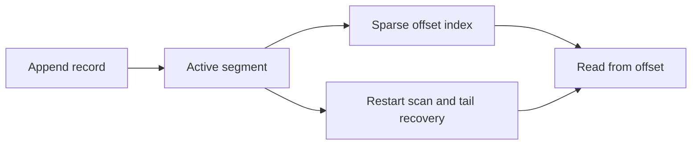

# Feature 01: Partition log and recovery

## Outcome

One broker persists a single partition as an append-only log. Appends receive
monotonic offsets; reads resume from an offset after a process restart.

## Ý tưởng chính

Sequential append makes the log simple to write and replay. A segment is an
immutable history prefix once rolled; the active segment may have an incomplete
tail after a crash and must be scanned before accepting new writes.

## Mapping với Kafka

| Kafka | Project | Deliberate limit |
| --- | --- | --- |
| partition log | one append-only file sequence | one broker |
| log segment and index | rolled segments and sparse offsets | local filesystem only |
| record validation | length and checksum | reduced record format |

## Dependency

This is the foundation; it has no earlier feature dependency.

## Strength, cost, and next question

Sequential I/O and stable offsets enable replay. Disk use grows with history;
Feature 05 introduces retention and Feature 09 adds key-based compaction.

## Use cases và roadmap

`TBU` means planned, without a detailed use-case document or implementation.

### UC-01 — TBU: Record and offset contract

Define key, value, timestamp, checksum and the next-offset rule. A failed
append must not expose a partial record.

### UC-02 — TBU: Segments and sparse index

Roll segments by size and locate the first record at or after a requested
offset without scanning every prior segment.

### UC-03 — TBU: Crash recovery

Validate the active tail, truncate only incomplete bytes, rebuild indexes and
resume append at the next surviving offset.

### UC-04 — TBU: Log diagnostics

Report log start/end offsets, segment count, append latency and recovered bytes.

## Feature boundary

No topic routing, replication, retention, compaction or Kafka wire protocol.

## Hoàn thành khi

- records retain their offset and order across restart;
- partial tail bytes never appear in a successful read;
- index rebuild and sequential scan return the same records;
- all use cases remain `TBU` until specified and implemented.
