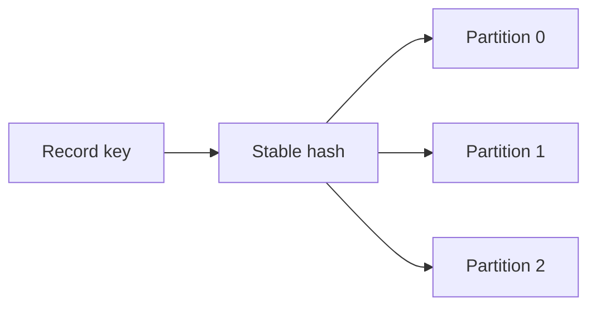

# Feature 02: Topic partitions and key routing

## Outcome

A topic has multiple independent partition logs. The producer routes a key to
one partition; ordering is defined inside that partition, not across a topic.

## Ý tưởng chính

Partitioning trades global order for parallelism. A stable hash keeps equal
keys together under one partition count. Changing that count can change the
destination of future records for the same key.

## Mapping với Kafka

| Kafka | Project | Deliberate limit |
| --- | --- | --- |
| topic metadata | name and fixed partition count | local metadata |
| key partitioner | deterministic hash routing | one built-in algorithm |
| per-partition order | Feature 01 offset order | no topic-wide merge order |

## Dependency

- Feature 01 provides a durable log per partition.

## Strength, cost, and next question

More partitions permit parallel work, but hot keys and excessive partitions
cause uneven load and overhead. Feature 11 studies reassignment and skew; it
must not claim that moving replicas splits a hot key.

## Use cases và roadmap

`TBU` means planned, without a detailed use-case document or implementation.

### UC-01 — TBU: Topic and partition identity

Define stable topic names, partition IDs and metadata validation.

### UC-02 — TBU: Key routing

Specify hash bytes, null-key policy and behavior when partition count changes.

### UC-03 — TBU: Independent partition append

Append concurrently to different partitions while preserving each partition's
offset order.

### UC-04 — TBU: Skew observability

Show records and bytes per partition, including the busiest partition.

## Feature boundary

No automatic partition splitting, replica placement or global ordering.

## Hoàn thành khi

- equal keys route together for a fixed partition count;
- each partition orders its own records without promising topic-wide order;
- a hot-key experiment visibly concentrates load;
- all use cases remain `TBU` until specified and implemented.
