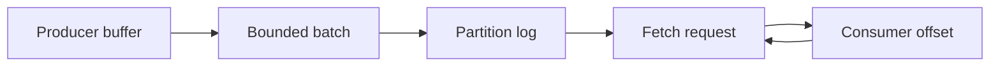

# Feature 03: Produce, Fetch and batching

## Outcome

Clients send record batches and pull records by partition and offset. Bounded
batching makes the throughput/latency tradeoff observable.

## Ý tưởng chính

One request carries several records; one Fetch returns the available range
after a position. A producer retry after an ambiguous response can append the
same data twice until Feature 08 adds deduplication.

## Mapping với Kafka

| Kafka | Project | Deliberate limit |
| --- | --- | --- |
| Produce/Fetch | small versioned local protocol | no Kafka wire compatibility |
| producer batch | byte/time bounded accumulator | no compression yet |
| pull consumer | offset and max-byte Fetch | simple long poll |

## Dependency

- Features 01–02 supply logs, partitions and routing.

## Strength, cost, and next question

Batching reduces request and disk overhead. Larger batches increase waiting
time and memory use; Feature 07 adds compression and backpressure. Ambiguous
retries motivate Feature 08.

## Use cases và roadmap

`TBU` means planned, without a detailed use-case document or implementation.

### UC-01 — TBU: Produce request and acknowledgement

Define batch size limits, partition errors and leader-local acknowledgement.
Replicated `acks=all` waits for Feature 06.

### UC-02 — TBU: Fetch and long poll

Return records at or after the requested offset, bounded by bytes and wait
time, with explicit out-of-range errors.

### UC-03 — TBU: Batching policy

Flush by bytes or time; cap buffered bytes and expose timeout behavior.

### UC-04 — TBU: Throughput experiment

Compare small and large batches using requests, bytes, latency and memory.

## Feature boundary

No deduplicated retry, transactions, compression or remote client compatibility.

## Hoàn thành khi

- Produce/Fetch preserve per-partition offset order;
- a consumer can seek and replay within retained data;
- changing batch bounds shows a measurable throughput/latency tradeoff;
- all use cases remain `TBU` until specified and implemented.
