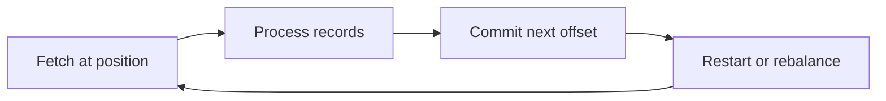

# Feature 04: Consumer offsets and groups

## Outcome

Consumers track their position and commit the next offset they intend to read.
A simple group coordinator assigns each partition to at most one active member
of a group.

## Ý tưởng chính

Reading, processing and committing are separate events. Commit after
processing can replay work after a crash; commit before processing can skip
work. A group rebalance changes ownership and must fence stale members.

## Mapping với Kafka

| Kafka | Project | Deliberate limit |
| --- | --- | --- |
| consumer position | in-memory next offset | explicit seek |
| committed group offset | durable per-group cursor | local coordinator |
| group assignment | deterministic eager rebalance | no cooperative protocol yet |

## Dependency

- Feature 02 defines partitions.
- Feature 03 defines offset-based Fetch.

## Strength, cost, and next question

Independent group offsets let many applications replay the same log. Crashes
and rebalances may repeat processing; Feature 10 reduces rebalance disruption
and Feature 12 studies atomic Kafka-to-Kafka processing. External side effects
still need application-level idempotency.

## Use cases và roadmap

`TBU` means planned, without a detailed use-case document or implementation.

### UC-01 — TBU: Position and commit contract

Distinguish fetched position from committed next offset and persist commits.

### UC-02 — TBU: Group membership and assignment

Join, heartbeat and assign partitions deterministically; one group member
owns a partition at a time.

### UC-03 — TBU: Generation fencing

Reject commits from a previous group generation after reassignment.

### UC-04 — TBU: Crash and lag experiment

Crash before and after commit; report repeated or skipped work and lag by
partition.

## Feature boundary

No incremental rebalance, static membership, transactions or external sink
exactly-once guarantee.

## Hoàn thành khi

- two groups maintain independent offsets;
- group assignment has no simultaneous valid owners for one partition;
- crash timing demonstrates the processing/commit tradeoff;
- all use cases remain `TBU` until specified and implemented.
