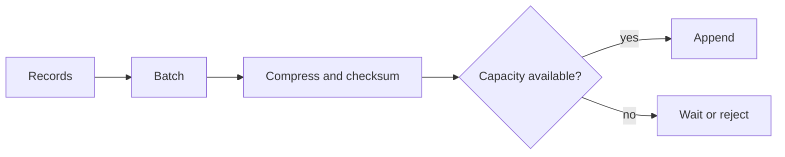

# Feature 07: Compression and backpressure

## Outcome

Record batches support compression and explicit memory/queue budgets so
higher throughput cannot silently exhaust producer or broker resources.

## Ý tưởng chính

Compress a whole batch, then transfer or store that unit with integrity
metadata. When buffers fill, reject or wait according to an explicit policy;
unbounded buffering only hides overload until failure.

## Mapping với Kafka

| Kafka | Project | Deliberate limit |
| --- | --- | --- |
| compressed record batch | one supported codec first | no codec negotiation |
| producer buffer memory | bounded byte queue | simple timeout policy |
| efficient Fetch | transfer whole validated batches | zero-copy as optional experiment |

## Dependency

- Feature 03 provides Produce/Fetch batching.
- Feature 01 provides record validation and storage.

## Strength, cost, and next question

Compression saves network/disk bytes but uses CPU and can increase tail
latency. Backpressure caps memory but exposes overload to callers. Both
make the batching tradeoff from Feature 03 measurable.

## Use cases và roadmap

`TBU` means planned, without a detailed use-case document or implementation.

### UC-01 — TBU: Batch format and codec

Encode uncompressed length, codec, checksum and maximum decompressed size.

### UC-02 — TBU: Bounded producer and broker queues

Specify wait, timeout and rejection behavior; never drop acknowledged data.

### UC-03 — TBU: Safe Fetch transfer

Return validated batch boundaries and reject decompression bombs or corrupt
checksums.

### UC-04 — TBU: Efficiency experiment

Compare bytes, CPU, throughput, queue depth and p95 latency across policies.

## Feature boundary

No universal codec support, adaptive compression or guaranteed OS zero-copy.

## Hoàn thành khi

- compressed and plain batches decode to identical records;
- memory stays within configured bounds under overload;
- capacity failures are visible to the caller and metrics;
- all use cases remain `TBU` until specified and implemented.
