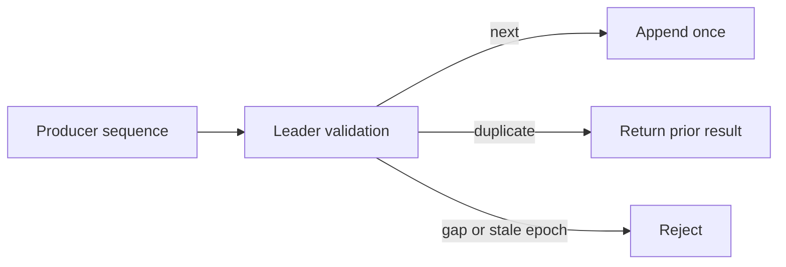

# Feature 08: Idempotent producer

## Outcome

A producer can retry an ambiguous Produce response without appending the same
batch twice to one partition.

## Ý tưởng chính

Attach producer ID, epoch and per-partition sequence numbers to batches. The
leader accepts the next sequence, acknowledges a known duplicate and rejects
gaps or stale epochs. Deduplication state must survive leader failover.

## Mapping với Kafka

| Kafka | Project | Deliberate limit |
| --- | --- | --- |
| producer ID and epoch | registered producer identity | reduced lifetime policy |
| sequence validation | per-partition deduplication | bounded remembered window |
| idempotent retry | same batch result on duplicate | no cross-partition atomicity |

## Dependency

- Feature 03 exposes retry ambiguity.
- Feature 06 supplies committed replication and failover.

## Strength, cost, and next question

Deduplication removes one common duplicate source. It does not make an
external consumer side effect exactly once, and it does not atomically write
multiple partitions. Feature 12 addresses Kafka-to-Kafka transactions.

## Use cases và roadmap

`TBU` means planned, without a detailed use-case document or implementation.

### UC-01 — TBU: Producer identity and sequence contract

Define ID, epoch, sequence, batch range and reset/fencing rules.

### UC-02 — TBU: Duplicate and gap response

Return the prior append result for a known retry; reject gaps and stale
producer epochs.

### UC-03 — TBU: Failover state recovery

Restore deduplication state with committed log data before new leader writes.

### UC-04 — TBU: Lost-ack experiment

Drop an acknowledgement, retry the same batch and verify one append.

## Feature boundary

No transactions, external sink idempotency or global exactly-once claim.

## Hoàn thành khi

- a retried committed batch appears once in its partition;
- a stale producer epoch cannot append;
- leader failover retains the duplicate-suppression decision;
- all use cases remain `TBU` until specified and implemented.
