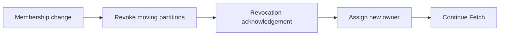

# Feature 10: Cooperative rebalance

## Outcome

Consumer groups can change membership while revoking only partitions that
must move. Static member identities reduce reassignment during short restarts.

## Ý tưởng chính

An eager rebalance stops all assignments at once. An incremental protocol
moves ownership in phases: revoke, confirm, then assign. Generation fencing
still prevents old members from committing after ownership changes.

## Mapping với Kafka

| Kafka | Project | Deliberate limit |
| --- | --- | --- |
| cooperative rebalance | staged revoke/assign | one assignor |
| static membership | persistent member identity | local coordinator |
| generation fencing | stale commit rejection | no cross-cluster group state |

## Dependency

- Feature 04 supplies eager group assignment and committed offsets.

## Strength, cost, and next question

Incremental movement reduces pause time for unaffected partitions, but adds
protocol states and slower convergence if a member disappears mid-revoke.

## Use cases và roadmap

`TBU` means planned, without a detailed use-case document or implementation.

### UC-01 — TBU: Incremental assignment plan

Compute retained, revoked and newly assigned partitions deterministically.

### UC-02 — TBU: Revocation handshake

A new owner starts only after the old assignment is revoked or fenced.

### UC-03 — TBU: Static member restart

Rejoin with stable identity without needless movement when safe.

### UC-04 — TBU: Rebalance experiment

Compare partition downtime and moved partition count with Feature 04 eager
rebalance.

## Feature boundary

No complete Kafka group protocol compatibility or multiple assignor plugins.

## Hoàn thành khi

- unaffected partitions keep serving during a membership change;
- two valid owners never process the same partition at once;
- stale generation commits are rejected;
- all use cases remain `TBU` until specified and implemented.
