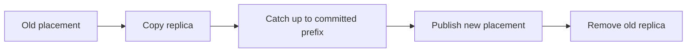

# Feature 11: Partition reassignment and skew

## Outcome

Operators can move partition replicas between brokers without losing the
committed prefix. Per-partition load metrics reveal skew and distinguish
broker imbalance from a hot key.

## Ý tưởng chính

Copy a replica to a destination broker, catch it up, then change placement
metadata before removing the old copy. Moving a replica spreads broker load;
it does not divide a single hot partition or change key routing.

## Mapping với Kafka

| Kafka | Project | Deliberate limit |
| --- | --- | --- |
| partition reassignment | staged replica movement | static broker set |
| throttled copy | explicit byte budget | no global optimizer |
| partition skew metrics | bytes and records per partition/key sample | no automatic hot-key split |

## Dependency

- Feature 02 provides partition identity and routing.
- Feature 06 provides replicas, ISR and leader epochs.

## Strength, cost, and next question

Reassignment repairs broker imbalance but consumes network/disk bandwidth.
A hot key still maps to one partition; changing key design or partitioning
requires a separate application migration.

## Use cases và roadmap

`TBU` means planned, without a detailed use-case document or implementation.

### UC-01 — TBU: Reassignment plan

Validate source, destination, replica count and current ownership.

### UC-02 — TBU: Catch-up and switch

Copy with throttling, verify the committed prefix and atomically publish
new placement.

### UC-03 — TBU: Interrupted movement

Resume or roll back an incomplete move without exposing an unverified replica.

### UC-04 — TBU: Skew diagnosis

Report broker load, partition load and sampled key concentration separately.

## Feature boundary

No automatic key splitting, transparent repartition of existing records or
production partition balancer.

## Hoàn thành khi

- moved replicas preserve committed offsets and data;
- readers/writers use one authoritative placement at a time;
- a hot-key test remains skewed after replica movement and explains why;
- all use cases remain `TBU` until specified and implemented.
