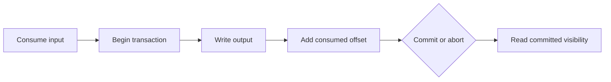

# Feature 12: Transactions and exactly-once processing

## Outcome

A producer atomically commits or aborts records across supported partitions
and a consumer group's offset update. A `read_committed` consumer skips
aborted work.

## Ý tưởng chính

The transaction coordinator tracks a producer epoch and transaction state.
Commit/abort markers close the transaction; Fetch visibility is bounded by
the last stable offset. Writing result records and committing consumed
offsets together enables exactly-once Kafka-to-Kafka processing for the
supported path.

## Mapping với Kafka

| Kafka | Project | Deliberate limit |
| --- | --- | --- |
| transactional producer | coordinator and producer epoch | fixed local participants |
| commit/abort markers | durable partition markers | reduced marker format |
| `read_committed` | last-stable-offset Fetch | no Kafka protocol compatibility |
| send offsets to transaction | atomic output-plus-offset | Kafka-to-Kafka only |

## Dependency

- Feature 04 supplies group offsets and assignment fencing.
- Feature 06 supplies committed replication.
- Feature 08 supplies producer identity and sequence validation.

## Strength, cost, and next question

Transactions close the write/offset gap for Kafka-to-Kafka workflows, but
hold records invisible until completion and add coordination cost. They do
not make writes to an external database exactly once; that sink needs its
own idempotency or atomic integration.

## Use cases và roadmap

`TBU` means planned, without a detailed use-case document or implementation.

### UC-01 — TBU: Transaction state and fencing

Define begin, prepare, commit, abort, timeout and producer-epoch rules.

### UC-02 — TBU: Markers and visibility

Persist markers and expose only eligible records to `read_committed`
consumers.

### UC-03 — TBU: Atomic offset commit

Commit output records and the next consumed offset in one transaction.

### UC-04 — TBU: Crash matrix

Crash before and after each transition; verify no partial committed
Kafka-to-Kafka result or stale producer completion.

## Feature boundary

No exactly-once external side effects, distributed database transaction or
full Kafka transaction protocol.

## Hoàn thành khi

- aborted records stay hidden from `read_committed` Fetch;
- committed output and input progress become visible together;
- timeout and stale epochs abort or fence safely;
- all use cases remain `TBU` until specified and implemented.
