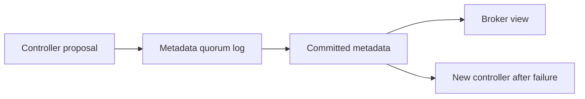

# Feature 13: Metadata quorum

## Outcome

A small controller quorum replicates topic, partition placement and broker
metadata, then elects a new active controller after failure.

## Ý tưởng chính

Data replication from Feature 06 protects records; it does not protect the
authority that decides leaders and placement. A separate ordered metadata
log lets controllers agree on one current cluster state and fence stale
controller epochs.

## Mapping với Kafka

| Kafka | Project | Deliberate limit |
| --- | --- | --- |
| KRaft metadata log | small replicated control log | reduced consensus scope |
| active controller | epoch-fenced authority | fixed controller set |
| metadata snapshots | restart acceleration | local files only |

## Dependency

- Feature 02 supplies topic and partition metadata.
- Feature 06 supplies leader epochs and broker registration concepts.
- Feature 11 supplies placement changes worth coordinating.

## Strength, cost, and next question

A quorum removes one controller process as a metadata single point of
failure. It requires a majority for metadata writes and adds recovery,
snapshot and fencing complexity. Data-plane replication remains a
separate mechanism.

## Use cases và roadmap

`TBU` means planned, without a detailed use-case document or implementation.

### UC-01 — TBU: Metadata record contract

Version topic, broker and placement changes in an ordered log.

### UC-02 — TBU: Quorum commit and election

Commit only after majority acknowledgement and elect one active controller
per epoch.

### UC-03 — TBU: Broker reconciliation

Replay committed metadata after reconnect and reject stale controller
commands.

### UC-04 — TBU: Controller-loss experiment

Kill the active controller and measure metadata unavailability, recovery
time and state convergence.

## Feature boundary

No full KRaft implementation, dynamic quorum reconfiguration or
production-compatible metadata records.

## Hoàn thành khi

- controllers converge on the same committed metadata order;
- a minority cannot publish new authoritative placement;
- stale controller epochs cannot command brokers;
- all use cases remain `TBU` until specified and implemented.
