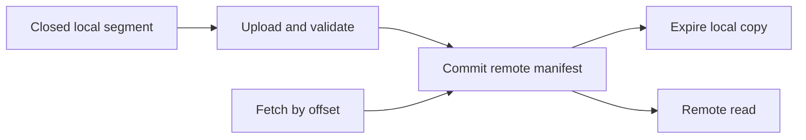

# Feature 14: Tiered storage

## Outcome

Completed log segments can move to a remote-style store so local disks keep
a shorter hot window while consumers can still read older retained data.

## Ý tưởng chính

Copy a closed, verified segment and its index to a separate store; publish a
manifest only after validation. Local deletion is safe only when the remote
copy is committed. Fetch chooses local or remote location by offset.

## Mapping với Kafka

| Kafka | Project | Deliberate limit |
| --- | --- | --- |
| tiered log segments | local filesystem remote-store emulator | no cloud SDK |
| remote log metadata | committed segment manifest | one broker namespace |
| local and total retention | separate hot/cold windows | no object-store lifecycle |

## Dependency

- Feature 01 supplies immutable closed segments and indexes.
- Feature 05 supplies retention and log start behavior.
- Feature 06 supplies committed-prefix safety before offload.

## Strength, cost, and next question

Older history no longer fills broker disks, but cold reads cost more and
remote storage failure complicates recovery. The remote tier changes
where data lives, not its offsets or per-partition order.

## Use cases và roadmap

`TBU` means planned, without a detailed use-case document or implementation.

### UC-01 — TBU: Remote segment contract

Define segment, index, checksum, manifest and upload lifecycle.

### UC-02 — TBU: Safe offload and local expiry

Publish a verified remote copy before deleting local bytes.

### UC-03 — TBU: Cold Fetch

Locate remote segments by offset and report cold-read latency and bytes.

### UC-04 — TBU: Remote failure experiment

Fail upload or read, then retry without serving corrupt data or advancing
log start incorrectly.

## Feature boundary

No S3-compatible production integration, cross-region replication,
compacted-topic offload or unbounded remote retention.

## Hoàn thành khi

- local eviction never precedes committed remote publication;
- local and remote Fetch return the same surviving records and offsets;
- remote failure produces a visible error without silent data loss;
- all use cases remain `TBU` until specified and implemented.
