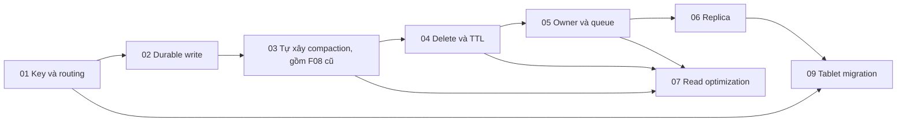

# Scylla: xây lại để hiểu từng quyết định thiết kế

Project mô tả một wide-column store nhỏ bằng Go. Mục tiêu là hiểu vì sao hệ
thống chọn cách đặt dữ liệu, xác nhận write, merge khi đọc, giữ dấu xoá và chia
công việc giữa owner/replica; sau đó quan sát mỗi lựa chọn tốn gì khi tải lệch,
disk chậm hoặc process chết.

Các tài liệu là **thiết kế cho mô hình học tập, chưa phải implementation**.
API Go và pseudocode minh hoạ contract dự kiến. Các bảng test là tiêu chí cần
kiểm chứng khi viết code; không phải báo cáo test đã chạy.

## Cách đọc giống bộ tài liệu Spark

Bắt đầu ở overview của feature để hiểu vấn đề, ví dụ và đánh đổi. Mỗi overview
liên kết tới các use case riêng trong `use-case/feature-XX/`. Use case đi sâu
vào input/output, model, thuật toán, lỗi, điều kiện luôn đúng và test cụ thể.

Một **invariant** là điều kiện phải luôn đúng trong mọi trạng thái hợp lệ.
Ví dụ “file chưa publish không được reader nhìn thấy” phải đúng cả khi flush
thành công, crash giữa chừng hay recovery chạy lại.

Không cần học API trước khi hiểu bài toán. Hãy đọc ví dụ và kết quả mong đợi,
rồi dùng model/thuật toán để giải thích vì sao hệ thống đạt kết quả đó.

## Roadmap và bộ use case

| Feature | Vấn đề cần giải quyết | Số UC |
| --- | --- | --- |
| [01 — Key và routing cố định](feature/01-partition-keys-and-static-token-routing.md) | Biết request đi đâu và nhóm dữ liệu nào được đọc cùng nhau. | 4 |
| [02 — Commitlog, memtable, SSTable](feature/02-commitlog-memtable-and-sstable.md) | Sau ACK rồi crash, lấy lại dữ liệu bằng cách nào? | 4 |
| [03 — Tự xây compaction để hiểu LSM](feature/03-read-merge-and-basic-compaction.md) | Implement cost observer, planner, windowing, scheduler, purge guard và executor; mapping sang ScyllaDB. | 6 |
| [04 — TTL và tombstone](feature/04-ttl-tombstones-and-delete-safety.md) | Dữ liệu đã xoá/hết hạn không được xuất hiện lại. | 4 |
| [05 — Shard và xử lý bất đồng bộ](feature/05-shard-ownership-and-async-scheduling.md) | Ai được sửa state, và quá tải được giới hạn thế nào? | 4 |
| [06 — Replication và consistency](feature/06-leaderless-replication-and-consistency.md) | Phải chờ bao nhiêu replica và làm gì khi chúng khác nhau? | 4 |
| [07 — Bloom, index và cache](feature/07-bloom-filters-indexes-and-cache.md) | Tránh đọc/merge không cần thiết mà giữ nguyên kết quả. | 4 |
| [09 — Tablet, split và migration](feature/09-tablet-placement-split-and-data-migration.md) | Chuyển dữ liệu thật trước khi đổi nơi phục vụ request. | 6 |

Roadmap Feature 02–09 còn 32 use case sau khi gộp; Feature 01 có 4 use case
riêng. Đây là số mục tiêu của roadmap, không khẳng định mọi UC đã được viết
hoặc triển khai. Feature 03 có 6 UC đặc tả implement từ đầu và 2 phụ lục kỹ
thuật không tính vào số UC chính. File Feature 08 đã xoá sau khi gộp nội dung;
giữ số Feature 09 để tránh đổi các đường dẫn còn lại.

Sơ đồ thể hiện đường học chính. Trong từng overview/use case có dependency cụ
thể; ví dụ migration cũng sử dụng durability và read/delete semantics đã học
từ Feature 02–04.

## Những quy ước dùng xuyên suốt

| Quy ước | Nơi định nghĩa | Các phần phải giữ đúng |
| --- | --- | --- |
| Row identity chứa table, partition key, clustering key | [F01 UC-01](use-case/feature-01/01-key-conventions-and-row-identity.md) | Log, merge, index, cache và migration không gộp row chỉ vì trùng token. |
| Mutation có ID bất biến, version, kind và expiry tuyệt đối | [F02 UC-01](use-case/feature-02/01-mutation-and-acknowledgement-contract.md) | Retry và replica copy giữ nguyên mutation. |
| Winner dùng cùng total order | [F02 UC-01](use-case/feature-02/01-mutation-and-acknowledgement-contract.md) | Replay, read merge, compaction và replica reconcile cho cùng kết quả. |
| ACK cục bộ sau log sync và apply state | [F02 UC-01](use-case/feature-02/01-mutation-and-acknowledgement-contract.md) | Timeout không có nghĩa rollback. |
| Manifest công bố file, watermark bảo vệ prefix log | [F02 UC-02](use-case/feature-02/02-memtable-and-safe-flush.md) | File tạm không visible; chưa đủ prefix thì chưa recycle. |
| Chọn winner trước, xét expiry sau | Feature 04 | Expired winner che value cũ; không cấp lại TTL khi restart/copy. |
| Tối ưu không đổi dữ liệu visible | Feature 03 và 07 | Tắt Bloom/index/cache hoặc đổi policy phải giữ kết quả đọc. |
| Placement đổi theo epoch, dữ liệu được copy trước cutover | Feature 09 | Destination provisional chưa là replica được tính ACK. |

Total order của mutation trong mô hình:
`(Version.Logical, kindRank, Version.WriterID, ID)`, chọn lớn nhất;
`Delete > Upsert` khi cùng logical version. Đây là quy tắc riêng, có chủ đích
của lab, không phải mô tả đầy đủ mọi semantics timestamp của CQL.

Local sequence commitlog phục vụ recovery trên một owner; không so sequence
của hai replica để chọn winner. Clustering order lấy từ schema, không suy ra
bằng cách so toàn bộ serialized bytes của key.

## Giới hạn và tài liệu nền

Project không tái tạo Seastar, CQL protocol, format SSTable, full repair,
Raft topology hay thuật toán tối ưu production. Những điểm giản lược được
nêu ở từng use case để người học biết điều gì có thể kết luận từ thí nghiệm.

Khái niệm tablet theo table/partition có thể đối chiếu với
[ScyllaDB Data Distribution with Tablets](https://docs.scylladb.com/manual/stable/architecture/tablets.html).
Bản thiết kế Feature 09 dùng một coordinator và giao thức cutover rút gọn
được mô tả riêng trong project.
