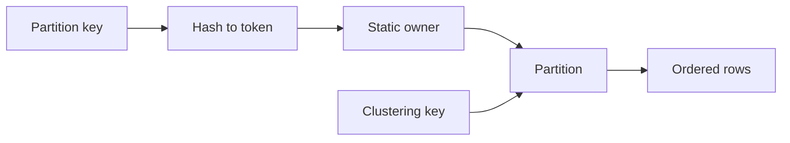

# Feature 01: Partition and token routing

## Outcome

A table accepts a partition key and optional clustering key. The partition
key hashes to a token and a fixed owner; clustering keys order rows inside
one partition.

## Ý tưởng chính

Key choice determines both data placement and efficient query shape. Equal
partition keys stay together. Static token ranges make ownership visible
before later study of tablets and migration.

## Mapping với ScyllaDB

| ScyllaDB | Project | Deliberate limit |
| --- | --- | --- |
| partition key | deterministic token input | one hash function |
| clustering key | row order within partition | small comparable type set |
| token ownership | fixed range map | no tablets or migration yet |

## Dependency

This is the foundation; it has no earlier feature dependency.

## Strength, cost, and next question

Colocated keyed reads are cheap, but a wide or hot partition concentrates
work. Tablet movement can balance ranges; it cannot split one partition
across replica sets. Alternate-key queries motivate later indexes or views.

## Use cases và roadmap

`TBU` means planned, without a detailed use-case document or implementation.

### UC-01 — TBU: Key and row contract

Define canonical key bytes, null rejection, clustering comparison and
deterministic row identity.

### UC-02 — TBU: Token routing

Hash partition keys and map every token to one fixed owner.

### UC-03 — TBU: Bounded partition query

Read one partition or a clustering-key range; reject unsupported global
scans explicitly.

### UC-04 — TBU: Skew experiment

Compare evenly distributed keys with one hot/wide partition using
per-partition bytes and request counts.

## Feature boundary

No CQL parser, mutable topology, tablets, index or global sort.

## Hoàn thành khi

- equal partition keys route together;
- clustering order is deterministic within a partition;
- skew is visible without claiming a tablet can divide a single partition;
- all use cases remain `TBU` until specified and implemented.
