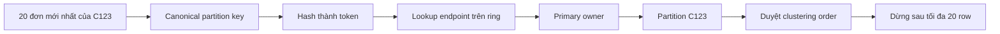
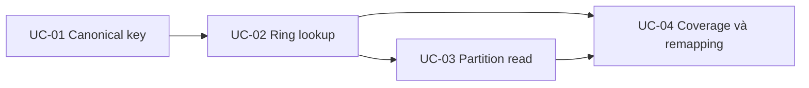

# Feature 01: Partition key, consistent hashing và token ring

> Thiết kế chi tiết, chưa triển khai. Feature học placement trên một ring cố
> định; phép so sánh ring mới/cũ là thí nghiệm, chưa chuyển dữ liệu đang phục vụ.

## 1. Vấn đề: khi dữ liệu không vừa một máy, request phải đi đâu?

Ứng dụng lưu lịch sử đơn hàng của hàng triệu khách. Khi tách dữ liệu sang nhiều
node, mỗi write/read cần biết node nào giữ khách C123. Hỏi mọi node cho mỗi
request khiến chi phí tăng theo cluster.

Một cách trực tiếp là `hash(customer_id) % số_node`. Nó chọn được đích, nhưng
khi thêm node, phép chia đổi và nhiều khách chuyển đích. Các node cũ vẫn hoạt
động mà hệ thống phải di chuyển lượng lớn dữ liệu.

Feature này trả lời hai câu hỏi nối tiếp: nhóm dữ liệu nào phải đi cùng nhau,
và làm sao tìm nơi giữ nhóm đó với placement ít xáo trộn khi cluster thay đổi.

## 2. Partition key xác định đơn vị đặt dữ liệu

Với `orders_by_customer_v1`:

```text
partition key:  customer_id
clustering key: created_at DESC, order_id ASC
```

Các đơn của C123 thuộc cùng partition. Clustering key xác định row và thứ tự
đọc trong partition; order_id phân biệt hai đơn cùng timestamp.

Partition key không đồng nghĩa một row. Một partition có thể chứa nhiều row,
nhưng chúng chia sẻ token và primary owner. Vai trò của partition/clustering
key được mô tả trong [ScyllaDB Data Definition](https://docs.scylladb.com/manual/stable/cql/ddl.html).

## 3. Consistent hashing giải quyết thay đổi placement bằng cách nào?

Hash partition key thành một token cố định, rồi tìm owner trên vòng token.
Node có các endpoint trên vòng. Key thuộc endpoint đầu tiên gặp theo chiều
token tăng; qua endpoint cuối thì quay về đầu.

Toy ring 0..99 để tính tay:

```text
endpoints: A20, B50, C80
A giữ (80,20] = 81..99 và 0..20
B giữ (20,50] = 21..50
C giữ (50,80] = 51..80
```

Thêm D ở 35:

| Vùng | Owner cũ | Owner mới |
| --- | --- | --- |
| (80,20] | A | A |
| (20,35] | B | D |
| (35,50] | B | B |
| (50,80] | C | C |

Chỉ vùng 21..35 đổi owner. Token của key không đổi. Đó là cơ chế ổn định
placement của consistent hashing; nó không phải cam kết consistency đọc/ghi.

Vnode cho một physical node sở hữu nhiều endpoint/range rời nhau. Đây là
khái niệm dùng trong tài liệu [ScyllaDB ring architecture](https://docs.scylladb.com/manual/stable/architecture/ringarchitecture/);
cấu hình/range cụ thể trong các ví dụ bên dưới là thiết kế riêng của lab.

## 4. Luồng giải quyết một truy vấn thực tế



Giả sử token của C123 là 30 trong toy fixture. Ring A20/B50/C80 đưa request
tới B. Trong partition, thứ tự created_at DESC giúp duyệt các đơn mới trước.

Hash không giữ thứ tự customer_id hoặc timestamp. “Tất cả đơn hôm nay của
mọi khách” không phải một range liên tục của token ring. Query đó cần fan-out,
schema khác hoặc một cơ chế khác; API Feature 01 từ chối global scan.

## 5. Các khái niệm dễ nhầm

| Khái niệm | Chịu trách nhiệm | Không tự giải quyết |
| --- | --- | --- |
| Partition key | Nhóm row cần đặt cùng nhau | Một customer quá nóng. |
| Hash/token | Đưa key vào không gian token | Đảm bảo không bao giờ collision. |
| Token ring | Chọn endpoint/primary owner | Copy dữ liệu sang owner mới. |
| Vnode | Cho node sở hữu nhiều vùng nhỏ | Tách row của một partition ra nhiều node. |
| Clustering key | Row identity và thứ tự nội bộ | Chọn node hoặc sắp xếp toàn cluster. |
| Replication | Nhiều bản sao trên node khác nhau | Nằm ngoài Feature 01, thuộc Feature 06. |

Token collision được phép: hai key khác có thể cùng token. Storage và metrics
phải giữ full partition identity, không dùng token làm primary key của map dữ liệu.

## 6. Tại sao vẫn giữ ring cố định trong feature này?

Consistent hashing giải thích *vùng nào cần đổi owner*; migration giải thích
*làm sao chuyển dữ liệu và write đang diễn ra mà không mất dữ liệu*.
Đổi route trước khi node mới có dữ liệu sẽ tạo read rỗng sai.

Feature 01 dùng RingSnapshot bất biến và so sánh hai snapshot trong fixture để
học tính chất remapping. Feature 09 mới nối placement với data movement.

ScyllaDB hiện còn có tablet placement theo table. Tài liệu
[Data Distribution with Tablets](https://docs.scylladb.com/manual/stable/architecture/tablets.html)
giải thích cơ chế đó; không coi mô hình ring rút gọn là toàn bộ kiến trúc
placement production hiện tại.

## 7. Contract và giới hạn lựa chọn của lab

Lab dùng canonical key codec rõ ràng, SHA-256 prefix 64 tạo uint64 token và
successor lookup trên ring với khoảng `(previous,current]`. ScyllaDB dùng
partitioner Murmur3; lab không hứa tương thích token với CQL.

Ring có một primary owner/request, chưa có replica set. Mỗi read bắt buộc đúng
một partition key, có limit, và có thể giới hạn clustering range. Owner là đích
logic; shard scheduler và network dispatcher thuộc feature sau.

## 8. Use case: từ input ổn định đến chứng minh phân bố

| Use case | Vấn đề cần trả lời | Tài liệu |
| --- | --- | --- |
| UC-01 | Các caller có tạo cùng bytes cho cùng logical key không? | [Key, row identity và input cho hash](../use-case/feature-01/01-key-conventions-and-row-identity.md) |
| UC-02 | Boundary, wrap-around, vnode và remapping hoạt động thế nào? | [Consistent hashing trên token ring](../use-case/feature-01/02-static-token-routing.md) |
| UC-03 | Biết owner rồi, đọc đúng phần dữ liệu cần bằng cách nào? | [Truy vấn một partition](../use-case/feature-01/03-bounded-partition-reads.md) |
| UC-04 | Ring đều có đồng nghĩa tải đều; thêm node làm đổi bao nhiêu key? | [Thí nghiệm placement và hot partition](../use-case/feature-01/04-skew-and-hot-partition-observability.md) |



## 9. Chi phí và các điều kiện luôn đúng

Lookup O(log V) với V endpoints và metadata O(V). Nhiều vnode tăng độ linh hoạt
placement nhưng cũng tăng metadata. Hash cân bằng số partition theo giả định
phân bố phù hợp; không cân bằng bytes/request nếu các partition khác kích thước.

Cùng key + codec + partitioner + RingID luôn có cùng owner. Mọi token có đúng
một primary owner, kể cả tại điểm nối vòng. Row trong một partition không tách
vì clustering key đổi. Thêm point trong fixture chỉ đổi vùng nó chiếm.

UC-04 phải đo riêng ring coverage, số partition, bytes, request và remapping
rate để chứng minh các giới hạn này.

## 10. Tiêu chí nghiệm thu và nguồn nghiên cứu

Boundary 0/MaxUint64, wrap-around, one-point ring và duplicate endpoints có test
rõ ràng. Query không đọc nhầm partition khi token collision. So sánh ring cũ/mới
kiểm tra đúng tập key đổi owner, không suy “balanced” từ mỗi token coverage.

Đọc [ghi chú research và kết quả review](../research/feature-01-02-foundations.md)
để đối chiếu các nguồn chính thức và phân biệt quyết định lab với production.
