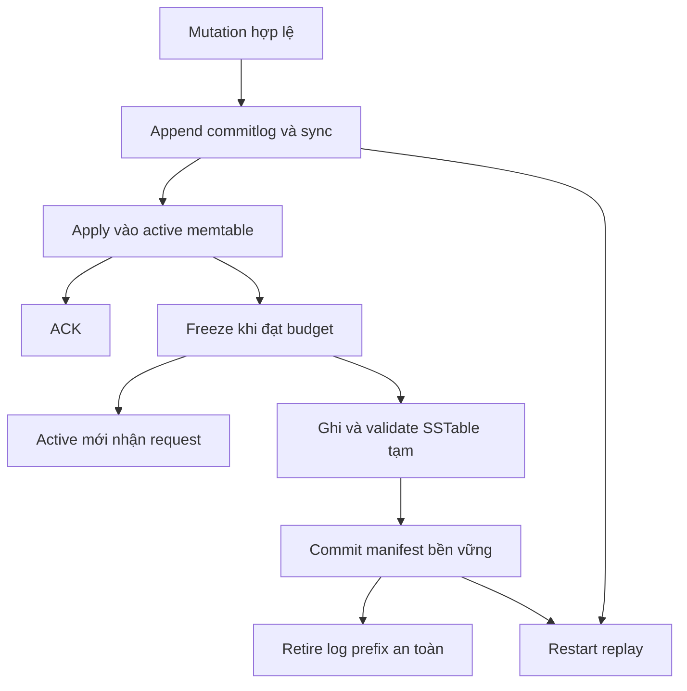
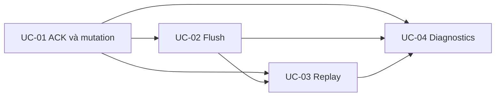

# Feature 02: LSM tree — gom ghi, tạo sorted runs và phục hồi sau crash

> Trạng thái: thiết kế chi tiết, chưa triển khai. Đây là mô hình học tập bằng Go.

## Feature này giải quyết vấn đề gì?

Ứng dụng cập nhật một đơn hàng rồi nhận “thành công”. Vài giây sau process lưu
trữ chết. Nếu trạng thái mới chỉ nằm trong RAM thì thông báo thành công đã hứa
quá mức: khi restart, hệ thống quên write đó.

Ghi ngay toàn bộ dữ liệu thành file cho từng request có thể bảo vệ dữ liệu,
nhưng phải làm nhiều việc trước mỗi ACK. Feature này dùng một bản ghi tuần tự
nhỏ để xác nhận durability, rồi gom các thay đổi trong RAM và ghi file dữ liệu
theo đợt.

Ba lớp dữ liệu và metadata công bố file có trách nhiệm riêng:

| Thành phần | Nó trả lời câu hỏi nào? | Ví dụ |
| --- | --- | --- |
| Commitlog | Sau crash lấy lại mutation đã nhận ở đâu? | Frame seq 77 ghi O-900=paid. |
| Memtable | Đang giữ những mutation mới nào trong RAM? | Winner hiện tại của O-900 là version 105. |
| SSTable | Snapshot nào đã được ghi thành file bất biến? | S7 chứa rows của memtable generation 4. |
| Manifest | File nào đã được công bố cho reader? | Generation 8 tham chiếu S1, S2, S7. |

## LSM tree giải quyết chi phí ghi như thế nào?

LSM là Log-Structured Merge tree. Một key có thể được update nhiều lần trong
khi disk chứa rất nhiều key khác. Cơ chế LSM đưa phần cập nhật mới vào cấu trúc
RAM, ghi WAL tuần tự để bảo vệ phần RAM đó, rồi xuất theo đợt thành các sorted
runs bất biến. Khi runs tích luỹ, merge/compaction hợp nhất chúng.

Một sorted run là dãy record đã sắp theo key. Một run có thể nằm trong một
file hoặc nhiều file tùy thiết kế. Ở baseline Feature 02, mỗi lần flush tạo một
SSTable tương ứng một run. Không sửa SSTable cũ tại chỗ khi nhận update mới.
Nền memtable/WAL/SST và quá trình flush/merge có thể đối chiếu ở
[RocksDB Overview](https://github.com/facebook/rocksdb/wiki/RocksDB-Overview).

Ví dụ các key `a < b < c` là ký hiệu cho full row keys trong cùng comparator:

```text
Writes lần 1: c=v2, a=v1
RAM giữ thứ tự: [a:v1, c:v2]
Flush 1 -> S1 = [a:v1, c:v2]

Writes lần 2: a=v3, b=v4
RAM giữ thứ tự: [a:v3, b:v4]
Flush 2 -> S2 = [a:v3, b:v4]

Read a -> đối chiếu S1(a:v1), S2(a:v3) -> v3
Compaction sau này -> S3 = [a:v3, b:v4, c:v2]
```

S2 có thể overlap key với S1. “File mới” không tự thắng mọi version trong file
cũ: retry hoặc write đến muộn có thể mang version thấp hơn. Winner vẫn phải
được chọn bằng mutation version của project.

## WAL khác sorted run ở đâu?

| Nội dung | Commitlog/WAL | Memtable | SSTable/sorted run |
| --- | --- | --- | --- |
| Thứ tự | Append theo sequence nhận cục bộ | Key comparator | Key comparator |
| Vai trò | Replay sau crash | State mới trong RAM | Nền dữ liệu bất biến trên disk |
| Update cùng key | Có thể thêm frame mới | Giữ winner theo baseline | Ghi ở run mới, không sửa run cũ |
| Có dùng đọc thông thường? | Không trong thiết kế này | Có | Có, qua read merge |
| Khi nào bỏ? | Sau checkpoint prefix an toàn | Sau flush và hết reader pin | Sau compaction publish và hết reader pin |

“Log-structured” không có nghĩa dữ liệu chỉ được ghi disk đúng một lần. Một
mutation có thể được ghi vào WAL, flush thành SSTable rồi được compact nhiều
lần. LSM chuyển phần lớn công việc sang các lần ghi có thứ tự và gộp theo lô;
nó phải trả thêm chi phí read merge, write amplification và disk tạm.

Baseline dùng một ordered memtable cho một owner; metadata giới hạn RAM rõ
ràng. Không mặc định dùng hash map rồi gọi đó là một cấu trúc hỗ trợ ordered
seek. UC-02 mô tả interface cần có và các lựa chọn dữ liệu.

## Vì sao Feature 02 chưa đủ thành một LSM engine hoàn chỉnh?

Feature 02 xây tầng ingest/durability và tạo sorted runs. Feature 03 xây merge
reader cùng compaction cơ bản; Feature 08 nghiên cứu chính sách chọn runs/files.
LSM cần cả các phần đó để vận hành lâu dài: chỉ flush mà không merge sẽ khiến
số file, read cost và disk usage tăng.

Không phải mọi LSM đều có cùng layout L0/L1 hay cùng policy. Trong lab, nói
"các runs mới flush" là đủ cho Feature 02; leveled/size-tiered sẽ được định nghĩa
ở feature tương ứng. Cách LevelDB tổ chức levels là một ví dụ cụ thể trong
[tài liệu implementation](https://raw.githubusercontent.com/google/leveldb/main/doc/impl.md).

## Ví dụ từ request đến restart

```text
10:00:00  Ghi O-900=paid, mutation m-105
           -> append commitlog
           -> sync thành công
           -> apply memtable
           -> ACK cho caller

10:00:03  Memtable đầy, freeze generation 4
           -> active generation 5 nhận write mới
           -> generation 4 đang flush ra S7.tmp

10:00:04  Process chết trước publish manifest
10:00:05  Restart
           -> load manifest cũ
           -> bỏ qua S7.tmp
           -> replay commitlog
           -> O-900=paid vẫn được khôi phục
```

Nếu S7 đã được publish bền vững trước crash, recovery lấy S7 làm nền và chỉ
replay phần log sau prefix đã flush. Hai đường đều phải tạo cùng visible state.

## Kết quả mong đợi và phạm vi lời hứa

Caller nhận ACK sau khi record log hoàn chỉnh đã sync và memtable apply xong.
Read cùng owner sau ACK có thể thấy mutation hoặc một version cao hơn thắng
nó. Nếu caller timeout, write có thể đã xảy ra; retry dùng lại mutation gốc.

Policy của lab là sync-before-ACK. ScyllaDB có cấu hình `periodic` và `batch`:
periodic không đợi mỗi write fsync, còn batch đợi sync trước acknowledgement.
Vì vậy thứ tự ACK trong lab không được mô tả thành default chung của ScyllaDB.
[Nguồn: commitlog configuration](https://docs.scylladb.com/manual/stable/reference/configuration-parameters.html#commit-log-settings).

Durability giả định local disk/filesystem tôn trọng sync và atomic rename.
Mô hình bảo vệ qua process restart trên storage còn nguyên. Mất toàn bộ disk
cần replica hoặc backup, nằm ở feature khác.

Một SSTable chỉ readable sau khi có trong manifest committed. Log chỉ được
retire sau khi manifest chứng minh một prefix liên tục đã được flush.

## Cách các thành phần phối hợp



Sequence commitlog là thứ tự cục bộ để flush/replay. Mutation version là thứ tự
chọn winner cho cùng row. Hai số này không thay thế nhau: một retry ghi sau có
thể mang version thấp hơn state hiện tại.

## Các điều kiện luôn đúng

- Không ACK trước durable boundary và apply state.
- Retry/replay cùng mutation không tạo thêm logical row.
- Memtable frozen không tiếp tục nhận write.
- Reader chỉ dùng file trong manifest đã publish.
- File output mới hoàn thành chưa đủ để cho phép xoá commitlog.
- Phục hồi xong mới mở owner nhận traffic.

Đây là các invariant: những điều kiện phải luôn đúng dù xảy ra flush, lỗi I/O
hay crash ở giữa quá trình.

## Use case và thứ tự học

| Use case | Vấn đề cụ thể | Tài liệu |
| --- | --- | --- |
| UC-01 | ACK hứa gì; timeout có chắc chưa ghi không? | [Mutation và acknowledge](../use-case/feature-02/01-mutation-and-acknowledgement-contract.md) |
| UC-02 | Làm sao giải phóng RAM mà không publish file dở? | [Memtable và flush an toàn](../use-case/feature-02/02-memtable-and-safe-flush.md) |
| UC-03 | Recovery chọn file/log nào sau crash? | [Restart replay](../use-case/feature-02/03-restart-replay.md) |
| UC-04 | Write chậm ở đâu; log nào đã có thể recycle? | [Chẩn đoán write path](../use-case/feature-02/04-write-path-diagnostics.md) |



## Liên hệ với ScyllaDB và giới hạn của mô hình

Tên commitlog, memtable và SSTable giúp học cách ghi của một LSM store. Thiết
kế ở đây dùng file format, mutation model và publish protocol rút gọn của
project; không hứa tương thích byte với ScyllaDB.

Feature 01 cung cấp key/row identity. Feature 03 sẽ đọc hợp nhất nhiều
memtable/SSTable. Feature 04 bổ sung Delete/TTL, Feature 05 đưa state vào owner
goroutine, Feature 06 đếm ACK từ nhiều replica.

## Thí nghiệm nào chứng minh cơ chế LSM?

Chạy cùng lịch mutation với memtable budget nhỏ và lớn. So số flush, bytes WAL,
bytes SSTable, số versions được gộp trong RAM và độ dài recovery. Dùng workload
overwrite một nhóm key nóng rồi so với workload mỗi write một key mới.

Memtable lớn có thể gom nhiều update cùng key trước flush, nhưng giữ nhiều RAM
và có thể làm phần log cần replay lớn hơn. Kết quả phụ thuộc workload; tài liệu
không khẳng định tăng memtable luôn làm mọi metric tốt hơn.

UC-04 định nghĩa công thức để tránh nhầm writes/s cao với hiệu năng bền vững
sau khi tính cả flush backlog và I/O nền.

## Chi phí và câu hỏi dẫn sang Feature 03

Sync mỗi write làm latency phụ thuộc durable I/O. Freeze cần RAM cho cả active
mới và frozen cũ; flush cần disk tạm cho output. Nếu flush chậm hơn tốc độ ghi,
admission phải chặn hoặc từ chối thay vì để memory tăng vô hạn.

Sau nhiều lần flush, cùng row có thể nằm trong nhiều SSTable. Read không thể
chỉ chọn file mới nhất theo tên; đó là bài toán merge và reconciliation của
Feature 03.

## Tiêu chí nghiệm thu

- Fault injection ở append/sync/apply/publish vẫn giữ đúng ACK contract.
- Restart giữ mọi write đã ACK hoặc mutation thắng nó hợp lệ.
- Flush đang chạy không trộn write của active generation mới vào snapshot cũ.
- Checkpoint không vượt qua khoảng sequence còn thiếu.
- Metrics phân biệt validation reject, I/O failure và outcome unknown.

Các tiêu chí này là việc cần kiểm chứng khi triển khai; viết xong tài liệu
không đồng nghĩa storage engine đã vượt qua các test.

Các nguồn web và kết quả review được tập hợp trong
[nền tảng Feature 01–02](../research/feature-01-02-foundations.md).
