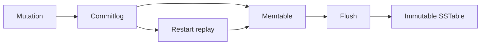

# Feature 02: Commitlog, memtable and SSTable

## Outcome

One owner shard can acknowledge a mutation after the configured durable
commitlog step, apply it to a memtable, flush immutable SSTable-like files,
and recover unflushed writes after restart.

## Ý tưởng chính

The write path favors sequential work. The commitlog protects accepted
mutations; the memtable serves recent data; flush turns sorted memory state
into an immutable file. The acknowledgement contract must state what a
process crash can and cannot lose.

## Mapping với ScyllaDB

| ScyllaDB | Project | Deliberate limit |
| --- | --- | --- |
| commitlog | local write-ahead record stream | one shard and local disk |
| memtable | mutable sorted in-memory state | bounded row types |
| SSTable | immutable sorted file plus metadata | reduced format |

## Dependency

- Feature 01 supplies partition and clustering-key order.

## Strength, cost, and next question

Sequential writes give throughput and restart recovery. Flush creates
multiple SSTables, so reads must merge versions and background compaction
must control file growth in Feature 03.

## Use cases và roadmap

`TBU` means planned, without a detailed use-case document or implementation.

### UC-01 — TBU: Mutation and acknowledgement contract

Define timestamp/version ordering and a durable append boundary before
reporting success.

### UC-02 — TBU: Memtable and flush

Bound memory, freeze a memtable and publish a validated immutable file.

### UC-03 — TBU: Restart replay

Replay accepted but unflushed mutations without duplicating an already
published flush.

### UC-04 — TBU: Write-path diagnostics

Report commitlog bytes, flush time, memtable bytes and accepted writes.

## Feature boundary

No replication, compaction strategy, compression or ScyllaDB file-format
compatibility.

## Hoàn thành khi

- an acknowledged mutation survives the specified process-crash test;
- restart reconstructs the latest accepted state;
- incomplete flush output is never readable;
- all use cases remain `TBU` until specified and implemented.
