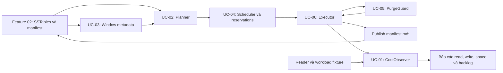
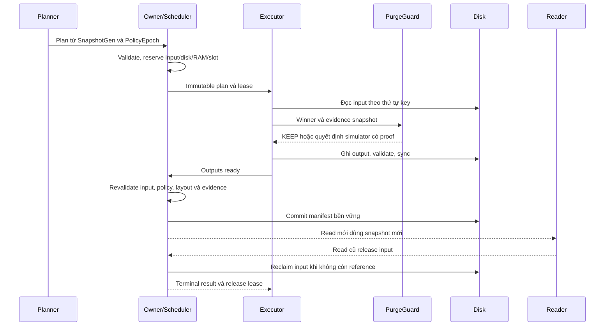

# Feature 03: Tự xây compaction để hiểu LSM và kỹ thuật vận hành ScyllaDB

> Đặc tả để implement từ đầu bằng Go; chưa phải code đã chạy.
> Feature 08 đã được gộp và xoá file riêng. Giữ số Feature 09 để không đổi
> các đường dẫn khác. Nguồn web đối chiếu ngày 2026-09-29.

## 1. Vấn đề gốc: append giúp ghi nhanh nhưng để lại công việc phía sau

Feature 02 đã cho ta WAL, memtable và SSTable bất biến. Khi cập nhật một key,
ta ghi version mới vào nơi khác thay vì sửa file cũ. Cách đó giảm việc cập
nhật tại chỗ, nhưng phiên bản cũ không tự biến mất.

Sau nhiều lần flush, cùng key xuất hiện trong nhiều nguồn. Muốn trả kết quả
đúng, reader phải xét các nguồn liên quan. Muốn lấy lại chỗ, engine phải ghi
một bố cục mới trước khi bỏ bố cục cũ. Muốn bỏ dấu xoá, engine còn phải biết
có bản cũ nào cần được dấu đó che đi hay không.

Vì vậy compaction là bài toán **đổi bố cục vật lý, giữ nguyên ý nghĩa dữ liệu,
và giới hạn chi phí của quá trình đổi đó**. Không phải chỉ nối file hay chạy
một lệnh dọn disk.

## 2. First principles: suy ra component từ ràng buộc

| Sự thật hoặc ràng buộc | Câu hỏi bắt buộc | Component tự xây |
| --- | --- | --- |
| Một key có nhiều version trong các file bất biến | Merge có giảm công việc đọc, đổi lại bao nhiêu ghi? | CostObserver — UC-01. |
| Không thể rewrite toàn bộ dataset sau mỗi flush | Chọn nhóm input nào có ích? | CompactionPlanner — UC-02. |
| Dữ liệu cùng thời kỳ có thể cùng hết hạn | Có thể xếp chúng để dọn theo nhóm không? | WindowPlanner — UC-03. |
| CPU, RAM và disk đều hữu hạn | Plan đúng nhưng có được chạy ngay không? | BoundedScheduler — UC-04. |
| Không thấy value không có nghĩa nó không tồn tại ở nơi khác | Khi nào bỏ deletion evidence được? | PurgeGuard — UC-05. |
| Process có thể chết ở bất kỳ bước ghi file nào | Công bố output thế nào để không mất dữ liệu? | CompactionExecutor — UC-06. |

Đây là cách tiếp cận 80/20: implement sáu cơ chế đủ nhỏ để kiểm nghiệm các
đánh đổi quan trọng. Không bắt đầu bằng việc sao chép toàn bộ thuật toán,
format SSTable hay mọi knob của ScyllaDB.

Trong tài liệu, **foreground** là read/write phục vụ ứng dụng; **backlog** là
công việc còn chờ; **headroom** là tài nguyên dự phòng; **reclaim** là thu hồi
disk vật lý; **SLO** là mục tiêu latency/tỷ lệ lỗi phải giữ.

## 3. Fixture xuyên suốt: file ít hơn nhưng dữ liệu phải như cũ

```text
S1: A@v1=pending, B@v1=active
S2: A@v2=paid,    C@v1=active
S3: B@v3=DELETE

Read trước: A=paid, B=absent, C=active
Plan chọn S1+S2
Output S4: A@v2=paid, B@v1=active, C@v1=active
Read sau từ S3+S4: A=paid, B=absent, C=active
```

S4 vẫn chứa B@v1 vì job không đọc S3. Điều đó không làm read sai: DELETE@v3
ở S3 tiếp tục che B. Ngược lại, compact S3 rồi bỏ DELETE tùy tiện có thể làm
B xuất hiện lại. Đây là lý do phải tách merge, policy và purge safety.

Bắt đầu fixture bằng sorted files nhỏ và oracle map, không cần cluster thật.
Key comparator và version winner lấy từ Feature 01/02, không thiết kế lại.

## 4. Kiến trúc tối thiểu cần implement



Planner là hàm quyết định trên metadata: không mở file, không xoá file.
Scheduler sở hữu queue, reservation và giới hạn concurrency.
Executor sở hữu lifecycle I/O của một job đã được admit.
PurgeGuard chỉ trả quyết định có lý do, không tự unlink file.
Observer ghi nhận sự kiện, không được biến thành một điều kiện để ACK thành công.

Một owner tuần tự hoá thay đổi metadata là đủ cho lab. Chưa cần Seastar,
network RPC hay scheduler production.

## 5. Contract dùng chung để các UC ghép được với nhau

Các type dưới đây là vocabulary thiết kế; pseudocode trong từng UC có thể
thêm field cục bộ nhưng không được thay nghĩa những field chung.

```go
type FileMeta struct {
    ID, RunID, TableID string
    Level             int
    MinKey, MaxKey    RowIdentity // inclusive, dùng comparator của lab
    BytesOnDisk       uint64
}

type CompactionPlan struct {
    SnapshotGen         uint64
    PolicyEpoch         uint64
    InputIDs            []string
    TargetLevel         int
    OutputTargetBytes   uint64
    WindowID            *int64
    EstimatedOutputBytes uint64
}
```

- File ID là duy nhất và nội dung file không đổi. Run gồm một hay nhiều file
  có khoảng key không overlap trong run. Không so file ID để chọn winner.
- Phạm vi mỗi plan là một owner và một table. InputIDs không rỗng, không trùng,
  tham chiếu files live; mọi slice/metadata được copy hoặc bất biến.
- Key order của lab là table → canonical partition bytes → typed clustering
  comparator. Đây không phải cam kết tương thích thứ tự/format SSTable ScyllaDB.
- Version.Logical dùng so winner, không là Unix timestamp. UC-03/05 thêm
  metadata wall-clock/expiry riêng cho thí nghiệm thời gian.
- SnapshotGen nhận diện snapshot dùng lập plan; PolicyEpoch nhận diện cấu hình.
  Plan cũ không tự chạy dưới policy mới.
- EstimatedOutputBytes là estimate để đặt chỗ, không phải sự thật vật lý.
  UC-04 phải kiểm tra và xin thêm reservation trước khi ghi vượt estimate.
- OutputTargetBytes là mục tiêu chia file. Không tách một nhóm cùng row key
  giữa hai output; record lớn có thể vượt target và vẫn phải chịu hard budget.

Manifest kế thừa Generation, LiveTables, FlushedThrough từ Feature 02.
Compaction thay LiveTables nhưng không tự nâng FlushedThrough để xoá WAL.

## 6. Sequence của một job và các ranh giới trách nhiệm



Flush có thể publish trong lúc job chạy. Khi đó không ghi đè manifest cũ:
UC-06 phải rebase trên state hiện hành và giữ file flush mới, hoặc reject
nếu không còn chứng minh được plan hợp lệ. LCS overlap và purge evidence
phải được kiểm tra lại, không chỉ hỏi input file có còn tồn tại không.

## 7. Sáu use case: implement cái gì và hiểu technique nào?

| UC | Component/output cần tự xây | Mapping ScyllaDB |
| --- | --- | --- |
| [01 — Đo chi phí compaction](../use-case/feature-03/01-compaction-diagnosis.md) | Event counters, gauges, report theo cùng workload | Read/write/space amplification; metrics và compaction history. |
| [02 — Chọn input và bố cục output](../use-case/feature-03/02-strategy-selection-and-change.md) | Deterministic size-tier/run-tier/leveled planner | STCS, nền tảng ICS và LCS. |
| [03 — Gom theo window và thời hạn](../use-case/feature-03/03-twcs-and-retention.md) | Window metadata, picker, expired-file candidates | TWCS, uniform TTL và late-data trade-off. |
| [04 — Điều phối trong budget hữu hạn](../use-case/feature-03/04-backlog-and-resource-budget.md) | Bounded queue, input leases, disk/RAM/slot reservations | Backlog, backpressure và cạnh tranh tài nguyên. |
| [05 — Giữ hoặc bỏ deletion evidence](../use-case/feature-03/05-tombstone-gc-and-repair.md) | Conservative guard và resurrection simulator | Tombstone GC, repair và propagation delay. |
| [06 — Rewrite/publish an toàn](../use-case/feature-03/06-safe-maintenance-and-validation.md) | Executor, recovery/fault-injection harness, before/after oracle | Lifecycle compaction, peak disk và kiểm chứng thay đổi. |

Mỗi UC có bài toán, suy luận từ nguyên lý, fixture, data model, pseudocode,
flowchart, sequence diagram, lỗi/invariant, test và mapping sản phẩm.
Các command quản trị chỉ xuất hiện để đối chiếu cơ chế, không thay thế bài implement.

## 8. Thứ tự xây để sớm có thí nghiệm end-to-end

1. Tạo fixture SSTable/manifest từ Feature 02 và observer UC-01.
2. Implement executor UC-06 với input chọn bằng tay, PurgeGuard luôn KEEP,
   một worker và budget cố định. Trước hết chứng minh không mất dữ liệu.
3. Thêm STCS toy ở UC-02, rồi bounded admission của UC-04.
4. Thêm leveled và run-tier variants. So cost dưới cùng mutation trace.
5. Thêm window picker UC-03; quan sát TTL đồng nhất so với dữ liệu trộn.
6. Xây simulator proof của UC-05 để hiểu điều kiện purge. Baseline engine
   vẫn giữ evidence nếu chưa có đủ mô hình an toàn.

Thứ tự đọc có thể đi từ UC-01 đến UC-06; thứ tự implement không bắt buộc giống
thứ tự số. Dùng stub luôn KEEP và plan bằng tay để tránh dependency vòng.

## 9. Những giới hạn cố ý phải giữ rõ

| Lab sẽ làm | Không được quảng cáo thành |
| --- | --- |
| Bucket theo quy tắc toy và deterministic picker | Tái tạo chính xác picker/tuning của ScyllaDB. |
| Run-tier picker và chia output thành segments | ICS production reclaim input tăng dần, có crash protocol đầy đủ. |
| File chọn theo window metadata của simulator | Mọi detail timestamp/window placement của ScyllaDB. |
| Finite-world purge proof trong fixture tách biệt | Chứng minh an toàn GC cho cluster đang nhận write bất kỳ. |
| Một batch commit manifest và reader pins | Format/metadata transaction production của ScyllaDB. |
| Bộ test mutation/TTL và cost counter | Benchmark latency/throughput của sản phẩm thật. |

Vì muốn hiểu nguyên lý, phần nào giản lược phải được ghi rõ. Đặc biệt: output
segmentation không tạo ra lợi ích incremental reclaim nếu input vẫn giữ đến
cuối job; policy hết hạn không thay thế bằng chứng chống resurrection.

## 10. Tiêu chí hoàn thành khi implement

- Các policy đổi input/layout nhưng không đổi kết quả đọc trên cùng tập
  mutation hợp lệ và cùng ReadTime.
- Planner deterministic; plan không còn hợp lệ bị reject có lý do.
- Mọi đường lỗi/cancel giải phóng reservation đúng một lần, không vượt budget
  bằng cách coi estimate là quyền ghi không giới hạn.
- Crash trước/sau publish phục hồi state đầy đủ; file chưa commit không visible.
- Row đã xoá hoặc winner đã hết TTL không fallback về value cũ.
- Báo cáo có chi phí vật lý, peak disk và backlog còn lại, không chỉ file count.
- Mỗi kết quả fixture giải thích được một đánh đổi khi vận hành ScyllaDB.

Giữ [Phụ lục A — Merge iterator](../use-case/feature-03/01-merge-iterator.md) và
[Phụ lục B — Reconciliation](../use-case/feature-03/02-version-reconciliation.md)
để tra cứu khi cần. Không lặp lại chúng thành hai use case cơ bản.

Đọc [Research và mapping nguồn](../research/feature-03-compaction-operations.md).
Cơ chế sản phẩm được đối chiếu với [ScyllaDB Compaction](https://docs.scylladb.com/manual/stable/kb/compaction.html)
và [Compaction Strategy Matrix](https://docs.scylladb.com/manual/stable/architecture/compaction/compaction-strategies.html);
thiết kế Go và các fixture ở đây là của project.
