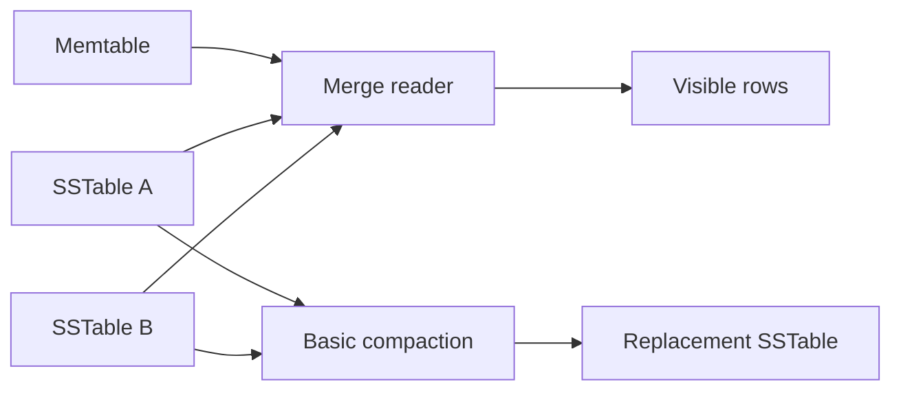

# Feature 03: Read merge and basic compaction

## Outcome

Point/range reads merge a memtable and multiple immutable SSTables, then
basic compaction rewrites old files without changing the visible result.

## Ý tưởng chính

One key may have several versions in different files. Reads choose the
winning mutation by a deterministic version rule. Compaction performs the
same reconciliation in the background and atomically replaces validated
files.

## Mapping với ScyllaDB

| ScyllaDB | Project | Deliberate limit |
| --- | --- | --- |
| merge read | version-aware source iterator | row-level subset |
| SSTable read | sorted file scan and sparse lookup | no cache yet |
| compaction | conservative merge/publish | one simple trigger |

## Dependency

- Feature 01 defines key order.
- Feature 02 supplies memtables, immutable files and recovery.

## Strength, cost, and next question

Compaction limits read and space amplification, but spends CPU, I/O and
temporary disk space. Feature 09 optimizes lookups; Feature 10 compares
compaction policies. Feature 04 adds tombstones that a merge must preserve.

## Use cases và roadmap

`TBU` means planned, without a detailed use-case document or implementation.

### UC-01 — TBU: Merge iterator

Read one partition or clustering range across memtable and SSTables in
deterministic order.

### UC-02 — TBU: Version reconciliation

Choose the latest supported mutation with a defined tie-break rule.

### UC-03 — TBU: Atomic basic compaction

Write, validate and publish replacement files before retiring inputs.

### UC-04 — TBU: Amplification metrics

Report files touched per read, bytes rewritten and temporary disk use.

## Feature boundary

No Bloom filter, row cache, advanced compaction policy or unsafe tombstone
garbage collection.

## Hoàn thành khi

- compaction does not change visible rows;
- reads remain correct across any supported flush sequence;
- failed compaction leaves the old files readable;
- all use cases remain `TBU` until specified and implemented.
