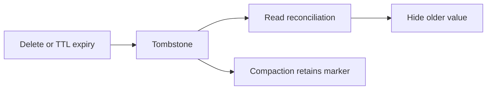

# Feature 04: TTL, tombstones and delete safety

## Outcome

Deletes and expired TTL values become logical tombstones. Reads and basic
compaction honor them so an older SSTable value cannot reappear.

## Ý tưởng chính

A delete must be represented until every relevant read can see it and
replicas can be reconciled. Removing a tombstone merely because it is old
may resurrect data from an older SSTable or a lagging replica. This feature
keeps tombstones whenever purge safety is uncertain.

## Mapping với ScyllaDB

| ScyllaDB | Project | Deliberate limit |
| --- | --- | --- |
| delete tombstone | versioned logical deletion | row-level subset |
| TTL | expiration creates effective deletion | one clock source |
| tombstone GC | disabled until safety is proven | no early purge |

## Dependency

- Feature 02 defines mutation versions and SSTables.
- Feature 03 defines read reconciliation and compaction.

## Strength, cost, and next question

Logical deletion works across immutable files and replicas, but tombstones
add read and storage cost. Feature 03 (including the former Feature 08) explores compaction policy tradeoffs
while retaining deletion evidence.

## Use cases và roadmap

`TBU` means planned, without a detailed use-case document or implementation.

### UC-01 — TBU: Delete and TTL contract

Define timestamp precedence, expiry evaluation and supported tombstone
scope.

### UC-02 — TBU: Read masking

A tombstone or expired value hides older mutations in every read source.

### UC-03 — TBU: Conservative compaction

Merge versions while retaining deletion evidence whenever an older value
might still exist.

### UC-04 — TBU: Resurrection experiment

Keep an old SSTable through flush and compaction and verify that deleted
data stays hidden. Repeat with a delayed replica after Feature 06.

## Feature boundary

No early tombstone purge, range tombstones or production-equivalent GC modes.

## Hoàn thành khi

- a deleted or expired value does not reappear after flush or compaction;
- ambiguous purge safety leaves the tombstone in place;
- reads and compaction apply the same version rule;
- all use cases remain `TBU` until specified and implemented.
