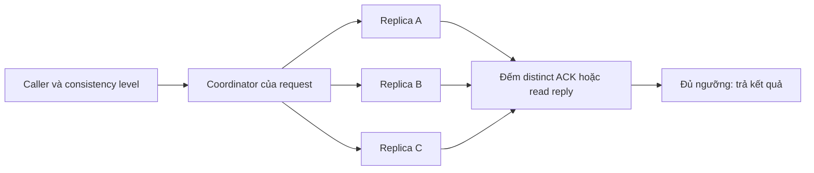

# Feature 06: Sao chép leaderless và chọn số replica phải trả lời

## Feature này giải quyết vấn đề gì?

Một node có thể chậm hoặc ngừng chạy. Sao chép partition sang ba node giúp
request còn nơi khác để hỏi, nhưng phải quyết định đợi bao nhiêu node và chọn
bản nào khi các node trả dữ liệu khác nhau.

Ví dụ giá đơn hàng được ghi lên A và B còn C mất kết nối. Write QUORUM thành
công với hai durable ACK. Read ONE từ C sau đó có thể thấy giá cũ. Feature
này làm đánh đổi đó quan sát được thay vì gọi tất cả kết quả là “đồng bộ”.

## Kết quả mong đợi

RF cố định bằng 3 trên ba node khác nhau. Mỗi request chọn coordinator và
ONE=1, QUORUM=2 hoặc ALL=3. ACK write chỉ hợp lệ sau fsync commitlog và apply
memtable. Timeout có thể đi cùng write đã lưu; không có rollback tự động.

Read lấy candidate kèm version/delete/expiry, chọn winner rồi xét TTL tại
một `ReadTime`. Tài liệu và API là thiết kế chi tiết chưa triển khai.

## Cách hoạt động



Coordinator là vai trò của request; nó không trở thành leader partition.
Node không chứa partition vẫn có thể điều phối nhờ placement map.

## Ví dụ dễ hình dung

```text
A: version 8, value=paid
B: version 8, value=paid
C: version 5, value=pending

ONE từ C:      pending
QUORUM từ B,C: paid
ALL:           cần cả ba reply
```

Trong replica set cố định, successful read quorum giao với successful write
quorum. Điều đó không cung cấp CAS, transaction, đồng hồ toàn cục hoặc bảo
đảm mọi concurrent operation tuyến tính hoá được.

## Đối chiếu với ScyllaDB

| Khái niệm | Trong project | Giới hạn |
| --- | --- | --- |
| replication factor | ba node khác nhau | một datacenter |
| consistency level | ONE, QUORUM, ALL | không LOCAL/EACH/SERIAL |
| coordinator | fan-out theo request | không cố định leader |
| read reconcile | total order mutation | không automatic repair |

## Use case và roadmap

| UC | Kết quả | Thiết kế |
| --- | --- | --- |
| UC-01 | Cố định replica set, tách coordinator khỏi owner | [Placement](../use-case/feature-06/01-replica-placement-and-coordinator.md) |
| UC-02 | Đếm ACK, phân biệt unavailable/timeout | [Consistency levels](../use-case/feature-06/02-write-read-consistency-levels.md) |
| UC-03 | Winner trước TTL, giữ deletion evidence | [Read reconciliation](../use-case/feature-06/03-read-reconciliation.md) |
| UC-04 | Tạo missed write và giải thích read | [Replica failure](../use-case/feature-06/04-replica-failure-experiment.md) |

## Phụ thuộc và đánh đổi

Features 01/05 cung cấp token, owner và message boundary. Features 02–04 cung
cấp mutation immutable, durable log, merge và delete safety. Commitlog sequence
chỉ có nghĩa trong một replica; không dùng nó so version giữa hai node.

Ba replica tăng dung lượng và write traffic khoảng ba lần trước overhead.
Đợi ít reply giảm latency nhưng có thể đọc stale; ALL phụ thuộc node chậm nhất.
Late reply có lifetime và bộ nhớ hữu hạn, không đổi response đã trả.

## Giới hạn và điều kiện nghiệm thu

Không hints, read repair, anti-entropy, multi-DC, consensus hoặc conditional
write. Mismatch tồn tại đến khi thao tác rõ ràng xử lý. Nghiệm thu cần test
distinct ACK, timeout ambiguity, winner/TTL/delete và fault experiment.
