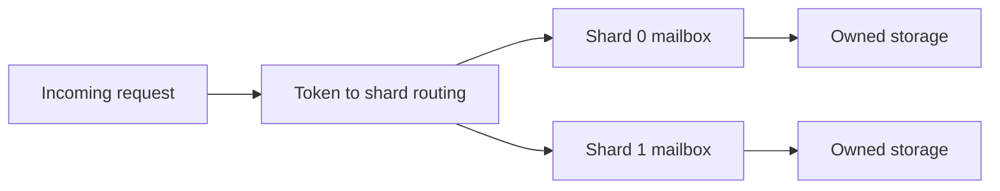

# Feature 05: Shard ownership and async scheduling

## Outcome

Each logical shard owns its mutable storage state and processes bounded
requests through an asynchronous queue. Per-shard metrics reveal hot shards
and queueing latency.

## Ý tưởng chính

Route a token to one shard owner. Requests to another shard cross a
message boundary instead of sharing mutable memtables. In Go, an owner
goroutine is an educational approximation; it does not promise CPU
pinning or reproduce Seastar's reactor runtime.

## Mapping với ScyllaDB

| ScyllaDB | Project | Deliberate limit |
| --- | --- | --- |
| shard per core | one logical owner per shard | no CPU affinity |
| shared-nothing state | message passing between owners | one process |
| async request path | bounded queues and cancellation | Go runtime, not Seastar |

## Dependency

- Feature 01 supplies token routing.
- Features 02–04 supply state owned by a shard.

## Strength, cost, and next question

Ownership avoids locks on the hot storage path, but one overloaded shard
can dominate tail latency. Bounded queues make overload visible and keep
memory use within the configured budget.

## Use cases và roadmap

`TBU` means planned, without a detailed use-case document or implementation.

### UC-01 — TBU: Shard routing and ownership

Map each token to one owner; reject direct mutation from another shard.

### UC-02 — TBU: Bounded asynchronous mailbox

Set queue and memory limits, cancellation, timeout and overload response.

### UC-03 — TBU: Cross-shard request

Forward work by message and return one result without shared mutable
storage.

### UC-04 — TBU: Hot-shard experiment

Drive uneven keys and report per-shard queue depth, service time and p95
latency.

## Feature boundary

No OS-level core pinning, Seastar reactor or dynamic shard ownership.

## Hoàn thành khi

- one shard owns each mutable partition state at a time;
- overload stays within explicit queue/memory bounds;
- hot-shard metrics explain latency changes;
- all use cases remain `TBU` until specified and implemented.
