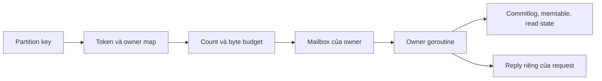

# Feature 05: Mỗi shard tự quản lý dữ liệu và hàng đợi của mình

## Feature này giải quyết vấn đề gì?

Khi nhiều request cùng sửa một memtable, các goroutine phải phối hợp để tránh
ghi đè hoặc đọc state đang thay đổi. Project chọn cách chia state thành shard:
mỗi shard có đúng một owner goroutine; mọi thao tác đọc hoặc sửa đi qua owner.

Ví dụ node A có bốn shard. Partition khách C123 thuộc shard 2; shard 0 nhận
request cũng phải gửi sang shard 2. Nó không lấy con trỏ memtable shard 2 để
tự sửa. Message boundary làm rõ ai có quyền thay đổi dữ liệu.

Owner một mình không giải quyết quá tải. Nếu C123 gửi request nhanh hơn shard
2 xử lý được, mailbox phải giới hạn cả số request và số byte. Khi đầy, hệ
thống trả overload rõ ràng thay vì giữ thêm vô hạn goroutine chờ.

## Kết quả mong đợi

Routing chọn owner từ assignment cố định; mailbox có ngân sách hữu hạn;
cross-shard request có một kết quả cuối và không chia sẻ buffer mutable.
Metrics tách thời gian chờ, thời gian xử lý và tỷ lệ từ chối.

Đây là thiết kế chi tiết chưa triển khai. API trong UC là đề xuất cho Go
chạy trong một process, không tái tạo CPU affinity hoặc Seastar.

## Cách hoạt động

Assignment `(node, token range) -> shard` ổn định trong lifetime runtime.
Không thêm công thức modulo độc lập khiến request và storage chọn hai nơi
khác nhau. Feature 09 thay lookup này bằng tablet placement có epoch.

## Ví dụ dễ hình dung

Queue shard 2 chứa tối đa 64 request và 1 MiB payload. Nếu mới có 60 request
nhưng đã chiếm 1 MiB, request mới vẫn bị từ chối. Hai giới hạn bảo vệ hai loại
tải: rất nhiều message nhỏ và ít message lớn.

Write đã append, fsync và apply memtable không bị xoá bởi caller cancellation.
Timeout có thể xảy ra khi dữ liệu đã durable; retry giữ nguyên mutation ID,
version và absolute expiry.

## Đối chiếu với ScyllaDB

| Khái niệm | Trong project | Giới hạn |
| --- | --- | --- |
| shard-per-core | owner goroutine/shard | Go scheduler tự chọn CPU |
| shared-nothing | state riêng, copy message | cùng process |
| async scheduling | mailbox và completion hữu hạn | không phải reactor |
| overload control | count + byte budget | không autoscale |

## Use case và roadmap

| UC | Câu hỏi cần trả lời | Thiết kế |
| --- | --- | --- |
| UC-01 | Ai sở hữu state của partition? | [Routing và ownership](../use-case/feature-05/01-shard-routing-and-ownership.md) |
| UC-02 | Giữ bao nhiêu request khi owner bận? | [Mailbox hữu hạn](../use-case/feature-05/02-bounded-asynchronous-mailbox.md) |
| UC-03 | Gửi việc sang shard khác thế nào? | [Cross-shard request](../use-case/feature-05/03-cross-shard-request.md) |
| UC-04 | Vì sao một shard chậm hơn? | [Thí nghiệm hot shard](../use-case/feature-05/04-hot-shard-experiment.md) |

## Phụ thuộc và đánh đổi

Feature 01 cung cấp identity/token; Features 02–04 cung cấp write, read, TTL và
tombstone. Feature 05 tổ chức quyền sở hữu, không thay quy tắc winner/ACK.

State riêng giảm nhu cầu lock memtable, nhưng owner chậm vẫn chặn shard của
nó. I/O dài dùng worker có giới hạn và completion trở lại owner; worker không
tự sửa storage state. Copy payload cũng tốn băng thông bộ nhớ.

## Giới hạn và điều kiện nghiệm thu

Không CPU pinning, dynamic remapping hoặc work stealing mutable state.
Chỉ coi feature đã triển khai khi test chứng minh đúng owner, ngân sách không
vượt giới hạn, reply không leak và durable write tồn tại sau cancellation.
