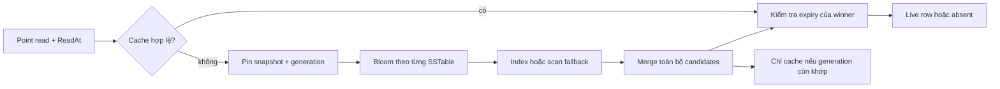

# Feature 07: Bloom filters, indexes và cache

## Bài toán cần giải quyết

Một point read đúng ở Feature 03 vẫn có thể mở hàng chục SSTables để tìm một
row không tồn tại. Nếu row tồn tại, reader có thể phải quét nhiều bytes mới
tìm được nó. Khi cùng row được đọc liên tục, công việc này còn bị lặp lại.

Feature 07 giảm ba loại công việc đó: Bloom loại file chắc chắn không chứa
key, sparse index tìm vị trí bắt đầu đọc, cache giữ kết quả merge đã kiểm tra.
Output của query phải giống khi tắt cả ba tối ưu.

## Ví dụ xuyên suốt

Shard có 12 SSTables. Row `orders / customer-42 / order-9` chỉ có mutation
trong hai file: upsert version 10 và delete version 12. Bloom có thể giúp bỏ
10 file khác; index tìm đúng vùng trong hai file còn lại. Merge chọn delete
12 và trả absent. Cache được phép giữ winner delete 12 để trả absent nhanh.

Nếu Bloom bỏ qua delete, hoặc cache giữ upsert 10 sau delete, tối ưu đã làm
thay đổi dữ liệu mà người dùng nhìn thấy. Vì vậy metadata tăng tốc không
được thay thế reconciliation của Feature 03/04.

## Hợp đồng chung

- Row key là encoding canonical có table, partition key và clustering key.
  Không nối chuỗi bằng dấu phân cách tùy ý; dùng codec/order của Feature 01.
- Mutation giữ `ID`, `Row`, `Version{Logical, WriterID}`, `Kind`, `Value` và
  `ExpiresAt` tùy chọn, tính bằng UTC microseconds.
- Winner là max theo `(Logical, Delete > Upsert, WriterID, ID)`; cùng ID phải
  cùng nội dung. Chọn winner trước, rồi mới xét expiry tại `ReadAt`.
- Bloom chứa key của cả delete và expired upsert. Winner hết hạn không cho
  phép quay về một value cũ hơn; metadata của winner vẫn được giữ đầy đủ.
- Metadata Bloom/index hỏng nghĩa là không dùng được tối ưu, không có nghĩa
  key absent. Data còn nguyên thì scan fallback; data hỏng thì trả error.
- Range read dùng ordered bounds/index, không dùng point Bloom để kết luận
  một khoảng trống. Cache phiên bản này chỉ phục vụ full-key point read.

## Use cases và roadmap

Các tài liệu dưới đây là thiết kế chi tiết, **chưa triển khai**. Các type/API
là đề xuất cho bản học tập, không khẳng định source hiện tại đã có chúng.

| UC | Câu hỏi được giải quyết | Tài liệu |
| --- | --- | --- |
| UC-01 | File nào chắc chắn không chứa full row key? | [Bloom construction](../use-case/feature-07/01-bloom-filter-construction.md) |
| UC-02 | Bắt đầu scan tại offset nào mà không bỏ sót version? | [Sparse lookup](../use-case/feature-07/02-sparse-index-lookup.md) |
| UC-03 | Khi write/expiry xảy ra, cached row còn dùng được không? | [Cache visibility](../use-case/feature-07/03-cache-visibility.md) |
| UC-04 | Bao nhiêu I/O thực sự tiết kiệm, với chi phí RAM nào? | [Read-cost experiment](../use-case/feature-07/04-read-cost-experiment.md) |

## Dependency và thứ tự làm

Feature 01 cung cấp codec/key order; Feature 02 cung cấp immutable SSTables và
format có checksum. Feature 03 cung cấp reader đúng, pinned snapshot và
atomic manifest. Feature 04 cung cấp delete/TTL. Feature 05 cung cấp shard
owner để serialize cache mutation, generation và publication.

Làm UC-01 và UC-02 trên reader không cache trước. UC-03 chỉ thêm sau khi đã
có generation gắn với snapshot. UC-04 chạy cùng lịch sử mutations và cùng
thời điểm đọc cho tất cả cấu hình. Phần compaction của Feature 03 dùng metrics này để giải thích
tác động của số file và compaction policy.

## Mapping và giới hạn học tập

| Ý tưởng trong ScyllaDB | Mô hình của lab | Giới hạn có chủ ý |
| --- | --- | --- |
| Bloom membership | một filter full-row-key/file | không mô phỏng mọi format |
| Index lookup | sparse fence theo row group | không mô phỏng promoted index |
| Row cache | shard-local winner cache, LRU có budget | không global coherency |
| Read tracing | counters có denominator rõ ràng | không cam kết latency production |

## Chi phí và tiêu chí hoàn thành

Bloom/index dùng disk metadata và RAM; cache dùng RAM cùng chi phí copy,
invalidation và kiểm tra expiry. Một positive Bloom vẫn có thể là false
positive. Nhiều versions ở nhiều file vẫn cần merge, nên tối ưu này không
thay compaction.

Hoàn thành khi các acceptance tests ở bốn UC chứng minh result equivalence,
không resurrect delete/TTL, fallback metadata an toàn, cache không nhận
entry từ snapshot cũ sau mutation, và báo cáo thí nghiệm có thể chạy lại.
Chưa có implementation hoặc kết quả benchmark nào được tuyên bố ở đây.
