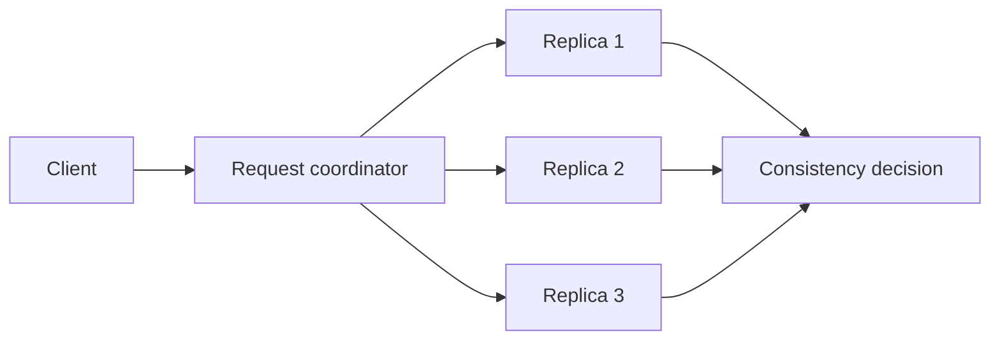

# Feature 06: Leaderless replication and consistency

## Outcome

A coordinator routes a partition mutation or read to a fixed replica set.
The caller selects ONE, QUORUM or ALL response requirements; no partition
leader is required for ordinary data reads and writes.

## Ý tưởng chính

The coordinator is chosen per request. It waits for enough replica replies
to satisfy the consistency level and reconciles versioned reads. Replicas
may still diverge after a failure or timeout; successful quorum operations
are not a blanket linearizability guarantee.

## Mapping với ScyllaDB

| ScyllaDB | Project | Deliberate limit |
| --- | --- | --- |
| replication factor | fixed three-replica placement | one data center |
| consistency level | ONE, QUORUM and ALL | reduced timeout policy |
| coordinator | per-request fan-out and read reconcile | no fixed data leader |

## Dependency

- Feature 01 supplies partition-to-replica routing.
- Features 02–04 supply versioned durable mutations.
- Feature 05 supplies request routing between owners.

## Strength, cost, and next question

Leaderless replicas can serve requests under different latency and
availability policies. Missed writes leave replica mismatch that remains
visible in diagnostics; the selected consistency level does not make
ordinary writes conditionally linearizable.

## Use cases và roadmap

`TBU` means planned, without a detailed use-case document or implementation.

### UC-01 — TBU: Replica placement and coordinator

Choose a static replica set and allow any reachable node to coordinate.

### UC-02 — TBU: Write/read consistency levels

Count acknowledgements separately for ONE, QUORUM and ALL; report
unavailable and timeout distinctly.

### UC-03 — TBU: Read reconciliation

Compare replica versions using the Feature 03 rule and return the winning
visible value.

### UC-04 — TBU: Replica-failure experiment

Drop one replica write, compare read results across consistency levels and
report mismatch without claiming it is automatically resolved.

## Feature boundary

No automatic reconciliation of missed writes or strong-consistency claim
for ordinary writes.

## Hoàn thành khi

- request success matches the selected response count;
- coordinator choice does not imply a fixed partition leader;
- a missed write is visible in diagnostics and cannot be silently
  described as resolved;
- all use cases remain `TBU` until specified and implemented.
