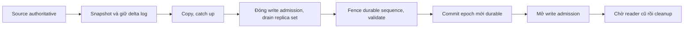

# Feature 09: Tablet, chia token range và chuyển dữ liệu an toàn

## Feature này giải quyết vấn đề gì?

Routing cố định cho biết dữ liệu ở đâu, nhưng không giúp chuyển dữ liệu khi
node quá tải. Sửa owner trong map sẽ đưa request tới nơi chưa có dữ liệu.
Tablet bổ sung một token range của một table, identity riêng và placement
gồm ba replica ở các vị trí `(node, shard)`.

Ví dụ T7 nằm ở A/1, B/0, C/2. Muốn thay A/1 bằng D/1, D phải nhận bản sao và
bắt kịp write phát sinh trong lúc copy trước khi trở thành replica hợp lệ.
Một lần đổi map đơn thuần chưa làm được việc này.

## Kết quả mong đợi

Map có epoch tăng đơn điệu; mỗi token thuộc đúng một tablet trong table;
RF luôn là ba node khác nhau. Migration có journal durable, resume được sau
restart và bảo toàn mutation đã ACK trên source bị thay thế.

Split chỉ chia token range: mọi dòng cùng partition và các partition trùng
token đi cùng child. Hai child ban đầu giữ nguyên replicas; move là bước riêng.

Đây là thiết kế chi tiết chưa triển khai. Một topology coordinator duy nhất
có storage durable, không có Raft/failover. Coordinator unavailable làm admission
và transition phụ thuộc nó bị chặn; không có cơ chế chống split-brain giả định.

## Giao thức chuyển dữ liệu

Trong copy, write gửi tới ba replica cũ; destination provisional không được
tính quorum. Tại cutover, chặn write mới, đợi operation đã admit hoàn tất trên
replica set, lấy fence sequence cục bộ của source và copy tới fence đó.

Source và destination khớp inventory mutation/version/tombstone/absolute expiry
tại fence. Fsync commit map trước khi mở writes. Mọi epoch cũ bị fence, kể cả
request tới replica được giữ lại. Copy giữ nguyên ID/version/expiry.

## Ví dụ dễ hình dung

Snapshot A có sequence 100; lúc copy A nhận thêm 101–120. Barrier đợi write
đang chạy xong, lấy fence 120 và copy đủ delta sang D. Chỉ sau D durable và
validation thành công mới đổi `[A,B,C]` thành `[D,B,C]`.

Crash sau commit durable nhưng trước reply phải resume epoch mới. Không được
quay lại A chỉ vì caller chưa nhận thông báo thành công.

## Đối chiếu với ScyllaDB

| Khái niệm | Trong project | Giới hạn |
| --- | --- | --- |
| tablet | token range theo table | bộ tablet nhỏ |
| placement | map có epoch, RF3 | một datacenter |
| migration | snapshot, delta, barrier, commit | từng migration một |
| topology coordination | journal tại một coordinator | không HA/Raft |

## Use case và roadmap

| UC | Câu hỏi | Thiết kế |
| --- | --- | --- |
| UC-01 | Map đại diện tablet thế nào? | [Identity và placement](../use-case/feature-09/01-tablet-identity-and-placement-map.md) |
| UC-02 | Request map cũ bị xử lý thế nào? | [Tablet-aware routing](../use-case/feature-09/02-tablet-aware-request-routing.md) |
| UC-03 | Copy không mất write đã ACK thế nào? | [Safe migration](../use-case/feature-09/03-safe-replica-migration.md) |
| UC-04 | Crash thì resume hay abort? | [Recovery](../use-case/feature-09/04-interrupted-migration-recovery.md) |
| UC-05 | Split không xé partition thế nào? | [Tablet split](../use-case/feature-09/05-tablet-split.md) |
| UC-06 | Move giảm skew và tốn bao nhiêu? | [Rebalance experiment](../use-case/feature-09/06-rebalance-experiment-and-diagnostics.md) |

## Phụ thuộc và đánh đổi

F01 giữ key/token; F02–04 giữ durability/delete safety; F05 giữ shard ownership;
F06 giữ RF/ACK/consistency semantics. Tablet placement thay static owner lookup,
không chạy song song với modulo chọn shard khác.

Migration tốn disk tạm, copy traffic, retained log và khoảng chặn write.
Không drain/validate được thì giữ barrier hoặc abort an toàn trước commit;
không hứa cutover luôn nhanh. Cleanup source phải đợi reader leases/pins cũ hết.

## Giới hạn và điều kiện nghiệm thu

Không autonomous balancing, concurrent migration, arbitrary partition split,
multi-DC hay giao thức production. Nghiệm thu cần crash matrix, stale epoch
test, invariant RF3 và kiểm chứng acknowledged state sau restart.
