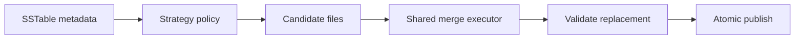

# Feature 08: Compaction strategies

## Outcome

A pluggable policy chooses which immutable SSTables to merge and when.
The learner compares read, write and space amplification across workloads
without changing mutation visibility.

## Ý tưởng chính

The merge executor from Feature 03 stays fixed; only file selection and
scheduling change. Size-tiered, leveled, incremental and time-window
policies optimize different workloads. All policies retain tombstones
unless safe garbage collection can be proven.

## Mapping với ScyllaDB

| ScyllaDB | Project | Deliberate limit |
| --- | --- | --- |
| size-tiered / incremental | size/run-oriented candidates | reduced policy model |
| leveled | bounded overlap by level | fixed target sizes |
| time-window | time-bucketed candidates | uniform-TTL experiment |
| compaction metrics | read/write/space amplification | local benchmarks |

## Dependency

- Feature 03 supplies merge and atomic publish.
- Feature 04 supplies tombstone and TTL semantics.
- Feature 07 supplies read-cost measurements.

## Strength, cost, and next question

A policy can favor cheap writes, fewer read files, or lower temporary
space, but cannot minimize all three for every workload. Time-window
behavior is especially sensitive to mixed TTL, overwrites and deletes.

## Use cases và roadmap

`TBU` means planned, without a detailed use-case document or implementation.

### UC-01 — TBU: Policy interface

Choose candidates from immutable SSTable metadata with explicit
memory, I/O and temporary-space budgets.

### UC-02 — TBU: Strategy variants

Model size-tiered, leveled, incremental and time-window selection
without duplicating the merge executor.

### UC-03 — TBU: Tombstone safety

Keep deletion evidence when a policy cannot prove it is safe to discard.

### UC-04 — TBU: Workload comparison

Run write-heavy, point-read, overwrite and uniform-TTL workloads;
report read/write/space amplification and p95 latency.

## Feature boundary

No automatic strategy tuning, full ScyllaDB policy parity or unsafe
tombstone purge.

## Hoàn thành khi

- all policies return equivalent visible data for the same mutation
  history;
- interrupted compaction leaves committed files readable;
- benchmark results expose the cost of each policy;
- all use cases remain `TBU` until specified and implemented.
