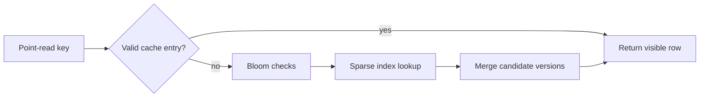

# Feature 09: Bloom filters, indexes and cache

## Outcome

Point reads skip irrelevant SSTables with safe membership checks, locate
candidate keys through sparse indexes and reuse validated hot rows through
a shard-local cache.

## Ý tưởng chính

A Bloom filter may produce a false positive, never a false negative.
Therefore a negative result can skip one SSTable, while a positive result
still needs an index/data check. Cache entries must be invalidated or
versioned after mutation, delete or TTL expiry.

## Mapping với ScyllaDB

| ScyllaDB | Project | Deliberate limit |
| --- | --- | --- |
| SSTable Bloom filter | no-false-negative membership hint | one filter format |
| SSTable index | sparse key-to-offset lookup | point reads first |
| row cache | shard-local versioned hot-row cache | no production eviction policy |

## Dependency

- Feature 03 supplies the correct merge reader and immutable SSTables.
- Feature 04 supplies delete/TTL visibility rules.
- Feature 05 supplies shard-local ownership.

## Strength, cost, and next question

Filters and indexes reduce unnecessary reads; caches cut repeated work.
They consume memory and may still touch many candidate SSTables. Feature
10 attacks that underlying file-count and amplification problem.

## Use cases và roadmap

`TBU` means planned, without a detailed use-case document or implementation.

### UC-01 — TBU: Bloom filter construction

Build a filter per SSTable and verify no false negatives for inserted keys.

### UC-02 — TBU: Sparse index lookup

Locate candidate key ranges without scanning the entire data file.

### UC-03 — TBU: Cache visibility

Invalidate or version entries on write, tombstone, expiry and compaction
publication.

### UC-04 — TBU: Read-cost experiment

Compare disk reads, candidate SSTables, cache hit rate, memory and p95
latency with optimizations enabled and disabled.

## Feature boundary

No global cache coherency, secondary index, materialized view or
production-equivalent cache policy.

## Hoàn thành khi

- disabling every optimization leaves query results unchanged;
- a Bloom negative never hides an existing key;
- cached deleted/expired values cannot be returned as live;
- all use cases remain `TBU` until specified and implemented.
