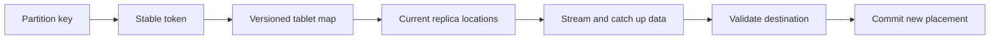

# Feature 09: Tablet placement, split and data migration

## Outcome

Replace Feature 01's fixed token-range owner with a versioned, per-table
tablet placement map. A tablet owns a token range containing whole
partitions; its replicas are assigned to node/shard locations. Existing
data can move between locations without changing partition-key tokens or
losing acknowledged writes.

## Ý tưởng chính

Token routing answers which range contains a partition. Tablet placement
answers where that range's replicas currently live. A migration copies
existing data to a new location, catches up concurrent mutations, validates
the destination, then changes ownership. Merely changing a routing map is
not data migration. A split divides a tablet's token range, never one
partition's rows.

## Mapping với ScyllaDB

| ScyllaDB | Project | Deliberate limit |
| --- | --- | --- |
| tablet | per-table token range with replica locations | fixed small tablet set initially |
| tablet load balancing | explicit move/split planner | no autonomous balancing loop |
| tablet migration | copy, catch up, validate, commit | one migration at a time |
| topology metadata | versioned placement snapshot | single coordinator, no Raft |

## Dependency

- Feature 01 supplies stable key-to-token routing and the fixed-ownership baseline.
- Features 02–04 supply stored mutations, reads and deletion safety.
- Feature 05 supplies node/shard ownership and asynchronous work.
- Feature 06 supplies replica placement and acknowledgement semantics.

## Strength, cost, and next question

Tablets make a table's placement granular enough to rebalance across nodes
and shards without changing partition keys. The cost is a coordinated
metadata transition plus data streaming: stale placement, concurrent writes
and interrupted transfers must not lose or duplicate visible mutations.

## Use cases và roadmap

`TBU` means planned, without a detailed use-case document or implementation.

### UC-01 — TBU: Tablet identity and placement map

Define table-scoped tablet IDs, non-overlapping token ranges, placement
versions and replica node/shard locations. Every token maps to exactly one
tablet for its table.

### UC-02 — TBU: Tablet-aware request routing

Resolve token to tablet and current replicas; reject or refresh stale
placement versions instead of silently routing to a former owner.

### UC-03 — TBU: Safe replica migration

Stream an existing tablet replica to a destination, catch up concurrent
mutations, validate the copy and atomically publish the new placement.
Keep the old replica authoritative until the transition is committed.

### UC-04 — TBU: Interrupted migration recovery

Resume or roll back an interrupted transfer without exposing an incomplete
replica or discarding acknowledged writes.

### UC-05 — TBU: Tablet split

Split one tablet's token range at a boundary while keeping every partition
whole. Assign the two child tablets independent placements only after their
data and metadata are consistent.

### UC-06 — TBU: Rebalance experiment and diagnostics

Compare fixed ownership with tablet moves under uneven node/shard load;
report streamed bytes, placement versions, migration duration and skew.

## Feature boundary

No production ScyllaDB tablet protocol, Raft topology coordination,
automatic load balancer, multi-datacenter placement policy, concurrent
migrations or arbitrary partition splitting.

## Hoàn thành khi

- Feature 01's static routing and Feature 09's data migration are visibly
  distinct in explain/diagnostics;
- every partition remains wholly inside one tablet after routing or split;
- a committed migration preserves acknowledged data and replica count;
- interruption leaves either the old placement valid or a validated new one;
- all use cases remain `TBU` until specified and implemented.

Background: [ScyllaDB Data Distribution with Tablets](https://docs.scylladb.com/manual/stable/architecture/tablets.html).
