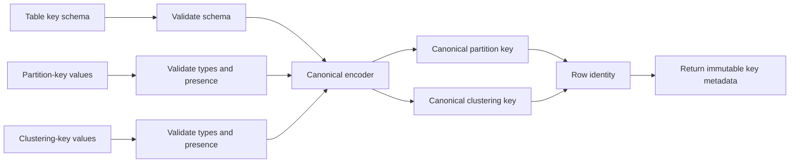

# Feature 01: Consistent hashing, token ring và partition key

## UC-01: Quy ước key và định danh dòng

> **Tình trạng: TBU / design proposal.** Tài liệu này mô tả hợp đồng dự kiến
> cho use case, không mô tả mã đã tồn tại. Các tên kiểu, hàm và error bên dưới
> là pseudocode Go để thảo luận API; chúng chưa được implement hay public.

## 1. Vấn đề cần giải quyết

Muốn route một request đến đúng nơi, mọi thành phần phải hiểu cùng một
partition key theo đúng một cách. Nếu một caller coi `42` là số còn caller khác
gửi chuỗi `"42"`, hoặc nếu composite key được nối byte một cách mơ hồ, cùng dữ
liệu nghiệp vụ có thể tạo ra hai partition khác nhau. Hậu quả là:

- ghi và đọc có thể đi tới các partition khác nhau;
- một row có thể bị hiểu là hai row khác nhau;
- thứ tự clustering không còn xác định giữa các owner hoặc lần chạy;
- UC-02 không có đầu vào byte ổn định để băm thành token.

UC-01 xác định ranh giới đó: từ key có kiểu dữ liệu rõ ràng, tạo ra byte chuẩn
hoá và một định danh row lặp lại được. Đây là **metadata/key logic**; UC này
không băm key, không chọn owner, không ghi dữ liệu và không thực hiện CQL.

## 2. Mục tiêu

- Mô tả partition key, clustering key và kiểu của từng component bằng schema
  bất biến.
- Chuyển cùng schema và cùng giá trị key có kiểu sang cùng một dãy byte.
- Tạo định danh row từ `table ID + partition key + clustering key`.
- Xác định thứ tự clustering độc lập với locale, timezone hay cách caller biểu
  diễn dữ liệu.
- Từ chối sớm key thiếu, `null`, sai kiểu hoặc có encoding không hợp lệ.

## 3. Outcome

Sau UC-01, caller *dự kiến* nhận được hai giá trị immutable về mặt contract:

```text
Canonical partition key  -> dùng làm input duy nhất cho UC-02
Row identity             -> nhận diện một row trong đúng một table/partition
```

Ví dụ outcome khái niệm:

```text
table:       orders_by_customer_v1
partition:   customer_id = "C123"
clustering:  created_at = 2026-09-28T09:00:00Z, order_id = "O-900"

=> PartitionKey: [canonical bytes]
=> RowIdentity:  (orders_by_customer_v1, [partition bytes], [clustering bytes])
```

Outcome này **không** có token, node, shard, mutation, value hay kết quả đọc.
Một table không có clustering key vẫn hợp lệ: mỗi partition khi đó có đúng một
row logic trong phạm vi model rút gọn này.

## 4. Ví dụ: đơn hàng của một khách

Use case dùng table logic sau:

```text
orders_by_customer_v1
partition key:  customer_id     text
clustering key: created_at      timestamp_micros DESC
                order_id        text             ASC
non-key columns: status, amount
```

Với input key:

```go
partition := KeyValues{
    "customer_id": "C123",
}
clustering := KeyValues{
    "created_at": TimestampMicros(1_790_586_000_000_000),
    "order_id":   "O-900",
}
```

UC-01 tạo một partition key cho `C123` và một row identity cho tổ hợp ba key
trên. Thay `status` từ `pending` sang `paid`, hoặc thay `amount`, **không** làm
đổi row identity. Ngược lại, thay `order_id` hoặc `created_at` tạo row khác
nhưng vẫn nằm trong partition của `C123`.

`created_at` đứng trước `order_id` để các row được nhóm theo thời gian; vì hai
đơn có thể cùng microsecond, `order_id` là tie-breaker bắt buộc để thứ tự và
định danh row vẫn rõ ràng. `DESC` chỉ ảnh hưởng thứ tự *trong partition*; nó
không ảnh hưởng token hoặc owner.

## 5. Luồng xử lý đề xuất



Flow này kết thúc trước khi gọi hàm hash. UC-02 nhận `Canonical partition key`
và chịu trách nhiệm `key -> token -> owner`.

## 6. Data model và API đề xuất

Đây là một API **minh hoạ**, chưa thuộc package nào và không được giả định là
compile được trong repository hiện tại.

```go
type TableID string

type KeyType string

const (
    KeyText            KeyType = "text"
    KeyBytes           KeyType = "bytes"
    KeyInt64           KeyType = "int64"
    KeyTimestampMicros KeyType = "timestamp_micros"
)

type KeyColumn struct {
    Name string
    Type KeyType
}

type ClusteringOrder string

const (
    Asc  ClusteringOrder = "asc"
    Desc ClusteringOrder = "desc"
)

type ClusteringColumn struct {
    KeyColumn
    Order ClusteringOrder
}

type TableKeySchema struct {
    TableID       TableID
    PartitionKey  []KeyColumn
    ClusteringKey []ClusteringColumn
}

type TimestampMicros int64
type KeyValues map[string]any

type CanonicalPartitionKey struct {
    Bytes []byte // owned, immutable-by-contract snapshot
}

type CanonicalClusteringKey struct {
    Bytes []byte // owned, immutable-by-contract snapshot
}

type RowIdentity struct {
    TableID    TableID
    Partition  CanonicalPartitionKey
    Clustering CanonicalClusteringKey // zero components if schema has no clustering key
}

func ValidateTableKeySchema(schema TableKeySchema) error
func CanonicalizePartitionKey(schema TableKeySchema, values KeyValues) (CanonicalPartitionKey, error)
func CanonicalizeClusteringKey(schema TableKeySchema, values KeyValues) (CanonicalClusteringKey, error)
func BuildRowIdentity(
    schema TableKeySchema,
    partition KeyValues,
    clustering KeyValues,
) (RowIdentity, error)
func CompareClusteringKey(
    schema TableKeySchema,
    left, right CanonicalClusteringKey,
) (int, error)
```

`KeyValues` chỉ chứa key columns của nhóm đang xử lý. Payload như `amount` hay
`status` không được lẫn vào map này; qua đó một typo ở key không bị che bởi row
payload. Input dùng `int64` chính xác cho `KeyInt64`, `TimestampMicros` cho
`KeyTimestampMicros`, `string` cho `KeyText` và `[]byte` không-nil cho
`KeyBytes`. Không tự ép `int`, `float64`, JSON number, `fmt.Stringer` hay
`time.Time` sang một key type.

### 6.1. Encoding chuẩn hoá

Mỗi key là một sequence có thứ tự của các component theo schema. Để composite
key không mơ hồ, đề xuất framing nhị phân sau:

```text
canonical key = component_count:u16-be || component...
component     = type_tag:u8 || payload_length:u32-be || payload
```

`payload_length` khiến `("ab", "c")` khác `("a", "bc")`, kể cả khi byte
payload được nối lại giống nhau. `type_tag` khiến chuỗi `"42"` khác số
`int64(42)` ngay cả trong một API nào đó vô tình cho cả hai đi qua.

Quy ước payload đề xuất:

| Key type | Giá trị Go được chấp nhận | Payload chuẩn hoá | Quy ước so sánh clustering ASC |
| --- | --- | --- | --- |
| `text` | `string` UTF-8 hợp lệ | exact UTF-8 bytes | byte-lexicographic |
| `bytes` | `[]byte` không-nil | exact bytes, sau khi copy | byte-lexicographic |
| `int64` | `int64` | `uint64(value) XOR 0x8000...0000`, big-endian | numeric |
| `timestamp_micros` | `TimestampMicros` | cùng encoding sortable của `int64` | microsecond UTC numeric |

Engine không tự `TrimSpace`, đổi hoa/thường, Unicode-normalize hay đổi timezone
cho `text`. Đây là một quyết định quan trọng: `"C123"` và `"c123"` là hai key
khác nhau, trừ khi tầng ứng dụng chuẩn hoá nghiệp vụ trước khi gọi API. Ngầm
coerce hay normalize trong storage engine dễ làm hai client bất đồng về nghĩa
của key.

`TimestampMicros` đã là một số microsecond UTC, nên API không nhận `time.Time`
và không phải suy đoán timezone. Kiểu `int64` signed được XOR bit sign trước khi
ghi big-endian để byte order tăng dần khớp với numeric order, kể cả số âm.

### 6.2. Giới hạn input đề xuất

Để key không biến thành payload không giới hạn, design đặt các giới hạn ban đầu
cho **mỗi** nhóm partition/clustering key:

```go
const (
    MaxKeyComponents    = 8
    MaxCanonicalKeyBytes = 64 << 10 // 64 KiB
)
```

Giá trị này là contract đề xuất, cần được giữ nhất quán giữa writer và reader
khi implement. Empty string và empty-but-non-nil byte slice là component hợp lệ;
`nil`, missing field và `[]byte(nil)` không hợp lệ vì chúng làm nhập nhằng
"không có key" với "key rỗng".

## 7. Thuật toán đề xuất

```text
buildRowIdentity(schema, partitionValues, clusteringValues):
    validateTableKeySchema(schema)

    partition = canonicalize(schema.PartitionKey, partitionValues)
    clustering = canonicalize(schema.ClusteringKey, clusteringValues)

    return RowIdentity(
        TableID = schema.TableID,
        Partition = freezeCopy(partition),
        Clustering = freezeCopy(clustering),
    )

canonicalize(columns, values):
    require values has exactly the names declared by columns
    require number of columns <= MaxKeyComponents

    out = encode component count
    for column in columns, in schema order:
        value = values[column.Name]
        require value is present, non-null, and has the exact Go type
        payload = encodeByDeclaredType(column.Type, value)
        append type tag, payload length, and payload to out
        require len(out) <= MaxCanonicalKeyBytes

    return freezeCopy(out)
```

`freezeCopy` là yêu cầu ownership của design: caller không thể mutate `[]byte`
đầu vào rồi làm đổi key đã canonicalize. Cách thực thi cụ thể (copy slice, kiểu
không export, hay API immutable khác) được quyết định ở implementation, nhưng
kết quả quan sát được phải như nhau.

`CompareClusteringKey` decode/kiểm tra theo schema, so sánh từng component theo
quy ước bảng ở trên, rồi đảo dấu kết quả cho một column `DESC`. Nó không so
sánh row payload, không so sánh partition keys, và không dùng token order.

## 8. Invariants cần giữ

| Invariant | Vì sao cần có |
| --- | --- |
| `TableID` không rỗng và partition key có ít nhất một component. | Row không được vô chủ và mọi table phải có partition để route. |
| Tên key column là duy nhất trong cả partition lẫn clustering key. | Không có một input field phục vụ hai vị trí khác nhau. |
| Cùng schema ID + cùng chuỗi component có kiểu bằng nhau luôn cho byte bằng nhau. | Ghi và đọc tạo cùng partition/row identity. |
| Hai chuỗi component khác nhau không thể có cùng encoding. | Không có collision do ghép chuỗi hay thiếu type framing. |
| Thứ tự component là thứ tự khai báo trong schema, không phải iteration order của Go map. | Map iteration không được làm đổi key. |
| `RowIdentity` bằng nhau khi và chỉ khi table ID, partition bytes và clustering bytes bằng nhau. | Xác định đúng row đích của update/read sau này. |
| Clustering order chỉ quyết định thứ tự trong một partition. | Không vô tình biến clustering key thành routing key. |
| Output key không alias mutable byte slice của caller. | Một row identity đã trả về không được thay đổi ngầm. |

## 9. Validation và error contract đề xuất

| Tình huống | Error khái niệm | Thời điểm |
| --- | --- | --- |
| `TableID` rỗng, không có partition key, quá nhiều component | `ErrInvalidKeySchema` | validate schema |
| Tên column trống/trùng, type hoặc clustering order không hỗ trợ | `ErrInvalidKeySchema` | validate schema |
| Thiếu key field, field dư hoặc `nil` | `ErrInvalidKeyValues` | canonicalize |
| Giá trị có type khác schema, ví dụ `"42"` cho `int64` | `ErrKeyTypeMismatch` | canonicalize |
| Text UTF-8 không hợp lệ, `[]byte(nil)`, hoặc payload quá lớn | `ErrInvalidKeyEncoding` | encode component |
| Tổng key vượt 64 KiB | `ErrKeyTooLarge` | encode component |
| Canonical bytes không decode được theo schema khi compare | `ErrCorruptCanonicalKey` | compare; đây là lỗi nội bộ/corruption, không phải query bình thường |

Không có partial result: khi bất kỳ validation nào lỗi, API trả error và không
trả key canonical hay `RowIdentity` dùng được. Error nên kèm table ID, tên
column và expected/actual type, nhưng không log toàn bộ key bytes mặc định vì
key có thể chứa định danh nhạy cảm.

## 10. Test cases chính khi implement

- Schema `orders_by_customer_v1` canonicalize lặp lại `C123`, timestamp và
  `O-900` thành byte y hệt ở nhiều lần gọi.
- Thay `status`/`amount` trong payload không thay row identity; thay một
  clustering component thì thay identity nhưng không thay partition key.
- `"42"` không được chấp nhận ở column `int64`; `int64(42)` không được chấp
  nhận ở column `text`.
- Hai composite inputs `("ab", "c")` và `("a", "bc")` có encoding khác nhau.
- Order của các entry trong `KeyValues` map không thay canonical bytes.
- Text không hợp lệ, missing field, field dư, `nil`, `[]byte(nil)`, type sai,
  component thứ chín và key trên 64 KiB đều bị reject rõ ràng.
- Empty string và `[]byte{}` vẫn là key hợp lệ, khác với missing/null.
- Với `created_at DESC, order_id ASC`, comparator xếp thời gian mới hơn trước;
  hai timestamp bằng nhau được break theo `order_id` tăng dần.
- Mutate slice `[]byte` input sau lời gọi không làm thay canonical partition/
  clustering key hoặc `RowIdentity` đã nhận.
- Table không có clustering key tạo clustering key zero-component hợp lệ và
  chỉ có một row identity cho mỗi partition key.

## 11. Vì sao canonical key là nền của consistent hashing?

Ring lookup chỉ ổn định khi hash nhận cùng bytes. Ví dụ `(tenant="ab",
customer="c")` và `(tenant="a", customer="bc")` đều thành `abc` nếu nối text
trực tiếp. Length framing ở mục 6 giữ chúng là hai partition khác nhau trước
khi hash. Thứ tự map field, cách format số và timezone cũng không được lén
thay input của partitioner.

Phải phân biệt hai loại collision:

| Trường hợp | Có được phép? | Cách xử lý |
| --- | --- | --- |
| Hai key khác nhau bị encode thành cùng bytes | Không | Sửa codec; dữ liệu đã mất identity trước hash. |
| Hai canonical key khác nhau hash ra cùng token 64 | Có thể xảy ra | Cùng owner, nhưng giữ hai partition bằng full key. |

Token là địa chỉ placement, không phải partition identity. Schema ID/table ID
phân biệt dữ liệu của hai table; lab hash partition bytes và giữ table trong
RowIdentity. Hai table có key bytes giống nhau có thể chọn cùng owner mà không
trở thành cùng partition.

Các caller phải dùng cùng `canonical-key-v1` và cùng partitioner ID của
[UC-02](02-static-token-routing.md). Đổi codec hoặc thứ tự key columns khi đã
có dữ liệu là đổi placement/identity, cần migration riêng; không coi đó là
refactor serialize nội bộ.

## 12. Byte encoding không tự là clustering comparator

Length framing bảo vệ identity, nhưng không đảm bảo `bytes.Compare(encodedA,
encodedB)` cho đúng thứ tự text. Ví dụ `"z"` có length1 và `"aa"` length 2:
so length trước có thể đặt z trước aa, trái với lexical order của payload.

Comparator phải decode các component, so theo type rồi áp dụng ASC/DESC từng
cột. Các test cần có `"aa"`/`"z"`, số âm/dương, timestamp bằng nhau và DESC.
Ring token order chỉ dùng placement; nó không thay comparator của rows.

Đây là cách lab cụ thể hoá vai trò partition/clustering key trong
[ScyllaDB Data Definition](https://docs.scylladb.com/manual/stable/cql/ddl.html).
Kiểu dữ liệu, format bytes và giới hạn 64 KiB ở đây là lựa chọn riêng của project.

## 13. Ngoài phạm vi

- hash token, lookup token range, chọn node/shard hay gửi request — thuộc
  [UC-02: static token routing](02-static-token-routing.md);
- mutation, upsert, đọc row/range, commitlog, memtable và SSTable;
- CQL parser, DDL, schema migration, secondary index hay global query;
- UUID, decimal, collection, UDT, `null` semantics đầy đủ và mọi CQL type;
- compatibility byte-for-byte với protocol/CQL serializer của ScyllaDB;
- replication, topology update hay data migration.

UC-01 chỉ hoàn tất sau khi design này được chuyển thành implementation có test
vectors và test cases nêu trên. Trước thời điểm đó, nó vẫn là **TBU**.
