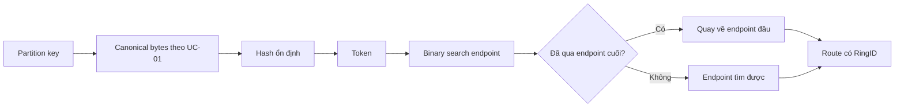

# Feature 01: Consistent hashing, token ring và partition key

## UC-02: Tìm owner trên token ring và hiểu vùng nào đổi khi thêm node

> Thiết kế chi tiết, chưa triển khai. Ví dụ ring 0..99 dùng để tính tay;
> API lab dùng token uint64, một snapshot ring bất biến và một primary owner.

### 1. Vấn đề: hash được key chưa đủ để mở rộng cluster

Giả sử mỗi request lấy `hash(key) % N` để chọn node. Khi N đổi từ 3 thành 4,
nhiều key đổi đích dù ba node cũ vẫn còn. Chuyển toàn bộ các key đó có thể tốn
nhiều network/disk và khiến cache mất hiệu quả.

Consistent hashing đặt key và các vị trí ownership trong một không gian vòng.
Key giữ token cũ khi số node đổi; owner thay đổi khi biên ownership liên quan
thay đổi. “Consistent” ở đây nói về sự ổn định của placement, không phải
consistency level đọc/ghi. Khái niệm ring/vnode có trong
[ScyllaDB Ring Architecture](https://docs.scylladb.com/manual/stable/architecture/ringarchitecture/).

UC này cung cấp phép lookup có quy tắc rõ ở boundary và wrap-around, rồi dùng
hai snapshot để giải thích key nào đổi owner. Chưa thực thi chuyển dữ liệu
đang lưu khi thay topology.

### 2. Ví dụ modulo làm nhiều key đổi đích

Giữ nguyên hash values 0..11 và tên node 0=A, 1=B, 2=C, 3=D:

| Hash | Modulo 3 | Modulo 4 | Đổi owner? |
| --- | --- | --- | --- |
| 0 | A | A | Không |
| 1 | B | B | Không |
| 2 | C | C | Không |
| 3 | A | D | Có |
| 4 | B | A | Có |
| 5 | C | B | Có |
| 6 | A | C | Có |
| 7 | B | D | Có |
| 8 | C | A | Có |
| 9 | A | B | Có |
| 10 | B | C | Có |
| 11 | C | D | Có |

9/12 key đổi owner trong ví dụ này. Đây là kết quả của fixture, không phải tỷ lệ
mặc định của mọi workload. Node còn sống cũng phải chuyển key qua lại.

### 3. Ring, endpoint và khoảng (previous, current]

Toy ring có token nguyên 0..99, tăng theo chiều kim đồng hồ:

```text
... 80(C) -> 99 -> 0 -> 20(A) -> 50(B) -> 80(C) ...
```

Mỗi endpoint sở hữu khoảng từ endpoint trước **không gồm đầu**, đến chính nó
**gồm cuối**. Owner được chọn bằng endpoint đầu tiên >= token; nếu không có,
quay về endpoint nhỏ nhất.

| Endpoint | Owner | Các token thuộc owner trong toy ring |
| --- | --- | --- |
| 20 | A | (80,20] qua điểm nối: 81..99 và 0..20 |
| 50 | B | (20,50]: 21..50 |
| 80 | C | (50,80]: 51..80 |

Token 20 thuộc A,21 thuộc B,80 thuộc C,81 quay về A. Không có gap tại 99→0.
Điểm nối chỉ là cách biểu diễn vòng, không phải một node đặc biệt.

### 4. Thêm node chỉ cắt một vùng của ring

Thêm endpoint 35 cho D, giữ nguyên 20/50/80 và hash function:

```text
old: A20 -> B50 -> C80 -> A20
new: A20 -> D35 -> B50 -> C80 -> A20
```

| Khoảng | Trước | Sau | Cần chuyển trong một migration thực? |
| --- | --- | --- | --- |
| (80,20] | A | A | Không |
| (20,35] | B | D | Có |
| (35,50] | B | B | Không |
| (50,80] | C | C | Không |

Chỉ 15/100 token đổi owner trong fixture. Key token 30 chuyển B→D; token 45 vẫn
ở B. Không lấy token % số endpoint vì điều đó phá tính chất vừa minh hoạ.

Thêm nhiều vnode sẽ cắt nhiều vùng nhỏ. Tỷ lệ key phải chuyển phụ thuộc các
vùng mới và phân bố hash; không luôn đúng bằng 1/N. Xoá endpoint 50 từ ring mới
thì (35,50] chuyển sang C80, các vùng khác giữ nguyên.

### 5. Một node có nhiều endpoint: vnode giải quyết điều gì?

Một endpoint/node có thể tạo vùng rất chênh lệch nếu vị trí rơi không đều.
Vnode cho một physical owner sở hữu nhiều khoảng rời rạc. Tổng các khoảng nhỏ
có thể phân bố đều hơn; đổi capacity có thể được mô tả bằng số/vị trí endpoint.

```text
endpoints = [(10,A), (25,B), (40,C), (60,A), (75,B), (90,C)]
```

A có cả vùng (90,10] và(40,60]. Vnode không phải thread CPU hay replica.
Hai vnode cùng A vẫn là một physical node; khi Feature 06 chọn RF3, không được
đếm hai vnode này là hai bản sao độc lập.

Vnode cũng không chia một partition: mọi request cho C123 có cùng token vẫn
đến cùng primary owner. UC-04 sẽ đo riêng ring coverage và hot-key traffic.

### 6. Data model và API đề xuất

```go
type Token uint64
type OwnerID string

type RingPoint struct {
    Token Token
    Owner OwnerID
}

type RingSnapshot struct {
    ID          string
    Partitioner string // lab-sha256-prefix64-v1
    KeyCodec    string // canonical-key-v1
    points      []RingPoint
}

type Route struct {
    RingID     string
    Token      Token
    Owner      OwnerID
    PointIndex int
    StartExclusive Token
    EndInclusive   Token
    Wraps      bool
    FullRing   bool // true khi ring chỉ có một point
}

func NewRingSnapshot(id string, points []RingPoint) (RingSnapshot, error)
func HashPartitionKey(key CanonicalPartitionKey) (Token, error)
func LookupToken(ring RingSnapshot, token Token) (Route, error)
func RoutePartition(ring RingSnapshot, key CanonicalPartitionKey) (Route, error)
```

API nhận points thay vì yêu cầu caller tự liệt kê range, nhờ đó mọi khoảng được
suy ra từ các endpoint duy nhất đã sort. Input point array được copy và sort;
duplicate endpoint token bị reject ngay cả khi cùng owner.

Ring ID định danh chính xác snapshot cấu hình. Cùng ID không được gán hai bộ
points khác nhau. Feature 01 load ring lúc khởi tạo và giữ bất biến; không có
hot-swap routing đang phục vụ. Hai ring trong thí nghiệm chỉ là hai fixture
độc lập để tính chênh lệch.

### 7. Hash function và giới hạn tương thích ScyllaDB

ScyllaDB mô tả partitioner Murmur3. Lab giữ một lựa chọn dễ kiểm chứng:
SHA-256 trên canonical partition bytes, lấy 8 byte đầu theo unsigned big-endian
làm token 64-bit. Đây là quyết định riêng của project, không tái tạo token CQL.

```text
digest = SHA256(canonicalPartitionBytes)
token  = uint64BigEndian(digest[0:8])
```

Đổi SHA thành Murmur không tự biến modulo placement thành consistent hashing:
tính chất chuyển ít key đến từ ring lookup và cách thay endpoint.
Hash chỉ phải ổn định, phân bố phù hợp và giống nhau giữa các caller.

`Partitioner` và `KeyCodec` là cấu hình định danh bắt buộc; khác version phải
reject. Không âm thầm đổi hash/serialization vì sẽ đổi vị trí của dữ liệu cũ.
Partition key thiếu, null hoặc không có component bị chặn theo UC-01;
giá trị text rỗng vẫn theo quy tắc kiểu của UC-01. Clustering key và payload
không được đưa vào hash.

Primitive vector `SHA256("abc")` có prefix `ba7816bf8f01cfea`.
Đây chỉ là vector kiểm tra hash byte/endianness; chuỗi raw "abc" không phải
canonical key của API production trong lab.

### 8. Lookup và xử lý wrap-around

```text
LookupToken(ring, t):
    require validated nonempty immutable ring
    i = lower_bound(points.Token >= t)
    if i == len(points):
        i = 0
    prev = (i - 1 + len(points)) % len(points)
    return Route(
        RingID=ring.ID, Token=t, Owner=points[i].Owner,
        PointIndex=i,
        StartExclusive=points[prev].Token,
        EndInclusive=points[i].Token,
        Wraps=(points[prev].Token > points[i].Token),
        FullRing=(len(points)==1))
```

Membership dùng comparator, không cộng 1 lên MaxUint64:

```text
fullRing              -> true
start < end           -> start < t AND t <= end
start > end (wrap)    -> t > start OR t <= end
start == end          -> chỉ hợp lệ khi explicit FullRing
```

Lookup O(log V), metadata O(V) với V endpoints. Sorting construction O(V log V).
Key token collision là hợp lệ: hai partition dùng chung owner nhưng storage
vẫn phân biệt bằng canonical partition key đầy đủ.

### 9. Luồng request và phạm vi trách nhiệm



Route là metadata. Nếu owner không reachable, lookup vẫn trả owner cũ; health
status không phải lý do tự chọn node kế tiếp đang chưa có dữ liệu. Feature 06
bổ sung replica policy; Feature 09 xử lý dữ liệu và placement chuyển đổi.

ScyllaDB hiện còn có tablet placement theo table. Tài liệu
[tablets](https://docs.scylladb.com/manual/stable/architecture/tablets.html)
được dùng để phân biệt cơ chế đó với mô hình vnode ring học ở đây.

### 10. Lỗi cần chặn

| Input/trạng thái | Hành vi |
| --- | --- |
| Ring không có endpoint | ErrEmptyRing trước lookup. |
| Owner/ID rỗng, codec/partitioner không hỗ trợ | Reject construction/request. |
| Hai endpoint cùng token | ErrDuplicateRingPoint; không chọn theo thứ tự slice. |
| Point array chưa sort | Copy và sort trong constructor. |
| Owner down | Không tự đổi placement; dispatcher báo unavailable. |
| Client dùng RingID khác instance | ErrRingMismatch; không tự gửi theo ring bất kỳ. |
| Muốn cập nhật ring đang phục vụ | ErrStaticTopology; cần migration protocol riêng. |
| Mutation của slice input sau construction | Snapshot và route không đổi. |

### 11. Các điều kiện luôn đúng

- Mọi token trong 0..MaxUint64 có đúng một primary owner trong snapshot hợp lệ.
- Boundary endpoint thuộc chính owner endpoint đó.
- Wrap-around không làm rơi token lớn nhất/nhỏ nhất.
- Cùng canonical key, partitioner và snapshot cho cùng route.
- Thêm một point trong phép so sánh fixture chỉ đổi owner vùng bị point đó cắt.
- Token collision không gộp partition identity.
- Thay clustering key không làm đổi token/owner.

### 12. Test cases có kết quả cụ thể

| Test | Fixture | Expected |
| --- | --- | --- |
| Boundary | A20/B50/C80, token 20/21/50/51 | A/B/B/C. |
| Wrap | Cùng ring, token 0/80/81/99 | A/C/A/A. |
| Add node | Thêm D35 | Chỉ token 21..35 đổi B→D. |
| Remove point | Ring mới bỏ B50 | Chỉ token 36..50 đổi B→C. |
| One point | Chỉ A20 | Mọi token→A; FullRing=true. |
| One owner nhiều points | A20/A50 | Mọi token→A, vẫn hai intervals. |
| MaxUint64 | Endpoint tại 0 và MaxUint64 | Cả hai boundary có owner đúng, không overflow. |
| Duplicate point | A20/B20 | Reject. |
| Input order | C80/A20/B50 | Kết quả như sorted ring. |
| Token collision | Hai key khác cùng token 30 | Cùng owner; hai partition vẫn độc lập. |
| Key churn fixture | H=0..11, modulo 3→4 | 9/12 đổi; không gán kết quả đó cho ring. |
| Ring mutation | Sửa input points sau constructor | Route không đổi. |

### 13. Phụ thuộc, chi phí và giới hạn

Input đến từ [UC-01](01-key-conventions-and-row-identity.md), output đi vào
[partition query](03-bounded-partition-reads.md) và
[thí nghiệm phân bố](04-skew-and-hot-partition-observability.md).

Chưa có gossip, distributed topology consensus, replica selection hay migration
thực. Ring giải bài toán placement; dữ liệu vẫn cần được copy và đồng bộ trước
khi một snapshot mới được phục vụ. Nguồn nghiên cứu và các quyết định khác với
production được ghi tại [ghi chú research](../../research/feature-01-02-foundations.md).
