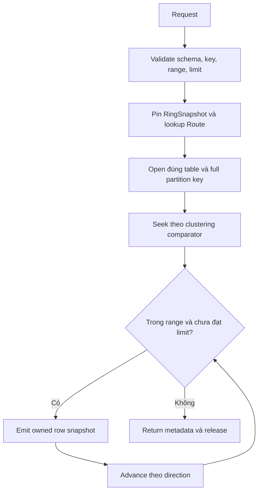

# Feature 01: Consistent hashing, token ring và partition key

## UC-03: Biết token rồi, đọc đúng phần dữ liệu cần bằng cách nào?

> Thiết kế chi tiết, chưa triển khai. Feature 01 dùng ordered in-memory fixture
> để kiểm chứng query contract; read merge trên LSM được nối vào ở Feature 03.

### 1. Vấn đề: placement đúng chưa đủ để query đúng

Ring cho biết owner của partition C123. Trên owner đó vẫn có nhiều partition,
mỗi partition lại có nhiều row. API cần chỉ rõ đọc row nào, theo thứ tự nào và
dừng ở đâu. Nếu chỉ biết token rồi quét toàn node, việc route chính xác chưa
mang lại query có chi phí dự đoán được.

Output là stream row của đúng một partition, đúng clustering range và tối đa
limit. Query mang RingID đã pin để toàn bộ lần đọc dùng cùng placement snapshot.

### 2. Hai thứ tự hoàn toàn khác nhau

| Thứ tự | Dùng ở đâu? | Ví dụ |
| --- | --- | --- |
| Token tăng theo ring | Chọn owner | Token 30 đến endpoint 50;81 wrap tới20. |
| Clustering comparator | Chọn/thứ tự row trong partition | created_at DESC, order_id ASC. |

Hash phá thứ tự tự nhiên của key. Khoảng customer_id C100..C200 không trở
thành một đoạn liên tục của ring, và giờ 09:00..10:00 không phải token range.

Tài liệu [ScyllaDB Data Definition](https://docs.scylladb.com/manual/stable/cql/ddl.html)
phân biệt partition key và clustering columns. Các constraint query dưới đây
là contract rút gọn do project chọn.

### 3. Ví dụ: hai đơn mới nhất của C123

Schema thống nhất với UC-01:

```text
orders_by_customer_v1
partition:  customer_id text
clustering: created_at timestamp_micros DESC, order_id text ASC
```

| Customer | Created at | Order | Status |
| --- | --- | --- | --- |
| C123 | 2026-09-03T16:30Z | O-03 | paid |
| C123 | 2026-09-02T11:00Z | O-02 | shipped |
| C123 | 2026-09-01T09:00Z | O-01 | paid |
| C999 | 2026-09-03T17:00Z | O-04 | paid |

```text
partition={customer_id:C123}
range=nil
direction=Forward
limit=2
```

Ring chọn owner từ token của C123. Ordered reader trả O-03 rồi O-02,
RowCount=2, Exhausted=false. `Forward` đi theo schema nên lấy mới nhất trước;
`Reverse` trong schema này lấy cũ nhất trước.

O-04 không được đọc dù nằm ở cùng owner, có timestamp mới hơn hoặc tình cờ
C999 hash trùng token với C123.

### 4. Ví dụ: một giờ sự kiện, không lặp boundary

Một bảng độc lập dùng `occurred_at ASC, event_id ASC`:

```text
events_by_device:
  partition={device_id:D77}
  start={occurred_at:09:00, event_id:""} inclusive
  end  ={occurred_at:10:00, event_id:""} exclusive
  direction=Forward, limit=500
```

Chuỗi rỗng là giá trị text nhỏ nhất theo byte comparator UC-01 và là component
hợp lệ. Dùng full tuple như trên cho khoảng [09:00,10:00): mọi event 09:00
được nhận, mọi event 10:00 bị loại. Không cần sentinel MIN chưa có trong codec.

Input thời gian phải chuyển thành TimestampMicros UTC trước khi gọi API;
09:00 chỉ là ký hiệu rút gọn trong ví dụ. Range theo comparator schema, không
được tự đảo start/end khi schema DESC.

### 5. Data model/API đề xuất

```go
type ReadDirection uint8
const (
    Forward ReadDirection = iota
    Reverse
)

type ClusteringBound struct {
    Values    KeyValues // đầy đủ các clustering columns
    Inclusive bool
}

type ClusteringRange struct {
    Start *ClusteringBound
    End   *ClusteringBound
}

type PartitionReadRequest struct {
    TableID      TableID
    Partition    KeyValues
    Range        *ClusteringRange
    Direction    ReadDirection
    Limit        uint32
}

type PartitionReadMetadata struct {
    Route     Route
    RowCount  uint32
    Exhausted bool
}

type RowVisitor func(RowSnapshot) error

func ReadPartition(
    ctx context.Context,
    req PartitionReadRequest,
    visit RowVisitor,
) (PartitionReadMetadata, error)
```

Baseline MaxReadRows=1000 mỗi table, cấu hình rõ khi tạo fixture. Limit phải
trong 1..MaxReadRows. Không truyền owner/token thô từ caller để bypass key
validation; router tính từ canonical key và ring đã pin.

Range=nil đọc từ đầu/cuối partition theo Direction, vẫn chịu limit.
Start/End riêng lẻ nil nghĩa là không chặn phía đó. Bound có mặt phải chứa
đầy đủ tuple; partial-prefix query chưa được hỗ trợ.

Table không có clustering key có tối đa một logical row/partition; chỉ nhận
Range=nil. Comparator không cố giải một tuple giả do caller tự tạo.

### 6. Thuật toán query



```text
ReadPartition(req, visit):
    validate table, visitor, direction, limit
    pk = canonicalizePartition(req.Partition)
    bounds = canonicalizeFullClusteringBounds(req.Range)
    require Start <= End theo schema comparator khi cả hai có mặt
    pin configured ring
    route = RoutePartition(ring, pk)
    open cursor(route.Owner, req.TableID, pk)
    seek lower boundary nếu Forward, upper boundary nếu Reverse

    count = 0
    while cursor has matching row:
        check cancellation
        if count == req.Limit: return(count, exhausted=false)
        snapshot = copy(cursor.row)
        if visit(snapshot) fails: return error
        count++
        advance cursor theo direction
    return(count, exhausted=true)
    finally close cursor và release pins
```

Phải peek/advance sau row thứ limit để biết có còn row trong range hay không.
Lookahead không emit thêm row. `Exhausted=true` khi hết đúng tại limit hoặc
trước limit; false khi còn kết quả.

Callback có thể đã nhận vài row rồi cursor/visitor lỗi. Caller phải coi toàn
request là failed/incomplete, không coi prefix đã nhận là kết quả thành công.
API streaming không rollback side effect do callback của ứng dụng tự tạo.

### 7. Routing và storage boundary

Một request giữ một RingID. Mô hình Feature 01 không thay ring đang chạy; nếu
adapter trả ring mismatch, query fail rõ thay vì retry sang owner tuỳ tiện.

`OpenPartition` nhận table và **full canonical partition key**, không chỉ token.
Token dùng chọn owner; dùng token làm storage lookup duy nhất sẽ lẫn dữ liệu
khi collision. Có thể kiểm tra rule này bằng hash stub cho C123/C999 cùng token.

Để test contract, fixture dùng ordered collection đã có rows và seek đúng
comparator. Nó không giả lập SSTable/read repair. Feature 02 lưu các mutation,
Feature 03 thay fixture bằng merge reader qua memtable và files.

### 8. Limit chặn kết quả, không đảm bảo chặn mọi I/O

Limit20 bảo đảm không emit21 rows. Nó không tự bảo đảm chỉ đọc 20 physical
records: có thể cần bỏ versions cũ, tombstones hoặc scan thêm nguồn trong LSM.

Feature 01 kiểm chứng query shape và ordering. Chi phí seek, số candidate
sources, bytes đọc và read merge là các đo lường Feature 03/07. Tránh viết
“limit20 luôn O(20)” vì điều đó che giấu wide partition và version history.

### 9. Validation và lỗi

| Tình huống | Hành vi |
| --- | --- |
| Thiếu partition key, multi-partition list | Reject trước router/store. |
| Table/key type sai | Schema/key error, không hash input tuỳ tiện. |
| Bound thiếu cột hoặc chứa null | InvalidClusteringBound. |
| Start > End theo schema | InvalidRange; không tự swap. |
| [K,K] | Có thể trả đúng rowK. |
| (K,K), [K,K), (K,K] | Empty hợp lệ. |
| Limit0 hoặc>MaxReadRows | InvalidReadLimit. |
| Partition không có trong fixture | Success empty, không fan-out hỏi owner khác. |
| Owner không sẵn sàng | Unavailable; ring không bị sửa bởi query. |
| Cursor/callback/cancellation error | Đóng tài nguyên, trả error; prefix không là success. |

### 10. Điều kiện luôn đúng và test

Một query chỉ có một partition identity và một ring snapshot. Mọi emitted row
thuộc partition đó, trong bounds, đúng comparator/direction. RowCount<=Limit;
output bytes không alias internal mutable state.

| Test | Input | Kết quả |
| --- | --- | --- |
| Latest2 | C123 DESC fixture, Forward2 | O-03,O-02; Exhausted=false. |
| Oldest2 | Cùng fixture, Reverse2 | O-01,O-02. |
| Exact limit | C123 có 3 rows, limit3 | RowCount3, Exhausted=true. |
| Time range | 08:59/09:00/09:30/10:00 | Chỉ 09:00 và 09:30. |
| Equal timestamps | Hai orders cùng time, IDs A/B | A trướcB ở Forward theo tie-breaker. |
| Collision | C123/C999 cùng token | ReadC123 không emitO-04. |
| Không PK | Query toàn bộ đơn hôm nay | Router/store call count=0. |
| Comparator text | Clustering text aa/z | Theo payload lexical, không theo length framing. |
| Cancellation | Hủy sau row 2 | Không emitrow3; resources được release. |
| Input/output mutation | Caller sửa bytes snapshot | Fixture đọc lại không đổi. |

### 11. Phụ thuộc và giới hạn

Dùng [UC-01 key codec](01-key-conventions-and-row-identity.md) và
[UC-02 ring lookup](02-static-token-routing.md). UC-04 đo request distribution.

Chưa có global query, secondary index, paging token, transport protocol,
snapshot isolation nhiều request hay read reconciliation giữa replica.
Quy ước Forward/Reverse, limit1000 và full-tuple bounds là lựa chọn của lab.
