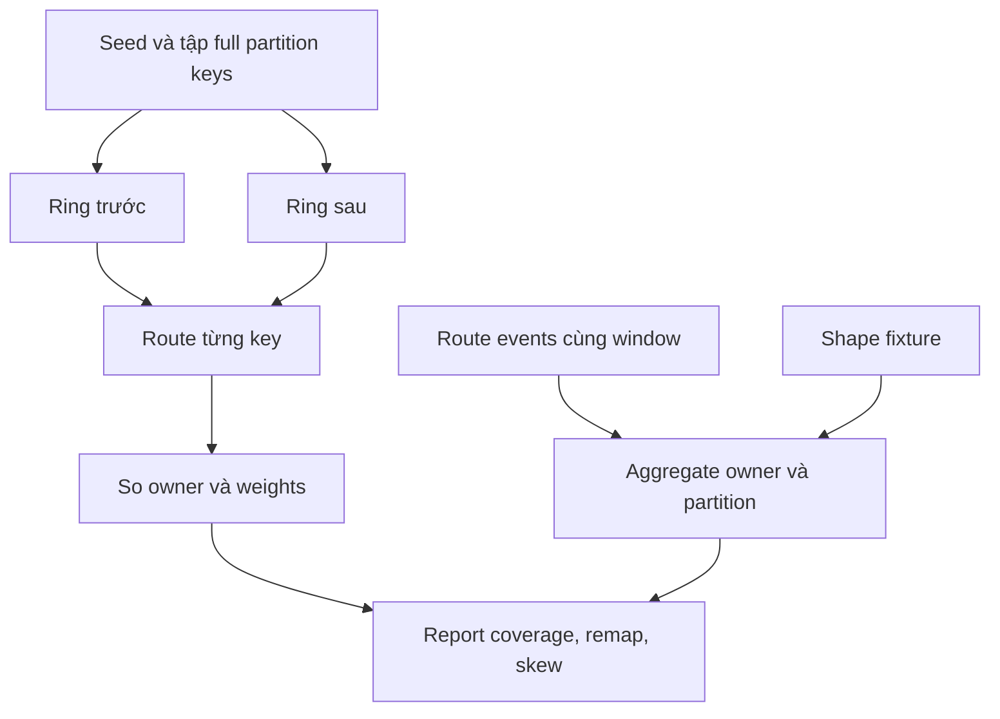

# Feature 01: Consistent hashing, token ring và partition key

## UC-04: Ring có đều không, key nào phải chuyển, và partition nào đang nóng?

> Thiết kế chi tiết, chưa triển khai. Các con số là fixture tính tay, không phải
> benchmark trên cluster ScyllaDB. Thí nghiệm không thay placement đang phục vụ.

### 1. Vấn đề: nhìn token coverage có thể kết luận sai

Một node giữ 30% vòng token không có nghĩa giữ 30% bytes hay nhận 30% request.
Một partition rất lớn có thể làm lệch bytes; một customer rất tích cực có thể
làm lệch traffic dù hash phân bố nhiều key khá đều.

Tương tự, ring lookup có wrap-around chưa đủ để chứng minh consistent hashing
đạt mục tiêu. Cần so key-owner trước/sau một thay đổi endpoint và chỉ ra đúng
vùng bị đổi. UC này kiểm chứng cả placement stability lẫn giới hạn cân bằng tải.

Output là một báo cáo có bốn nhóm số liệu:

| Nhóm | Câu hỏi |
| --- | --- |
| Ring coverage | Mỗi physical owner giữ bao nhiêu không gian token? |
| Key/byte/request distribution | Workload thực hoặc fixture phân bố ra sao? |
| Remapping | Bao nhiêu key/bytes/request weight đổi owner giữa hai snapshot? |
| Hot/wide partitions | Tải tập trung ở một key hay nhiều key; key nào quá lớn? |

### 2. Thí nghiệm A: tính coverage và vùng remap bằng tay

Toy ring 0..99:

```text
Before: A20, B50, C80
After:  A20, D35, B50, C80
```

| Owner | Coverage trước | Coverage sau |
| --- | --- | --- |
| A | 40 tokens | 40 tokens |
| B | 30 tokens | 15 tokens |
| C | 30 tokens | 30 tokens |
| D | Không có | 15 tokens |

Với một synthetic key cho mỗi token 0..99, đúng 15/100 key đổi B→D.
Nếu key token 21..35 đều chứa 1 MiB thì 15 MiB chuyển; nếu một key trong vùng đó
chứa 1 GiB thì bytes cần chuyển cao hơn nhiều. Key remap rate và byte remap rate
phải là hai metric riêng.

Một key đổi owner không được tính nhiều lần vì nhiều request. Request weight
phục vụ phân tích traffic; cardinality phục vụ placement.

### 3. Thí nghiệm B: modulo với cùng dữ liệu

Dùng hash values 0..11, so `h%3` với `h%4`: 9/12 key đổi. Đặt cạnh ring
fixture giúp thấy cơ chế nào hạn chế remap, nhưng không so 9/12 với 15/100 như
một benchmark cùng dataset.

Muốn so định lượng công bằng, dùng cùng tập hash values và normalize toy ring
domain hợp lệ; ghi seed, N, V và cấu hình endpoints. Báo tỷ lệ đo được, không
tuyên bố một số phần trăm luôn đúng cho mọi distribution.

### 4. Thí nghiệm C: hot partition dù coverage đẹp

Trong cửa sổ năm phút:

```text
A: C123=80 requests, C777=10 ->90
B: C200=15                 ->15
C: C300=15                 ->15
total=120, owner mean=40
```

A có ratio 90/40=2.25 lần mean. C123 chiếm 80/90=88.9% traffic A.
Policy fixture: MinimumRequests 20, HotShareOfOwner 0.5, OwnerSkewRatio 2.0.
A bị đánh dấu skew; C123 hot; C777 chưa đủ ngưỡng.

Nếu A nhận 90 requests từ 30 keys mỗi key 3 requests thì A vẫn skew, nhưng không
có một hot partition theo policy. Vnode có thể thay phân bố nhiều key; không
thể chia 80 requests cùng C123 sang nhiều primary owner chỉ bằng hash.

### 5. Thí nghiệm D: wide không nhất thiết hot

Một tenant có 2 triệu row, estimated bytes 3 GiB nhưng chỉ 1 request trong cửa sổ:
wide=true nếu vượt threshold bytes/rows, hot=false.

Một key chỉ có 1 row nhưng 80 requests có thể hot=true, wide=false.
Nếu chưa có row/byte measurement, wide=unknown; không dùng zero thay unknown.

Feature 01 lấy shape từ fixture/provider. Nó chưa có storage engine tự quét
mọi partition để tính bytes. Khi Feature 02 có storage, cần nói rõ bytes là
logical key/value bytes hay physical disk bytes; hai số khác nhau trong LSM.

### 6. Data model và contract đề xuất

```go
type PartitionID struct {
    Table TableID
    CanonicalKey string // bản copy bytes, dùng equality nội bộ
}

type RouteEvent struct {
    EventID   string
    At        time.Time
    Partition PartitionID
    Route     Route
}

type PartitionShape struct {
    Partition PartitionID
    AsOf      time.Time
    Rows      *uint64
    LogicalBytes *uint64
}

type RemapRecord struct {
    Partition PartitionID
    Token Token
    Before, After OwnerID
    LogicalBytes *uint64
    RequestWeight uint64
}

type ExperimentConfig struct {
    WindowStart, WindowEnd time.Time
    MinimumRequests uint64
    HotShareOfOwner, OwnerSkewRatio float64
    MaxPartitions uint32
    MaxEvents uint32
    MaxRows, MaxLogicalBytes *uint64
}

func ComparePlacement(
    before, after RingSnapshot, keys []PartitionID,
) ([]RemapRecord, error)
func Snapshot(
    ring RingSnapshot, config ExperimentConfig,
) (PlacementReport, error)
```

Report định danh bằng full key ở bên trong, chỉ hiển thị fingerprint ngắn cho
người đọc. Fingerprint là nhãn rút gọn, không chứng minh dữ liệu được ẩn danh:
key dễ đoán vẫn có thể bị dò. Hai key có fingerprint/token collision phải
được đếm riêng dựa trên equality của canonical bytes.

RouteEvent dùng Route từ UC-02 gồm RingID, owner và endpoint. Observer validate
với snapshot tương ứng; không tự bịa owner theo health hoặc modulo.

### 7. Cách tính coverage không overflow

Với ring 64-bit, độ lớn vòng là 2^64, không chứa được trong uint64. Độ dài
khoảng (start,end] tính bằng số nguyên độ rộng lớn hơn 64-bit:

```text
nếu FullRing: length = 2^64
nếu start < end: length = end - start
nếu start > end: length = 2^64 - start + end
coverage(owner) = sum(length of owner's intervals) / 2^64
```

Tổng coverage mọi owner bằng 1. Một owner có nhiều vnode phải cộng các interval
của nó; không báo từng vnode như physical node độc lập.

Expected request share theo coverage chỉ có nghĩa khi giả định key hash đều
và request weight giống nhau. Mặc định report giữ coverage và traffic riêng,
không gọi chênh lệch là “hash bug” nếu chưa kiểm tra workload.

### 8. Thuật toán remap và snapshot

```text
ComparePlacement(before, after, distinctPartitionKeys):
    require cùng partitioner và key codec
    for mỗi full partition key:
        token = hash(canonicalKey)
        old = LookupToken(before, token)
        new = LookupToken(after, token)
        emit record(old.Owner, new.Owner, token, weights)

remapKeyRate = number(owner changed) / number(distinct keys)
remapByteRate = sum(known bytes of changed keys) / sum(known bytes of all keys)
```

Nếu thiếu bytes của bất kỳ key nào, báo byte rate trên known subset cùng
coverage count, không quảng cáo đó là tỷ lệ toàn dataset. Zero denominator
cho metric unavailable, không chia 0 hoặc coi là balanced.

Snapshot window là [start,end). Report tạo một lần sau seal; late event bị
reject và tăng late counter, không tự chuyển sang window kế tiếp.
Shape dùng bản mới nhất với AsOf<end và hiển thị tuổi; báo unknown nếu vắng.

Baseline MaxPartitions giới hạn partition map và MaxEvents giới hạn tập
EventID của thí nghiệm. Vượt một trong hai giới hạn
thì kết thúc run với budget error; không silently bỏ những partition sau và
vẫn công bố report đầy đủ. EventID được dedup trong cùng cửa sổ có budget để
instrumentation retry không làm request tăng giả.

### 9. Luồng thí nghiệm tái lập



Lưu cấu hình hash/codec/RingID, endpoints, seed, key count và weights.
Các nguồn thí nghiệm được copy; việc compare không sửa ring hoặc đổi owner
live. Nếu muốn thực sự chuyển dữ liệu, phải dùng workflow Feature 09.

### 10. Validation, invariant và test

Hai snapshots khác partitioner/codec không là thí nghiệm “chỉ thêm node”,
nên ComparePlacement từ chối. Duplicate key input phải dedup theo full identity;
duplicate endpoint đã bị chặn ở UC-02.

| Test | Expected |
| --- | --- |
| Ring A20/B50/C80 trên 0..99 | Coverage A40%, B30%, C30%. |
| Thêm D35 | Chỉ keys token 21..35 đổi, tỷ lệ 15/100. |
| Bỏ B50 sau khi thêm D | Chỉ 36..50 đổi B→C. |
| Token collision | Cùng token, hai identity vẫn hai key trong report. |
| Hot fixture 80/10/15/15 | A ratio 2.25, C123 share 88.9%. |
| Skew nhiều keys nhỏ | Owner finding có, hot partition finding không. |
| Owner không request | Vẫn có trong mẫu số mean owner. |
| Wide cold | Rows/bytes vượt ngưỡng, requests 1: wide=true hot=false. |
| Bytes unknown | Report unknown, không ghi 0. |
| No events | Counter 0, ratio unavailable, coverage vẫn tính được. |
| Event đúngend | Không thuộc window. |
| Duplicate EventID | Chỉ đếm một lần. |
| Budget exceeded | Run failure rõ, không báo partial như complete. |
| Caller sửa snapshot | Report/ring nội bộ không đổi. |

Các invariant: coverage cộng đủ vòng; mỗi route event thuộc đúng ring;
metrics không đổi routing; remap so full partition identity; hot/width không
được suy ra từ nhau.

### 11. Cách dùng kết quả

Nếu coverage lệch, xem endpoint/vnode allocation. Nếu coverage đều nhưng bytes
lệch, xem kích thước partition. Nếu một partition quá nóng, cân nhắc thay key
theo time bucket hoặc schema, rồi đánh giá query phải fan-out thêm bao nhiêu.

Những thay đổi đó là quyết định mới về data model; report chỉ cung cấp bằng
chứng. Nền vnode/ring tham khảo
[ScyllaDB Ring Architecture](https://docs.scylladb.com/manual/stable/architecture/ringarchitecture/).
Xem [research](../../research/feature-01-02-foundations.md) để phân biệt ring
lab với tablet placement production.
