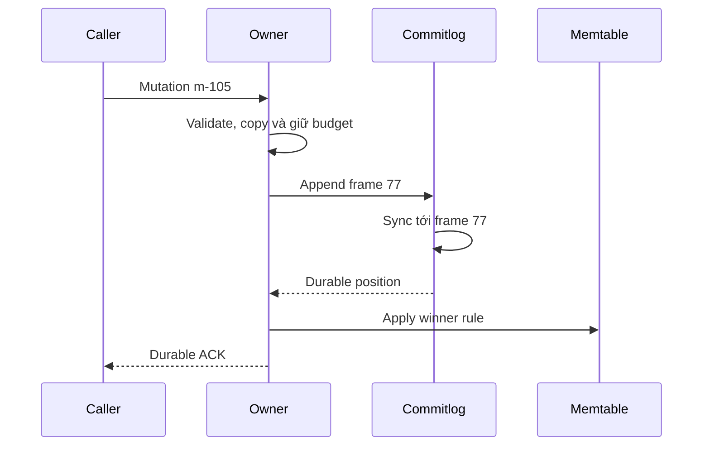

# Feature 02: LSM tree — commitlog, memtable và SSTable

## UC-01: Khi nào được trả “ghi thành công”?

> Trạng thái: thiết kế chi tiết, chưa triển khai. API và mã giả là đề xuất
> cho mô hình học tập; các test bên dưới là tiêu chí nghiệm thu.

### 1. Vấn đề và kết quả cần có

Ứng dụng cập nhật đơn hàng O-900 sang `paid`. Người dùng đã nhìn thấy thông
báo thành công thì process lưu trữ chết. Khi chạy lại, trạng thái phải còn là
`paid`, hoặc một phiên bản mới hơn đã thắng nó. Lưu trong RAM không đủ để
thực hiện lời hứa này.

Commitlog là sổ ghi tuần tự những thay đổi mà owner nhận. Trước khi một thay đổi
được xác nhận, owner ghi một record hoàn chỉnh xuống log, yêu cầu hệ điều hành
đồng bộ file, rồi áp dụng nó vào state dùng để đọc. SSTable có thể được tạo sau.

Output là một `WriteReceipt`: mutation nào được xác nhận, ở vị trí log nào và
đã đạt mức bền vững nào. Receipt xác nhận việc nhận mutation; nó không đảm bảo
mutation đó thắng một version lớn hơn đã tồn tại.

### 2. Vì sao LSM cần cả WAL và memtable?

LSM dời việc ghi cấu trúc dữ liệu đã sắp xếp trên disk sang các lần flush theo
lô. Điều đó tạo một khoảng thời gian mutation mới chỉ có trong RAM. WAL bảo
vệ khoảng trống này bằng append tuần tự; memtable phục vụ lookup và gom state
cùng key; mỗi thành phần giải một vấn đề khác nhau.

```text
Append order trong WAL: b=v1, a=v2, b=v3
State ordered trong RAM: a=v2, b=v3
Sorted run khi flush:    a=v2, b=v3
```

Ba log records chỉ tạo hai row winners trong run. Log không được bỏ record
b=v1 ngay lúc nhận b=v3; điều kiện recycle phụ thuộc checkpoint bền vững,
không chỉ việc overwrite trong RAM.

WAL không phải query index. Một read bình thường không replay toàn log để tìm
b mới nhất; state RAM đã được apply phục vụ nhiệm vụ đó. Cơ chế WAL/recovery
được tham khảo từ [RocksDB WAL](https://github.com/facebook/rocksdb/wiki/Write-Ahead-Log-%28WAL%29);
contract đồng bộ và mutation model dưới đây là lựa chọn riêng của lab.

### 3. Ví dụ xuyên suốt: ghi, xác nhận, crash

```text
Row:       (orders_by_customer_v1, C123, 09:00/O-900)
Mutation:  m-105
Version:   (105, writer-a)
Value:     status=paid

1. Owner cấp local sequence 77.
2. Append frame 77 vào segment 4.
3. Sync segment 4 thành công.
4. Memtable áp dụng m-105.
5. Trả ACK(position=(owner-0, segment-4, sequence-77)).
6. Process chết trước lần flush kế tiếp.
7. Recovery đọc frame 77 và khôi phục status=paid.
```

Nếu process chết giữa bước 3 và 5, dữ liệu có thể đã được lưu dù caller chưa
nhận ACK. Vì vậy timeout là “chưa biết kết quả”, không phải “chắc chắn chưa ghi”.
Retry phải dùng lại mutation ID, version và nội dung gốc.

### 4. Input, output và ownership

```go
type Version struct {
    Logical  uint64
    WriterID string
}

type Mutation struct {
    ID        string
    Row       RowIdentity
    Version   Version
    Kind      MutationKind // Upsert hoặc Delete
    Value     []byte
    ExpiresAt *int64       // UTC microseconds; nil nghĩa là không hết hạn
}

type CommitPosition struct {
    OwnerID   string
    SegmentID uint64
    Sequence  uint64
    Offset    int64
}

type WriteReceipt struct {
    MutationID string
    Position   CommitPosition
    Durable    bool
}

func (w *WritePath) Apply(
    ctx context.Context, mutation Mutation,
) (WriteReceipt, error)
```

| Field | Ý nghĩa và lý do cần có |
| --- | --- |
| `ID` | Nhận diện một mutation bất biến; retry giữ nguyên ID và nội dung. |
| `Row` | Table, canonical partition key và clustering key của Feature 01. |
| `Version` | Thứ tự nghiệp vụ để giải quyết nhiều mutation của cùng row. |
| `Kind` | Upsert có payload; Delete được Feature 04 bổ sung semantics. |
| `ExpiresAt` | Mốc hết hạn tuyệt đối; retry/replay không cộng lại TTL. |
| `Sequence` | Thứ tự append cục bộ, dùng recovery/flush; không so giữa replica. |
| `Offset` | Vị trí frame trong segment để kiểm tra và định vị. |

Caller chịu trách nhiệm cấp logical version theo intent nghiệp vụ. Hai writer
độc lập có thể cùng cấp số 105; tie-breaker dưới đây cho kết quả xác định, chứ
không chứng minh writer nào xảy ra muộn hơn trong thời gian thực.

Write path copy key, value và expiry trước khi đưa chúng vào log hoặc state.
Sau khi gọi API, caller sửa slice của mình không được làm thay đổi mutation.

### 5. Quy tắc chọn phiên bản dùng chung

Với cùng row, so sánh lần lượt và chọn mutation lớn nhất:

```text
(Version.Logical, kindRank, Version.WriterID, ID)
kindRank: Upsert=0, Delete=1
WriterID và ID: so sánh byte, không phụ thuộc locale
```

Delete thắng Upsert nếu cùng `Logical`. Với hai Upsert cùng logical version,
WriterID rồi ID phá hoà. Các feature đọc, compact, replica reconciliation và
migration phải dùng đúng một quy tắc này.

Cùng ID có nội dung khác là input sai, không phải một update hợp lệ. Khi bản
trùng được đối chiếu trong state/log/read merge, phải báo `MutationConflict`.
API yêu cầu caller giữ ID bất biến; mô hình này chưa cung cấp registry dedup
toàn cục giữ vô hạn mọi ID từng xuất hiện.

TTL không tham gia sửa version. Reader chọn winner trước, rồi xét expiry của
winner. Nếu winner đã hết hạn, row vắng mặt; không quay về value cũ bên dưới.

### 6. Commitlog record phải tự kiểm chứng được

Frame đề xuất:

```text
magic | formatVersion | payloadLength | ownerSequence | mutationPayload | CRC32C
```

Checksum bao phủ version format, length, sequence và payload để phát hiện
record ghi dở hoặc sai byte. Length có giới hạn cấu hình và được kiểm tra trước
cấp bộ nhớ; không đọc một con số bị hỏng rồi cấp hàng GiB RAM.

Segment mới phải có header hợp lệ và được tạo bền vững, gồm sync thư mục khi
cần. Sync file dữ liệu không tự chứng minh directory entry mới đã bền vững.
Thiết kế giả định local filesystem tôn trọng fsync và atomic rename; test
process crash không được quảng cáo là chứng minh mọi loại hardware failure.

### 7. Luồng xử lý chính



```text
Apply(m):
    validate schema, identity, version, kind, size, expiry
    reject canceled request trước khi nhận xử lý
    ownCopy = copy(m); reserve memory cho apply
    pos = appendCompleteFrame(ownCopy)
    syncUntil(pos)
    applyIfWinner(memtable, ownCopy) // lower version là no-op hợp lệ
    invalidateReadCacheIfPresent()  // được nối vào ở Feature 07
    return receipt(m.ID, pos, durable=true)
```

Giữ budget trước append giảm khả năng “đã durable nhưng hết RAM để apply”.
Nếu apply vẫn thất bại, owner ngừng phục vụ state không hoàn chỉnh và yêu cầu
recovery. Caller nhận kết quả chưa xác định, không nhận success giả.

Cancellation trước admission có thể bảo đảm chưa append. Sau append, cancellation
chỉ dừng chờ ở caller; không xoá record đã ghi hay rollback mutation durable.
Baseline dùng sync mỗi write để dễ kiểm tra; group commit là mở rộng sau này.

Sync từng write, sync theo batch và sync định kỳ là các hợp đồng durability
khác nhau. Batch có thể amortize một lần sync cho nhiều request cùng đợi;
periodic có thể trả ACK trước sync và chấp nhận rủi ro mất phần chưa sync ở
một số kiểu failure. Lab chọn strict sync-before-ACK, không gọi đây là default
ScyllaDB. [Nguồn cấu hình](https://docs.scylladb.com/manual/stable/reference/configuration-parameters.html#commit-log-settings).

### 8. Các điểm lỗi và ý nghĩa với caller

| Điểm lỗi | State có thể đã đổi? | Kết quả và cách xử lý |
| --- | --- | --- |
| Key sai, size vượt budget | Chưa | Reject trước append. |
| Không đủ budget apply | Chưa | Overloaded; caller có thể retry cùng mutation. |
| Append bị ngắn | Có thể có tail dở | Không ACK; khoá append vào segment lỗi và recovery. |
| Sync trả lỗi | Có thể record đã tới disk | OutcomeUnknown; không cam kết rollback. |
| Sync xong, apply RAM lỗi | Log đã durable | Owner dừng phục vụ; replay trước khi mở lại. |
| Apply xong, response mất | Mutation có thể đã visible | Retry cùng ID/version/value. |
| Version thấp hơn state | Log được chấp nhận, state giữ winner | ACK không có nghĩa value thấp hơn đã thay winner. |

Không tiếp tục append phía sau một frame rách: recovery sẽ không phân biệt được
tail có thể bỏ với phần giữa log chứa dữ liệu đã ACK.

### 9. Điều kiện luôn đúng — invariant

- ACK success chỉ xuất hiện sau append, sync và apply thành công.
- Mutation ID/row/version không bị đổi bởi retry, log replay hay transport.
- Local sequence chỉ tăng trong cùng owner và được phục hồi sau restart.
- Retry cùng mutation cho cùng visible state; đây là idempotence của state,
  không phải lời hứa chỉ có một bản frame trên disk.
- Không có đường xử lý lỗi nào chuyển trạng thái chưa biết thành “chưa ghi”.

### 10. Test cases và kết quả mong đợi

| Test | Thao tác | Kết quả cần chứng minh |
| --- | --- | --- |
| Ghi bình thường | Ghi m-105, read cùng owner | ACK durable; read thấy m-105. |
| Gom overwrite | Ghi b1,a2,b3 trong cùng generation | WAL3 frames, memtable2 rows a2/b3, chưa có sửa SSTable cũ. |
| Input mutable | Sửa input bytes sau API | Log và state giữ nội dung đã copy. |
| Crash trước append | Kill tại admission | Không có frame, không có ACK. |
| Crash trước sync | Ghi một phần/tất cả frame rồi kill | Có thể phục hồi hoặc không; chưa từng trả success. |
| Crash sau sync | Kill trước apply | Replay có m-105; caller có outcome unknown. |
| Crash sau ACK | Kill trước flush | Restart vẫn có m-105 hoặc version mới hơn. |
| Retry | Gửi m-105 ba lần | Một row visible, cùng winner. |
| Ghi cũ | State 106, gửi 105 | Có thể ACK 105 nhưng read vẫn trả 106. |
| Equal logical delete | Upsert105 và Delete105 | Delete thắng mọi thứ tự nhận. |
| Conflicting ID | Cùng ID khác payload được đối chiếu | MutationConflict, không chọn ngẫu nhiên. |

Test harness cần fault injection ở từng bước và một oracle ghi lại ACK thật
caller nhận được. Sau crash, mọi mutation đã ACK phải còn bằng chứng hoặc đã
bị mutation thắng nó che đi hợp lệ.

### 11. Chi phí, phụ thuộc và ngoài phạm vi

Sync mỗi write tăng latency; lợi ích là durable boundary dễ giải thích. Có thể
đo append và sync riêng để biết chậm do serialize hay disk. Memory admission
cũng phải tính payload copy, không chỉ số request.

UC dùng key contract Feature 01, phục vụ [flush](02-memtable-and-safe-flush.md)
và [replay](03-restart-replay.md). Feature 06 mở rộng ACK thành đếm durable ACK
từ replica. Chưa có transaction nhiều row, compare-and-set, consensus hay
cam kết thứ tự thực toàn hệ thống.
