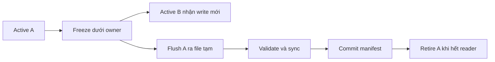

# Feature 02: LSM tree — commitlog, memtable và SSTable

## UC-02: Làm sao chuyển dữ liệu trong RAM xuống file một cách an toàn?

> Trạng thái: thiết kế chi tiết, chưa triển khai. Các cấu trúc là API đề xuất.

### 1. Vấn đề và output

Memtable cho phép cập nhật nhanh trong RAM, nhưng không thể tăng mãi. Khi gần
hết budget, owner phải đưa dữ liệu xuống disk. Đồng thời, request mới vẫn đến,
reader vẫn đọc và process có thể chết giữa lúc file đang được tạo.

Một flush thành công tạo ra SSTable bất biến, được kiểm tra đầy đủ và xuất hiện
trong manifest đã commit. Manifest là danh sách chính thức những file reader
được dùng. Có file trên disk chưa đủ để nói flush đã hoàn thành.

### 2. Ví dụ: tách write cũ và write mới

Trong ví dụ này, các mutation cập nhật cùng row có version tăng dần;
sequence chỉ đánh dấu vị trí log, không tự quyết định winner.

```text
Memtable A:
  row O-900 = pending, seq 10
  row O-900 = paid,    seq 20   -> winner giữ trong A là paid
  row O-901 = pending, seq 30
  mọi sequence của owner tới 30 đã được xử lý

Freeze tại sequence 30:
  frozen A: rows tới 30, không còn được sửa
  active B: bắt đầu từ sequence 31

Trong khi A flush:
  seq 31 sửa O-900 thành shipped trong B
  reader vẫn phải thấy shipped qua read merge
```

SSTable của A chứa `paid`, không chứa `shipped`. Điều đó đúng: file là
snapshot một thế hệ memtable; Feature 03 hợp nhất A và B theo mutation version.

Flush có thể không ghi mọi frame log: `pending` ở seq 10 đã bị `paid` seq 20
che đi. Bằng chứng winner đủ để tái tạo visible state nếu cùng quy tắc reconcile
được dùng. Tombstone và metadata expiry cũng phải được giữ khi Feature 04 có mặt.

### 3. Memtable phải hỗ trợ những thao tác nào của LSM?

LSM cần chèn/update nhanh và xuất row theo key order. Baseline dùng abstraction
ordered map với comparator rõ ràng, có thể cài bằng balanced search tree.
Skiplist cũng là một lựa chọn, nhưng API không phụ thuộc một thư viện cụ thể.
Hash map thuần không có ordered seek; nếu chọn hash map + sort khi flush thì
phải tính riêng chi phí sort và giải pháp range read.

```go
type OrderedMemtable interface {
    ApplyWinner(m Mutation) (changed bool, err error)
    Find(key RowIdentity) (Mutation, bool)
    Seek(start RowIdentity) OrderedCursor
    Freeze() FrozenView
    AccountedBytes() uint64
}
```

Với balanced tree và M row identities, insert/find/seek có mục tiêu O(log M),
duyệt toàn bộ O(M). Version thấp hơn không thay winner. Baseline không cung cấp
historical MVCC snapshots; nếu mở rộng MVCC sau này, không được drop version
chỉ vì nó chưa phải winner của “hiện tại”.

Freeze không đồng nghĩa copy cả RAM thành một buffer lớn. Nó chuyển quyền sửa
đổi sang generation mới; frozen view cung cấp iterator ổn định cho flusher.
Iterator emit từng row, nên buffer flush có thể giới hạn độc lập với M.

### 4. Sorted run có nghĩa gì trong ví dụ cụ thể?

Giả sử `a < b < c < d` là full keys theo comparator đã định nghĩa:

```text
Generation A nhận: c@v2, a@v1, a@v3
Flush A -> S1: [a@v3, c@v2]

Generation B nhận: b@v4, a@v5, d@v6
Flush B -> S2: [a@v5, b@v4, d@v6]
```

S1/S2 đều sorted, nhưng overlap tại a. Flush B không mở và sửa record a trong
S1. Read a về sau phải xem candidate versions và chọn v5. Đọc range [a,d) cần
merge các iterator để ra a@v5,b@v4,c@v2 theo thứ tự.

Compaction có thể tạo run mới từ S1/S2 rồi thay cả hai atomically; đó là
Feature 03. Flush chỉ chuyển một frozen generation thành run. Giữ ranh giới
này giúp không nhầm “flush xong” với “đã compact mọi file cũ”.

Sorted tables và cơ chế merge trong LSM có ví dụ thực ở
[LevelDB implementation](https://raw.githubusercontent.com/google/leveldb/main/doc/impl.md).
Lab không sao chép kích thước file, số level hoặc format manifest của LevelDB.

### 5. Các đối tượng và vòng đời

```go
type MemtableGeneration struct {
    ID           uint64
    FirstSequence uint64
    LastSequence  uint64
    AccountedBytes uint64
    State        MemtableState
}

type SSTableMeta struct {
    ID           string
    GenerationID uint64
    DataBytes    uint64
    RowCount     uint64
    MinKey, MaxKey RowIdentity
    Checksum     string
}

type Manifest struct {
    Generation      uint64
    LiveTables      []SSTableMeta
    FlushedThrough  uint64
}

type FlushResult struct {
    TableID           string
    ManifestGeneration uint64
    FlushedThrough    uint64
}
```

| Giá trị | Dùng để quyết định gì? |
| --- | --- |
| Memtable generation | Snapshot nào được flush và reader nào còn giữ nó. |
| First/last sequence | Khoảng mutation cục bộ mà thế hệ memtable đã xử lý. |
| Min/max key | Phạm vi key; dùng comparator schema, không dùng string tuỳ tiện. |
| RowCount/checksum | Đối chiếu file đã ghi với snapshot. |
| Manifest generation | Snapshot metadata reader pin trong một lần đọc. |
| FlushedThrough | Prefix log đã được bảo vệ đầy đủ bởi SSTable committed. |

Memory accounting tính bytes key, value, metadata và overhead đã công bố.
Số rows không phải memory budget: một row 4 MiB khác một row 100 bytes.

### 6. Freeze là chuyển quyền sở hữu



Owner xử lý một điểm chuyển ngắn: hoàn tất các mutation đã admitted cho A,
đánh dấu A frozen, cài B active. Worker flush nhận snapshot chỉ đọc, không được
sửa map của A hay tự thay state owner.

Giới hạn tối đa một active và một frozen đang chờ là baseline dễ thử nghiệm.
Nếu B lại đầy trước khi A xong, owner từ chối admission mới bằng Overloaded
hoặc chờ theo deadline với budget hữu hạn. Không tạo vô hạn memtable frozen.

Reader đang pin A vẫn dùng được A sau publish. Giải phóng RAM chỉ sau khi
không còn reader và worker giữ reference; Feature 03 quy định read snapshot.

### 7. Ghi SSTable và kiểm tra lại

```text
flush(frozen A):
    require A is frozen and immutable
    reserve disk space cho output + metadata
    create unique temporary output
    stream winning rows theo table/partition/clustering comparator
    write footer: format version, count, bounds, checksum, generation
    sync output; reopen and validate structure, ordering, checksum
    prepare manifest replacement
    publish on owner
```

Thứ tự partition của file phải thống nhất với reader/index: table ID, canonical
partition bytes, rồi comparator clustering của schema. Token phục vụ routing,
không thay thế full key khi sắp xếp hay định danh row.

Trong row không có payload nhưng có Delete, row vẫn được ghi như một mutation.
Empty memtable có thể tạo không file và vẫn ghi metadata prefix đã xử lý;
quyết định này không được làm mất tombstone vì đếm “live row = 0”.

### 8. Publish bền vững theo một lần thay manifest

Baseline dùng cùng filesystem để rename có ý nghĩa nguyên tử:

1. Sync file output đã validate.
2. Rename file tạm sang tên final duy nhất, sync thư mục chứa file.
3. Owner đọc manifest mới nhất và thêm output; không dùng manifest cũ đã copy
   lúc worker bắt đầu.
4. Ghi manifest mới vào file tạm, sync, rename thay manifest hiện hành, sync
   thư mục manifest.
5. Công bố generation mới cho reader, đánh dấu A đã flush.
6. Retire frozen A và log segment đủ điều kiện khi không còn reader pin.

Nếu có một publish khác xen vào, owner serialize hoặc kiểm tra generation rồi
retry phần lập manifest. Không được ghi đè danh sách live files mới bằng snapshot
cũ của worker.

Sau crash giữa rename và directory sync, recovery có thể thấy generation cũ
hoặc mới. Log chưa được retire cho đến sau durable manifest commit, nên cả hai
khả năng vẫn giữ đủ bằng chứng phục hồi.

### 9. Vì sao không lấy MaxSequence làm watermark?

```text
A: sequence 1..30, chưa flush xong
B: sequence 31..60, đã flush xong (nếu hỗ trợ nhiều frozen)

MaxSequence published = 60
FlushedThrough an toàn = 0
```

Xoá log tới 60 sẽ làm mất A. `FlushedThrough` chỉ tăng trên một prefix liên
tục mà mọi thế hệ trước đó đã publish an toàn. Baseline flush theo thứ tự sẽ
tránh lỗ hổng này; validation vẫn phải kiểm tra prefix để mở rộng không sai.

Segment chỉ được retire nếu tất cả sequence của nó <= FlushedThrough. Nếu
segment chứa cả 1..100 và watermark mới 60, giữ nguyên segment; không cắt byte
tuỳ ý. Recovery có thể đọc và bỏ các frame <=60.

### 10. Khi tốc độ ghi vượt tốc độ flush

Giả sử workload unique-key tạo 10 MiB/s state mới nhưng flusher chỉ giải phóng
6 MiB/s frozen memory trong môi trường thử. Backlog tăng xấp xỉ 4 MiB/s dưới các
giả định này; thêm buffer chỉ trì hoãn lúc đầy. Với 64 MiB dư, khoảng 16 giây là ước
tính để kiểm tra bằng fixture, không phải dự báo chung cho disk production.

Owner cần admission budget bao gồm active, frozen và buffer đang pinned. Khi
chạm giới hạn, trả Overloaded hoặc đợi có deadline trong hàng đợi hữu hạn.
Không báo success rồi bỏ mutation vì không còn RAM.

Về lâu dài, ngay cả flush theo kịp nhưng compaction không theo kịp cũng làm
sorted runs tích luỹ. Đo pending flush và pending compaction riêng. Khái niệm
write stalls do backlog có trong
[RocksDB Write Stalls](https://github.com/facebook/rocksdb/wiki/Write-Stalls).

### 11. Lỗi và hành vi bắt buộc

| Điểm lỗi | Reader thấy gì? | Evidence phải giữ |
| --- | --- | --- |
| Reserve disk thất bại | Snapshot cũ | Frozen A, log đầy đủ. |
| Ghi file/checksum/sort lỗi | Snapshot cũ | Log và A; output tạm không publish. |
| Rename data xong, chưa commit manifest | Snapshot cũ | File có thể là orphan; log chưa retire. |
| Manifest publish thành công | Snapshot mới hoặc reader pin snapshot cũ | Output mới; file cũ giữ tới release. |
| Cleanup log lỗi | Dữ liệu vẫn đọc được | Log dư; báo lỗi cleanup, không rollback manifest. |
| Frozen đầy, active đầy | State cũ vẫn đọc được | Reject admission, không ACK mutation chưa nhận. |

### 12. Điều kiện luôn đúng — invariant

- Chỉ owner chuyển active/frozen state và publish manifest.
- Frozen snapshot không thay đổi sau điểm freeze.
- Manifest committed không tham chiếu output chưa validate và sync.
- Retire log chỉ sau durable manifest và đủ prefix.
- Giảm bộ nhớ không được phá reader đang pin snapshot cũ.
- Tổng active/frozen/output buffer không vượt policy admission đã công bố.

### 13. Test cases cụ thể

| Test | Thiết lập | Kết quả mong đợi |
| --- | --- | --- |
| Write trong flush | Freeze tại 30, write 31 vào B | A không có 31; read merge thấy winner31 nếu mutation31 thắng theo version. |
| Ordered run | Nhận c2,a1,a3 | Output a3,c2 theo key, không theo append order. |
| Overlap runs | S1=a3,c2; S2=a5,b4,d6 | S1 không bị sửa; merge oracle chọn a5,b4,c2,d6. |
| Comparator DESC | Timestamp schema DESC | File output đúng comparator, không raw bytes.Compare. |
| Overwrite trong A | Seq 10 và 20 cùng row | File giữ winner20, recovery state tương đương. |
| Delete-only | Frozen chỉ chứa Delete | Không coi là empty và bỏ marker. |
| Tail segment | Segment 1..100, watermark 60 | Không retire segment. |
| Out-of-order flush | B publish trước A trong fixture | Watermark chưa vượt prefix A còn thiếu. |
| Crash mỗi publish step | Kill trước/sau rename/sync | Recovery chọn manifest hợp lệ và replay đủ. |
| Slow reader | Pin A, flush thành công | A chưa được free tới khi reader release. |
| Disk full | Output ghi dở | Manifest cũ còn nguyên; retry flush được. |
| Budget cạn | Active và frozen đều đầy | Overloaded với queue/memory hữu hạn. |

### 14. Chi phí, phụ thuộc và ngoài phạm vi

Flush cần thêm disk cho output, RAM cho active mới và buffer stream. Thời gian
tạo SSTable dài hơn tốc độ memtable đầy sẽ gây backpressure; UC-04 phải chỉ ra
điều đó bằng frozen bytes và tuổi flush đang chờ.

UC này dựa trên [mutation/ACK](01-mutation-and-acknowledgement-contract.md),
cung cấp durable prefix cho [recovery](03-restart-replay.md). Việc chọn nhiều
SSTable để compact thuộc Feature 03/08, Bloom/index thuộc Feature 07.
