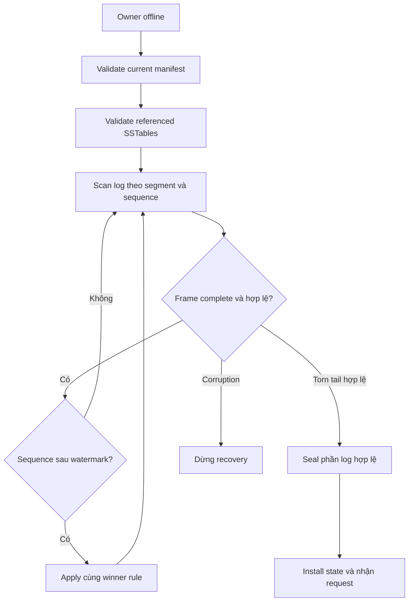

# Feature 02: LSM tree — commitlog, memtable và SSTable

## UC-03: Sau crash, khôi phục lại dữ liệu nào?

> Trạng thái: thiết kế chi tiết, chưa triển khai. Các tình huống crash là test
> cần xây, không phải kết quả test đã chạy.

### 1. Vấn đề và kết quả mong đợi

Process chết thì memtable biến mất, nhưng disk thường không ở trạng thái “mọi
việc đều xong”. Nó có thể chứa SSTable đã commit, file tạm chưa xong, commitlog
vừa append và manifest vừa rename.

Recovery cần chọn một nền dữ liệu đã được xác nhận rồi đọc lại phần log chưa
được nền đó bao phủ. Nếu đọc tất cả file trong directory, có thể đưa output dở
vào kết quả. Nếu bỏ toàn bộ log vì thấy một SSTable mới, có thể mất write đã ACK.

Output là `RecoveredOwnerState` chỉ được đưa vào phục vụ sau khi kiểm tra xong.
Mọi mutation caller đã nhận ACK phải còn được thể hiện trong visible state,
hoặc đã bị một mutation có precedence cao hơn che đi đúng quy tắc.

### 2. Ví dụ cụ thể

```text
Manifest generation 8:
  live SSTables = [S1, S2]
  FlushedThrough = 90

Commitlog:
  seq 88: upsert O-900 version 105 paid
  seq 91: upsert O-900 version 106 shipped
  seq 92: upsert O-901 version 107 pending
  seq 93: frame incomplete

Orphan output:
  S3.tmp (không có trong manifest)
```

Kết quả:

| Thành phần | Recovery làm gì? |
| --- | --- |
| S1/S2 | Validate rồi đăng ký làm nguồn dữ liệu committed. |
| Seq 88 | Prefix đã được flush; không apply lại vào recovered memtable. |
| Seq 91 | Replay; O-900 có version 106. |
| Seq 92 | Replay; O-901 có version 107. |
| Seq 93 incomplete tail | Không giải mã thành mutation; ghi diagnostic. |
| S3.tmp | Không đưa vào reader; xử lý như orphan sau khi state an toàn. |

Nếu seq 92 có expiry đã qua tại lúc restart, recovery vẫn giữ mutation cùng
expiry gốc. Reader trả absent cho winner hết hạn; recovery không cấp TTL mới
và không bỏ nó để làm lộ value cũ.

### 3. Recovery dựng lại phần RAM của LSM, không replay cả lịch sử

Logical state sau restart được tạo từ:

```text
committed sorted runs
  + mutation trong WAL sau checkpoint
  -> memtable recovered và read view của LSM
```

Sorted runs là nền đã materialize, WAL bảo vệ phần chưa materialize. Một WAL
record cũ có thể không xuất hiện nguyên vẹn trong SSTable vì đã được gộp với
version thắng nó trong cùng generation. Điều cần bảo toàn là kết quả reconcile,
không phải giữ một row vật lý cho mỗi lần append.

Ví dụ S1 giữ a@v3 sau khi generation từng nhận a@v1,a@v3. Checkpoint xác nhận
cả hai sequence đã được xử lý an toàn; recovery không cần tìm a@v1 trong file.
Ngược lại, thấy S1 có key a không đủ lý do bỏ mọi WAL record của a: record
a@v5 sau checkpoint vẫn phải replay.

Cách tách committed file set khỏi log phục hồi có thể đối chiếu trong
[LevelDB Recovery/Manifest](https://raw.githubusercontent.com/google/leveldb/main/doc/impl.md).
Checkpoint prefix và manifest replace của lab là protocol riêng, không phải
format MANIFEST/CURRENT của LevelDB.

### 4. Input/output đề xuất

```go
type RecoveryOptions struct {
    OwnerID       string
    ManifestPath  string
    LogDirectory  string
    MemoryBudget  uint64
    MaxFrameBytes uint64
}

type RecoveryReport struct {
    ManifestGeneration uint64
    FlushedThrough      uint64
    LastValidSequence   uint64
    FramesScanned       uint64
    FramesReplayed      uint64
    DuplicateMutations  uint64
    IgnoredTailBytes    uint64
    OrphanFiles         []string
}

func RecoverOwner(
    ctx context.Context, opts RecoveryOptions,
) (*RecoveredOwnerState, RecoveryReport, error)
```

Report phục vụ chẩn đoán, không thay thế recovered state. Nếu có corruption
fatal, report chỉ mô tả phần đã kiểm tra, không được coi là node đã ready.

`LastValidSequence` phải xét cả manifest checkpoint và log để next sequence
không tái sử dụng giá trị đã tồn tại. Ví dụ log cũ đã recycle hết nhưng manifest
FlushedThrough=90 thì append mới bắt đầu từ 91.

### 5. Chọn manifest authoritative

Recovery đọc manifest hiện hành đã được publish theo UC-02 và kiểm tra checksum,
generation, owner, format và danh sách file. Những file manifest tạm không phải
“bản mới nhất để thử”; modification time không xác định commit.

Nếu current manifest hợp lệ nhưng S2 bị mất hoặc checksum sai, recovery dừng.
Tự bỏ S2 và tiếp tục có thể làm biến mất dữ liệu đã ACK mà log tương ứng đã
recycle. Tự chọn manifest cũ cũng không an toàn nếu file của generation cũ đã
được cleanup.

Thiết kế publish phải bảo đảm sau crash đọc được một manifest committed hợp lệ.
Nếu nền filesystem phá vỡ giả định này, recovery báo lỗi metadata; tài liệu
không hứa tự suy đoán state từ các file rời rạc.

### 6. Replay từng frame có giới hạn bộ nhớ



```text
recover(opts):
    acquire exclusive owner storage access
    manifest = readAndValidateCurrentManifest()
    validateAllReferencedSSTables(manifest)
    state = newOfflineOwnerState(manifest)
    last = manifest.FlushedThrough

    for segment in validatedSegmentOrder:
        verify header, owner, sequence continuity
        for frame in streamFrames(segment):
            verify bounded length, full frame, checksum, format
            last = max(last, frame.sequence)
            if frame.sequence <= manifest.FlushedThrough:
                continue
            decode and validate mutation
            applyUsingSharedPrecedence(state, mutation)
            flushOfflineIfMemoryBudgetReached(state)

    makeValidLogTailReadyForAppendOrRotate()
    state.nextSequence = last + 1
    installReadyState(state)
```

Offline flush dùng đúng UC-02 và commit prefix liên tục, nhưng không nhận live
write trong lúc đó. Replay log lớn hơn RAM không được ép tất cả vào một map
khổng lồ. Segment vẫn được giữ tới khi checkpoint mới bền vững.

### 7. Torn tail khác corruption ở giữa như thế nào?

| Tình huống | Quyết định |
| --- | --- |
| EOF sau một phần header/payload cuối active segment | Torn tail; bỏ phần incomplete, báo số bytes. |
| Frame đầy đủ nhưng checksum sai | Corruption; dừng, kể cả ở cuối, vì không chứng minh chưa ACK. |
| Frame thiếu trong sealed segment | Corruption; segment đã seal phải có cấu trúc hoàn chỉnh. |
| Sequence trùng/nhảy không khớp metadata | Dừng; không tự điền hoặc sắp lại record. |
| Unknown format version | Dừng với unsupported-format; không decode bằng format gần giống. |

Mô hình không append tiếp vào tail hỏng. Sau khi đã xác định prefix hợp lệ,
recovery truncate phần incomplete một cách có kiểm soát rồi sync, hoặc tạo
segment mới có checkpoint rõ ràng. Việc sửa log chỉ bắt đầu khi đã validate
manifest và giữ đủ evidence; không xoá file chỉ vì tên kết thúc bằng `.tmp`.

### 8. Duplicate, mutation cũ và conflict

Retry có thể tạo nhiều frame khác local sequence nhưng cùng mutation ID.
Apply cùng comparator cho ra một winner. Không cần xuất ra nhiều row để
“giữ đúng số lần retry”.

Local sequence không phải version: frame seq 99 có logical version 104 không
được thắng seq 91 có version 106. Bảng dưới thể hiện sự khác biệt:

| Log sequence | Mutation version | State sau apply |
| --- | --- | --- |
| 91 | 106 shipped | 106 shipped |
| 98 | 106 shipped, cùng ID | 106 shipped |
| 99 | 104 pending | 106 shipped |

Cùng ID/nội dung khác khi đối chiếu là lỗi dữ liệu. Không dùng “frame đến sau”
để sửa conflict, vì replica khác có thể replay theo thứ tự khác.

### 9. Khi nào được mở node phục vụ?

Chỉ sau khi manifest, nguồn dữ liệu và replay hoàn tất; owner cài memtable,
next sequence và log append position nhất quán. Trước đó readiness=false,
live request nhận NotReady thay vì đọc một phần state.

Cancellation dừng recovery có kiểm soát. Các offline flush đã committed vẫn
hợp lệ; lần recovery sau đọc lại current manifest và tiếp tục. Không giữ một
ready flag từ lần startup trước trên disk rồi bỏ qua recovery.

### 10. Điều kiện luôn đúng — invariant

- Source SSTable chỉ đến từ committed manifest.
- Replay không làm lùi winner và không tạo row trùng vì retry.
- Expiry/version/ID giữ nguyên qua restart.
- Không nhận traffic trước khi state recovered đầy đủ.
- Tail incomplete chỉ được bỏ khi chứng minh thuộc active tail chưa hoàn chỉnh.
- Sequence mới lớn hơn checkpoint và mọi complete sequence còn lại.

### 11. Test cases và bằng chứng cần thu

| Test | Fault/input | Kết quả bắt buộc |
| --- | --- | --- |
| Clean restart | Seq 91/92 complete | Hai mutation replay, seq tiếp theo 93. |
| Same key sau checkpoint | SSTable a3, WAL sau checkpoint a5 | Replay a5; không skip chỉ vì a đã có trong file. |
| Overwrite được gộp | Seq 1=a1, seq 2=a3 đã flush thành a3 | Không đòi a1 tồn tại vật lý; state vẫn a3. |
| Torn tail | Seq 93 thiếu payload cuối active segment | Bỏ tail, giữ 91/92, readiness true sau kiểm tra. |
| CRC sai | Seq 92 full frame checksum sai | Readiness false; không bỏ qua để đọc 93. |
| Mất file committed | Manifest trỏ S2 không tồn tại | Recovery thất bại rõ file ID. |
| Orphan SSTable | S3 final nhưng chưa trong manifest | Không visible, không dùng max filename làm checkpoint. |
| Retry duplicates | Hai frame cùng mutation | Một logical winner, duplicate counter tăng. |
| Log lớn hơn RAM | Replay nhiều thế hệ | Offline flush hữu hạn, kết quả tương đương oracle. |
| Expiry qua lúc nghỉ | TTL winner hết hạn trong downtime | Absent, không phục hồi version cũ. |
| Restart hai lần | Recovery xong rồi kill lại | Cùng visible state; next sequence không lùi. |
| Crash lúc cleanup | Manifest committed, log chưa xoá | Replay bỏ prefix, dữ liệu không bị nhân đôi. |

Oracle là tập mutation theo ID cùng comparator chung và một ReadTime cố định.
Lưu danh sách ACK mà caller thật sự nhận để tách dữ liệu đã hứa bền vững khỏi
mutation có outcome chưa xác định.

### 12. Chi phí và phạm vi

Startup mất thời gian theo bytes log chưa checkpoint và lượng file cần validate.
UC-04 phải tách thời gian scan log, apply và offline flush; số frame không bằng
số row visible vì overwrite, Delete và TTL.

UC này dựa trên [ACK](01-mutation-and-acknowledgement-contract.md) và
[flush](02-memtable-and-safe-flush.md). Không bao gồm backup, khôi phục từ disk
đã mất, sửa corruption tự động hoặc repair giữa replica.
