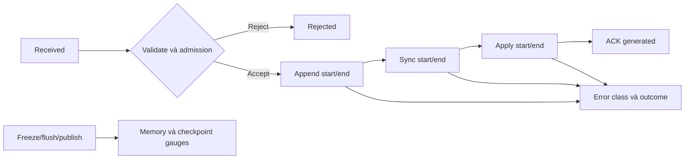

# Feature 02: LSM tree — commitlog, memtable và SSTable

## UC-04: Write chậm ở bước nào, và dữ liệu đã bền vững đến đâu?

> Trạng thái: thiết kế chi tiết, chưa triển khai. Những số liệu trong ví dụ là
> dữ liệu giả định để giải thích cách đọc báo cáo.

### 1. Vấn đề và output

Ứng dụng ghi chậm không đồng nghĩa disk hết tốc độ. Có thể sync log chậm,
memtable chạm budget, flush không theo kịp, hoặc caller đã timeout trong khi
owner vẫn hoàn tất mutation. Một counter writes/s không phân biệt được chúng.

UC này tạo snapshot theo owner và cửa sổ quan sát, gồm số request qua từng
bước, thời gian từng bước, memory/log pressure và tiến độ recovery. Người đọc
phải xác định được bước nào đang chờ và evidence nào còn cần giữ.

### 2. Ví dụ: throughput giảm dù append nhanh

```text
Window: [10:00:00, 10:01:00), owner-0
Requests: received=1200, rejected=200, admitted=1000
Terminal: acknowledged=990, failed=5, unknown=5
Append p95: 0.3ms
Sync p95: 18ms
Active: 60 MiB / 64 MiB
Frozen: 64 MiB, age=8s
Flush: running=1, queue=0, elapsed=8s
Log: retained=240 MiB, recyclable=80 MiB, flushedThrough=800
```

Append nhanh nhưng sync chậm cho thấy latency nằm ở durable step. Frozen già
cho thấy flush cũng không giải phóng RAM kịp. 200 reject cần được tính khi đánh
giá khả năng phục vụ; chỉ nhìn latency của 990 ACK sẽ bỏ qua request bị từ chối.

80 MiB recyclable nhưng retained 240 MiB không phải toàn bộ 240 MiB đều xoá
được. 160 MiB còn lại có thể chứa write chưa được SSTable bảo vệ.

### 3. Counter và gauge khác nhau

Counter đếm sự kiện trong thời gian; gauge là trạng thái ở một thời điểm.
Báo cáo cần giữ rõ hai loại, không cộng dồn gauge qua nhiều lần snapshot.

| Số đo | Loại | Thời điểm ghi |
| --- | --- | --- |
| Received | Counter | API entry, trước validation. |
| Rejected | Counter | Không admitted vì input/budget/deadline. |
| Admitted | Counter | Owner nhận trách nhiệm xử lý mutation. |
| Acknowledged | Counter | Owner tạo receipt thành công sau sync và apply. |
| FailedBeforeAppend | Counter | Kết thúc lỗi có thể chứng minh chưa ghi. |
| OutcomeUnknown | Counter | Lỗi sau ranh giới không còn khẳng định chưa ghi. |
| Active/FrozenBytes | Gauge | Bytes đang bị các memtable giữ. |
| FlushInFlight | Gauge | Số flush đang chạy ở thời điểm snapshot. |
| FlushedThrough | Gauge tăng đơn điệu | Prefix log đã được checkpoint. |
| ReplayFrames | Counter riêng startup | Frame recovery thực sự apply/đối chiếu. |

Owner biết đã tạo ACK, nhưng không biết chắc response đã tới caller nếu transport
bị đứt. Vì vậy `Acknowledged` ở server không được đặt tên “client confirmed”.
Thí nghiệm crash muốn kiểm tra lời hứa với caller phải có log ACK ở caller.

### 4. Data model/API đề xuất

```go
type ObservationWindow struct {
    Start, End time.Time
}

type LatencySummary struct {
    Samples uint64
    P50, P95, P99 time.Duration
    Available bool
}

type WritePathSnapshot struct {
    OwnerID   string
    RunID     string
    Window    ObservationWindow
    AsOf      time.Time
    Received, Admitted, Rejected uint64
    Acknowledged, FailedBeforeAppend, OutcomeUnknown uint64
    InFlight uint64
    Append, Sync, Apply, Total, Flush LatencySummary
    ActiveBytes, FrozenBytes, RetainedLogBytes uint64
    RecyclableLogBytes uint64
    FlushedThrough uint64
    FlushInFlight uint32
    OldestFrozenAge time.Duration
    ErrorsByClass map[string]uint64
}
```

RunID phân biệt hai lần khởi động; không lấy counter sau restart trừ counter
trước restart rồi báo throughput âm. Latency không có samples được ghi
`Available=false`, không giả vờ p95=0 có nghĩa là cực nhanh.

Snapshot copy slices/maps để caller không sửa được metrics nội bộ. `AsOf`
ghi thời điểm lấy gauge, còn Window mô tả counter/latency được tổng hợp.

### 5. Instrumentation bám state transition



Mỗi operation có trace ID cục bộ và các mốc monotonic time. Không dùng wall
clock để trừ latency vì chỉnh NTP có thể làm kết quả âm. Wall clock chỉ đặt
timestamp/window để người vận hành đối chiếu.

```text
onWriteReceived: increment Received
onAdmissionRejected(reason): increment RejectedByReason
onAdmissionAccepted: increment Admitted; increment InFlight
onAppend/Sync/ApplyFinished: record duration for that phase
onTerminal(state):
    increment đúng một terminal counter
    decrement InFlight đúng một lần
onManifestCommitted:
    publish new FlushedThrough và SSTable counters
onFlushFailed:
    increment FlushErrors; keep frozen bytes gauge
```

Một mutation retry tạo request mới, nên request counters tăng dù logical state
không thêm row. Nếu muốn đếm unique mutation phải có metric riêng với contract
dedup và memory budget; không suy unique writes từ số frame.

### 6. Quan hệ số liệu phải kiểm tra được

Trong một run tính từ lúc start, với mọi request đã vào API:

```text
Received = Rejected + Admitted
Admitted = Acknowledged + FailedBeforeAppend + OutcomeUnknown + InFlight
```

Với cửa sổ bất kỳ, request có thể bắt đầu ở cửa sổ trước và hoàn tất ở cửa sổ
sau. Khi đó không được áp hai đẳng thức chỉ trên counter deltas rồi kết luận
metrics sai. Cần thêm InFlight tại đầu/cuối hoặc gắn báo cáo theo cohort.

Baseline báo counter theo event timestamp trong `[start,end)`, kèm gauge
InFlight đầu/cuối nếu cần kiểm toán. Timestamp đúng end thuộc cửa sổ sau.

Flush duration hoàn tất và elapsed của flush đang chạy là hai metric khác.
Một flush treo chưa có duration sample; vì vậy vẫn cần OldestFrozenAge.

### 7. Đọc báo cáo để chọn bước điều tra

| Bằng chứng | Cách diễn giải | Kiểm tra tiếp |
| --- | --- | --- |
| Sync p95 cao, append thấp | Durable step chiếm thời gian | Sync lỗi, disk saturation của môi trường thử. |
| Frozen age tăng, active đầy | Flush không theo kịp admission | Flush bytes/s, disk reserve và publish failures. |
| Retained log tăng, watermark đứng | Prefix chưa checkpoint | Frozen nào cũ nhất chưa publish. |
| Validation reject cao | Input/API sai hoặc quá giới hạn | Error class, không log nguyên payload. |
| Timeout cao, ACK server vẫn tăng | Caller có kết quả chưa xác định | Deadline và response transport. |
| Recovery scan nhiều, applied ít | Log chứa nhiều prefix/duplicates | Checkpoint/recycle, không gọi nhầm mất dữ liệu. |

Đây là bằng chứng để điều tra, không phải chẩn đoán nguyên nhân tuyệt đối.
Ví dụ sync chậm không tự chứng minh disk vật lý lỗi; môi trường VM cũng ảnh
hưởng. Tài liệu chỉ khẳng định những gì instrumentation trực tiếp đo được.

### 8. Giới hạn tài nguyên và dữ liệu xuất ra

Counter label chỉ dùng owner, stage và error class hữu hạn. Mutation ID, row
ID, partition key không làm label theo từng request vì cardinality sẽ tăng
theo dữ liệu.

Histogram dùng bucket hoặc bounded reservoir có phương pháp công bố. p95 từ
histogram có độ phân giải bucket; ghi cấu hình khi benchmark. Không giữ mọi
request trace vô hạn để tính percentile.

Nếu event sink debug đầy, tăng dropped diagnostic count; core counters vẫn
cập nhật cục bộ. Việc gửi metrics ra ngoài không nằm trên durable ACK boundary.

### 9. Điều kiện luôn đúng — invariant

- Mỗi request terminal chỉ tăng một counter kết thúc.
- Validation reject không tăng durable write counter.
- Publish metric và watermark chỉ tăng sau manifest commit thật.
- Gauge phản ánh state còn giữ, kể cả flush thất bại.
- Snapshot không thay owner state, ACK semantics hoặc log retention.
- No-sample là unknown/unavailable, không phải zero latency.

### 10. Test cases cụ thể

| Test | Input/sự cố | Kỳ vọng |
| --- | --- | --- |
| Happy path | 100 received, 100 admitted | 100 acknowledged, inflight 0. |
| Reject | 20 key sai | rejected 20, append calls 0. |
| Sync lỗi | Frame complete, fsync error | OutcomeUnknown tăng; ACK không tăng. |
| Slow flush | Clock fixture tăng 8s | OldestFrozenAge8s dù chưa có Flush latency sample. |
| Publish lỗi | Data file xong, manifest fail | Published count/watermark giữ nguyên. |
| Qua biên window | Start trước cửa sổ, end trong cửa sổ | Terminal trong cửa sổ; cohort không bị suy sai. |
| Window rỗng | Không event | Latency Available=false; gauges vẫn hợp lệ. |
| Restart | RunID mới, counter reset | Không trừ hai run thành negative throughput. |
| Debug sink đầy | Sink drop event | Write vẫn theo ACK contract; dropped count tăng. |
| Privacy | Key chứa customer ID nhạy cảm | Không raw key/value trong metric labels. |

### 11. Đo xem LSM đã gom được bao nhiêu việc ghi

Để giải thích cơ chế LSM, báo cáo cần thêm logical input bytes, WAL bytes,
flush bytes, number of sorted runs và số winner rows mỗi generation. Các
denominator phải ghi rõ trước khi chạy để retry không làm metric đẹp giả.

Baseline thí nghiệm không retry, kích thước mutation cố định và cùng một trace:

```text
ingest_write_ratio = (WALBytes + FlushBytes) / AcceptedMutationBytes
flush_coalescing_ratio = FlushedWinnerRows / AppliedMutationCount
```

AcceptedMutationBytes tính key+payload+metadata mutation đã admitted, không
phải chỉ payload visible cuối cùng. WALBytes gồm framing; FlushBytes gồm file
metadata. Vì vậy ratio không được kỳ vọng luôn là số nguyên hoặc luôn>=2.
Denominator 0 trả unavailable.

Đây là tỷ lệ I/O của ingest trong Feature 02, chưa phải total write amplification
của một LSM chạy lâu dài. Khi Feature 03 có compaction, cộng CompactionOutputBytes
vào numerator và ghi rõ thời điểm dừng đo. Không bỏ backlog chưa xử lý rồi
kết luận chiến lược có write amplification thấp.

### 12. Hai workload cho thấy lợi ích và chi phí khác nhau

**Overwrite:** 1000 mutation cập nhật 10 full row keys, tất cả nằm trong một
memtable generation; fixture không có historical snapshots. Flush giữ 10
winners, nên coalescing ratio=10/1000=0.01. WAL vẫn ghi 1000 mutation: gom RAM
không làm biến mất chi phí durability đã trả.

**Unique keys:** 1000 mutation vào 1000 row identities cùng generation. Flush
giữ 1000 winners, coalescing ratio=1. Hai workload cùng số write nhưng lượng
state khi flush khác nhau. Không dùng throughput của overwrite để dự đoán
capacity cho workload unique-key.

Chạy mỗi trace với hai budget memtable; giữ seed, mutation sizes, sync policy,
filesystem và giới hạn flush cố định. Báo số flush, bytes, peak RAM, thời gian
drain backlog và replay bytes sau crash. Tăng budget có thể giảm số runs nhưng
tăng phần RAM/log phải phục hồi; kết quả phải đọc cùng nhau.

### 13. Thí nghiệm backpressure thay vì chỉ đo ACK nhanh

Hạ tốc độ flusher bằng fixture có kiểm soát, giữ tốc độ admission cao hơn mức
flusher xử lý. Quan sát frozen age, pending bytes, memory peak và reject rate.
Kết quả đúng là budget được giữ, errors thể hiện overload; không phải tất cả
request đều ACK với memory tăng vô hạn.

Sau pha gửi request, chờ drain và báo riêng duration. Nếu dừng ngay khi client
ngừng gửi, phần công việc LSM còn nợ ở background chưa được tính. Cơ chế stalls
do memtable/file backlog tham khảo
[RocksDB Write Stalls](https://github.com/facebook/rocksdb/wiki/Write-Stalls);
threshold và công thức ở đây là thiết kế thí nghiệm của lab.

| Kiểm chứng thêm | Kỳ vọng |
| --- | --- |
| Overwrite 1000 vào 10 keys, một generation | WAL1000 frames, flush 10 winners. |
| Unique 1000 | Flush 1000 winners. |
| Hai budget, cùng trace | Visible result bằng nhau; báo khác biệt bytes/runs/RAM. |
| Flusher chậm hơn arrival | Backpressure trước khi vượt budget, không che reject rate. |
| Zero accepted bytes | Ratio unavailable. |
| Chưa có compaction | Không đặt tên ingest ratio là total LSM amplification. |

### 14. Phụ thuộc và ngoài phạm vi

Events xuất phát từ [ACK](01-mutation-and-acknowledgement-contract.md),
[flush](02-memtable-and-safe-flush.md) và [recovery](03-restart-replay.md).
Feature 05 bổ sung queue wait, Feature 06 bổ sung replica response breakdown.

Exporter, dashboard, cảnh báo tự động, tuning budget và tracing liên node nằm
ngoài UC. Output hiện tại là snapshot có thể kiểm tra bằng fixture và báo cáo
thí nghiệm.
