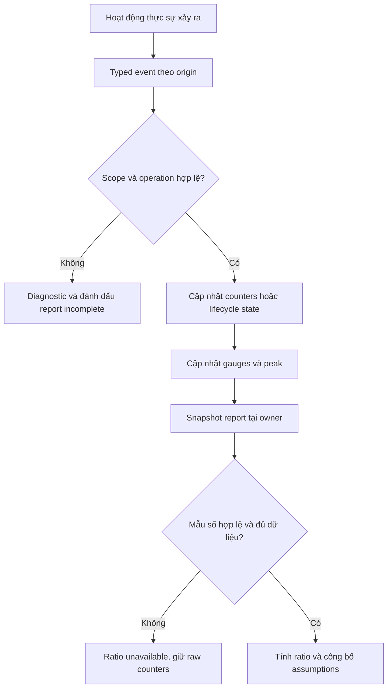

# Feature 03 — UC-01: Tự xây bộ đo chi phí của LSM và compaction

> Đặc tả implement từ đầu; API/pseudocode chưa tồn tại trong engine.
> Số liệu là fixture học tập, không là kết quả benchmark ScyllaDB.

## 1. Vấn đề gốc: ít file hơn có thực sự tốt hơn?

Ta có thể viết một compactor luôn gom tất cả file. Sau mỗi lần chạy chỉ còn
rất ít nguồn đọc, nhưng gần như mọi byte bị ghi lại liên tục. Một compactor
khác không làm gì: không tốn rewrite, nhưng read phải xét nhiều nguồn.

Muốn quyết định giữa hai cách, trước hết phải thấy được công việc đã xảy ra.
UC này tự xây **CostObserver**: đặt điểm đo tại read, write, flush, compaction
và file lifecycle; từ đó so các policy trên cùng workload.

Output không phải một dashboard đẹp hoặc một ngưỡng cảnh báo production.
Output là report tái lập được với phạm vi, đơn vị, mẫu số và trạng thái đủ dữ liệu.

## 2. First principles: suy ra những gì phải đếm

1. Query trả một row nhưng có thể đọc nhiều candidates. Vì vậy số row trả
   không đủ: cần đếm nguồn thực sự đọc và bytes/candidates đã xét.
2. Một mutation ghi vào WAL, flush và có thể rewrite nhiều lần. Vì vậy cần
   tách bytes theo origin, không chỉ đo ingest throughput.
3. File đã khỏi manifest có thể còn bị reader/snapshot giữ. Vì vậy active
   bytes, retired bytes và physical bytes không phải cùng một gauge.
4. Job thất bại sau khi ghi nửa output vẫn tiêu thụ I/O. Vì vậy terminal
   failure không được xoá chi phí đã xảy ra khỏi báo cáo.
5. Job chưa chạy không có I/O nhưng có work đang chờ. Vì vậy pending work
   không được gộp vào counters bytes đã đọc/ghi.

Từ các ràng buộc đó, ta cần counters, gauges và operation lifecycle riêng.

## 3. Fixture trước khi viết API

Dùng một owner/table và ba nguồn nhỏ:

```text
S1: A@v1, B@v1
S2: A@v2
S3: A@v3

read(A): xét S1, S2, S3 -> A@v3
compact(S1,S2,S3): output S4 chứa A@v3, B@v1
read(A): xét S4 -> A@v3
```

Reader baseline không Bloom/cache. Fixture instrument tại nơi mở data source,
không đếm chỉ từ danh sách files trong manifest. Kết quả fanout là 3 rồi 1;
đây không tự chứng minh latency giảm ba lần.

Một fixture bytes độc lập:

```text
AcceptedMutationBytes = 10 GiB
WALBytes = 11 GiB
FlushOutputBytes = 8 GiB
CompactionOutputBytes = 24 GiB

SST write ratio   = (8 + 24) / 10      = 3.2
Local write ratio = (11 + 8 + 24) / 10 = 4.3
```

Codec/framing có overhead nên bytes WAL không bắt buộc bằng bytes mutation.
Fixtures bytes không được trộn với row fixture rồi giả định đã đo từ nó.

## 4. Data model tối thiểu

```go
type Scope struct { RunID, OwnerID, TableID string }
type OperationID uint64

type Counters struct {
    AcceptedMutationBytes, WALBytes uint64
    FlushOutputBytes, CompactionOutputBytes uint64
    QueryCount, FailedQueries uint64
    ReadSources, QueryStorageBytes, ResultBytes uint64
    Candidates, VisibleRows uint64
    CompactionInputBytes, CompletedJobs, FailedJobs uint64
}
type Gauges struct {
    ActiveSSTableBytes, RetiredPinnedBytes uint64
    TemporaryOutputBytes, PhysicalDataBytes uint64
    PeakPhysicalDataBytes uint64
    QueuedPlans, ActiveJobs uint64
    EstimatedQueuedInputBytes uint64
}
type Ratio struct { Value float64; Available bool }
type Report struct {
    Scope Scope
    Counts Counters
    Current Gauges
    Complete bool
    InFlight uint64
}
```

Đây là metric names của lab, không giả định ScyllaDB expose cùng field.
Scope được đăng ký trước; giới hạn số scope và operations in-flight bằng
cấu hình. Không tạo metric labels theo partition key, payload hay file ID.

File ID và operation ID dùng trong diagnostic nội bộ có giới hạn, không
phải một time-series mới cho mỗi file. Observer chỉ giữ state của operation
đang chạy, counters tích luỹ và một buffer lịch sử có cap nếu bật.

## 5. Điểm đo và ownership

| Sự kiện | Ai phát? | Thay đổi cần ghi nhận |
| --- | --- | --- |
| Mutation admitted | Write owner | Accepted bytes theo codec đã công bố; không đếm request reject. |
| Bytes thực sự ghi | WAL/flush/output writer | Counter origin tương ứng, kể cả job sau đó thất bại. |
| Source thật sự đọc | Query reader | Một lượt source cho mỗi query-source, không phải mỗi block. |
| Block được đọc/record được xét | Reader | Query bytes hoặc compaction input bytes, không trộn hai đường. |
| Query terminal | Reader | QueryCount, error, visible rows/result bytes và duration nếu đo. |
| Manifest publish | Metadata owner | Active set mới; file cũ chuyển retired nếu còn reference. |
| File reclaim | File registry | Giảm physical bytes khi allocation thực sự được trả. |
| Queue/admit/job terminal | Scheduler | Pending, active và terminal counts. |

Lab đồng bộ hoá các sự kiện qua owner để dễ kiểm tra thứ tự. Dùng monotonic
clock cho duration, wall clock chỉ để gắn nhãn báo cáo. Không suy latency
thật từ công thức “mỗi byte = một nanosecond”.

Với file I/O thật, write trả số bytes đã ghi mới tăng counter số đó. Lỗi
partial write vẫn có bytes. Buffer append chưa flush ra file không được
gọi là physical write. Có thể dùng hai counter riêng nếu muốn đo cả hai.

## 6. Flowchart: từ hoạt động engine đến report



Observer không được rollback write hoặc thay winner. Lỗi instrumentation
làm report không đủ tin cậy; trong test, harness fail để sửa điểm đo. Engine
không được báo mutation thất bại chỉ vì exporter telemetry mất kết nối.

## 7. Sequence: publish khác reclaim

```mermaid
sequenceDiagram
    participant R as Reader
    participant E as Executor
    participant O as Owner
    participant F as FileRegistry
    participant C as CostObserver
    R->>F: Pin S1 và S2
    E->>C: BeginJob
    E->>C: InputRead và OutputWrite theo bytes thực
    E->>O: Output S3 đã validate và sync
    O->>F: Replace active S1,S2 bằng S3
    F->>C: Active giảm; retired pinned tăng
    O->>C: Job committed
    R->>F: Release S1 và S2
    F->>F: Reclaim khi không còn reference
    F->>C: Physical bytes giảm
```

Job committed có thể xảy ra trước PhysicalDataBytes giảm. Đây là lý do không
dùng CompletedJobs làm bằng chứng disk đã được trả.

## 8. Thuật toán aggregation và chống đếm hai lần

API đề xuất: Begin(scope, kind) trả handle; handle có AddRead/AddWrite và
Finish(outcome). Finish chỉ hợp lệ một lần. Retry công việc tạo attempt ID mới,
vì I/O retry là chi phí thật; retry gửi lại cùng terminal event không được
tăng CompletedJobs lần hai.

```text
onWrite(handle, origin, actualBytes):
    require active handle
    checkedAdd(counter[origin], actualBytes)
    update file allocation state nếu event có nghĩa allocation
    refresh peak physical usage

finish(handle, outcome):
    if already finished: report duplicate-terminal diagnostic; do not count again
    move active -> terminal exactly once
    retain bounded summary; release per-operation state

snapshot(scope):
    copy counters and gauges under owner
    complete = no lost events or overflow or invalid transitions
    inFlight = active handle count
    compute ratios only if denominator > 0 and operands available
```

Observer này không hỗ trợ at-least-once event delivery phân tán. AddRead/
AddWrite là lời gọi local đúng một lần tại điểm I/O; không replay chúng sau
crash. RunID mới bắt đầu counters mới; report không lấy delta xuyên restart.

## 9. Công thức và đơn vị

```text
read_source_fanout = ReadSources / QueryCount
read_byte_ratio = QueryStorageBytes / ResultBytes
sst_write_ratio = (FlushOutputBytes + CompactionOutputBytes) / AcceptedMutationBytes
local_write_ratio = (WALBytes + FlushOutputBytes + CompactionOutputBytes)
                    / AcceptedMutationBytes
```

QueryCount ở đây đếm mọi query terminal. FailedQueries được báo riêng; bytes
đã đọc của query lỗi vẫn nằm trong tổng. Muốn report riêng success cohort,
cần accumulator riêng, không lọc mỗi mẫu số.

Với ResultBytes=0, byte ratio unavailable nhưng vẫn báo bytes/query và miss/
error rate. GiB, compressed bytes, logical codec bytes phải ghi rõ, không
trộn giữa các lần thử. Queued input estimate là tổng plan đang xếp hàng,
không phải backlog metric của ScyllaDB và có thể đổi khi replan.

FileRegistry đếm allocation vật lý duy nhất theo file ID. Snapshot hard link
không tạo một bản copy bytes thứ hai; nó thêm reference ngăn reclaim.
PhysicalDataBytes chỉ bao phủ data files mà registry quản lý, không gọi đó
là tổng filesystem used khi chưa tính WAL, metadata và hệ điều hành.

## 10. Các bước implement và test

1. Làm pure counter accumulator với checked arithmetic và lifecycle handle.
2. Viết in-memory FileRegistry: active/temp/retired, references và allocation.
3. Gắn điểm đo vào fake reader/writer để kiểm tra exact expected counts.
4. Gắn vào I/O wrapper thật của lab; giữ cùng semantics khi partial error.
5. Dùng UC-06 replay một trace cố định, lưu report trước/trong/sau compaction.

| Test | Expected |
| --- | --- |
| Read A trước/sau fixture | Winner luôn v3; fanout 3 rồi 1. |
| Bytes 10/11/8/24 GiB | SST ratio 3.2; local ratio 4.3. |
| Miss, ResultBytes=0 | Byte ratio unavailable; bytes/query vẫn có. |
| Output ghi 100 bytes rồi lỗi | CompactionOutputBytes tăng 100; FailedJobs tăng. |
| Finish hai lần cùng handle | Chỉ một terminal count, report có diagnostic. |
| Reader pin input sau publish | Active bytes giảm nhưng physical chưa reclaim. |
| Thêm snapshot reference cùng file | Physical bytes không tăng gấp đôi. |
| Counter overflow hoặc event mất | Report incomplete, không đưa ratio như đủ dữ liệu. |
| Restart RunID mới | Không tính delta counters xuyên hai lần chạy. |

## 11. Mapping sang ScyllaDB và bài học vận hành

| Component lab | Technique/quan sát thực tế | Điều không tương đương |
| --- | --- | --- |
| Job progress và terminal summary | compactionstats / compactionhistory | Field và retention lịch sử phụ thuộc version. |
| Queue count + estimate riêng | Pending tasks và backlog | Không coi backlog production là bytes của plan toy. |
| Query fanout và bytes | Read amplification, Bloom/cache ảnh hưởng I/O | Không dự đoán p99 bằng fanout đơn lẻ. |
| Registry references | File lifecycle và snapshot giữ disk | Không tái tạo filesystem/storage manager của ScyllaDB. |

Đối chiếu [Metrics](https://docs.scylladb.com/manual/stable/reference/metrics.html),
[compactionstats](https://docs.scylladb.com/manual/stable/operating-scylla/nodetool-commands/compactionstats.html)
và [compactionhistory](https://docs.scylladb.com/manual/stable/operating-scylla/nodetool-commands/compactionhistory.html).
Từ lab, người đọc phải giải thích được vì sao ít file hơn chưa đủ, và vì sao
job xong mà disk chưa giảm không nhất thiết là lỗi.

[Feature 03](../../feature/03-read-merge-and-basic-compaction.md) ·
[UC-06 — Executor và harness](06-safe-maintenance-and-validation.md).
