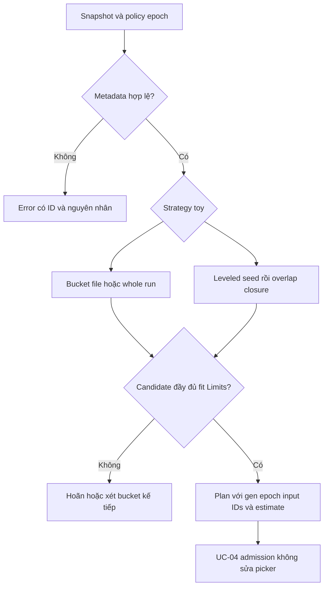
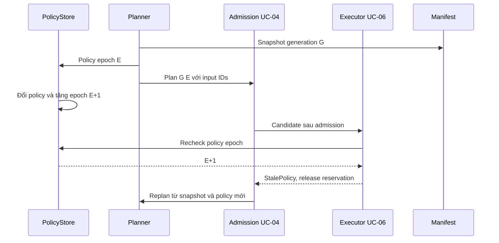

# UC-02: Thiết kế planner STCS, leveled và run-tier từ đầu

> Đây là thiết kế để triển khai lab, chưa phải code đã chạy. Kích thước,
> threshold và capacity trong fixture là giả định, không phải tuning ScyllaDB.
> Planner dùng key/comparator của Feature 01 và SSTable/manifest của Feature 02.
> Key order của lab không tương thích định dạng hoặc thứ tự SSTable ScyllaDB.

## 1. Nguyên lý: chọn input trước, xử lý mutation sau

SSTable bất biến tích luỹ sau flush. Nếu mọi job luôn chọn mọi file, rewrite
quá nhiều; nếu chỉ chọn file nhỏ, các version ở file lớn có thể tồn tại lâu.
Planner giải bài toán “nhóm nào đáng compact?” bằng metadata, không merge row.

Chia pipeline thành selector thuần → admission UC-04 → executor UC-06.
Selector không mở SSTable, xoá file, sửa manifest hoặc nâng FlushedThrough.
Output là một Plan có thể so sánh chính xác trong test; lý do hoãn cũng là output.
[UC-01](01-compaction-diagnosis.md) đo chi phí; [UC-05](05-tombstone-gc-and-repair.md)
quyết định retain/GC. Policy chọn input không tự cấp quyền purge.

## 2. Fixture và thứ tự key

Key là TableID + canonical partition + typed clustering, so bằng comparator
Feature 01; ký hiệu A–Z dưới đây rút gọn các key hợp lệ cùng một table.
Không so bytes raw, tên file hoặc chuỗi clustering để suy thứ tự key.

| ID | BytesOnDisk | Range inclusive | Level | RunID |
| --- | ---: | --- | ---: | --- |
| S1 | 8 MiB | A–F | 0 | R1 |
| S2 | 8 MiB | C–K | 0 | R2 |
| S3 | 8 MiB | A–H | 0 | R3 |
| S4 | 8 MiB | B–M | 0 | R4 |
| B1 | 128 MiB | A–Z | 0 | RB |

Toy tiered threshold=4 chọn S1–S4, tổng input 32 MiB, để B1 ngoài job.
A@v3 trong S3 phải thắng A@v0 trong B1 khi đọc. Nếu winner là delete/expiry,
executor giữ bằng chứng theo UC-05 để không trả lại A@v0.
Version.Logical là thứ tự logical của lab, không phải wall clock hay file age.

## 3. Data model và API thuần

Các kiểu dưới đây là thiết kế Go-ish; dùng lại kiểu Key và Mutation sẵn có,
không tạo comparator thứ hai. ID/RunID là định danh ổn định, không đo tuổi dữ liệu.

```go
type FileMeta struct {
    ID, RunID, TableID string
    Level int
    MinKey, MaxKey Key             // inclusive, Compare(Min, Max) <= 0
    BytesOnDisk uint64
}
type Plan struct {
    SnapshotGen, PolicyEpoch uint64
    InputIDs []string              // sorted, unique, complete candidate
    TargetLevel int
    OutputTargetBytes uint64
    WindowID *int64                // nil trong UC này
    EstimatedOutputBytes uint64
}
type Snapshot struct {
    Generation uint64
    LiveTables []FileMeta          // immutable copy của manifest metadata
    FlushedThrough uint64          // quan sát; planner không được đổi
}
type Policy struct {
    Epoch uint64
    TableID, Kind string           // toy-size-tiered, toy-run-tiered, toy-leveled
    MinInputs, MaxInputs int
    OutputTargetBytes uint64
    LevelCapacity map[int]uint64
    EstimateNumerator, EstimateDenominator uint64
}
type Limits struct { MaxInputBytes, MaxEstimatedOutputBytes uint64 }
type Decision struct { Plan *Plan; Reason string }
func Select(s Snapshot, p Policy, l Limits, cmp Comparator) (Decision, error)
```

PolicyEpoch khác SnapshotGen: một cái version cấu hình, một cái version tập
file công bố. Executor kiểm tra epoch và input identity/invariants của manifest
mới nhất trước publish; generation là provenance, không được ghi đè flush mới.
Giới hạn selector chỉ chặn candidate quá lớn; không đo FreeNow hay reserve.
Admission tài nguyên và xung đột InputIDs thuộc [UC-04](04-backlog-and-resource-budget.md).

Estimate = ceil(sumInput × numerator / denominator), dùng phép toán checked.
Trong fixture numerator=denominator=1. Đây là estimate, không phải hard budget
hay upper bound chắc chắn: compression/encoding có thể làm output khác dự đoán.
Writer xin UC-04 mở rộng reservation trước allocation khi cần; nếu không được,
dừng có kiểm soát thay vì ghi vượt reservation rồi mới báo lỗi.

## 4. Validate metadata trước mọi strategy

1. TableID của mỗi candidate khớp policy; ID duy nhất, size > 0, Level >= 0.
2. MinKey/MaxKey đúng key table và comparator; từ chối range đảo chiều.
3. MinInputs >= 2, MaxInputs >= MinInputs; output target và denominator > 0.
4. Sum size, capacity, estimate không được wraparound uint64.
5. Run dùng cho run-tier phải đầy đủ trong snapshot; fragment không overlap.
6. Toy LCS từ L1 trở lên có range disjoint trong từng level; L0 được overlap.

Kind ngoài ba policy toy trả UnknownPolicy; capacity level được dùng phải > 0.
Snapshot là enumeration đầy đủ: không truyền subset rồi coi run thiếu fragment
là run hoàn chỉnh. Việc tạo snapshot hoàn chỉnh thuộc manifest adapter UC-06.

Sort bản sao metadata, không sửa slice của caller. Thứ tự plan InputIDs là
lexicographic ID cho serialization; thứ tự key phải dùng comparator.
Reason ổn định: NoCandidate, InputLimit, OutputLimit hoặc LevelWithinCapacity.
Metadata sai trả error cụ thể, không im lặng bỏ một fragment hỏng để có plan nhỏ hơn.

## 5. Thuật toán toy STCS: bucket powers-of-two

Định nghĩa bucket(size) = floor(log2(size)), với size > 0 và đơn vị byte.
Ví dụ [8 MiB, 16 MiB) cùng bucket; 16 MiB thuộc bucket kế tiếp.
Đây là bucket factor hai cố định của lab, không phải average bucket picker ScyllaDB.

Nhóm file của table theo bucket, sort bucket tăng dần rồi sort ID trong nhóm.
Nhóm đủ MinInputs tạo candidate là prefix tối đa MaxInputs, nhưng tối thiểu
MinInputs. Chọn prefix dài nhất fit Limits; không dưới threshold để lách budget.
Nếu nhóm không fit, ghi reason và xét bucket tiếp theo theo thứ tự cố định.

Trả candidate đầu tiên fit. Nếu không nhóm nào đạt threshold, trả NoCandidate;
nếu có nhưng đều bị chặn, lấy reason đầu tiên theo thứ tự bucket, input limit
trước output limit. Như vậy Reason không phụ thuộc thứ tự iteration map.
Mỗi prefix phải tính sum/estimate checked; không trông cậy iteration order map.
Output giữ mọi winner và evidence cần giữ, có thể chia file theo OutputTargetBytes.
Không lấy 32 MiB input làm cam kết chắc chắn output 32 MiB sau reconciliation.

## 6. Thuật toán run-tier: cảm hứng ICS, không incremental reclaim

Group FileMeta theo RunID. Với policy này, RunID không rỗng; fragment trong
một run có TableID/Level nhất quán, ranges disjoint, sort theo MinKey rồi ID.
Size run là tổng BytesOnDisk của tất cả fragment; bucket theo size run.

MinInputs/MaxInputs đếm run, không đếm fragment. Xếp run cùng bucket theo RunID;
chọn prefix fit Limits như STCS, rồi flatten toàn bộ fragment thành InputIDs.
Rbig 128 MiB không cùng bucket R1–R4 8 MiB, dù một fragment của Rbig chỉ 8 MiB.

Executor merge cả candidate, chia output thành run mới với range disjoint.
OutputTargetBytes là mục tiêu; cắt tại boundary partition, không cắt đôi partition
chỉ để đủ size. Partition lớn có thể vượt target và phải được báo cáo riêng.

Lab giữ input tới atomic batch publish và reader release. Chia 32 MiB output
thành bốn fragment không giảm nhu cầu chứa toàn bộ output tạm trong mô hình này.
Không xoá input fragment khi cursor vừa đi qua; protocol này thuộc ICS production,
cần crash recovery/evidence bổ sung mà UC-06 baseline chưa triển khai.

## 7. Thuật toán toy LCS: seed và overlap closure

Đặt capacity từng level trong policy; fixture L0 trigger là MinInputs file.
Nếu L0 đủ trigger, seed là prefix ID đầu tiên dài MinInputs, target=L1.
Nếu L0 chưa đủ, chọn level thấp nhất L>=1 có tổng size > capacity[L],
seed là file nhỏ nhất theo (MinKey, ID) của level đó, target=L+1.
Thiếu capacity cho level cần xét trả InvalidPolicy, không suy default.

Target selection cần toàn bộ overlap closure, không chỉ các file giao seed đầu:
khởi đầu range=min/max của seed; lấy mọi file target giao range inclusive;
mở rộng range theo các file vừa lấy; lặp cho tới không còn file mới.
Hai range giao nhau khi cmp(a.Min,b.Max)<=0 và cmp(b.Min,a.Max)<=0.

Ví dụ seed [D,F], target P1=[A,E], P2=[F,M], P3=[N,Z] chọn P1/P2,
range cuối [A,M], bỏ P3. Target level disjoint vẫn có thể cùng giao seed rộng.
Nếu một file target overlap nhưng bị bỏ vì budget, kết quả sẽ vi phạm layout.
Vì thế closure là indivisible: vượt limit thì hoãn cả candidate, không truncate.

Output của seed+closure vào target, sort bằng comparator và chia tại partition.
Kiểm tra disjoint với target survivors trước publish; input seed từ level L
không buộc kéo mọi file cùng source level. L0 exception không lan sang L1+.
Determinism: L0 ưu tiên trước, rồi source level tăng, rồi (MinKey, ID).

## 8. Flow: chọn candidate và kiểm tra budget



## 9. Sequence: thay policy làm plan cũ hết hiệu lực



Policy đổi giữa build và publish cũng cần guard chung của UC-06; không chỉ
check một lần lúc submit. Reservation phải được release đúng một lần khi reject.
Plan stale không được sửa epoch tại chỗ rồi giữ InputIDs cũ như đã replan.

## 10. Errors, invariants và phạm vi transition

InputIDs không còn live/identity thay đổi → StaleSnapshot; PolicyEpoch khác
→ StalePolicy. Generation tăng do concurrent flush không tự cho phép publish
hay buộc mất flush: UC-06 xác minh reserved input và invariants manifest mới
nhất, giữ mọi file không thuộc input. Không chứng minh được thì reject/replan.
Hai plan dùng chung input → admission conflict.
Job fail không cho selector tự loại file lỗi khỏi manifest rồi chạy tiếp.
Các winner/expiry evidence giữ bảo thủ; compaction không nâng FlushedThrough.

Chuyển toy policy chỉ đổi cấu hình và tăng epoch; existing layout có thể chưa
hợp invariants policy mới. Ví dụ chuyển tiered sang leveled mà L1 đang overlap:
trả InvalidLayout và yêu cầu fixture/bootstrap layout riêng, không giả “đã migrate”.
Rollback policy không undo SSTable đã rewrite. Full production migration ngoài scope.

## 11. Concrete tests trước triển khai

| Test | Input / hành động | Kết quả cần assert |
| --- | --- | --- |
| Bucket boundary | size 8, 15, 16 MiB | 8/15 cùng bucket; 16 khác |
| Basic tiered | S1–S4 8 MiB + B1 128 MiB | InputIDs S1–S4; sum 32 MiB |
| Missing threshold | Chỉ ba file 8 MiB | Không Plan |
| Deterministic | Shuffle snapshot 100 lần, map order khác | Plan và Reason giống byte-for-byte |
| Budget | limit 31 MiB, threshold bốn file 8 MiB | Không chọn ba file để lách limit |
| Whole run | Một run gồm nhiều fragment, tổng 128 MiB | Không chọn fragment lẻ vào bucket 8 MiB |
| Inclusive overlap | Seed [D,F], P1 [A,E], P2 [F,M] | Cả P1/P2 thuộc closure |
| Closure budget | Seed+target vượt limit | Hoãn toàn candidate, không bỏ target |
| L0 exception | Nhiều file L0 chứa A; L1 disjoint | Layout hợp lệ; L1 overlap bị reject |
| Overflow | Sum hoặc numerator vượt uint64 | Error, không plan có estimate nhỏ |
| Stale plan | Input mất identity hoặc epoch đổi sau select | Executor reject, manifest không đổi |
| Concurrent flush | Gen tăng, input còn live, thêm file L0 mới | Revalidate latest; giữ file flush mới hoặc reject an toàn |
| Pure selector | Snapshot copy trước/sau select | Không đổi file, slice, manifest hay watermark |

Test correctness winner thuộc UC-05/06: cùng Row/Version.Logical/WriterID/Kind
và thời điểm đọc phải cho kết quả giống nhau với mỗi bộ InputIDs hợp lệ.
Thêm test output fragment disjoint, partition quá target và reader pin sống qua publish.

## 12. Mapping sang ScyllaDB và giới hạn chủ ý

[ScyllaDB compaction](https://docs.scylladb.com/manual/stable/kb/compaction.html)
mô tả STCS theo size, ICS theo run, LCS có level và L0 exception. Lab giữ cơ chế
chọn input, nhưng bucket fixed factor hai/capacity/seed là lựa chọn thiết kế toy.
ICS production reclaim input tăng dần và có safety hỗ trợ crash; lab chỉ segment output.
[CQL options](https://docs.scylladb.com/manual/stable/cql/compaction.html)
là cấu hình engine thực, không phải API Go của thiết kế này.

Compaction option của ScyllaDB là schema toàn bảng: ALTER qua một node không
tạo canary strategy riêng replica. Thử migration dùng staging/clone trước;
đổi schema lại không undo layout vật lý. Không khẳng định một default cho mọi
version/edition. [Strategy guidance](https://docs.scylladb.com/manual/stable/architecture/compaction/compaction-strategies.html)
và [Research](../../research/feature-03-compaction-operations.md) ghi bối cảnh nguồn/version.
