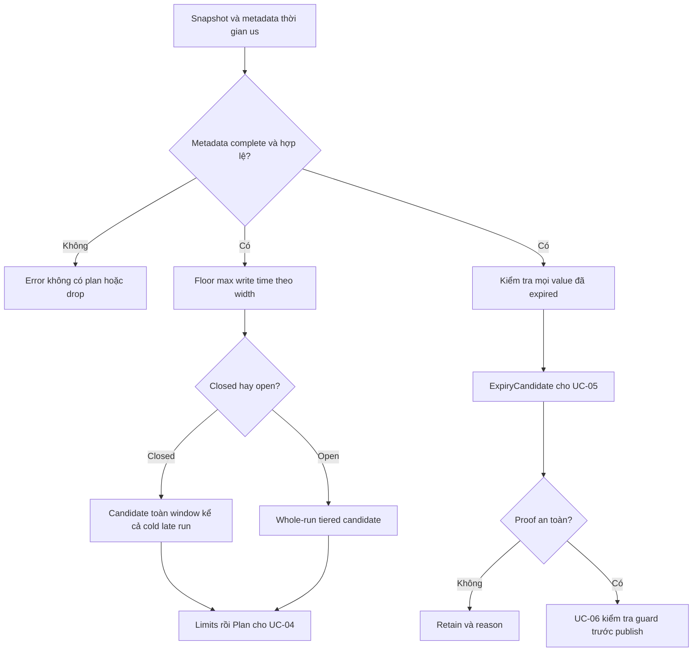
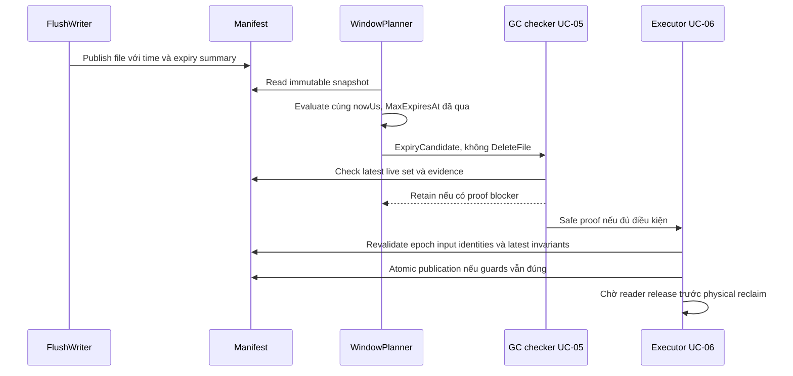

# UC-03: Thiết kế window planner và expiry eligibility từ đầu

> Đây là thiết kế lab để triển khai, chưa phải tính năng đã chạy. Mọi window,
> TTL và số liệu trong fixture là giả định. UTC microseconds là đơn vị thời gian;
> Version.Logical không phải clock. Key order của lab không tương thích ScyllaDB.

## 1. Nguyên lý: gom dữ liệu cùng tuổi, tách expiry khỏi quyền xoá

Dữ liệu append có thể hết hạn theo retention, nhưng row hết hạn không đồng
nghĩa SSTable được xoá ngay. Một file còn cell sống, version không TTL hoặc
bằng chứng xoá cần giữ vẫn có thể cần thiết cho correctness.
Thiết kế tách hai việc: WindowPlanner chọn input merge; ExpiryScanner chỉ tìm
candidate đủ điều kiện thời gian để đưa sang safety checker [UC-05](05-tombstone-gc-and-repair.md).

Cả hai chỉ đọc snapshot/metadata. Không mở file dữ liệu, xoá file, publish
manifest hoặc nâng FlushedThrough. Executor [UC-06](06-safe-maintenance-and-validation.md)
mới thực hiện thay đổi sau admission [UC-04](04-backlog-and-resource-budget.md).
Baseline AlwaysKeep vẫn merge được khi chưa triển khai GC proof simulator.

## 2. Fixture và bốn mốc thời gian

Table telemetry dùng key TableID + canonical partition + typed clustering.
Event time là field nghiệp vụ; write wall clock nằm trong metadata envelope.
Mutation có ID, Row, Version.Logical/WriterID, Kind, Value, ExpiresAt của Feature 02.
Không dùng Logical=100 để suy wall clock=100 microseconds.

D0 là một mốc UTC cụ thể của fixture. Width=86_400_000_000 us (một ngày),
TTL=259200 seconds (ba ngày), được chuyển sang us bằng checked multiplication.

| Mutation | Event time | Write wall clock | Logical | ExpiresAt |
| --- | --- | --- | ---: | --- |
| a | D0 10:00 | D0 10:00 | 1 | D3 10:00 |
| b | D0 22:00 | D0 22:00 | 2 | D3 22:00 |
| c | D1 09:00 | D1 09:00 | 3 | D4 09:00 |
| d, event đến muộn | D0 11:00 | D2 12:00 | 9 | D5 12:00 |

Window tổ chức merge; TTL xác định lifetime. a/b có cùng TTL nhưng expiry
khác vì thời điểm write khác. d không hết hạn D3 chỉ vì event time là D0.
Nếu business giữ ba ngày từ event time, ingestion phải tính retention còn
lại hoặc từ chối event quá hạn; window planner không tự thay business contract.

[ScyllaDB TTL reference](https://docs.scylladb.com/manual/stable/cql/time-to-live.html)
xác nhận TTL theo write dùng wall clock coordinator, không dùng USING TIMESTAMP
để tính expiry. Lab giữ clock tách logical version và expiry được cung cấp rõ ràng.

## 3. Metadata và API Go-ish

Dùng FileMeta/Plan của [UC-02](02-strategy-selection-and-change.md).
Thêm metadata thời gian có version format; không nhét time vào MinKey/MaxKey.

```go
type TimeMeta struct {
    HasWriteTime bool
    MinWriteTime, MaxWriteTime int64  // UTC us, envelope chứa mọi mutation
}
type ExpiryMeta struct {
    ValueCount, ExpiringValueCount uint64
    NoTTLValueCount uint64
    UnknownExpiry bool
    MaxExpiresAt *int64             // us; nil nếu không có value có TTL
    TombstoneCount uint64           // evidence, không tự cấp quyền purge
}
type WindowFile struct {
    File FileMeta
    Time TimeMeta
    Expiry ExpiryMeta
}
type WindowPolicy struct {
    Epoch uint64
    TableID string
    WidthUs int64
    MinOpenRuns, MaxOpenRuns int
    OutputTargetBytes uint64
}
type ExpiryCandidate struct {
    FileID string
    SnapshotGen, PolicyEpoch uint64
    ObservedNowUs int64
    Reason string
}
type WindowDecision struct {
    Plan *Plan
    ExpiryCandidates []ExpiryCandidate
    Reason string
}
func SelectWindow(s Snapshot, files []WindowFile, p WindowPolicy,
    nowUs int64, limits Limits, cmp Comparator) (WindowDecision, error)
func WindowID(maxWriteUs, widthUs int64) (int64, error)
```

files phải mô tả đúng tất cả file live của table trong snapshot; không dùng
một subset tùy ý khiến closed-window merge bỏ sót run cũ. ID và metadata join
đúng một-một. Missing/duplicate metadata là error, không coi như file đã hết hạn.
TimeMeta ở flush là min/max thực; compaction output có thể kế thừa envelope
bảo thủ của cả input run cho từng fragment, giữ assignment ổn định của job.
Envelope rộng hơn dữ liệu fragment được phép; hẹp hơn dữ liệu thực là lỗi.

ExpiryMeta tính trên tất cả value mutation được giữ trong file, gồm version
cũ. Tombstone thống kê riêng; thời gian alone không đủ để drop tombstone.
NoTTL value dù đã bị một version khác shadow vẫn chặn heuristic whole-file
eligibility này; đây là bảo thủ chủ ý, không phải tối ưu tối đa reclamation.
Writer tính summary từ mutation xuất ra, không copy một MaxExpiresAt cũ sai.

## 4. Floor division có dấu và overflow

Toy assignment: WindowID = floor(MaxWriteTime / WidthUs), WidthUs > 0.
Go chia integer theo hướng về zero, nên a=-1, width=10 phải thành -1, không 0.

```go
q, r := maxWriteUs / widthUs, maxWriteUs % widthUs
if r < 0 { q-- } // widthUs đã validate > 0
return q
```

Đây là phép floor có dấu của lab. WindowID của INT64_MIN vẫn cần hợp lệ khi
width dương; không dùng float64 hoặc abs(INT64_MIN) để tính.
Nếu cần bounds, checked multiply id*width rồi checked add width; kết quả có
thể overflow dù id hợp lệ. Khi đó trả BoundsOverflow, không wrap về tương lai.
TTL seconds → us và writeUs + ttlUs cũng checked; TTL không hợp lệ bị từ chối
tại ingestion. ExpiresAt=nil nghĩa no-TTL; ExpiresAt=0 là thời điểm epoch thật.

## 5. Flush đồng nhất và file trộn thời gian

Có hai fixture để học trade-off, không tự thay đổi format Feature 02:

- Homogeneous synthetic flush: các mutation/partition được tạo sao cho một
  flush run thuộc cùng window; writer sort bằng comparator rồi ghi SSTable.
- Mixed flush: một file chứa write D0 và D2; MaxWriteTime=D2 nên gán window D2.
  Không đoán window từ event time, MinWriteTime hoặc majority của row.

Nếu một partition chứa mutation từ nhiều window, không cắt partition tùy ý
để giả homogeneous. Dùng mixed fixture hoặc thiết kế phân nhóm riêng được
kiểm chứng. Thứ tự logical version vẫn quyết định winner trong cùng row.
Việc gán max window là lựa chọn toy rõ ràng, không mô phỏng đầy đủ TWCS picker thực.

Compaction trong một window giữ envelope input run cho output fragments.
Nhờ vậy mixed file không bị tự chia về window cũ chỉ vì một fragment có key
cũ hơn. Width đổi thì planner tính assignment lại từ metadata, không chia file
tại chỗ hoặc sửa ExpiresAt đã được ghi.

## 6. Thuật toán window planner

Validate WidthUs, policy epoch, counts, key ranges, sizes và metadata complete.
Lấy nowUs đúng một lần cho toàn SelectWindow; caller inject clock trong test.
Group whole run theo WindowID, đồng thời kiểm tra run không straddle assignment.
Nếu fragment cùng RunID có envelope/window khác, trả InvalidRunWindow.
Xếp WindowID tăng dần, rồi RunID/ID theo thứ tự ổn định.

CurrentWindow = floor(nowUs/WidthUs). Các nhóm nhỏ hơn là closed, bằng là open;
nhóm lớn hơn current được hoãn FutureWindow, không tự đổi timestamp để hợp lệ.
Ưu tiên closed group có từ hai run trở lên; candidate gồm mọi file trong nhóm.
Một file cold đến muộn cộng output run cũ của cùng window phải merge cùng nhau.
Nếu toàn candidate vượt Limits thì hoãn nhóm đó; không bỏ một run để fit.

Cold late file trong test là delayed flush/import giữ WriteWallClock gốc D0,
xuất hiện ở manifest tại D2. Nó khác event d mới ghi D2: d thuộc max-write D2.
Không dùng event time cũ để ép một mutation mới vào closed window D0.

Nếu không chọn được closed group, open group dùng size-tiered whole-run picker
UC-02 với MinOpenRuns/MaxOpenRuns. Một closed run đơn lẻ không cần rewrite chỉ
vì đóng window; expiry scanner vẫn xét file đó độc lập.
Plan có WindowID, SnapshotGen, PolicyEpoch, InputIDs đầy đủ, TargetLevel=0,
OutputTargetBytes và EstimatedOutputBytes theo estimate UC-02.
Selector Limits không phải physical reserve; UC-04 kiểm tra trước cấp allocation.

## 7. Expiry scanner: chỉ tạo candidate cho safety checker

Duyệt FileID tăng dần, xét metadata đã validate. Điều kiện thời gian bảo thủ:

```text
ValueCount > 0
ExpiringValueCount == ValueCount
NoTTLValueCount == 0 và UnknownExpiry == false
MaxExpiresAt != nil và MaxExpiresAt <= nowUs
```

Đây là eligibility sơ bộ cho toàn-file expiry, không phải lệnh DropFile.
Một tombstone-only file không qua heuristic ValueCount>0; UC-05 có đường proof
riêng. File có tất cả value hết hạn vẫn cần xét tombstone, dữ liệu shadowed
ngoài input, replica model và reader lifetime trước reclaim.
Mixed TTL chỉ chặn khi có value chưa hết hạn; nếu mọi expiry đã qua, scanner
có thể tạo candidate. NoTTL luôn chặn heuristic này khi còn trong file.

ExpiryCandidate ghi snapshot/epoch/now làm provenance. UC-05 kiểm tra lại proof
với manifest và clock hợp lệ; proof quá hạn/stale phải bị reject hoặc re-evaluate.
Plan merge và expiry candidates có thể chứa cùng file; scheduler chọn một đường,
không chạy hai mutation manifest cạnh tranh trên cùng input.

## 8. Flow: window plan và expiry eligibility là hai nhánh



## 9. Sequence: hết hạn không tự xoá file



## 10. Invariants và errors

Planner/scan không làm query winner thay đổi và không sửa ExpiresAt.
NowUs không được suy từ Logical, và comparator không dùng write time thay key.
Thiếu time/expiry metadata trả MissingMetadata hoặc RetainUnknown, không đoán expiry.
Count không nhất quán, min>max, invalid width và arithmetic overflow trả error.
Late data không khiến bỏ winner mới rồi trả version cũ từ run khác.
AlwaysKeep của UC-05 là baseline; test merge không phụ thuộc proof purge đã có.

PolicyEpoch tăng khi đổi width. Plan cũ bị invalid; rollback width không undo
file đã rewrite hoặc phục hồi expiry. SnapshotGen là provenance: UC-06 kiểm tra
reserved input identity và latest invariants, preserve concurrent flush; reject/
replan nếu không chứng minh hợp lệ, không ghi đè manifest bằng snapshot cũ.

## 11. Concrete tests

| Test | Fixture | Assert |
| --- | --- | --- |
| Floor zero/negative | width=10; t=0,9,10,-1,-10,-11 | id=0,0,1,-1,-1,-2 |
| Invalid width | 0 và -10 | InvalidWidth, không Plan |
| Extreme arithmetic | INT64_MIN; bounds hoặc TTL phép cộng overflow | Floor hợp lệ khi có thể; bounds/expiry error rõ |
| Time separation | Logical=9, event D0, write D2 | Window D2, expiry D5 của d |
| Mixed flush | D0 và D2 cùng file | Gán max-write D2, không split tự động |
| Partial expiry | a/b cùng file, now=D3 12:00 | a invisible, b live; không expiry candidate |
| Mixed TTL | Thêm e TTL mười ngày | Candidate bị chặn đến expiry cuối, không chặn mãi |
| NoTTL | Thêm value ExpiresAt=nil | Không candidate; nil khác timestamp zero |
| Cold late run | Run cũ W0 + delayed flush W0 | Closed candidate gồm cả hai run |
| Budget closure | Toàn closed group không fit | Không truncate group để đạt limit |
| Deterministic | Shuffle files, nowUs cố định | Plan/candidate order giống nhau |
| Unknown proof | File value expired nhưng còn blocker UC-05 | Retain; manifest/file không bị xoá |
| Policy change | Width đổi sau select | Epoch invalid, replan; expiry không đổi |
| Concurrent flush | Manifest thêm file khi job build output | Revalidate latest; không mất file flush mới |

## 12. Mapping sang TWCS thực và phạm vi chủ ý

[ScyllaDB TWCS](https://docs.scylladb.com/manual/stable/kb/compaction.html#time-window-compaction-strategy-twcs)
gom thời gian và cảnh báo dữ liệu trộn tuổi; lab chọn floor max write envelope rõ
ràng, không dùng LogicalVersion làm CQL timestamp. [Strategy guidance](https://docs.scylladb.com/manual/stable/architecture/compaction/compaction-strategies.html)
khuyến nghị TTL thống nhất; overwrite/delete và mixed TTL làm reclaim kém hiệu quả.

Giảm window không tự split SSTable cũ; migration sang TWCS không luôn phải major
compact. Lab chỉ đổi policy/epoch và replan, không triển khai full migration engine.
Không hứa một file toàn cluster cho mỗi window hoặc expiry đúng lúc disk giảm.
Xem [Research](../../research/feature-03-compaction-operations.md) cho version/edition
và [Feature 03](../../feature/03-read-merge-and-basic-compaction.md) cho shared contract.
