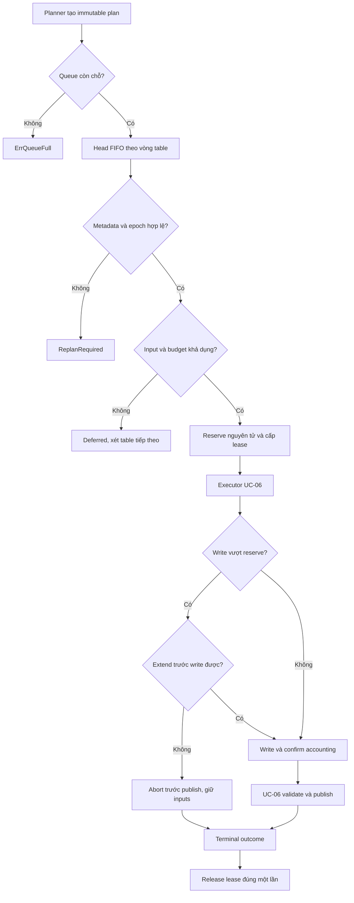
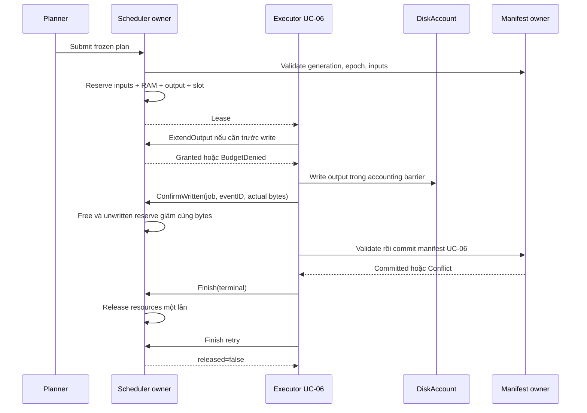

# UC-04: Tự xây BoundedScheduler với reservation và resource budget

> Thiết kế để triển khai từ đầu bằng Go, chưa có engine code trong tài liệu.
> Thuộc [Feature 03](../../feature/03-read-merge-and-basic-compaction.md).
> Các con số ví dụ là giả định. Scheduler của lab không có lời hứa tương
> đương scheduler ScyllaDB; nguồn mapping được đối chiếu ngày 2026-09-29.

## 1. Vấn đề và kết quả cần tạo

Planner UC-02/03 có thể liên tục đề xuất nhiều nhóm SSTable để compact.
Nếu executor chạy mọi plan ngay, hai job có thể đọc cùng input, dùng hết RAM
hoặc lấp disk trước khi publish. Flush cần thêm file nhưng đã mất headroom.
Chạy ít job cũng không tự giải quyết nợ nếu work mới đến nhanh hơn xử lý.

Xây `BoundedScheduler` nhận plan bất biến, xếp hàng hữu hạn và cấp lease chỉ
khi đủ disk/memory/slots. Một owner quyết định reservation nguyên tử; UC-06
thực thi output/publish rồi báo terminal outcome để trả lease đúng một lần.
Foreground và flush giữ budget riêng; compaction không được mượn chúng.

Ví dụ hai plan `P1={S1,S2}` và `P2={S2,S3}` cùng đủ disk. Chỉ một plan được
admit vì cả hai muốn S2. Plan còn lại chờ/replan sau khi manifest thay đổi.
Nếu `P3={S8,S9}` không chồng input và đủ budget, nó có thể dùng slot tiếp theo.

## 2. Phân biệt nợ công việc và tài nguyên đã tiêu

| Đại lượng của lab | Đơn vị | Nguồn |
| --- | --- | --- |
| Queued plans | count | Queue state của scheduler. |
| Estimated pending input | bytes | Tổng plan input đã freeze, chỉ là estimate. |
| Work debt của policy | unit do policy định nghĩa | Planner/cost observer, không đổi tên thành bytes I/O. |
| Output read/write thực tế | bytes | Cost observer UC-01 và writer UC-06. |

Hai node giả định cùng pending count 4 có thể chờ 8 GiB hoặc 240 GiB input.
Count không cho biết I/O cần làm, thời gian chạy hay phần bytes đã reclaim.
Nếu report dùng một work unit cho cả arrival và completion, có thể tính:

```text
debt_next = max(0, debt_now + work_arrived - work_completed)
arrival = 60 work-units/giờ; completion = 45 -> debt tăng 15/giờ
giảm arrival xuống 35, completion vẫn 45 -> debt giảm 10/giờ
```

Không dùng writes/s trừ MiB/s. Thí nghiệm tăng slot chỉ có ích nếu capacity
thực tăng; khi disk bão hoà, giảm ingest có thể làm debt giảm hữu hiệu hơn.

## 3. Shared contract và dữ liệu scheduler sở hữu

`FileMeta`/`CompactionPlan` lấy từ contract Feature 03; không sửa metadata
planner trả về. Key bounds inclusive dùng full-row comparator Feature 02.

```go
type FileMeta struct {
    ID, RunID, TableID string
    Level int
    MinKey, MaxKey RowKey // inclusive, full-row order
    BytesOnDisk uint64
}
type CompactionPlan struct {
    SnapshotGen, PolicyEpoch uint64
    InputIDs []string
    TargetLevel int
    OutputTargetBytes uint64
    WindowID *int64
    EstimatedOutputBytes uint64
}
type JobState uint8 // Queued, Running, Succeeded, Failed, Cancelled
type Job struct {
    ID, TableID string
    Plan CompactionPlan // deep copy, InputIDs canonicalized
    FrozenInputs []FileMeta
    State JobState
    MemoryReserved, RemainingOutput uint64
}
```

Scheduler tạo JobID theo owner sequence; không dùng map iteration hay wall
clock để chọn thứ tự. Deep copy cả slices và `WindowID`; caller sửa plan sau
`Submit` không được thay đổi job đã xếp hàng. InputIDs rỗng/trùng bị từ chối.

```go
type Limits struct {
    MaxQueued, MaxRunning int
    CompactionMemoryBytes uint64 // đã trừ foreground/flush memory riêng
    GrowthReserve, OtherReserve, SafetyMargin uint64
}
type Lease struct { JobID string; InputIDs []string }
type BoundedScheduler interface {
    Submit(tableID string, p CompactionPlan) (string, error)
    TryAdmit() (Lease, error)
    ExtendOutput(jobID string, additional uint64) error
    ExtendMemory(jobID string, additional uint64) error
    ConfirmWritten(jobID, eventID string, bytes uint64) error
    Cancel(jobID string) error
    Finish(jobID string, outcome JobState) (released bool, err error)
}
```

Metadata owner cung cấp manifest snapshot, policy epoch và file identity.
Memory estimate phải bao gồm iterator/buffer/output writer được executor
cam kết dùng; không suy từ `EstimatedOutputBytes` thành lượng RAM tự động.
Vượt memory estimate phải xin extension trước allocation hoặc abort an toàn.

## 4. Disk ledger: reserve phần chưa ghi, không đếm input lần hai

Input đang trên disk đã nằm trong Used. FreeNow cũng đã phản ánh output đã
ghi. Đặt `R = tổng RemainingOutput` của các running leases, còn `G` là growth
+ other + safety reserve dùng chung; chúng không chồng phạm vi với nhau.

```text
admissionAvailable = FreeNow - G - R
admit nếu EstimatedOutputBytes <= admissionAvailable
```

Mọi phép trừ dùng checked arithmetic. Nếu `FreeNow < G+R`, báo budget deficit
và chặn admission; không để uint underflow thành dung lượng rất lớn.
Ví dụ FreeNow=120 GiB, job mới cần output=70, growth=10, other=20, safety=30:
reserve cần thêm 130 GiB, nên job bị hoãn. Không cộng input đang Used nữa.

Khi ghi x GiB thành công, update nguyên tử `FreeNow -= x` và
`RemainingOutput -= x`: available không đổi do bytes đã chuyển từ reservation
sang physical allocation. Không giảm FreeNow lần nữa nếu disk sample đã
bao gồm write đó. Ledger theo dõi sample generation để tránh double count.

Trong lab, fake DiskAccount nhận mọi allocation/reclaim event có sequence.
Adapter filesystem lấy baseline rồi reconcile sample khi không có write
accounting đang dở; mỗi event được áp dụng một lần. Giữa write và confirm,
giữ admission barrier để không có cửa sổ vừa trừ reserve vừa dùng Free cũ.
Disk phát sinh ngoài các writers được theo dõi vẫn có thể gây I/O failure;
reserve không phải bảo đảm filesystem chống ENOSPC.

Trước write n bytes, nếu `n > RemainingOutput`, xin thêm phần thiếu. Extension
chỉ thành công khi `extra <= FreeNow-G-R`. Thất bại thì UC-06 dừng trước write
và trước publish, giữ input/manifest; temp đã ghi được dọn theo protocol UC-06.
Disk writer không được ghi trước rồi mới xin bổ sung estimate.
Mỗi job chỉ có một writer nối tiếp; ConfirmWritten ghi nhận EventID một lần.
Retry cùng event/bytes là no-op, payload khác trả ErrEventConflict. Memory
extension cũng qua owner và chỉ lấy từ compaction pool, không mượn flush RAM.

Snapshot/reader pin khiến input chưa reclaim sau publish. Reservation không
coi input sẽ free ngay; khi actual reclaim xảy ra, DiskAccount mới tăng Free.
Nếu không có reclaim horizon rõ, không lấy thời điểm job xong làm cam kết.

## 5. Admission nguyên tử và công bằng xác định được

State gồm queues theo TableID, vòng table IDs đã sort, cursor cuối phục vụ,
`inputOwner[FileID]JobID`, running count, memory và disk ledger.
Một goroutine owner xử lý request nối tiếp; cũng có thể dùng một mutex cho
toàn bộ critical section. Không kiểm tra budget rồi unlock trước reservation.

```text
Submit(table, plan):
  validate + deep-copy plan và FrozenInputs từ snapshot
  nếu queue đầy -> ErrQueueFull, không giữ resource nào
  append vào FIFO của table; tạo JobID; cập nhật gauges

TryAdmit(): trong một owner turn
  nếu foreground/flush guard đóng hoặc hết slot -> Deferred(reason)
  duyệt mỗi table một lần theo vòng sau cursor, xét head FIFO
  nếu SnapshotGen/PolicyEpoch stale -> remove head, emit ReplanRequired
  nếu input thiếu/đổi identity -> reject stale job, không chạy
  nếu input đã có owner hoặc budget thiếu -> thử table tiếp theo
  nếu đủ -> reserve tất cả inputs + RAM + output + slot cùng lúc
             pop head; state=Running; cursor=table; return immutable Lease
  không có head đủ điều kiện -> Deferred(reason-summary)
```

FIFO giữ thứ tự trong một table; không bypass head lớn bằng job nhỏ cùng
table ở baseline. Một table bị block không chặn table khác. Round-robin đảm
bảo mỗi table đủ điều kiện có lượt; không hứa job vượt budget sẽ chạy cuối cùng.
Stale/rejected heads được xử lý ở tick tiếp theo nếu cần, tránh vòng lặp vô hạn.

## 6. Luồng từ queue đến terminal state





## 7. Finish, lỗi và invariants

`Finish` chấp nhận terminal outcome từ UC-06 sau commit hoặc abort cleanup.
Nó giải phóng inputOwner, RAM, remaining unwritten reservation và slot một
lần. Bytes output đã viết vẫn nằm trên disk cho đến cleanup/reclaim event;
release reservation không tự cộng Free. Finish lặp lại cùng outcome là no-op;
outcome mâu thuẫn trả `ErrTerminalConflict`, không đổi counters lần nữa.

| Lỗi | Hành vi bắt buộc |
| --- | --- |
| QueueFull | Caller backpressure/retry; không cấp lease. |
| Stale metadata/epoch | Replan; không tự sửa frozen plan. |
| InputBusy, DiskDenied, MemoryDenied, SlotsFull | Deferred có reason; không reserve một phần. |
| Extension denied / I/O fail | Abort trước publish; input còn readable. |
| Cancel queued | Remove queue, không có resource để trả. |
| Cancel running | Signal executor; release khi executor xác nhận terminal. |
| Process crash | UC-06 recovery quyết định manifest/temp; không phục hồi lease RAM như job đang sống. |

Invariants: mỗi input thuộc tối đa một running lease; queue/running luôn hữu
hạn; tổng memory không vượt compaction pool; guard của foreground/flush có
quyền đóng admission. Policy update không mutate running plan; UC-06 phải
revalidate epoch/publication. OutputTargetBytes không phải upper bound disk.

## 8. Observability và test cases triển khai

Gauges: queued/running theo table, reserved memory, outstanding output bytes,
inputs leased và disk available. Counters: submit rejected, deferred reason,
admitted, extensions denied, terminal outcomes. UC-01 giữ measured bytes và
latency; không cộng gauges/counters khác đơn vị thành một backlog chung.

- **Overlap race:** Submit P1/P2 cùng S2, concurrent TryAdmit chỉ cấp một lease.
- **Atomic reject:** thiếu RAM sau kiểm tra disk không giữ input/output/slot nào.
- **Bounded queue:** submit vượt MaxQueued trả QueueFull và queue không tăng.
- **Fairness:** A liên tục submit, B/C đủ budget vẫn có lượt theo vòng ổn định;
  blocked A không chặn B/C; chạy lại fixture cho cùng admission sequence.
- **Frozen metadata:** caller sửa InputIDs/WindowID sau Submit không đổi job.
- **Disk arithmetic:** 120 < 70+10+20+30 phải hoãn; test checked overflow.
- **Write accounting:** ghi 20 trong reserve 70 làm Free và remaining cùng
  giảm 20; sample đã chứa write không bị debit thêm lần nữa.
- **Estimate miss:** trước write vượt remaining, extension bị từ chối thì
  không gọi writer/publish; input IDs còn trong manifest.
- **Finish idempotence:** success/fail/cancel release đúng một lần; output temp
  còn tồn tại không được cộng thành free chỉ vì lease đã kết thúc.
- **Guardrail:** debt giảm nhưng foreground/flush vượt guard là fixture fail.

## 9. Mapping sang ScyllaDB và giới hạn

[Metrics ScyllaDB](https://docs.scylladb.com/manual/stable/reference/metrics.html)
tách pending count, backlog và normalized backlog; lab giữ phân biệt đó nhưng
không tái tạo công thức strategy/scheduler production. [Advisor compaction](https://monitoring.docs.scylladb.com/stable/use-monitoring/advisor/heavyCompaction.html)
nêu giới hạn shares và tradeoff read latency; không lấy static shares ví dụ
làm budget tối ưu chung. [Disk requirements](https://docs.scylladb.com/manual/stable/getting-started/system-requirements.html)
giải thích temporary rewrite space; [snapshot hard links](https://docs.scylladb.com/manual/stable/kb/disk-utilization.html)
giải thích reclaim bị trì hoãn. Ledger, FIFO và round-robin trên là thiết kế lab.
Liên kết [UC-01](01-compaction-diagnosis.md), [UC-02](02-strategy-selection-and-change.md),
[UC-03](03-twcs-and-retention.md), [UC-06](06-safe-maintenance-and-validation.md)
và [Research](../../research/feature-03-compaction-operations.md).
