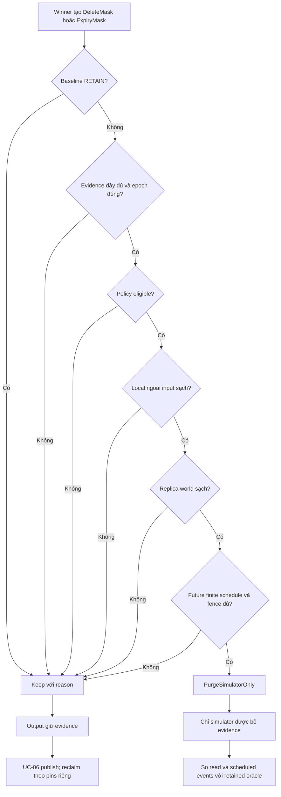
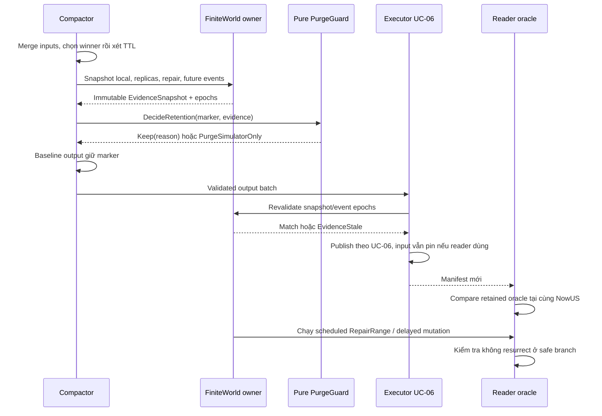

# UC-05: Tự xây PurgeGuard và simulator chống resurrection

> Thiết kế triển khai từ đầu bằng Go, chưa triển khai GC production.
> Thuộc [Feature 03](../../feature/03-read-merge-and-basic-compaction.md).
> Baseline giữ deletion/expiry evidence; ví dụ là fixture giả định.
> Mapping ScyllaDB tham chiếu nguồn chính thức ngày 2026-09-29.

## 1. Vấn đề: merge đúng vẫn có thể làm dữ liệu xoá sống lại

Compactor chọn winner giữa các input và thấy DELETE cao nhất. Nếu nó bỏ
DELETE vì không có value còn sống trong input, một SSTable ngoài input có
thể trả bản cũ. Replica chưa nhận DELETE cũng có thể đưa bản cũ trở lại.
Tuổi tombstone không chứng minh hai nguồn dữ liệu đó đã được xử lý.

Xây hàm pure `DecideRetention` trả giữ/purge cùng reason, với baseline
`RETAIN`. EvidenceSnapshot ghi những điều biết và chưa biết; dữ liệu thiếu
phải fail closed. Nhánh purge chỉ tồn tại trong simulator hữu hạn có proof
kiểm tra được, không tạo một hàm purge production giả vờ đủ bằng chứng.

## 2. Hai fixture buộc thiết kế phải xử lý

```text
Local ngoài input:
  S1: K@v10=active                 // không được compact lần này
  S2: K@v20=DELETE; S3: K@v15=old  // input
  giữ DELETE@v20 -> K absent
  bỏ DELETE@v20  -> S1 có thể trả active

Replica trễ:
  R1/R2 nhận DELETE@v20; R3 offline còn K@v10=active
  R1/R2 bỏ v20 trước đồng bộ -> R3 có thể truyền v10 trở lại
```

Simulator có read union và event `RepairRange` để đưa mutations giữa replica
stores theo winner rule. UnsafeDrop chỉ đổi một fixture copy rồi chạy read/
repair; kết quả mong đợi là chứng minh resurrection, không bật cho lab baseline.

## 3. Winner, wall clock và ba mốc trạng thái

Mutation từ Feature 02 có ID, Row, Version.Logical, Version.WriterID, Kind,
Value và ExpiresAt (absolute microseconds). Logical version không là đồng
hồ. Chọn winner theo contract chung, không dùng tên file hay thời điểm flush.

```text
S1 K: Put@v10, không TTL
S2 K: Put@v20, ExpiresAt=wall_us_100
Read tại wall_us_101: v20 thắng rồi được coi expired -> absent
Không bỏ v20 trước chọn winner rồi fallback về v10.
```

ExpiryMask giữ version/row của winner và expiry evidence thay vì làm sống
lại v10. DELETE và expiry mask che bản thấp hơn theo cùng reconciliation rule.
`ExpiresAt` được so với fake wall clock; `Version.Logical` chỉ so precedence.
Grace/repair delay dùng thời gian wall riêng, không lấy `Logical + grace`.

| Trạng thái | Nghĩa trong mô hình |
| --- | --- |
| Expired | Winner đã hết TTL ở read time, không visible như value. |
| Policy-eligible | Điều kiện timeout hoặc scoped repair/delay đã đủ. |
| Purge-safe trong simulator | Policy đủ và proof local/replica/future đầy đủ. |
| Physically reclaimed | UC-06 đã retire file và pins hết, disk trả bytes. |

Eligible không chứng minh purge-safe; purge-safe không chứng minh reclaimed.
Baseline retain mask/tombstone nhưng vẫn có thể drop stale values mà winner
che trong input, vì bằng chứng winner còn được giữ cho reads về sau.

## 4. Go-ish model: snapshot bằng chứng phải tường minh

```go
type RetentionAction uint8 // Keep, PurgeSimulatorOnly
type GuardMode uint8 // RetainBaseline, FiniteProofSimulation
type GCPolicy uint8 // TimeoutPolicy, RepairPolicy
type Reason string
type Marker struct {
    Mutation Mutation // Feature 02 contract, không tự đổi version semantics
    MaskKind string   // DeleteMask hoặc ExpiryMask
    GCWallTimeUS int64
    GCWallTimeKnown bool // delete có thể cần metadata riêng từ ingest fixture
}
type RowRange struct { Min, Max RowKey } // inclusive, full-row comparator
type LocalSource struct {
    ID string
    Kind string // SSTable, active memtable, frozen memtable
    Rows []Mutation
    Exhaustive bool
}
type RepairEvidence struct {
    Range RowRange
    ReplicaIDs []string
    CompletedAtUS, BarrierUS int64
    CoversMarker bool // derived từ scheduled repair, không caller đoán
    Succeeded bool
}
type ScheduledMutation struct { AtUS int64; ReplicaID string; Mutation Mutation }
type FutureFence struct {
    BarrierUS int64
    Known bool
    AllEventsEnumerated bool
    NoOlderMutationAfterBarrier bool
    PendingMutations []ScheduledMutation
}
type EvidenceSnapshot struct {
    Mode GuardMode
    Policy GCPolicy
    NowUS, GraceUS, PropagationDelayUS int64
    LocalOutsideInput []LocalSource // bao gồm active/frozen memtable
    LocalCoverageComplete bool
    ReplicaIDs []string
    ReplicaRows map[string][]Mutation // simulator đọc world hữu hạn
    ReplicaCoverageComplete bool
    Repairs []RepairEvidence
    Future FutureFence
    SnapshotGen, MemtableEpoch, EventEpoch uint64
}
type Decision struct { Action RetentionAction; Reason Reason }
func DecideRetention(m Marker, e EvidenceSnapshot) Decision
```

`GCWallTimeUS` là metadata thời gian riêng do fixture định nghĩa và lưu.
Nó không giả lập đầy đủ timestamp/tombstone format ScyllaDB. ExpiryMask có
thể dùng ExpiresAt làm mốc của policy simulator được công bố; delete cần mốc
độc lập đã biết. Unknown clock hoặc overflow tính tuổi đều trả Keep.

Trong simulator, `CoversMarker` phải được dựng từ lịch repair thực tế: đúng
row range, đủ replica set, marker đã được đưa vào barrier đó. Boolean toàn
cục `repaired=true` không tồn tại trong API và không thể thay proof này.
EvidenceSnapshot immutable; sau event/memtable/manifest đổi phải lấy mới.

## 5. Policy eligibility trước, coverage proof sau

Timeout simulation cho eligible khi `NowUS >= GCWallTimeUS + GraceUS`.
Nó không tự bảo đảm replicas được đồng bộ; coverage proof vẫn kiểm tra riêng.
Repair simulation tìm repair record đúng phạm vi/replicas, đã hoàn tất và
bao phủ marker; marker phải trước repair barrier ít nhất propagation delay.
Tất cả thời gian dùng checked arithmetic và clock policy của simulator.

```text
DecideRetention(marker, evidence):
  nếu Mode == RetainBaseline -> Keep(BaselineRetainsEvidence)
  nếu metadata/time/coverage thiếu -> Keep(Unknown với reason cụ thể)
  nếu marker không là delete/expired winner -> Keep(NotDeletionEvidence)
  eligible, reason = EvaluatePolicy(marker, evidence)
  nếu không eligible -> Keep(reason: PolicyNotEligible/RepairScopeMismatch)
  nếu local outside-input có lower mutation cần marker che -> Keep(LocalShadow)
  nếu replica world có stale lower mutation -> Keep(ReplicaShadow)
  nếu future schedule/fence không biết hoặc không exhaustive -> Keep(FutureUnknown)
  nếu fence bị vi phạm hoặc có lower mutation tới sau purge -> Keep(FutureStaleArrival)
  return PurgeSimulatorOnly(FiniteWorldProof)
```

Local proof phải xét toàn bộ sources ngoài input cho row, kể cả memtables.
Bounds chỉ giúp loại source chắc chắn không chứa row; overlapping bounds
không là proof sạch. Metadata thiếu, comparator mismatch hoặc source chưa
đọc exhaustive đều Keep. Không chọn max version file để suy absence.

Baseline simulator proof cố ý bảo thủ: nếu bất kỳ replica còn lower mutation
cho row, nó giữ marker, kể cả có thể có một higher marker khác che mutation.
Giới hạn này làm proof dễ kiểm tra; không gọi nó tối ưu GC production.

Future bound không chỉ là “delay tối đa ước lượng”. Proof branch yêu cầu
world hữu hạn, mọi scheduled event được liệt kê, và fence chặn stale write
đến sau barrier. Nếu sửa lịch bằng một stale event mới, EventEpoch đổi và
proof cũ mất hiệu lực. World mở có network/retry chưa biết luôn Keep.
Guard duyệt PendingMutations để đối chiếu bound với row/version marker;
NoOlderMutationAfterBarrier là kết quả builder, không thay việc kiểm tra list.

## 6. Flowchart quyết định retention



## 7. Sequence của compactor và simulator



Đối với proof simulation, mọi evidence cần giữ trong một world transaction
đến lúc quyết định được áp dụng, hoặc revalidate epochs trước publish.
Baseline luôn Keep nên không cần giả vờ có distributed proof để tạo output.
UnsafeDrop bypass guard chỉ được gọi trên bản sao world tách biệt của test.

## 8. Errors và invariants

| Reason/error | Kết quả yêu cầu |
| --- | --- |
| BaselineRetainsEvidence | Keep dù tuổi lớn hoặc repair task xanh. |
| UnknownLocal/Replica/Future | Keep, ghi rõ phần bằng chứng thiếu. |
| PolicyNotEligible | Keep; không ép bằng cách đặt grace về 0. |
| LocalShadow / ReplicaShadow | Keep, simulator nêu source/replica chứa stale row. |
| RepairScopeMismatch | Keep; repair range khác hoặc thiếu replica không đủ. |
| EvidenceStale | Snapshot lại hoặc abort; không áp proof cũ. |
| Invalid time / comparator | Fail closed; không chuyển thành allow purge. |

Mutation winner không đổi vì compaction. Expired winner không fallback về
version thấp hơn. PurgeGuard pure không sửa sources, không chạy repair, không
xoá file và không cộng disk free. Default của mọi constructor là baseline.
Purge action không được executor baseline chấp nhận; nó chỉ thuộc simulator.
GC grace là eligibility parameter, không là phép chứng minh distributed safety.

## 9. Test cases có expected outcome cụ thể

- **Local stale SSTable:** input S2/S3, S1 ngoài input chứa v10 -> Keep(LocalShadow);
  safe read absent; UnsafeDrop copy trả active để chứng minh lỗi.
- **Active memtable:** file ngoài input sạch nhưng active memtable chứa v10 ->
  Keep(LocalShadow); bỏ memtable khỏi snapshot phải thành Unknown, không Purge.
- **R3 lag:** R1/R2 giữ DELETE, R3 v10 -> Keep(ReplicaShadow); unsafe repair
  simulator đưa v10 trở lại khi không còn marker trên bất kỳ replica.
- **Repair sai scope:** completed repair cho range khác hoặc thiếu R3 ->
  Keep(RepairScopeMismatch), không phụ thuộc job status tổng quát.
- **Propagation delay:** marker nằm trong khoảng đệm trước barrier -> Keep;
  chỉ vượt đệm vẫn chưa đủ nếu local/replica/future proof thiếu.
- **Logical không là clock:** thay Logical từ 20 thành 2000 không đổi GC age;
  chỉ thay GCWallTimeUS/NowUS làm eligibility simulator thay đổi.
- **TTL masking:** Put v20 expired che Put v10 live trước/sau compaction.
- **Unknown fail closed:** thử missing coverage, unknown time, overflow và
  comparator mismatch; mọi đường trả Keep, không dùng zero-value như proof.
- **Finite safe world:** mọi local/replica stale rows đã bỏ, repair đủ scope,
  time eligible và schedule fenced -> PurgeSimulatorOnly; chạy mọi event còn
  lại cho cùng visible state như retained oracle.
- **Late event:** thêm scheduled Put v10 sau barrier -> Keep(FutureStaleArrival);
  proof epoch cũ bị invalidated trước áp dụng.
- **Reclaim riêng:** guard trả eligible/safe nhưng reader pin hoặc snapshot
  còn giữ input -> physical bytes chưa giảm; UC-06 không báo reclaimed sớm.

## 10. Mapping ScyllaDB và ranh giới mô hình

[DDL 2026.3](https://docs.scylladb.com/manual/branch-2026.3/cql/ddl.html#tombstones-gc-options)
mô tả timeout theo grace, repair với propagation delay. RF=1 không repair
được; repair mode hành xử như immediate. Colocated Tables chưa hỗ trợ repair
mode trong release đó; không suy những điều này cho mọi cluster/version cũ.
Không coi global repair boolean là đủ, không blanket dùng grace=0/immediate.
[Compaction history](https://docs.scylladb.com/manual/stable/operating-scylla/nodetool-commands/compactionhistory.html)
có counters purge bị chặn bởi memtable/SSTable ngoài input; chúng minh hoạ
lý do phải xét local coverage, không cung cấp production proof cho lab.
[TTL facts](https://docs.scylladb.com/manual/stable/kb/ttl-facts.html) giải thích
expired SSTable vẫn bị overlap chặn; [snapshot hard links](https://docs.scylladb.com/manual/stable/kb/disk-utilization.html)
giải thích physical reclaim riêng. Simulator finite world trên là thiết kế
học tập, không byte-format, clock policy hay repair metadata ScyllaDB thật.
Liên kết [UC-03](03-twcs-and-retention.md), [UC-06](06-safe-maintenance-and-validation.md),
[Feature 04](../../feature/04-ttl-tombstones-and-delete-safety.md)
và [Research](../../research/feature-03-compaction-operations.md).
