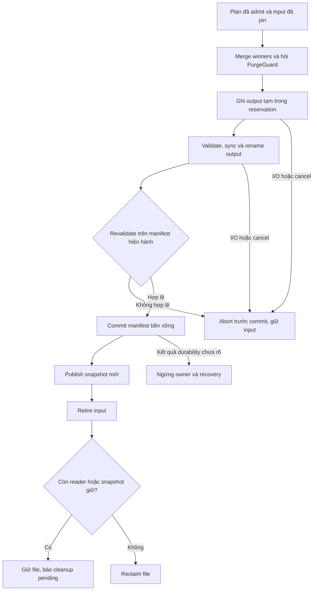
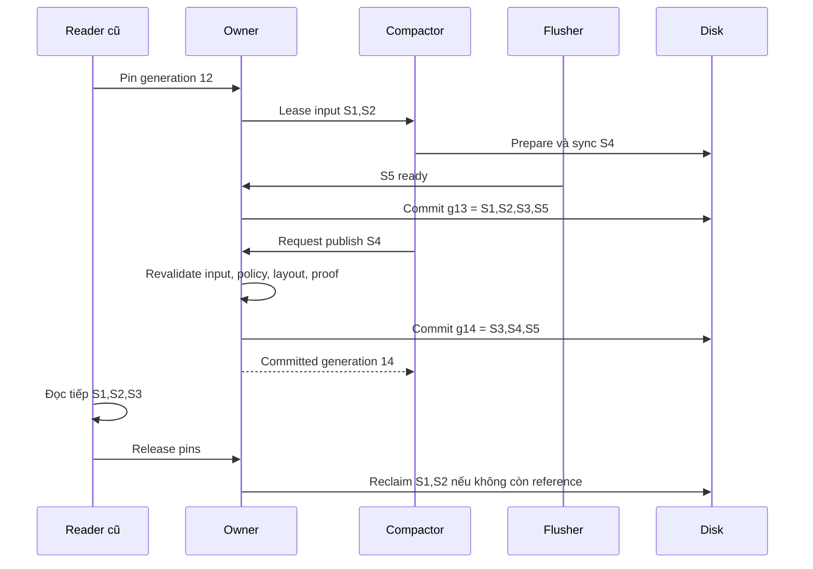

# Feature 03 — UC-06: Tự xây executor, atomic publish và crash-test harness

> Đặc tả implement từ đầu, chưa có engine hoặc fault-injection result.
> Protocol manifest dưới đây là lựa chọn của lab, không phải format ScyllaDB.

## 1. Vấn đề gốc: merge đúng vẫn có thể làm mất dữ liệu

Giả sử đã chọn S1 và S2, đã biết giữ winner nào, đã đủ tài nguyên. Ta ghi
S3 rồi xoá S1/S2. Nếu crash khi S3 mới ghi nửa file, dữ liệu mất dù thuật toán
reconciliation hoàn toàn đúng.

Đổi thứ tự: ghi xong S3 rồi giữ cả ba. Dữ liệu chưa mất nhưng reader phải biết
S3 đã được công bố hay chỉ là file bỏ dở. Khi flush khác chạy đồng thời, một
manifest ghi từ snapshot cũ còn có thể làm biến mất file vừa flush.

UC này tự xây **CompactionExecutor** và **CrashHarness**. Executor biến plan
thành một thay đổi file set bền vững; harness chứng minh tính đúng và ghi lại
chi phí toàn bộ lifecycle.

## 2. First principles: suy ra prepare, commit, retire

1. Input bất biến là bản an toàn hiện tại; chưa có output bền vững thì không
   được bỏ input.
2. Sự có mặt của file không nói reader có được dùng nó. Cần một danh sách
   committed files: manifest.
3. Tập output có thể gồm nhiều file, nhưng việc thay input phải được công bố
   như một thay đổi logic duy nhất, không từng nửa.
4. Reader đang chạy có thể giữ input cũ. Vì vậy retire khỏi manifest khác với
   unlink/reclaim.
5. Thông báo I/O lỗi sau rename có thể có kết quả chưa biết. Vì vậy recovery
   phải dựa trên manifest hợp lệ thực sự, không chỉ trạng thái cuối trong RAM.

Từ đó có ba pha: **prepare output → commit file set → retire input**.
Observer UC-01 và reservation UC-04 đi cùng từng pha, không chỉ happy path.

## 3. Fixture dùng để bắt lỗi mà row count không bắt được

```text
Manifest generation 12: [S1, S2, S3]
S1: A@v1=pending, B@v1=active
S2: A@v2=paid,    C@v1=active
S3: B@v3=DELETE

Plan: input [S1,S2], output dự kiến [S4], PurgeGuard=AlwaysKeep
S4: A@v2=paid, B@v1=active, C@v1=active

Read g12: A=paid, B=absent, C=active
Read g13 với [S3,S4]: cùng kết quả
```

Trong lúc prepare, flush publish S5 chứa D@v1 và tạo generation 13.
Compactor phải tạo generation 14 là [S3,S4,S5], không được ghi [S3,S4]
từ snapshot cũ rồi làm mất D.

Reader đã pin generation 12 tiếp tục dùng S1/S2/S3. Reader mới sau commit
dùng file set mới; không đổi nguồn giữa chừng trong một iterator.

## 4. Data model và API của executor

```go
type OutputMeta struct {
    File FileMeta
    Checksum string
    RowCount uint64
}
type ExecuteResult struct {
    Committed bool
    ManifestGen uint64
    OutputIDs []string
    CleanupPending bool
}
type Executor interface {
    Execute(ctx context.Context, plan CompactionPlan, lease Lease) (ExecuteResult, error)
}
type FaultPoint string
type FaultInjector interface { Check(FaultPoint) error }
```

CompactionPlan/FileMeta lấy từ overview. Lease do UC-04 cấp: quyền dùng input,
RAM, slot và số bytes output đã reserve; executor không tự tăng limit.
Manifest có Generation, LiveTables, FlushedThrough theo Feature 02.

File ID mới phải duy nhất qua restart; không dùng counter reset về 0 rồi ghi
đè file cũ. OutputMeta chỉ được dựng từ dữ liệu/footer đã kiểm tra. ID cùng
checksum/metadata của input được giữ trong lease để phát hiện plan stale.

Pseudocode là contract, không phải Go compile-ready. Tách filesystem adapter
để cùng một executor có thể dùng fake disk trong test và disk thật trong lab.

## 5. Flowchart lifecycle và lỗi



Đường lỗi ở commit không được gộp vào abort bình thường. Nếu chưa biết manifest
nào bền vững, giữ mọi file có thể cần và đóng owner admission cho đến recovery.

## 6. Thuật toán prepare: merge theo nhóm, ghi có giới hạn

```text
prepare(plan, lease):
    require lease matches plan and inputs are pinned
    open bounded iterators for immutable inputs
    for each full row group in sorted merge:
        check cancellation and lease validity
        winner = reconcile(group) using Feature02 contract
        decision = PurgeGuard(winner, evidence snapshot)
        if decision == KEEP:
            encode winner unchanged
            reserve/extend before allocating bytes beyond remaining credit
            append to current temporary output
        else:
            require simulator mode and explicit finite-world proof
        if output target reached at a row boundary:
            seal output and begin next only when another row exists
    seal final nonempty output
    validate every output order, footer, count, bounds, checksum
    sync every output
    return outputs plus exact input identities and proof token if used
```

Không tách các mutation của cùng row qua hai output. OutputTargetBytes là
mục tiêu, không hard cap. Một record lớn vượt target phải xin đủ budget hoặc
fail rõ; không tạo file hỏng để giữ đúng kích thước đẹp.

Trong baseline, PurgeGuard luôn KEEP deletion evidence. Một nhóm row chỉ
còn tombstone vẫn tạo output. Zero output chỉ hợp lệ khi input thật sự rỗng
hoặc simulator chứng minh đã bỏ toàn bộ; không dùng visible row count để
coi input delete-only là rỗng.

Duplicate ID xung đột đang gặp là lỗi, không chọn payload tùy ý. Engine không
hứa phát hiện ID conflict của lịch sử đã bị loại bỏ và không còn bằng chứng.

## 7. Sequence: flush xen vào và reader cũ



Owner là nơi duy nhất thay active file set. Worker không giữ một bản manifest
cũ rồi tự write đè. Các file mới không liên quan phải được giữ khi rebase.

## 8. Publish protocol và revalidation cụ thể

Sau khi outputs đã validate/sync:

1. Rename output tạm sang tên final duy nhất trên cùng filesystem, sync thư mục.
2. Dưới owner, lấy manifest hiện hành; kiểm tra PolicyEpoch còn đúng, lease
   còn hiệu lực và mọi input còn live, identity/checksum không đổi.
3. Kiểm tra bố cục output với các file ngoài input. Với leveled, không tạo
   overlap trong target level từ L1 trở lên; nếu flush/compaction khác khiến
   proof không còn đúng, abort/replan thay vì publish bố cục sai.
4. Nếu simulator đã purge, evidence generation/proof token phải còn hợp lệ.
   Evidence thay đổi thì bỏ output đó và rewrite với proof mới hoặc KEEP;
   không thể thêm lại tombstone bằng cách chỉ sửa manifest.
5. Tạo nextManifest bằng currentLive trừ đúng inputs cộng outputs; giữ
   FlushedThrough hiện hành. Ghi file tạm, sync, rename manifest, sync directory.
6. Công bố snapshot trong RAM và đánh dấu inputs retired.
7. Release job pins/lease sau khi worker hết dùng; reader/snapshot pins độc lập.
   Reclaim input khi không còn reference và metadata bền vững đã bỏ input.

Sau bước 5 bền vững, cancellation không undo thay đổi. ExecuteResult phải
báo Committed=true, có thể CleanupPending=true. Caller biết state đã đổi dù
một bước cleanup sau đó lỗi.

Nếu rename manifest đã xảy ra nhưng sync directory lỗi, không báo
Committed=false chắc chắn. Trả lỗi commit-unknown, giữ files, chuyển owner
sang recovery required. Không tiếp tục mutate file set trên state mơ hồ.

## 9. Recovery và cleanup không được đoán theo tên file

Recovery bắt đầu bằng manifest committed hợp lệ theo giao thức Feature 02:

- Validate mọi referenced output: file có mặt, format/order/checksum đúng.
- Nếu referenced file thiếu/corrupt, fail closed; không coi như bảng rỗng.
- File không referenced là orphan candidate, không là dữ liệu mới hơn mặc
  định. Chỉ cleanup sau khi xác minh manifest và không còn job/reader dùng.
- Giữ khả năng manifest cũ hoặc mới được nhìn thấy khi crash trước durable
  boundary; do input chưa retire sớm, cả hai đường có đủ dữ liệu.
- Sau restart tạo RunID mới cho observer và dựng lại registry từ disk/manifest,
  không replay I/O counters như thể nó vừa được thực hiện lần hai.

Cleanup lỗi không đổi winner, nhưng giữ disk usage cao. Reservation cho phần
chưa ghi có thể release; file output orphan còn tồn tại vẫn phải tính Used.
Không trả cả disk allocation thật về Free chỉ vì lease đã kết thúc.

## 10. Xây CrashHarness từ đâu?

Implement fake filesystem với hai trạng thái: bytes/namespace đang thấy và
phần đã durable. Mỗi operation write/sync/rename/directory-sync là fault point.
Crash bỏ các thay đổi chưa durable theo mô hình test và reset RAM.

Harness không được chỉ ném error rồi chạy defer cleanup như shutdown bình
thường. Power-loss simulation phải có đường bỏ qua cleanup, sau đó khởi tạo
recovery từ durable image. Với rename chưa directory-sync, duyệt các kết quả
namespace cũ/mới mà mô hình cho phép thay vì chỉ thử một đường thuận lợi.

Oracle giữ toàn bộ mutation history hợp lệ của fixture, chọn winner theo
Feature 02 và xét một ReadTime cố định. So full keys/value/absence, không chỉ
count. Thêm file ngoài input, memtable, delete và expired winner vào fixture.

Fake disk là mô hình để kiểm tra protocol. Sau này vẫn cần test filesystem
thật; không suy fake fs pass thành mọi storage device tôn trọng sync.

## 11. Fault-injection và expected state

| Test | Expected |
| --- | --- |
| Crash khi S4 ghi nửa file | Recover g12, đọc từ S1/S2/S3; S4 chưa visible. |
| S4 sync xong, chưa manifest commit | g12; output orphan, không mất input. |
| Crash sau rename manifest trước directory sync | Mô hình có thể chọn manifest cũ/mới; mỗi đường đều đủ file hợp lệ. |
| Crash sau durable manifest | g13 hoặc g14 đúng file set; không fallback manifest cũ chỉ vì cleanup chưa xong. |
| Flush S5 xen vào | Publish giữ S5; D không biến mất. |
| Input bị job khác thay / PolicyEpoch đổi | Revalidation reject, không publish stale output. |
| Target level mới có overlap ngoài plan | Reject/replan; không phá invariant L1+. |
| Purge proof stale | Không publish output đã bỏ evidence dựa trên proof cũ. |
| Reader pin input | Reader hoàn tất; reclaim chỉ sau release. |
| Cancel trước commit | Không đổi live set, ghi nhận I/O đã tốn. |
| Cancel/cleanup error sau commit | Committed=true; cleanup có thể pending, không rollback dữ liệu. |
| Output cần thêm bytes, extension bị từ chối | Fail trước allocation vượt credit, input còn nguyên. |

Chạy mọi test với kế hoạch chia output một file và nhiều file. Sau recovery,
thêm assertion reservation/pin không rò, manifest không trỏ file chưa sync,
FlushedThrough không tăng do compaction.

## 12. Đo trade-off thay vì chỉ kiểm tra đúng/sai

Dùng UC-01 replay cùng mutation trace với manual plan, STCS toy, run-tier,
leveled và window picker. Giữ cố định seed, comparator, codec, TTL clock,
cache mode và input data; chỉ đổi policy đang thử.

Đo ba pha: steady workload, rewrite đang chạy, rồi drain công việc còn lại.
Report có read fanout, read/write bytes, peak physical bytes, failed attempts,
thời gian/đơn vị công việc và backlog còn lại. Các query trả zero rows vẫn có
chi phí. Không bỏ bytes của aborted attempt khỏi report.

Đối với baseline batch executor, mọi input còn giữ đến commit/reference
release. Dùng kết quả đó để giải thích chi phí batch, không đặt nhãn “ICS
production benchmark” chỉ vì output chia fragments.

## 13. Mapping sang ScyllaDB và kết luận cần rút ra

| Tự implement | Technique thực tế được hiểu rõ hơn | Giới hạn |
| --- | --- | --- |
| Prepare/commit/retire | Rewrite bất biến, bảo vệ reader và crash safety | Manifest protocol ở đây là riêng của lab. |
| Plan → executor tách riêng | Strategy chọn việc; cơ chế thực thi phải giữ correctness | Không tái tạo toàn bộ compaction manager. |
| Batch output vs input lifetime | Vì sao peak disk khác final disk; ICS có incremental reclaim | Lab không xoá input từng phần trong khi chạy. |
| Fault harness và observer | Cần xem progress, errors, costs và trạng thái sau job | Không thay thế test/recovery production. |

Xem [ScyllaDB Compaction](https://docs.scylladb.com/manual/stable/kb/compaction.html)
để đối chiếu vai trò rewrite và ICS; [snapshot disk utilization](https://docs.scylladb.com/manual/stable/kb/disk-utilization.html)
để hiểu vì sao job kết thúc chưa chắc giải phóng disk.
[compact](https://docs.scylladb.com/manual/stable/operating-scylla/nodetool-commands/compact.html)
là thao tác có tác động tài nguyên, không phải bằng chứng correctness hay cách
mặc định chữa backlog. Không chạy command production trong bài implement này.

[Feature 03](../../feature/03-read-merge-and-basic-compaction.md) ·
[UC-04 — Scheduler](04-backlog-and-resource-budget.md) ·
[UC-05 — PurgeGuard](05-tombstone-gc-and-repair.md).
