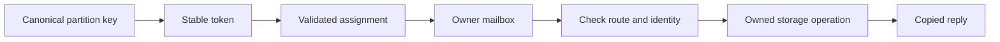

# Feature 05: Shard ownership và async scheduling

## UC-01: Request thuộc shard nào và ai được sửa state?

### 1. Vấn đề và kết quả

Một node có nhiều shard nhưng chỉ một shard sở hữu một partition.
Nếu request được xử lý bởi goroutine bất kỳ, memtable vẫn là shared state.
Chia tên shard mà không giới hạn quyền truy cập chưa tạo shared-nothing.

UC này xác định owner và ranh giới truy cập storage.
Output là một route có node, shard, token và phiên bản assignment.
Đây là thiết kế chi tiết chưa triển khai; API dưới đây là đề xuất.

### 2. Ví dụ: request đến nhầm shard

Node A có assignment minh hoạ:

| Range token | Owner |
| --- | --- |
| [0, 50) | A/0 |
| [50, 100) | A/1 |

Các token nhỏ chỉ để minh hoạ; runtime dùng miền token của Feature 01.

```text
customer C123 -> token 72
shard nhận request: A/0
shard sở hữu partition: A/1
kết quả: enqueue vào A/1, không đọc state của A/1 tại A/0
```

Clustering key khác nhau không đổi route của C123.
Hai partition trùng token cùng vào A/1 nhưng vẫn có RowIdentity riêng.

### 3. Input và API đề xuất

```go
type ShardRoute struct {
    NodeID     string
    ShardID    uint32
    Token      uint64
    Assignment uint64
}

type ShardRouter interface {
    Resolve(table string, partitionKey []byte) (ShardRoute, error)
}
```

`table` chọn schema/encoding key trước khi băm.
`partitionKey` là canonical encoding từ Feature 01.
`Assignment` là version cấu hình cố định của runtime, chưa phải tablet epoch.
`ShardRoute` là snapshot; caller không sửa được registry nội bộ.

Không băm clustering key để chọn shard.
Không dùng địa chỉ con trỏ hoặc Go map iteration làm input routing.

### 4. Một nguồn sự thật cho assignment

Runtime tạo assignment trước khi mở storage hoặc nhận request.
Mọi token được phủ đúng một lần trong mỗi node có replica liên quan.
Range không overlap, không có gap và shard ID phải tồn tại.

Ở F05, assignment không thay đổi trong lifetime node.
Đổi shard count yêu cầu công cụ migration tương lai hoặc kho dữ liệu mới.
Không tự đổi `token % shardCount` trên dữ liệu đang tồn tại.

F06 chọn replica node trước, rồi resolve shard trong từng node.
F09 thay lookup bằng replica location từ tablet map có epoch.
Khi F09 bật, không chạy thêm modulo để ghi đè shard được map chỉ ra.

### 5. Storage ownership

```text
Owner A/1 owns:
  active memtable
  frozen memtable registry
  commitlog append state
  SSTable manifest and read pins
  row reconciliation state

Caller owns:
  request payload before Submit
  copied result after completion
```

Một storage handle chỉ tồn tại trong owner loop.
Interface bên ngoài chỉ nhận message, không export pointer tới map/tree.
Reply chứa bản sao row bytes và metadata.

Worker I/O có thể đọc immutable flush snapshot.
Worker gửi completion về owner; owner mới cập nhật manifest.
Snapshot còn pinned thì không được reuse backing array.

### 6. Luồng xử lý



```text
dispatch(request):
    key = canonicalize(request.partitionKey)
    route = router.resolve(request.table, key)
    envelope = copyPayloadAndAttachRoute(request, route)
    return mailbox[route.ShardID].submit(envelope)

ownerHandle(envelope):
    require envelope.route.assignment == activeAssignment
    require resolve(envelope.row.partitionKey) == thisOwner
    execute local storage operation
    reply with copied result
```

Validation lặp ở owner bắt lỗi route giả/mất đồng bộ.
Nó không tạo vòng forward vô hạn giữa hai shard.

### 7. Mutation và durability không thay đổi

Mutation giữ ID, RowIdentity, Version, Kind, Value và ExpiresAt.
Route không được tạo version mới hoặc đổi absolute expiry.

Write ACK vẫn yêu cầu commitlog fsync và memtable apply.
Cancellation sau durable append không phải yêu cầu rollback.
Kết quả chưa rõ được retry bằng cùng mutation ID và nội dung.

Local append sequence chỉ dùng cho log của owner đó.
Nó không phải version toàn cục để so với shard/node khác.

### 8. Invariants cần giữ

- Mỗi partition tại một replica node có đúng một owner.
- Mỗi state mutable chỉ bị sửa bởi owner goroutine.
- Mọi row trong partition dùng cùng route.
- Caller không giữ buffer mutable dùng bên trong storage.
- Worker không publish manifest trực tiếp.
- Assignment không đổi trong khi có state đang phục vụ.
- Sai owner bị reject trước storage mutation.
- Copy read result không cho caller sửa memtable.

Invariant ownership bao gồm cả background flush completion.
Chỉ kiểm tra đường write công khai là chưa đủ.

### 9. Validation và lỗi

| Tình huống | Output | Storage effect |
| --- | --- | --- |
| Key sai encoding | InvalidKey | Không |
| Range overlap/gap | InvalidAssignment lúc startup | Không mở phục vụ |
| Shard ID không tồn tại | InvalidAssignment | Không |
| Route gửi sai shard | WrongOwner kèm route hiện tại | Không |
| Assignment cũ | StaleAssignment | Không |
| Owner đang shutdown | ShardUnavailable | Không nhận việc mới |
| I/O worker fail | StorageError có owner context | Theo contract F02 |
| Caller cancel sau append | OutcomeUnknown nếu chưa có ACK | Có thể durable |

Lỗi không được fallback sang shard khác và tạo bản sao ngầm.
Retry routing lỗi cấu hình không giải quyết được bằng tăng consistency level.

### 10. Tests và output dự kiến

```text
Case: token 49, 50, 99
Expected: A/0, A/1, A/1

Case: 100 clustering keys cùng partition C123
Expected: 100 routes đều A/1

Case: submit token 72 trực tiếp A/0
Expected: WrongOwner; append_count[A/0] = 0

Case: sửa []byte reply
Expected: lần read kế tiếp trả bytes ban đầu
```

Test collision dùng hai key khác nhau có token test bằng nhau.
Expected: cùng owner, hai identity và hai value độc lập.

Test completion I/O chạy ngoài owner loop.
Expected: completion được enqueue, manifest chỉ đổi khi owner nhận nó.

Chạy race detector trên concurrent submissions khi có implementation.
Race detector là hỗ trợ; assertion quyền owner mới kiểm tra contract.

### 11. Chi phí, phụ thuộc và phạm vi

Lookup range sorted tốn O(log S), S là số range của node.
Copy payload tốn O(bytes); không tuyên bố “zero-copy” ở boundary này.
Registry owner tốn O(số shard), state storage tính riêng.

Phụ thuộc [F01 routing](../feature-01/02-static-token-routing.md) và F02–04.
[UC-02](02-bounded-asynchronous-mailbox.md) giới hạn admission.
[UC-03](03-cross-shard-request.md) quản lý reply/cancellation.

Không CPU affinity, dynamic owner remap hoặc distributed transport.
Không tự tối ưu hot partition bằng cách xé rows sang nhiều shard.
