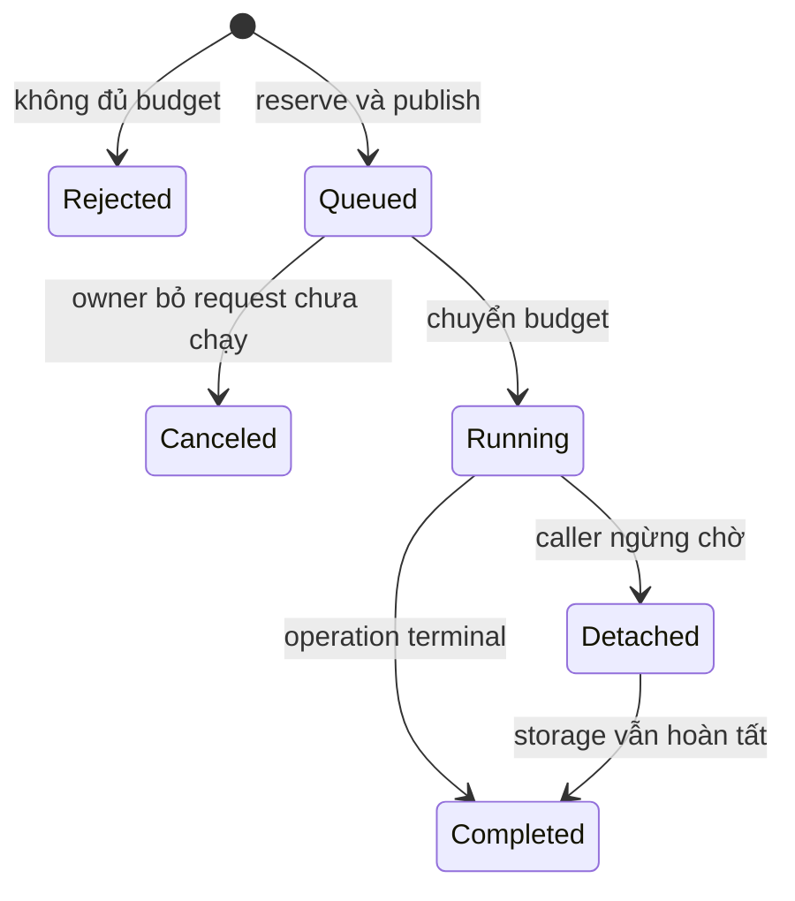

# Feature 05: Shard ownership và async scheduling

## UC-02: Khi owner bận, giữ bao nhiêu request trong bộ nhớ?

### 1. Vấn đề và output

Một channel có capacity 64 chỉ chặn số message.
64 request, mỗi request 100 MiB, vẫn có thể làm process hết memory.
Ngược lại, byte limit lớn có thể chứa hàng triệu message rỗng.

UC này đặt cả count limit lẫn byte limit cho admission.
Output là ticket đã nhận hoặc lỗi overload trước khi nhận.
Đây là thiết kế chi tiết chưa triển khai, không phải mailbox có sẵn.

### 2. Ví dụ cụ thể

```text
QueueMaxCount = 4
QueueMaxBytes = 1024
MaxRequestBytes = 512

q1=300 bytes, q2=300 bytes, q3=300 bytes
queue_count = 3
queue_bytes = 900

submit q4=200 -> Overloaded(bytes)
submit q5=100 -> accepted
submit q6=1   -> Overloaded(count)
```

Byte charge bao gồm encoded request và envelope overhead cấu hình.
Các số ví dụ đã tính charge, không chỉ tính Value length.

Count và byte reservation phải xảy ra nguyên tử.
Hai submit đồng thời không được cùng nhìn thấy chỗ trống cuối cùng.

### 3. API và cấu hình đề xuất

```go
type MailboxLimits struct {
    QueueCount      int
    QueueBytes      int64
    MaxRequestBytes int64
    InFlightCount   int
    InFlightBytes   int64
    MaxReplyBytes   int64
}

type Ticket struct {
    RequestID string
    Done      <-chan Reply
}

Submit(ctx context.Context, request Request) (Ticket, error)
```

`Queue*` tính request còn đang đợi owner.
`InFlight*` tính request đã dequeue nhưng chưa terminal.
`MaxReplyBytes` áp dụng cho read có limit từ Feature 01.

Tách queue khỏi in-flight để dequeue không che mất memory đang giữ.
Tổng retained memory còn gồm reply và worker snapshot budget riêng.

### 4. Admission không tạo hàng đợi ngầm

`Submit` dùng fail-fast admission.
Nếu thiếu budget, trả Overloaded, không spawn goroutine chờ slot.
Caller muốn retry phải tự backoff trong deadline hữu hạn.

Trình tự:

```text
validate shape and declared encoded size
reject if request > MaxRequestBytes
atomically reserve queue count and byte charge
copy payload into reserved envelope
publish envelope into mailbox
return ticket
```

Copy fail hoặc cancellation trước publish trả lại reservation.
Sau publish, ownership envelope thuộc mailbox.
Caller có thể sửa buffer input mà không đổi request đã nhận.

### 5. State machine



Detached không phải storage rollback.
Ticket có đúng một terminal result phía caller.
Reply nội bộ đến muộn được thu hồi trong lifetime đã đặt.

### 6. Dequeue và budget transfer

Owner chỉ dequeue khi có đủ in-flight count/bytes.
Transfer queue -> in-flight diễn ra cùng một critical section.
Không nhả queue budget rồi nhận operation khi in-flight đã đầy.

```text
takeNext():
    lock accounting
    e = peek queue
    if no inFlightCapacity(e.charge): return none
    remove e
    queueCount -= 1; queueBytes -= e.charge
    inFlightCount += 1; inFlightBytes += e.charge
    unlock
    return e

finish(e):
    release in-flight reservation exactly once
    deliver reply or discard if caller detached
```

Storage owner không chờ một reply consumer đọc channel.
Reply channel capacity 1 hoặc completion registry tương đương.

### 7. Cancellation và deadline

Queued request đã cancel có thể bị bỏ trước append.
Cancellation phải release reservation và tạo terminal outcome.
Running read có thể dừng tại điểm kiểm tra context an toàn.

Running write đã durable vẫn được apply/recover.
Timeout sau dispatch được báo outcome chưa chắc chắn.
Retry giữ nguyên mutation ID, Version và ExpiresAt.

Không giữ goroutine vô hạn chỉ vì caller bỏ ticket.
Internal operation deadline và shutdown drain có giới hạn rõ.
Không biến deadline thành bằng chứng write chưa xảy ra.

### 8. Invariants

- QueueCount và QueueBytes không vượt cấu hình.
- InFlightCount và InFlightBytes được tính riêng.
- Mỗi reservation được release đúng một lần.
- Request bị reject chưa vào storage path.
- Mọi accepted payload được copy hoặc có ownership độc quyền.
- Consumer chậm không chặn owner gửi reply.
- Cancel không làm giảm counter hai lần.
- Durable write không bị undo để khớp caller timeout.

Read output lớn hơn budget trả ResultTooLarge.
Không serialize output vô hạn rồi mới kiểm tra MaxReplyBytes.

### 9. Failure table

| Tình huống | Kết quả | Counter cuối |
| --- | --- | --- |
| Request vượt max size | RequestTooLarge | Không đổi |
| Queue đầy count | Overloaded(count) | Không đổi |
| Queue đầy byte | Overloaded(bytes) | Không đổi |
| Cancel trước publish | CanceledNotAdmitted | Reservation trả lại |
| Cancel khi queued | CanceledBeforeExecution | Queue giảm một |
| Cancel khi write chạy | OutcomeUnknown nếu chưa xác nhận | In-flight giữ đến terminal |
| Copy allocation fail | AdmissionFailed | Reservation trả lại |
| Owner shutdown | ShardUnavailable | Drain hoặc reject rõ |
| Reply consumer biến mất | Discard late reply | Không leak ticket |

Không thể giải phóng payload đang được I/O worker sử dụng.
Shutdown phải đợi completion hoặc giữ storage unavailable đến replay.

### 10. Tests với kết quả dự kiến

```text
Given limits count=4, bytes=1024
Submit charges 300,300,300,200
Expected accepted=3, rejected_bytes=1, queue_bytes=900

Given queue_count=4 and byte capacity còn
Submit charge=1
Expected Overloaded(count)

Cancel một queued request hai lần
Expected reservation release count=1
```

Stress 100 producers tranh một slot.
Expected: đúng một accepted; không counter âm hoặc vượt limit.

Pause disk worker rồi submit tiếp.
Expected: in-flight bytes vẫn hiển thị, queue đầy thì reject.

Caller timeout ngay sau fsync, trước reply.
Expected: restart đọc được mutation; mọi counter trở lại zero sau drain.

### 11. Cost, dependency và ngoài phạm vi

Admission có O(1) accounting cộng O(payload bytes) để copy.
Capacity phải nhỏ đủ để backlog deadline có ý nghĩa.
Queue sâu tăng chờ; nó không tăng throughput của owner.

Phụ thuộc [UC-01 ownership](01-shard-routing-and-ownership.md).
[UC-03](03-cross-shard-request.md) dùng ticket cho forwarding.
[UC-04](04-hot-shard-experiment.md) đo overload và latency.

Không unbounded retries, priority scheduling hoặc fairness theo tenant.
Không coi queue bytes là toàn bộ RSS của process.
