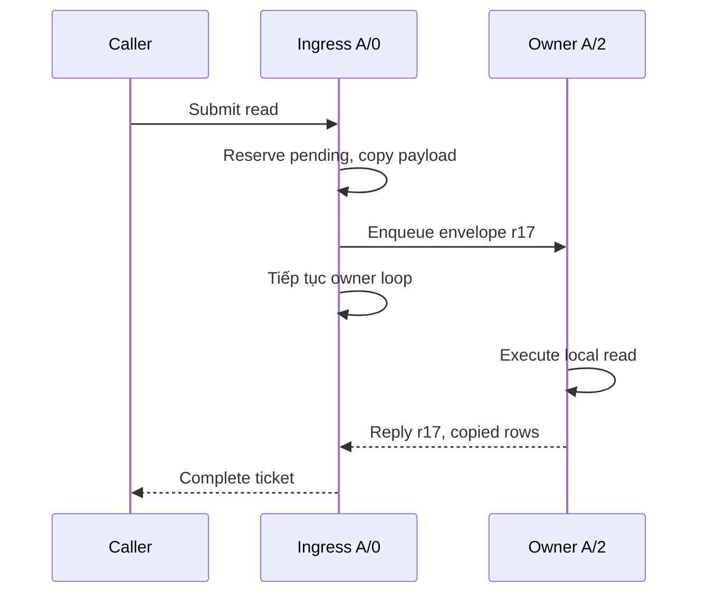

# Feature 05: Shard ownership và async scheduling

## UC-03: Một shard nhờ shard khác xử lý request thế nào?

### 1. Vấn đề và output

Shard nhận request không nhất thiết sở hữu partition.
Giữ lock rồi gọi storage shard khác có thể gây deadlock.
Trả reference vào memtable shard khác lại phá ownership.

UC này gửi một envelope và ghép đúng một reply với request.
Output là copied result hoặc terminal error cho caller.
Đây là thiết kế chi tiết chưa triển khai.

### 2. Ví dụ end-to-end

```text
Client gọi read(customer=C123, limit=2)
Ingress: A/0
Route:   A/2

A/0 -> envelope request=r17 -> mailbox A/2
A/2 -> đọc đúng partition -> reply r17
A/0 -> complete caller ticket
```

A/0 không được đợi đồng bộ ngay trong owner loop.
Nếu A/2 cần gửi completion tới A/0, loop bị block sẽ không nhận được.
Pending registry giữ continuation; loop vẫn xử lý message khác.

### 3. Envelope đề xuất

```go
type Envelope struct {
    RequestID string
    Origin    OwnerID
    Target    OwnerID
    Route     ShardRoute
    Deadline  int64
    Payload   Request
}

type Reply struct {
    RequestID string
    Value     Result
    Err       error
}
```

`RequestID` chỉ dùng correlation trong một runtime lifetime.
Nó khác mutation ID: retry cùng mutation có thể có request ID mới.
`Deadline` có đơn vị thống nhất; TTL của dữ liệu dùng ExpiresAt riêng.

Payload chứa value-copy và bytes đã copy.
Không chứa function closure truy cập state owner khác.
Không truyền storage handle, map pointer hoặc iterator mutable.

### 4. Registry pending

```text
pending[r17] = {
  caller completion slot,
  target A/2,
  operation deadline,
  reserved reply budget
}
```

Số pending và tổng byte được giới hạn.
Đăng ký pending trước enqueue để reply nhanh không bị thất lạc.
Enqueue thất bại thì xoá pending và release budget.

Request ID unique trong runtime, có generation sau restart.
Reply ID không tồn tại bị drop và tăng orphan_reply_count.
Nó không được gán cho một request mới tình cờ reuse ID.

### 5. Luồng bất đồng bộ



Không cần thread dành riêng cho mỗi request.
Worker pool, queue và pending registry đều có cấu hình hữu hạn.

### 6. Pseudocode

```text
forward(request):
    route = resolve(request)
    slot = pending.reserve(newRequestID(), deadline)
    if slot failed: return Overloaded
    envelope = ownedCopy(request, route, slot.id)
    err = targetMailbox.trySubmit(envelope)
    if err:
        pending.completeAndRelease(slot.id, err)
    return slot.ticket

onReply(reply):
    slot = pending.takeIfOpen(reply.requestID)
    if slot missing:
        release reply payload
        count late_or_duplicate_reply
        return
    slot.complete(copiedResult(reply))
    release pending reservation
```

`takeIfOpen` là transition terminal nguyên tử.
Reply và timeout tranh nhau chỉ một bên thắng.

### 7. Timeout và late response

Caller timeout đóng ticket và bỏ pending caller state.
Storage đã nhận operation có lifecycle riêng tới terminal.
Completion đến muộn phải release buffer ngay, không restart pending.

Timeout read không cần undo.
Timeout write có thể đã append/fsync/apply trên target.
Báo OutcomeUnknown nếu không chứng minh chưa admit.

Retry cùng mutation ID/version/expiry cho phép dedup ở storage.
Không tuyên bố exactly-once execution vì request có thể chạy lại.
Contract là deterministic mutation và một terminal reply mỗi ticket.

### 8. Tránh cycle và deadlock

Owner loop không block khi gửi sang một mailbox đầy.
TrySubmit trả overload, caller quyết định retry trong deadline.

Không cho phép request chứa chuỗi forward vô hạn.
F05 resolve một target cuối; target mismatch trả WrongOwner.
Sau này F09 cho refresh epoch với số lần retry hữu hạn.

Completion cần lane/budget riêng hoặc reserved slot trước dispatch.
Nếu completion chen cùng queue đã đầy, protocol vẫn phải có cách drain.
Không giữ mutation-state lock trong lúc enqueue hay chờ result.

### 9. Invariants và lỗi

- Target kiểm tra ownership trước storage access.
- Mỗi pending slot có đúng một transition terminal.
- Reply ID không match không tác động request khác.
- Caller cancellation không undo durable mutation.
- Buffer qua boundary không còn mutable alias.
- Queue đầy không block owner loop vô hạn.
- Pending và late-response lifetime đều hữu hạn.

| Failure | Output phía caller | Tác động |
| --- | --- | --- |
| Reserve pending fail | Overloaded | Chưa dispatch |
| Target mailbox đầy | Overloaded | Release pending |
| Wrong target | WrongOwner | Không mutate |
| Target disk fail | StorageError/Unknown | Theo F02 |
| Caller timeout | DeadlineExceeded/Unknown | Target có thể hoàn tất |
| Duplicate reply | Không reply lần hai | Drop, count |
| Unknown reply ID | Không ảnh hưởng request đang chờ | Drop |
| Target shutdown | Unavailable hoặc Unknown | Tuỳ đã admit |

### 10. Tests và expected output

```text
forward r17 A/0 -> A/2
Expected: storage_calls[A/0]=0, storage_calls[A/2]=1

reply r17 hai lần
Expected: caller_completions=1, duplicate_or_late=1

timeout r17 rồi reply r17
Expected: caller giữ timeout, pending_count=0

caller sửa Value sau submit
Expected: target thấy Value tại lúc submit
```

Test hai owner đồng thời forward cho nhau.
Expected: cả hai completion đến trong deadline; không owner-loop deadlock.

Test target durable write trước timeout.
Expected: retry cùng mutation ID không tạo version mới;
restart vẫn thấy mutation và không có thông báo rollback.

### 11. Chi phí và phạm vi

Mỗi request có envelope, pending slot và tối đa một reply buffer.
Copy hai boundary tốn O(input bytes + output bytes).
Số in-flight lớn làm tăng registry, nên limit độc lập với mailbox.

Phụ thuộc [UC-01](01-shard-routing-and-ownership.md) và
[UC-02](02-bounded-asynchronous-mailbox.md).
F06 có thể bọc transport này để fan-out replica trong mô hình học tập.

Không network RPC production, retry vô hạn hoặc actor migration.
Không truyền closure tuỳ ý giữa owner để lách storage interface.
