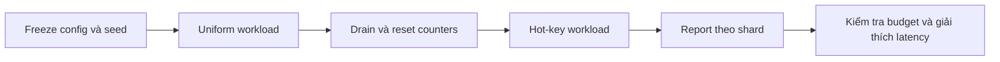

# Feature 05: Shard ownership và async scheduling

## UC-04: Tải lệch làm một shard chậm đi như thế nào?

### 1. Câu hỏi và output

Latency trung bình toàn node có thể che một shard đã đầy queue.
Cần phân biệt request đang chờ owner với operation thực sự chạy chậm.

UC này tạo workload có kiểm soát và báo số đo theo shard.
Output gồm cấu hình, route distribution, latency và overload counters.
Đây là kế hoạch thí nghiệm chưa chạy, không phải kết quả benchmark.

### 2. Hai workload có cùng offered load

```text
Runtime: node A, 4 shard, cùng queue/disk configuration
Run U: 1000 partition keys phân bố đều
Run H: 80% request vào partition C123 trên shard 2
       20% request phân bố các key còn lại

Mỗi run:
  warmup 10 s
  đo 30 s
  drain đến deadline
```

Các khoảng thời gian là config ví dụ, không là target production.
Dùng cùng seed, payload size, write/read ratio và offered rate.

Hot partition không đồng nghĩa wide partition.
C123 có thể chỉ một row nhưng nhận rất nhiều lần update.

### 3. API thí nghiệm đề xuất

```go
type ShardExperiment struct {
    Seed             int64
    OfferedPerSecond int
    DurationSeconds  int
    PayloadBytes     int
    HotKeyFraction   float64
    MaxOutstanding   int
}

RunShardExperiment(cfg ShardExperiment) (ShardReport, error)
```

`OfferedPerSecond` là rate muốn gửi, không phải throughput thành công.
`MaxOutstanding` giới hạn generator để nó không là nguồn OOM.
Generator bị limit phải ghi số operation chưa phát được.

`HotKeyFraction` nằm trong [0,1].
Report lưu assignment fingerprint để giải thích key thực sự vào shard nào.

### 4. Timestamps và các loại latency

```text
t0: generator định gửi
t1: request được submit
t2: mailbox accepted
t3: owner bắt đầu operation
t4: operation storage terminal
t5: caller nhận result
```

| Số đo | Công thức | Ý nghĩa |
| --- | --- | --- |
| Generator lag | t1 - t0 | Generator không theo kịp |
| Queue wait | t3 - t2 | Chờ owner |
| Service | t4 - t3 | Storage/worker thực thi |
| Caller latency | t5 - t1 | Caller thật sự trải qua |
| End-to-end planned | t5 - t0 | Bao gồm generator lag |

Dùng monotonic clock cho durations.
Không trừ wall clock hai node để suy ra latency.
Timeout và reject có histogram/counter riêng.

### 5. Instrumentation theo shard

Mỗi shard xuất:

```text
accepted_total
completed_success_total
overloaded_count_total
overloaded_bytes_total
timeout_total
queue_count_current / queue_count_max
queue_bytes_current / queue_bytes_max
in_flight_count / in_flight_bytes
queue_wait_p50,p95,p99
service_p50,p95,p99
caller_latency_p50,p95,p99
```

Queue gauge ghi tại transition enqueue/dequeue.
Sampling mỗi giây có thể bỏ lỡ đỉnh, nên max ghi trực tiếp khi reserve.

Không giữ label cho từng mutation/request ID.
Nếu cần top partition, dùng top-K giới hạn và key hash an toàn.

### 6. Luồng chạy



Reset chỉ metrics thí nghiệm khi không còn request của run trước.
Storage baseline được tạo lại hoặc reuse có mô tả rõ.
Không so run cold-cache với run warm-cache mà giấu khác biệt.

### 7. Pseudocode

```text
runExperiment(cfg):
    validate(cfg)
    freeze assignment, storage config and queue limits
    for mode in [uniform, hot]:
        prepare identical baseline
        warm up with bounded generator
        reset metrics after drain
        for scheduled tick until measurementEnd:
            if generator at outstanding limit:
                record generator_limited
                continue
            submit deterministicKey(mode, cfg.seed)
        stop new submissions
        drain accepted requests to deadline
        capture per-shard metrics and unresolved operations
    return report with raw counts and percentile sample counts
```

Mọi request có mutation ID riêng trừ retry có chủ đích.
Retry không làm inflated count “user write mới”.

### 8. Cách đọc kết quả

Ví dụ giả định để giải thích report:

| Run/shard | Queue p95 | Service p95 | Reject |
| --- | --- | --- | --- |
| U / shard 2 | 1 ms | 2 ms | 0 |
| H / shard 2 | 30 ms | 2 ms | 200 |
| H / shard 0 | 1 ms | 2 ms | 0 |

Nếu service gần như không đổi nhưng queue wait tăng, bằng chứng ủng hộ
nghẽn admission/owner vì tải tập trung.
Nếu service cùng tăng ở mọi shard, kiểm tra disk/worker pool chung.

Không dùng các số minh hoạ làm expected benchmark.
Không kết luận “thêm shard chắc chắn chữa hot key”.
Một partition vẫn thuộc một owner.

### 9. Invariants và failure table

Tổng offered = submitted + generator-limited.
Tổng submitted = accepted + rejected-before-admission.
Accepted = terminal + còn unresolved tại cuối report.
Không bỏ timeout khỏi mẫu rồi chỉ công bố success latency.

| Failure | Report bắt buộc |
| --- | --- |
| Generator không theo kịp | lag và generator_limited |
| Queue overload | reason count/bytes và shard |
| Disk failure | error count, run không đạt baseline |
| Drain deadline | unresolved count, không claim leak-free |
| Histogram không có mẫu | N/A, không ghi 0 ms |
| Assignment đổi giữa run | InvalidExperiment |
| Counter reset khi còn pending | InvalidExperiment |
| RSS vượt queue budget | Phân tích budget khác, không che số |

### 10. Tests của harness

```text
Seed cố định + assignment cố định
Expected: cùng key sequence và target counts

100 requests, 80 vào C123 trên shard 2
Expected: shard 2 nhận ít nhất 80 requests

Queue byte limit=1024, disk worker bị pause
Expected: queue_bytes_max <= 1024, có overload

Một request timeout
Expected: timeout_total=1, không counted success
```

Dùng fake monotonic clock để test queue wait/service subtraction.
Expected: t2=10,t3=20,t4=25 cho queue=10, service=5.

Percentile test dùng tập mẫu [1,2,3,4,100] với convention đã ghi.
Expected nearest-rank p95=100; không trung bình các p95 shard.

### 11. Chi phí, dependency và scope

Histogram/counters giới hạn memory theo số shard.
Raw event trace chỉ bật với cap; report ghi số event bị drop.
Instrumentation có overhead nên giữ cùng mức giữa các run.

Phụ thuộc ba UC trước và F01 hot-partition diagnostics.
Không so hiệu năng trực tiếp với ScyllaDB production.
Không tự thay placement, split partition hoặc autoscale sau report.
