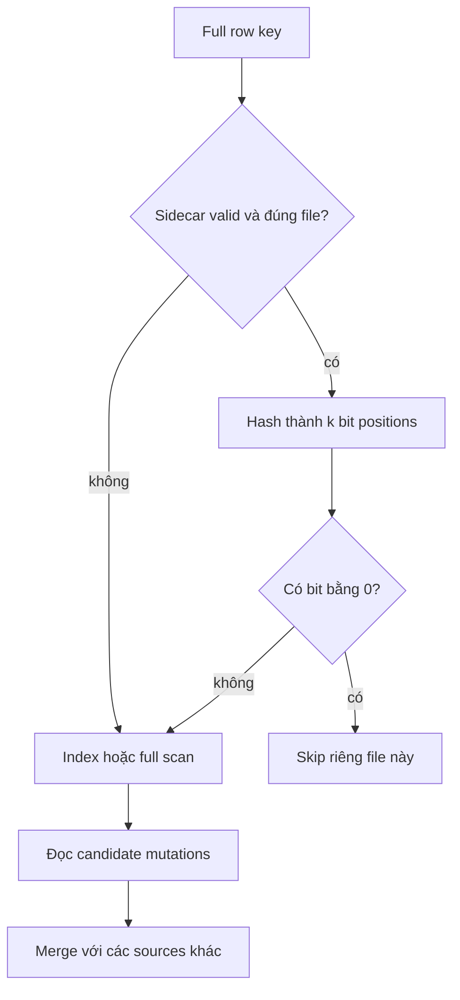

# Feature 07: Bloom filters, indexes và cache

## UC-01: Bỏ qua SSTable nào khi tìm đúng một row?

### 1. Bài toán và output

Reader đã biết merge versions đúng, nhưng một key không tồn tại vẫn khiến nó
mở mọi SSTable. Bloom filter trả lời câu hỏi rẻ hơn: file này chắc chắn không
có key, hay có thể có và cần đọc tiếp?

Output là một Bloom sidecar cho mỗi SSTable và quyết định
`DefinitelyAbsent` hoặc `MayContain` cho full row key.
Không có quyết định `DefinitelyPresent`.

Đây là thiết kế chi tiết **chưa triển khai**. Types, format và tests dưới đây
là contract đề xuất cho lab; chưa có số đo hoặc source implementation.

### 2. Ví dụ: delete cũng là một key cần đưa vào filter

Tất cả rows dưới đây thuộc table `orders`, partition `customer-42`.

| File | Clustering key | Mutation | Trạng thái tại ReadAt=300 |
| --- | --- | --- | --- |
| A | order-9 | Upsert logical=10, value=paid | live nếu xét riêng A |
| B | order-9 | Delete logical=12 | absent |
| B | order-10 | Upsert logical=15, ExpiresAt=250 | expired |
| C | order-11 | Upsert logical=16, value=new | live |

Build filter:

```text
Bloom(A) = add canonical(orders, customer-42, order-9)
Bloom(B) = add canonical(orders, customer-42, order-9)
           add canonical(orders, customer-42, order-10)
Bloom(C) = add canonical(orders, customer-42, order-11)
```

Read order-9 phải lấy candidates từ A và B, rồi merge ra delete 12.
Nếu builder chỉ thêm live values, B có thể trả negative và upsert 10 sống lại.
Read order-10 vẫn phải thấy expired winner 15 để che version cũ ở file khác.

Read order-99 có thể nhận negative từ cả ba file và không mở data file nào.
Nếu hash collision làm B positive, reader mở B, tìm không thấy rồi trả absent.
False positive tốn I/O nhưng không thay đổi kết quả.

### 3. Key identity và granularity

Filter này dùng **full row key**, không dùng partition-only key:

```text
CanonicalRowKey = Encode(table, partition-components, clustering-components)
```

Codec là codec có version của Feature 01, có type/length boundaries.
Không dùng `table + ":" + partition + ":" + clustering`, vì dữ liệu có thể
chứa dấu `:` và tạo hai logical keys có cùng bytes.

Bloom, sparse index và data reader phải dùng cùng codec version.
Table khác nhưng cùng partition/clustering vẫn là hai keys khác nhau.
Hai versions của cùng row thêm cùng bytes; duplicate insert không gây lỗi.

Một partition scan hoặc clustering range không biết trước toàn bộ full keys.
Không query Bloom bằng partition prefix, endpoint hoặc token rồi suy ra
range empty. Range reads đi qua ordered index/bounds của UC-02.

### 4. Model và API đề xuất

```go
type BloomHeader struct {
    FileID        string
    DataChecksum  []byte
    FormatVersion uint32
    KeyCodec      uint32
    HashVersion   uint32
    HashSeed      uint64
    BitCount      uint64
    HashCount     uint32
    DistinctKeys  uint64
}

type Membership uint8
const (
    DefinitelyAbsent Membership = iota
    MayContain
)

func BuildBloom(rows SortedMutationStream, cfg BloomConfig) (BloomFile, error)
func ProbeBloom(filter ValidatedBloom, key CanonicalRowKey) Membership
```

`FileID` và `DataChecksum` bind sidecar với đúng immutable data file.
`FormatVersion`, codec và hash version cho biết cách giải mã/probe.
`BitCount` là số bit, không phải bytes; `HashCount` là số positions/query.
`DistinctKeys` đếm row identities, gồm delete và expired rows.
`ValidatedBloom` chỉ được tạo sau khi kiểm tra header, payload và checksum.

Public reader còn cần trạng thái `Unavailable(reason)` khi sidecar thiếu/hỏng.
Trạng thái này đi vào đường scan/index bình thường; không biến thành negative.

### 5. Chọn kích thước có giới hạn

Với n distinct keys và false-positive target p:

```text
m = ceil(-n * ln(p) / (ln(2)^2)) bits
k = round((m / n) * ln(2))
```

Ví dụ n=10,000, p=0.01 cần khoảng 95,851 bits, tức khoảng 11,982 bytes,
và k xấp xỉ 7. Đây là sizing lý thuyết, không phải kết quả benchmark.

Validate `0 < p < 1`, giới hạn m và k, kiểm tra overflow khi đổi sang bytes.
Nếu budget không đủ, bỏ filter cho file đó và ghi reason; không xây filter
chỉ cho một phần keys. Cấu hình invalid trả error trước flush/compaction.

Đối với n=0, data file hợp lệ không có rows có thể dùng empty marker đã
validate. Không dùng `BitCount=0` như filter thường vì modulo zero.

### 6. Build và publication

Builder nhận row groups sorted từ cùng pipeline ghi SSTable:

```text
validate config and canonical key codec
count distinct row keys using sorted groups or trusted writer count
allocate bounded bitset
for each complete row group written:
    derive canonical full key
    compute k positions using fixed versioned hash
    set every corresponding bit
write header, bitset, checksum into temporary sidecar
reopen and validate sidecar against completed data file
publish data + sidecars through Feature 03 manifest transaction
```

Nếu cần hai passes để biết n, cả hai dùng cùng immutable input snapshot.
Không count một snapshot rồi build trên memtable đang thay đổi.
Compaction tạo FileID mới, do đó xây filter mới từ rows thật của outputs.
Không copy filter cũ sang output có file identity khác.

### 7. Probe và fallback



Một negative chỉ bỏ file đã probe; nó không bỏ memtable hoặc SSTable khác.
Bloom positive không cho phép return sớm: một file khác có thể chứa winner.
Reader giữ file pin trong suốt lookup để filter/data không bị retire giữa chừng.

### 8. Boundaries và failure behavior

| Tình huống | Hành vi yêu cầu |
| --- | --- |
| Sidecar thiếu | fallback và tăng missing-filter counter |
| Checksum/header sai | fallback và tăng invalid-filter counter |
| Codec/hash version lạ | coi unavailable, không probe đoán |
| Sidecar thuộc FileID khác | fallback, không dùng bitset |
| Data checksum/record hỏng | trả contextual corruption error |
| Cancel trong build | bỏ output chưa publish, giữ inputs |
| Budget thiếu | bỏ optimization cho toàn file |

Checksum metadata có thể phát hiện truncation/bit flip theo fault model của
lab; không tuyên bố chống adversarial tampering. Khi data intact, missing
optimization chỉ làm read chậm. Khi data hỏng, không trả absent giả.

### 9. Invariants và acceptance tests

**A. Không false negative:** sinh 1,000 full keys có seed cố định, gồm live,
delete, expired và nhiều versions. Sau serialize/reopen, probe mọi key đã
ghi đều là MayContain. Test chạy trên cả flush outputs và compacted outputs.

**B. Không resurrect:** A có upsert 10, B có delete 12 cho order-9. Bật filter
và tắt filter đều trả absent; trace chứng minh B không bị Bloom skip.

**C. Expiry evidence:** B có expired upsert 15, A có live upsert 9. Tại
ReadAt=300 output absent, winner vẫn là mutation 15 với ID/expiry nguyên vẹn.

**D. Identity:** keys `("a:b","c")` và `("a","b:c")`, hoặc hai tables khác,
encode khác nhau; inserted identities đều probe positive.

**E. Fallback:** flip một sidecar byte hoặc đổi FileID; query vẫn bằng full
scan khi data intact, invalid counter tăng. Flip data byte thì read error.

**F. Range:** query clustering interval có key ở giữa nhưng hai endpoints
không tồn tại. Range vẫn trả row đó; trace không có point-Bloom range skip.

**G. False positives:** measure positives trên absent-key set có seed;
báo observed rate, không assert bằng chính xác p. Correctness không phụ
thuộc một threshold xác suất trên một mẫu nhỏ.

### 10. Chi phí, dependencies và ngoài phạm vi

Build dùng O(n*k) hash/bit operations, probe O(k), bitset O(m) memory/disk.
Đếm n có thể thêm pass; metadata được load trong budget riêng, không giấu
trong row-cache budget. Counters gồm probes, negatives, positives, fallback
và filter bytes; UC-04 kết hợp với data I/O để đo lợi ích thực.

Dependency: Feature 01 codec, Feature 02 file format, Feature 03 atomic
publication/merge, Feature 04 tombstones. UC-02 xác minh positives.
Không có distributed filter, partition Bloom hay Bloom-based range pruning.
Không dùng filter để bỏ delete/expiry markers hoặc quyết định tombstone GC.
