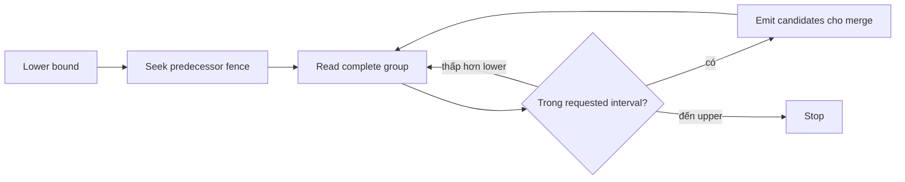

# Feature 07: Bloom filters, indexes và cache

## UC-02: Seek gần row cần đọc mà không bỏ sót version

### 1. Bài toán và output

Bloom positive mới chỉ nói file có thể chứa key. Quét từ byte 0 trên một file
lớn vẫn đắt. Sparse index giữ một số key và offset để reader nhảy tới vùng
có thể chứa target rồi scan một đoạn ngắn.

Output là row-group fences và lookup trả mọi mutations của target trong
một SSTable. Merge reader mới quyết định winner giữa các sources.

Đây là thiết kế **chưa triển khai**; offsets trong ví dụ là dữ liệu giả lập
để giải thích ownership, không phải layout đã tồn tại trong source.

### 2. Ví dụ: offset phải trỏ đầu row group

File có các full keys đã sort bằng codec Feature 01:

```text
key = (table=orders, partition=c42, clustering=order-NN)

offset   row group
0        order-01: Upsert v3
100      order-03: Upsert v4, Delete v6
260      order-05: Upsert v8
380      order-07: Upsert v2, Upsert v9 ExpiresAt=500
560      order-09: Upsert v10
700      EOF
```

Với stride=2 distinct row groups, index là:

| Fence key | Offset | Ý nghĩa |
| --- | --- | --- |
| order-01 | 0 | đầu group 0 |
| order-05 | 260 | đầu group 2 |
| order-09 | 560 | đầu group 4 |

Lookup order-07 chọn greatest fence <= order-07, tức order-05 tại 260.
Reader đọc group order-05, rồi **toàn bộ** group order-07 và dừng trước order-09.
Nó trả cả v2 và v9 cho reconciliation của Feature 03.

Tại ReadAt=600, winner v9 expired nên visible output absent.
Nếu reader trả v2 vì v9 hết hạn, đó là sai semantics dù index offset đúng.

### 3. Vì sao không đặt fence ở giữa các versions?

Giả sử order-03 gồm upsert ở offset 100, delete ở offset 180.
Fence `order-03 -> 180` có thể bỏ qua version mà reconciliation cần.
Ngược lại, một fence trỏ 100 nhưng stop tại 180 cũng làm thiếu delete.

Mỗi fence phải trỏ byte đầu của một **complete row group**. Một group chứa
tất cả mutations của cùng canonical key trong file, kể cả delete/expired.
Writer không cắt một group thành hai index blocks hoặc hai output files.

Lab có thể reconcile còn một winner/key lúc flush, nhưng index không dựa
vào giả định đó: input hợp lệ với nhiều versions vẫn phải đọc đủ group.
ID trùng nhưng nội dung khác là data inconsistency, không tự chọn một bản.

### 4. Model/API đề xuất

```go
type Fence struct {
    FirstKey CanonicalRowKey
    Offset   uint64
}

type SparseIndex struct {
    FileID       string
    DataChecksum []byte
    KeyCodec     uint32
    StrideRows   uint32
    DataSize     uint64
    FirstKey     CanonicalRowKey
    LastKey      CanonicalRowKey
    Fences       []Fence
}

type LookupSpan struct {
    Start uint64
    End   uint64
}

func PointSpan(index ValidatedIndex, key CanonicalRowKey) LookupSpan
func ReadKey(ctx Context, file PinnedFile, key CanonicalRowKey) ([]Mutation, error)
```

`StrideRows` đếm distinct key groups, không đếm individual mutations.
`FirstKey/LastKey` là min/max thật, tính trên cả tombstones và expired rows.
`End` là offset fence kế tiếp hoặc DataSize, và exclusive.
`LookupSpan` giới hạn khu vực data reader cần kiểm tra, không xác nhận key có.
`PinnedFile` giữ file descriptor/manifest reference sống suốt read.

### 5. Build từ chính data writer

Writer giữ `groupCount` và key/offset trước khi encode group:

```text
for each complete key group in canonical order:
    verify current key > previous group key
    if groupCount % stride == 0:
        append fence(current key, current byte offset)
    write full group with length and checksum framing
    update actual min/max key and data size
    groupCount++
validate completed index and bind it to completed data checksum
publish data and sidecars together
```

Stride phải >0; file size/offset conversions phải kiểm tra overflow.
Empty data file có empty fences và explicit empty marker.
Metadata counts không được lấy từ estimated output của compaction policy.
Rebuild index trên mỗi new SSTable; old offsets không dùng lại được sau merge.

### 6. Point lookup từng bước

```text
pin file from read snapshot
validate index identity, checksum, codec and structural bounds
if index unavailable:
    scan file from first complete group
else if key < FirstKey or key > LastKey:
    return no candidates for this file
else:
    i = last fence whose FirstKey <= key
    scan from fences[i].Offset up to next fence or EOF
    skip groups with group.key < key
    collect complete group when group.key == key
    stop when group.key > key
verify framing/checksums for data read
return candidate mutations, not final visible row
```

Vì first fence là minimum key, binary search không cần fallback về một
offset trước file. Target bằng fence phải bắt đầu đúng fence đó.
Target giữa order-07 và order-09 không có group: scan tới bound rồi absent.

### 7. Range read sử dụng index khác point read

Với interval `[order-03, order-08)`, seek predecessor của lower bound.
Ví dụ này bắt đầu từ order-01 tại 0, bỏ order-01, emit groups 03, 05, 07,
dừng khi thấy group >= order-08 hoặc EOF.

Không dừng tại fence kế tiếp như point span: range có thể qua nhiều blocks.
Partition bounds được encode từ canonical order có table; reader không
lọt sang partition kế tiếp hoặc table khác khi upper bound mở.



Bloom full-key của UC-01 không dùng cho range này. Hai endpoints absent
không chứng minh keys giữa chúng absent.

### 8. Index lỗi và data lỗi khác nhau

Validate fences strictly increasing theo key và offset, offset trong data,
first fence ở group đầu, checksum/codec/file identity đúng.
Việc xác nhận fence trỏ đúng group được writer validator kiểm tra trước
publish; loader không tin sidecar chưa qua integrity validation.

| Failure | Cách xử lý |
| --- | --- |
| index thiếu/truncated/checksum sai | scan data từ đầu, ghi fallback reason |
| offset vượt EOF hoặc duplicate fence | index unavailable, scan fallback |
| codec version unsupported | bỏ index; data codec vẫn phải supported |
| read group checksum sai | corruption error, không kết luận absent |
| I/O error hoặc cancellation | trả error và release pin |
| một row group quá giới hạn | explicit oversized-group error |

Nếu data codec cũng không supported, full scan không giải mã được: trả
unsupported-format error. Fallback không có nghĩa nuốt mọi lỗi.
Không partial-success cho query khi một candidate source bị data corruption.

### 9. Acceptance tests có expected output

**A. Seek:** fixture offsets ở mục 2, query order-07. Start=260, end=560;
candidate versions chính xác `[v2,v9]`, không chỉ version đầu.

**B. Equal fence:** query order-05 bắt đầu 260, trả v8. Query order-09 bắt
đầu 560 và đọc tới EOF, không bỏ last group.

**C. Missing/bounds:** order-00 và order-99 trả empty không data scan khi
index valid. order-06 trả empty sau scan predecessor block.

**D. Range:** `[order-03,order-08)` trả groups 03/05/07; upper exclusive,
giữ mọi versions và không truy vấn Bloom bằng endpoints.

**E. Delete và expiry:** order-03 merge ra delete 6; order-07 tại 600 absent
do winner 9 expired. Kết quả bằng full scan với cùng ReadAt.

**F. Corruption:** offset ngoài EOF và bad sidecar checksum đều fallback
ra đúng candidates. Bad data checksum khiến lookup trả corruption error.

**G. Boundary group:** tạo một group lớn hơn normal stride bytes nhưng
trong max-group limit; reader không cắt group dù scan bytes vượt mục tiêu.

**H. Compaction:** compact inputs, reopen new file/index rồi chạy mọi point
và range query; candidate reconciliation bằng reader trước compaction.

### 10. Chi phí và dependency

Với N groups, stride S, index giữ khoảng N/S fences.
Binary search O(log(N/S)), scan tối đa khoảng S groups cho point lookup;
bytes có thể lớn nếu một group/value lớn. Không hứa bounded bytes bằng S.
Range scan tỷ lệ với groups trong interval cộng phần seek dư.

Feature 01 cung cấp order/codec; Feature 02 cung cấp framing/checksum;
Feature 03 cung cấp pins và merge; Feature 04 quyết định visibility.
UC-01 giảm files cần lookup, UC-04 đo data bytes và index memory.
Không có B-tree mutable, multi-column secondary index hoặc predicate index.
Index không chọn winner và không bỏ tombstones để giảm kích thước.
