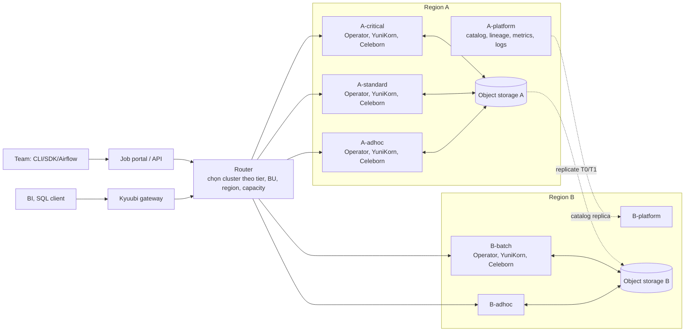

# Phase 3 — Enterprise: triển khai Spark trên Kubernetes

Tài liệu triển khai cụ thể cho Phase 3 trong
[scale-spark.md](../deployment/scale-spark.md). Phase trước:
[phase-2-growth.md](../growth/phase-2-growth.md). Lỗi vận hành ở quy mô này:
[issue/common-issues.md](./issue/common-issues.md).

Tài liệu chỉ giữ những gì **mới** so với Phase 1-2. Các thành phần cũ (Spark
Operator, YuniKorn, Argo CD, Iceberg, OpenCost, Prometheus/Loki…) vẫn dùng,
không nhắc lại cách cài.

## 1. Context

**Tình huống giả định** (thay bằng số thật của bạn):

| Mục | Giá trị |
|---|---|
| Tổ chức | 5 business unit (BU), 40+ team, ~400 người viết Spark |
| Platform org | ~20-25 người: compute, storage/lakehouse, observability, developer experience |
| Input | 200 TiB/ngày Parquet nén (~600 TiB giải nén), tăng ~100%/năm |
| Job | ~10.000 job/ngày, chia 3 tier SLA (T0 critical, T1 standard, T2 ad-hoc/backfill) |
| Region | 2 region: A (chính, ~70% tải) và B (BU có yêu cầu data residency + DR cho T0) |
| Cluster | 7 cluster K8s: A-critical, A-standard, A-adhoc, A-platform, B-batch, B-adhoc, B-platform |
| Loại xử lý | Batch là chính; SQL tương tác qua gateway |

**Mục tiêu Phase 3**

- Team tự submit job, xin quota, xem chi phí mà không cần ticket cho platform.
- SLA theo tier: T0 ≥ 99,5% job xong đúng hạn; T2 chấp nhận bị preempt.
- Sự cố một cluster/zone không ảnh hưởng tier khác; T0 chạy lại được ở region
  B trong ≤ 4 giờ (RTO) với dữ liệu trễ ≤ 1 giờ (RPO).
- Chargeback chính thức theo BU; chi phí/TiB giảm theo năm.

**Không làm ở Phase 3**: active-active mọi tier giữa 2 region; tự viết
scheduler thay YuniKorn; một cluster khổng lồ duy nhất; streaming (nằm ngoài
tài liệu này).

**Kiến trúc** (chỉ các đơn vị deploy được)



**Thay đổi so với Phase 2**

| Khía cạnh | Phase 2 | Phase 3 |
|---|---|---|
| Quy mô | 4 team, ~5 TiB/ngày | 40+ team, 200 TiB/ngày |
| Cluster | 1-2 cluster, 1 region | 7 cluster, 2 region, tách theo tier |
| Submit job | Team viết `SparkApplication`, Argo CD/Airflow | Portal/API + router; team không cần biết cluster |
| Scheduling | YuniKorn, queue theo team | YuniKorn mỗi cluster, queue BU → team, priority theo tier |
| Shuffle | Local disk + decommission | Remote Shuffle Service (Celeborn) |
| Catalog | Iceberg REST catalog | REST catalog có RBAC + credential vending, replica sang region B |
| Governance | Chưa có hoặc tối thiểu | OpenLineage + DataHub/Marquez, access control ở catalog |
| Tuning | Thủ công | Gợi ý tự động từ metric lịch sử |
| Chi phí | Showback bằng OpenCost | Chargeback theo BU, commitment discount |

---

## 2. Back-of-envelope

### 2.1 Giả định

```text
Input nén/ngày          = 200 TiB → giải nén 600 TiB
Đọc lặp (nhiều team đọc cùng dữ liệu, backfill, ad-hoc) = 3x → 1.800 TiB xử lý/ngày
Throughput scan         = 25 MB/s/core (giống Phase 1)
Hệ số stage             = 3x một lần scan (job nặng hơn Phase 1: join rộng, UDF)
Safety margin           = 1,3x
Shuffle                 = 40% dữ liệu xử lý
Executor node           = 32 vCPU / 128 GiB, 8 executor x 4 core (32 task slot/node)
```

Tất cả là giả định cho đến khi đo bằng event log thật (checklist 5.8).

### 2.2 Core-giờ mỗi ngày

```text
1.800 TiB = 1.800 x 1.048.576 MB     = 1.887.436.800 MB
Scan                                  = / 25 MB/s   = 75.497.472 core-giây
x 3 stage                             = 226.492.416 core-giây ≈ 62.915 core-giờ
x 1,3 margin                          ≈ 82.000 core-giờ/ngày
```

### 2.3 Cores lúc đỉnh theo tier và region

| Tier | % core-giờ | Core-giờ/ngày | Cửa sổ chạy | Cores trung bình | Hệ số đỉnh | Cores đỉnh |
|---|---|---|---|---|---|---|
| T0 | 15% | 12.300 | 02:00-06:00 (4 giờ) | 3.075 | 1,5 | ~4.600 |
| T1 | 55% | 45.100 | 00:00-10:00 (10 giờ) | 4.510 | 1,5 | ~6.800 |
| T2 | 30% | 24.600 | cả ngày (24 giờ) | 1.025 | 2 | ~2.050 |
| **Tổng** | | **82.000** | | | | **~13.500** |

Chia region: A ≈ 70% → ~9.450 cores; B ≈ 30% → ~4.050 cores.

### 2.4 Số node

```text
Executor  = 13.500 / 32 slot = 422 node x 1,15 (bin-packing lẻ) ≈ 485 node
            (A ~340, B ~145)
Driver    = app đồng thời ≈ 13.500 / ~30 core/app ≈ 450 driver
            x 1,5 vCPU / 6 GiB → node 16 vCPU / 64 GiB, 10 driver/node ≈ 45 node
Celeborn  = 50 worker (mục 2.7)
System    = 7 cluster x ~8 node (Operator, YuniKorn, agent, ingress…) ≈ 56 node
Tổng đỉnh ≈ 485 + 45 + 50 + 56 ≈ 650 node

Executor node-giờ/tháng = 82.000 / 32 x 1,3 (scale lag) x 30 ≈ 100.000 node-giờ
```

**Độ nhạy**: nếu throughput thực chỉ bằng 1/3 giả định (UDF Python nặng,
dữ liệu lệch), executor x3 → ~1.700 node đỉnh. Sau 12 tháng tăng 2x: ~1.250
node (cơ sở) đến ~3.400 node (trường hợp nặng). Con số "vài nghìn node" chỉ
xuất hiện ở trường hợp nặng + tăng trưởng.

### 2.5 Kích thước cluster so với giới hạn Kubernetes

| Giới hạn | Giá trị | Nguồn |
|---|---|---|
| Kubernetes upstream | ≤ 5.000 node, ≤ 110 pod/node, ≤ 150.000 pod, ≤ 300.000 container | [K8s – large clusters](https://kubernetes.io/docs/setup/best-practices/cluster-large/) |
| EKS | Cần lên kế hoạch khi > 300 node hoặc > 5.000 pod; liên hệ AWS khi > 1.000 node hoặc > 50.000 pod; tối đa 100.000 node nếu được onboard | [EKS scalability](https://docs.aws.amazon.com/eks/latest/best-practices/scalability.html), [EKS 100K nodes](https://aws.amazon.com/about-aws/whats-new/2025/07/amazon-eks-100000-worker-nodes-per-cluster) |
| GKE | Standard 65.000 node, Autopilot 5.000 node | [GKE 65K nodes](https://cloud.google.com/blog/products/containers-kubernetes/gke-65k-nodes-and-counting) |
| AKS | 5.000 node/cluster, 1.000 node/node pool | [AKS large workloads](https://learn.microsoft.com/en-us/azure/aks/best-practices-performance-scale-large) |
| etcd | Khuyến nghị DB ≤ 8 GiB; quá quota thì cluster thành read-only | [AWS – etcd size on EKS](https://aws.amazon.com/blogs/containers/managing-etcd-database-size-on-amazon-eks-clusters/) |

Cluster lớn nhất (A-standard) lúc đỉnh:

```text
T1 region A = 6.800 x 70% = 4.760 cores → 1.190 executor pod, ~170 node
Sau tăng trưởng + trường hợp nặng (x6) ≈ 1.000 node, ~7.000 executor pod
```

→ Ở tải hiện tại **không có cluster nào gần giới hạn**. Số cluster (7) được
quyết định bởi **cô lập tier/BU, region và phạm vi ảnh hưởng khi upgrade**,
không bởi số node. Ngưỡng tự đặt: tách cluster khi vượt ~1.000 node hoặc
~50.000 pod (theo ngưỡng "liên hệ AWS" của EKS), thay vì chờ giới hạn cứng.

### 2.6 Tải lên control plane và Spark Operator

```text
Pod tạo mới/ngày  ≈ 10.000 job x ~25 executor x 1,5 (dynamic allocation) + driver
                  ≈ 400.000 pod/ngày
Giờ cao điểm (12%) ≈ 48.000 pod/giờ ≈ 13 pod/giây toàn fleet, ~5 pod/giây ở cluster lớn nhất

LIST polling      = mỗi driver LIST pod của namespace mỗi 30s
                  = 450 driver / 30s ≈ 15 LIST/giây; chi phí mỗi LIST tỉ lệ số pod trong namespace
                  → namespace theo team (~40), mỗi namespace vài trăm pod

Submit lúc đỉnh   = 30% job trong 00:00-02:00 = 3.000 / 120 phút ≈ 25 app/phút toàn fleet
Spark Operator    = benchmark ~130-150 app/phút/instance, controller CPU-bound;
                    webhook thêm ~60s/job → 1 instance/cluster đủ, tắt webhook
```

Nguồn: [Kubeflow Spark Operator benchmark](https://spark.kubeflow.org/en/latest/performance/benchmarking.html),
[apache/spark PR #58489 – executor LIST polling](https://github.com/apache/spark/pull/58489),
[YuniKorn performance](https://yunikorn.apache.org/docs/performance/evaluate_perf_function_with_kubemark/)
(~410 pod/giây trên cluster 4.000 node, bị giới hạn bởi API server chứ không
phải scheduler).

### 2.7 Shuffle và Celeborn

```text
Shuffle/ngày      = 1.800 TiB x 40%           = 720 TiB
Giờ cao điểm (12%)= 86,4 TiB/giờ              ≈ 25 GB/s ghi
Replicate x2      → 50 GB/s ghi vào worker; đọc 25 GB/s → tổng ~75 GB/s
Một worker        ≈ 2 GB/s bền vững (tham chiếu: ~8 worker đạt 15-20 GB/s)
Số worker         = 75 / 2 = 38 x 1,3         ≈ 50 worker (A ~35, B ~15)

Dữ liệu sống      = 86,4 TiB/giờ x ~1 giờ vòng đời app x 2 replica ≈ 173 TiB
                    x 1,3 ≈ 225 TiB → ~4,5 TiB/worker → NVMe ≥ 6 TiB/worker
Network/worker    = 75 GB/s / 50 = 1,5 GB/s ≈ 12 Gbps bền vững → NIC ≥ 25 Gbps
```

Worker chọn loại storage-optimized (NVMe local). Đặt worker và executor
**cùng zone** (Celeborn cell theo zone) — lý do ở mục 3.2.

Nguồn tham chiếu throughput: [Celeborn discussion #3191](https://github.com/apache/celeborn/discussions/3191).

### 2.8 Replication giữa region, catalog, lineage, metric

```text
Replication A → B = output T0/T1 ≈ 30 TiB/ngày ≈ 364 MB/s ≈ 2,9 Gbps trung bình
Catalog commit    = 10.000 job x ~3 commit + ~5.000 compaction ≈ 35.000 commit/ngày
                    giờ cao điểm ≈ 1,5 commit/giây (vấn đề là tranh chấp bảng nóng, không phải tổng)
Lineage           = ~50 event OpenLineage/app x 10.000 ≈ 500.000 event/ngày
                    x ~20 KB ≈ 10 GB/ngày, đỉnh ~20 event/giây
Metric            = ~2.500 executor đồng thời x ~500 series ≈ 1,25 triệu series active
                    (tăng nhanh nếu giữ label pod — xem common-issues 7.1)
Log               = ~100 MB/app ở mức WARN ≈ 1 TB/ngày
```

### 2.9 Storage

```text
Raw input         = 200 TiB/ngày: 30 ngày lớp chuẩn (6.000 TiB) + 60 ngày lớp rẻ (12.000 TiB), xoá sau 90 ngày
Output mới giữ lại ≈ 20 TiB/ngày (phần còn lại là overwrite/snapshot hết hạn), giữ 2 năm
                  → sau 12 tháng: 7.300 TiB
Bản DR ở region B ≈ 50% output → 3.650 TiB (lớp rẻ)
Tổng sau 12 tháng ≈ 6.000 + 12.000 + 7.300 + 3.650 ≈ 28.950 TiB ≈ 28 PiB
```

### 2.10 Tăng trưởng 12 tháng (x2)

| Tài nguyên | Hiện tại | Sau 12 tháng |
|---|---|---|
| Core-giờ/ngày | 82.000 | ~164.000 |
| Cores đỉnh | ~13.500 | ~27.000 |
| Node đỉnh (cơ sở / nặng) | ~650 / ~1.700 | ~1.250 / ~3.400 |
| Celeborn worker | 50 | ~100 |
| Storage | ~28 PiB | ~45-50 PiB |
| Cluster | 7 | 7-9 (tách khi một cluster > ~1.000 node) |

---

## 3. Cost

Giá tham khảo list price region US, đơn vị nghìn $/tháng, ở trạng thái ổn
định (storage đã đủ 12 tháng retention, tải hiện tại). Sai số ±30%. **Kiểm tra
lại bằng pricing calculator và báo giá của account team** — ở quy mô này giá
thực tế gần như luôn được đàm phán.

### 3.1 Chi phí hằng tháng

| Hạng mục | EKS (AWS) | GKE (GCP) | AKS (Azure) |
|---|---|---|---|
| Executor ~100.000 node-giờ (32 vCPU), ~65% spot | 93 | 82 | 80 |
| Driver ~14.600 node-giờ (16 vCPU, on-demand) | 12 | 11 | 11 |
| Celeborn ~38 worker trung bình (storage-optimized) | 76 | 61 | 69 |
| Platform & system node (7 cluster, portal, catalog, observability) | 30 | 28 | 29 |
| Control plane 7 cluster | 0,5 | 0,4 | 0,5 |
| Object storage ~28 PiB (phân lớp) | 490 | 433 | 391 |
| Network (inter-AZ còn lại, cross-region, NAT/LB) | 61 | 41 | 20 |
| Request storage + KMS | 15 | 14 | 17 |
| Managed DB (catalog, Airflow, router) | 10 | 10 | 10 |
| Support doanh nghiệp | ~50 | ~45 | ~45 |
| **Tổng list price** | **~840** | **~725** | **~675** |
| **Với commitment** (~40% trên compute on-demand + ~10% đàm phán) | **~690** | **~600** | **~545** |

Cách tính các dòng chính:

- Executor: 35% on-demand x giá node + 65% spot x ~35% giá on-demand. Ví dụ
  EKS: 35.000 x $1,61 + 65.000 x $0,56 ≈ $93k.
- Storage EKS: raw chuẩn 6.000 TiB x $0,021/GB + raw IA 12.000 TiB x
  $0,0125/GB + output 7.300 TiB x $0,021/GB + DR 3.650 TiB x $0,0125/GB ≈ $490k.
  GCS dùng Standard $0,020 / Nearline $0,010; Azure Hot ~$0,017 / Cool ~$0,010.
- Commitment: AWS Savings Plans/RI, GCP CUD, Azure Reservations/Savings Plan
  áp cho phần on-demand ổn định (driver, Celeborn, platform, executor T0) —
  ~$155-175k/tháng mỗi provider. Giảm ~40% là mức thực tế cho kết hợp 1-3
  năm; mức tối đa quảng cáo cao hơn (đến ~66-72%). Đàm phán toàn tài khoản
  (AWS EDP/private pricing, GCP commit agreement, Azure MACC) thường thêm vài
  % đến ~15% — con số 10% trong bảng chỉ để minh hoạ.

Nhận xét:

- **Storage chiếm ~55-60% hoá đơn.** Retention, lifecycle và xoá snapshot là
  đòn bẩy lớn nhất, giống Phase 1 nhưng ở quy mô PiB.
- **Celeborn là dòng compute lớn thứ hai** vì chạy on-demand, cần NVMe và
  network lớn. Đổi lại executor chạy spot an toàn hơn nhiều.
- Support tính theo % chi tiêu (ví dụ AWS Enterprise: 10% phần đầu, giảm dần
  đến 3% khi chi tiêu > $1M/tháng) *[kiểm tra lại]*.

### 3.2 Chi phí ẩn ở quy mô này

| Chi phí ẩn | Ước tính nếu bỏ qua | Cách chặn |
|---|---|---|
| Shuffle Celeborn đi qua zone khác | Traffic 2.160 TiB/ngày (ghi x2 + đọc), 2/3 qua zone khác: **~$885k/tháng** trên AWS ($0,01/GB mỗi chiều), ~$440k trên GCP; Azure hiện chưa tính phí *[kiểm tra lại]* | Celeborn cell theo zone, executor và worker cùng zone, replica trong cùng zone |
| KMS cho từng request object storage | ~550 triệu request/ngày x $0,03/10.000: **~$50k/tháng** | S3 Bucket Keys (giảm gọi KMS đến 99%); chỉ dùng CMEK nơi bắt buộc |
| Request storage do file nhỏ | 50 triệu PUT + 500 triệu GET/ngày ≈ $13,5k/tháng, tăng tuyến tính theo số file | Compaction, target file size 256-512 MB |
| Log vào logging của cloud | 1 TB/ngày: ~$15k/tháng (CloudWatch, Cloud Logging); Log Analytics ~$2-3/GB → $60-90k | Loki/tương đương ghi ra object storage |
| Metric managed | ~1,25 triệu series: vài nghìn $/tháng, tăng theo series | Bỏ label pod/executor id, aggregate trước khi lưu |
| Replication giữa region | 30 TiB/ngày x $0,02/GB ≈ $18k/tháng (+ phí replication time control nếu bật) | Chỉ replicate T0/T1 output, không replicate raw có thể tính lại |
| Commitment không dùng hết | Commit theo đỉnh → trả tiền cho capacity rảnh ban ngày | Commit ≤ 70-80% mức dùng tối thiểu ổn định; phần còn lại spot/on-demand |
| EKS K8s version extended support | 7 cluster x $0,60/giờ thay vì $0,10 → +$2,5k/tháng | Lịch upgrade fleet (mục 5.7) |

---

## 4. Tech stack

### 4.1 Stack chung

| Lớp | Chọn cho Phase 3 | Lý do | Phương án khác |
|---|---|---|---|
| Cluster | Nhiều cluster theo tier/region, mỗi cluster ≤ ~1.000 node | Giới hạn phạm vi ảnh hưởng khi lỗi/upgrade | Ít cluster lớn hơn (ít việc vận hành, rủi ro lớn hơn) |
| Submit & routing | Portal/API + router nội bộ, gọi K8s API của cluster đích | Kiểm soát policy tier/BU/residency; chưa có công cụ OSS trưởng thành cho SparkApplication đa cluster | Armada, Kueue MultiKueue (xem bảng dưới) |
| SQL tương tác | Apache Kyuubi (engine chạy Spark trên K8s) | Gateway JDBC/REST, chia sẻ engine theo user/group, chọn context K8s theo session | Spark Connect server tự vận hành |
| Scheduling | YuniKorn mỗi cluster, queue BU → team, `priority.offset` theo tier | Đã dùng từ Phase 2; benchmark bị giới hạn bởi API server chứ không bởi scheduler | Kueue (không hỗ trợ dynamic allocation cho SparkApplication) |
| Remote shuffle | Apache Celeborn | Dự án Apache top-level, dùng production ở quy mô > 1.000 worker (Alibaba), Pinterest dùng trên EKS | Apache Uniffle |
| Catalog & quyền | Iceberg REST catalog có RBAC + credential vending (ví dụ Apache Polaris) | Quyền theo bảng, pod không cần quyền đọc cả bucket | Unity Catalog OSS; Apache Ranger |
| Lineage | OpenLineage Spark listener → DataHub hoặc Marquez | Chuẩn mở, Spark/Airflow đều phát event | Lineage của catalog thương mại |
| Tuning | Pipeline nội bộ đọc event log + metric → gợi ý cấu hình, có guardrail | Không có công cụ OSS còn bảo trì tốt cho Spark 3.5+ *[chưa xác minh]* | Dr. Elephant (cũ), công cụ thương mại |
| Metric | Prometheus agent → Mimir/Thanos/VictoriaMetrics | Prometheus đơn lẻ không chịu nổi ~1 triệu series + churn | Managed Prometheus của cloud |
| Chi phí | OpenCost + billing export của cloud, join theo label BU/team | Chargeback cần gộp cả storage/network, không chỉ pod | Kubecost Enterprise, FinOps tool thương mại |
| Image | Base image chung, ký bằng cosign, Kyverno `verifyImages` | 40 team build image — cần chuỗi cung ứng kiểm soát được | Harbor + policy tương đương |

**So sánh lớp routing đa cluster**

| Lựa chọn | Điểm mạnh | Hạn chế hiện tại |
|---|---|---|
| Router nội bộ (kiểu Archer của Pinterest, Genie của Netflix) | Toàn quyền policy; dùng lại Operator + YuniKorn sẵn có | Phải tự xây và bảo trì |
| Apache Kyuubi | Trưởng thành cho SQL/JDBC; `kyuubi.kubernetes.context` chọn cluster theo session | Engine chạy qua `spark-submit`, không qua `SparkApplication`; hợp SQL hơn batch |
| Armada (G-Research, CNCF Sandbox) | Hàng đợi đa cluster, fair share, gang, preemption; chạy hàng triệu job/ngày | Tích hợp Spark (`armada-spark`) còn đang phát triển |
| Kueue + MultiKueue | K8s-native | Tích hợp SparkApplication cần Operator ≥ v2.4.0, không hỗ trợ dynamic allocation; MultiKueue cần field `managedBy` — issue [#2879](https://github.com/kubeflow/spark-operator/issues/2879) vẫn open |

**Celeborn vs Uniffle**

| | Celeborn | Uniffle |
|---|---|---|
| Nguồn gốc | Alibaba, Apache top-level | Tencent, Apache |
| Bộ nhớ | Off-heap | On-heap |
| Lưu trữ | Memory → local disk → HDFS/S3 (tiering) | Memory → local file → HDFS |
| K8s | Helm chart; chạy trên K8s hoặc standalone | Có K8s operator |
| Người dùng công khai | Alibaba (> 1.000 worker), Pinterest | Tencent |

### 4.2 So sánh provider ở quy mô enterprise

| Tiêu chí | EKS (AWS) | GKE (GCP) | AKS (Azure) |
|---|---|---|---|
| Node tối đa/cluster | 100.000 nếu được onboard; khuyến nghị liên hệ AWS khi > 1.000 node / 50.000 pod | Standard 65.000; Autopilot 5.000 | 5.000; 1.000/node pool |
| Quản lý nhiều cluster | Không có đối tượng "fleet" native đầy đủ; dùng Terraform + Argo CD + EKS add-on *[kiểm tra lại]* | GKE Fleet: gom cluster, cấu hình và rollout theo fleet | Azure Kubernetes Fleet Manager: update run theo thứ tự, placement đa cluster |
| Upgrade fleet | Tự điều phối (managed node group, Karpenter drift) | Release channel + maintenance window + rollout sequencing | Fleet Manager update run theo stage |
| Mạng giữa region | Transit Gateway / VPC peering, phí inter-region | VPC toàn cầu (một VPC nhiều region) | Global VNet peering, phí inter-region |
| Phí giữa zone | $0,01/GB mỗi chiều | $0,01/GB | Hiện chưa tính *[kiểm tra lại]* |
| Autoscaling lớn | Karpenter; rủi ro EC2 API throttling (`RequestLimitExceeded`) | Cluster autoscaler + node auto-provisioning, đã thử ở 65.000 node | Cluster autoscaler / Node Auto Provisioning; giới hạn VMSS |
| Quota cần xin trước | vCPU theo family (on-demand và spot tách riêng), EC2 API rate, IP | CPU theo region, dải IP pod | vCPU theo family/region, số VM/subscription |
| Commitment | Savings Plans (Compute đến ~66%, EC2 Instance đến ~72%), RI, EDP | CUD theo resource (1-3 năm) hoặc theo spend (flex) | Reservations (đến ~72%), Savings Plan (đến ~65%), MACC |
| Storage ở mức PiB | S3 giá giảm theo bậc; phí request thấp | GCS giá phẳng, Nearline rẻ | Hot rẻ nhất trong 3, phí transaction cao hơn |

### 4.3 Khuyến nghị

1. **Ở lại provider hiện tại.** Chi phí và rủi ro migrate 28 PiB lớn hơn mọi
   chênh lệch giá trong bảng 3.1. Nếu đa cloud, chia theo BU/region, không
   chia một pipeline qua hai cloud.
2. Trên AWS: bắt buộc Celeborn cell theo zone và S3 Bucket Keys trước khi
   chạy tải thật — hai dòng chi phí ẩn lớn nhất (mục 3.2).
3. Trên GCP: tận dụng GKE Fleet cho upgrade và cấu hình; VPC toàn cầu giảm
   độ phức tạp mạng giữa 2 region.
4. Trên Azure: dùng Fleet Manager cho upgrade; chú ý giới hạn 5.000
   node/cluster và 1.000 node/pool khi tính kế hoạch tách cluster.
5. Routing: bắt đầu bằng router nội bộ mỏng + Kyuubi cho SQL; theo dõi
   MultiKueue và armada-spark, đánh giá lại mỗi 6 tháng.

---

## 5. Checklist triển khai Phase 3

Chỉ gồm việc **mới** so với Phase 1-2. Mỗi mục có điều kiện "xong" (→).

### 5.1 Tổ chức & chính sách

- [ ] Định nghĩa tier T0/T1/T2: SLA, quyền preempt, loại node (on-demand/spot) → có tài liệu được các BU ký duyệt
- [ ] Mỗi job khai báo owner, BU, tier, data classification → portal từ chối job thiếu metadata
- [ ] Chia ownership platform: compute, storage/lakehouse, observability, developer experience → mỗi thành phần có team on-call
- [ ] Error budget cho T0 → review hằng tháng

### 5.2 Fleet & cluster

- [ ] Terraform module chung cho mọi cluster, khác nhau chỉ ở biến → tạo cluster mới trong ≤ 1 ngày
- [ ] Xin quota trước: vCPU theo family (on-demand + spot), IP, EC2/Compute API → quota ≥ đỉnh 12 tháng x 1,3
- [ ] Executor pool dùng ≥ 10 instance type tương đương, nhiều zone → không kẹt capacity một loại
- [ ] Mỗi team một namespace; drivers trong namespace không quá vài trăm pod → giảm chi phí LIST polling
- [ ] Spark Operator: 1 instance/cluster, webhook tắt, cấu hình pod qua pod template → submit không bị trễ ~60s
- [ ] Alert etcd DB size, API server latency, số object `SparkApplication` → dưới ngưỡng trong load test

### 5.3 Routing & self-service

- [ ] Portal/API nhận job spec, áp policy tier/BU/residency, trả trạng thái và link log → team submit không cần kubeconfig
- [ ] Router chọn cluster theo tier, region được phép, capacity queue YuniKorn → job T0 luôn vào cluster critical
- [ ] Idempotency: mỗi lần chạy có run ID duy nhất; router không submit cùng run ID vào 2 cluster → không chạy trùng khi failover
- [ ] Kyuubi cho SQL: `kyuubi.kubernetes.context.allow.list`, share level `GROUP` → user BI không tạo engine riêng lẻ tràn lan
- [ ] Queue YuniKorn BU → team với guaranteed/max, `priority.offset` theo tier (mẫu mục 6.2) → T2 bị preempt trước

### 5.4 Remote shuffle (Celeborn)

- [ ] Celeborn master 3 node (HA) + worker storage-optimized mỗi zone → mất 1 worker không fail job
- [ ] Executor và Celeborn worker cùng zone → traffic inter-AZ của shuffle ≈ 0 trên billing
- [ ] Cấu hình client theo mẫu mục 6.1; bật `stageRerun` và `throwsFetchFailure` → mất dữ liệu shuffle thì Spark chạy lại stage
- [ ] Graceful shutdown/decommission cho worker khi upgrade → rolling upgrade không làm fail job
- [ ] Alert disk usage worker, partition split, push/fetch fail rate

### 5.5 Lakehouse & DR

- [ ] Catalog REST có RBAC + credential vending → pod Spark không có quyền IAM đọc cả bucket
- [ ] Location bảng dùng tên trừu tượng (ví dụ Multi-Region Access Point hoặc alias), không phải tên bucket vật lý → bản replica đọc được ở region B
- [ ] Replicate output T0/T1 + metadata catalog sang region B → RPO ≤ 1 giờ đo được
- [ ] DR drill mỗi quý: chạy job T0 ở region B từ replica → đạt RTO ≤ 4 giờ
- [ ] Mỗi bảng nóng chỉ một writer tại một thời điểm (router/Airflow pool) → không có `CommitFailedException` lặp lại

### 5.6 Governance & security

- [ ] OpenLineage bật mặc định trong base image (mẫu mục 6.3) → ≥ 95% job T0/T1 có lineage
- [ ] Data classification gắn ở catalog; quyền theo bảng/cột → audit được ai đọc bảng nhạy cảm
- [ ] Image ký bằng cosign, Kyverno `verifyImages` → image chưa ký bị chặn
- [ ] Không còn access key tĩnh; workload identity + credential vending → quét không thấy key trong secret

### 5.7 Vận hành fleet

- [ ] Ma trận version hỗ trợ: K8s, Operator, Spark, Celeborn client → mỗi version có ngày hết hỗ trợ
- [ ] Upgrade theo thứ tự: adhoc → standard → critical, region B trước region A (hoặc ngược lại theo SLA) → mỗi bước có tiêu chí rollback
- [ ] Base image chung, team build lên trên; chặn Spark version ngoài ma trận → không còn image quá 2 minor version
- [ ] Capacity review hằng tháng: đỉnh theo tier, quota, commitment coverage → commit ≤ 80% mức dùng tối thiểu

### 5.8 Observability, tuning & chi phí

- [ ] Metric lưu tập trung (Mimir/Thanos/VictoriaMetrics), bỏ label pod/executor id → series active ổn định
- [ ] Pipeline đọc event log → bảng thống kê job (cores, spill, GC, skew, chi phí) → cập nhật lại giả định mục 2 mỗi quý
- [ ] Gợi ý tuning có guardrail: chỉ giảm resource khi ≥ N lần chạy ổn định, tự rollback khi OOM → không có regression do tuning
- [ ] Chargeback theo BU gồm compute, storage, network, phần platform dùng chung → BU nhận báo cáo hằng tháng, tranh chấp < 5%

---

## 6. Mẫu cấu hình

### 6.1 Spark client dùng Celeborn

Thêm vào `sparkConf` của `SparkApplication` (hoặc base image). Key theo
[Celeborn deploy](https://celeborn.apache.org/docs/latest/deploy/) và
[Celeborn client config](https://celeborn.apache.org/docs/latest/configuration/client/).

```yaml
sparkConf:
  spark.shuffle.manager: "org.apache.spark.shuffle.celeborn.SparkShuffleManager"
  spark.serializer: "org.apache.spark.serializer.KryoSerializer"
  spark.celeborn.master.endpoints: "celeborn-master-0.celeborn:9097,celeborn-master-1.celeborn:9097,celeborn-master-2.celeborn:9097"
  spark.shuffle.service.enabled: "false"
  # Dynamic allocation với Celeborn (Spark 3.5+)
  spark.shuffle.sort.io.plugin.class: "org.apache.spark.shuffle.celeborn.CelebornShuffleDataIO"
  spark.dynamicAllocation.shuffleTracking.enabled: "false"
  spark.sql.adaptive.enabled: "true"
  spark.sql.adaptive.skewJoin.enabled: "true"
  spark.sql.adaptive.localShuffleReader.enabled: "false"
  spark.celeborn.client.push.replicate.enabled: "true"
  # Mất dữ liệu shuffle → báo FetchFailure để Spark chạy lại stage
  spark.celeborn.client.spark.fetch.throwsFetchFailure: "true"
  spark.celeborn.client.spark.stageRerun.enabled: "true"
```

Jar client `celeborn-client-spark-<spark-major>-shaded_<scala>-<version>.jar`
phải nằm trong `$SPARK_HOME/jars` của image. Với shuffle nằm ở Celeborn,
không cần migrate shuffle block khi decommission executor.

### 6.2 Queue YuniKorn theo BU → team, ưu tiên theo tier

Ví dụ cho cluster A-standard. Kiểm tra cú pháp theo version YuniKorn đang
dùng.

```yaml
partitions:
  - name: default
    placementrules:
      - name: tag
        value: namespace
        create: true
    queues:
      - name: root
        submitacl: "*"
        queues:
          - name: bu-ads
            resources:
              guaranteed: {vcore: 1500, memory: 6000Gi}
              max: {vcore: 3000, memory: 12000Gi}
            queues:
              - name: t1
                properties:
                  priority.offset: "100"
              - name: t2
                properties:
                  priority.offset: "0"
          - name: bu-payments
            resources:
              guaranteed: {vcore: 1000, memory: 4000Gi}
              max: {vcore: 2000, memory: 8000Gi}
```

`guaranteed` cộng lại ≤ capacity thật của cluster; `max` cho phép mượn phần
rảnh của BU khác.

### 6.3 Kyuubi chọn cluster theo session và OpenLineage

```properties
# kyuubi-defaults.conf
kyuubi.kubernetes.context.allow.list=a-standard,a-adhoc,b-adhoc
kyuubi.kubernetes.namespace.allow.list=bu-ads,bu-payments
kyuubi.engine.share.level=GROUP
```

Client đặt `kyuubi.kubernetes.context` (và `spark.kubernetes.context`) trong
session config để chọn cluster trong danh sách cho phép. Key theo
[Kyuubi settings](https://kyuubi.readthedocs.io/en/master/configuration/settings.html).

OpenLineage trong base image *[kiểm tra key theo version OpenLineage]*:

```properties
spark.extraListeners=io.openlineage.spark.agent.OpenLineageSparkListener
spark.openlineage.transport.type=http
spark.openlineage.transport.url=http://lineage-api.platform:5000
spark.openlineage.namespace=bu-ads
```

---

## 7. Khi nào tách thêm cluster hoặc region

Enterprise không có phase tiếp theo; thay vào đó là tách cluster/region hoặc
thay kiến trúc một thành phần khi:

- Một cluster vượt ~1.000 node hoặc ~50.000 pod, hoặc API server latency p99
  tăng rõ khi đỉnh submit → tách cluster theo BU hoặc tier.
- Upgrade một cluster ảnh hưởng quá nhiều team → cluster nhỏ hơn để giảm
  phạm vi ảnh hưởng.
- Một BU có yêu cầu residency/compliance mới → cluster (và bucket) riêng ở
  region đó.
- Chi phí shuffle giữa zone hoặc giữa region tăng dù đã co-zone → xem lại
  topology Celeborn/cluster.
- Router nội bộ tốn nhiều công sức hơn giá trị → đánh giá lại Armada hoặc
  MultiKueue khi tích hợp Spark của chúng đã ổn định.
- Catalog là nút thắt (commit latency, tranh chấp bảng nóng) → tách catalog
  theo BU/domain.
