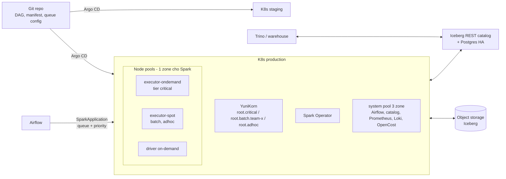

# Phase 2 — Growth: triển khai Spark trên Kubernetes cho nhiều team

Tài liệu triển khai cụ thể cho Phase 2 trong
[scale-spark.md](../deployment/scale-spark.md). Phase 2 kế thừa toàn bộ stack
và checklist của [phase-1-startup.md](../start-up/phase-1-startup.md); tài liệu
này chỉ ghi phần **thay đổi hoặc thêm mới**. Lỗi vận hành riêng của phase này:
[issue/common-issues.md](./issue/common-issues.md).

## 1. Context

**Tình huống giả định** (thay bằng số thật của bạn):

| Mục | Giá trị |
|---|---|
| Team | 4 team dữ liệu (~20 người viết Spark) + platform team 3 người |
| Input | 5 TiB/ngày Parquet đã nén (~15 TiB khi giải nén), tăng 5%/tháng |
| Job | ~400 job/ngày chia 3 tier SLA |
| Tier `critical` | ~40 job ETL hằng ngày, input sẵn sàng 02:00, deadline 07:00 |
| Tier `batch` | ~300 job rải từ 06:00 đến 24:00 |
| Tier `adhoc` | ~60 job/ngày: backfill, thử nghiệm, không cam kết SLA |
| Cluster | 2: `staging`, `production`; mỗi team một namespace |
| Người dùng output | BI, Trino/warehouse đọc bảng Iceberg |

**Mục tiêu Phase 2**

- Tier `critical` đạt deadline ≥ 99% số ngày dù các team khác đang chạy.
- Một team không thể chiếm tài nguyên làm trễ job của team khác.
- Mỗi team thấy chi phí của mình theo tháng (showback).
- Team dữ liệu tự deploy job qua Git, không cần platform team review từng job.
- Platform team 3 người vận hành được, không trực đêm thường xuyên.

**Không làm ở Phase 2**: multi-region, nhiều cluster production, self-service
portal, lineage đầy đủ, auto-tuning, chargeback tính tiền thật cho từng team.

**Thay đổi so với Phase 1**

| Hạng mục | Phase 1 | Phase 2 |
|---|---|---|
| Cluster | 1 cluster, 1 zone | `staging` + `production`; control plane HA, system pool 3 zone |
| Scheduler | K8s mặc định | YuniKorn: queue theo tier/team, gang scheduling, preemption |
| Namespace | 1 (`spark`) | 1 namespace/team + namespace hệ thống |
| Catalog | Iceberg JDBC trên Postgres nhỏ | Iceberg REST catalog (hoặc Glue/BigLake) + Postgres HA |
| Deploy | Helm + CI | GitOps với Argo CD |
| Node | 8 vCPU | Executor 16 vCPU có NVMe local; pool on-demand riêng cho `critical` |
| Chi phí | Budget alert | OpenCost/tool của cloud, showback theo namespace |
| SQL ad-hoc | Không | Trino hoặc warehouse sẵn có đọc Iceberg |

**Kiến trúc**



---

## 2. Back-of-envelope

Giả định giữ như Phase 1: throughput 25 MB/s/core, job nhiều stage tốn 2x một
lần scan, safety margin 1.3x, 1 TiB = 1.048.576 MB. Tất cả là giả định cho đến
khi benchmark.

### 2.1 Cores lúc đỉnh theo tier

```text
critical: đọc 60% dữ liệu ngày = 9 TiB giải nén = 9.437.184 MB
  Một lần scan          = 9.437.184 / 25          = 377.487 core-giây
  Toàn bộ (x2 stage)    = 754.975 core-giây       ≈ 210 core-giờ
  Cửa sổ tính toán hiệu dụng = 2 giờ
    (02:00-07:00 nhưng DAG có chuỗi phụ thuộc, chừa 1 giờ buffer)
  Cores                 = 754.975 / 7.200s        ≈ 105
  Có margin             = 105 x 1,3               ≈ 136 → 144 cores

batch:  tổng việc = 2 x critical = 420 core-giờ, rải 18 giờ
  Trung bình            = 420 / 18                ≈ 23 cores
  Đỉnh (x3 trung bình)  ≈ 70 → 72 cores

adhoc:  tổng việc = 1 x critical = 210 core-giờ, dồn cục
  Giới hạn cứng bằng queue max = 64 cores
```

Đỉnh `critical` rơi vào ban đêm, đỉnh `batch` + `adhoc` (72 + 64 = 136) rơi
vào ban ngày, nên cluster cần ~144 cores lúc đỉnh. Đặt max executor pool
**256 cores** để chừa chỗ cho backfill và tăng trưởng.

### 2.2 Tổng core-giờ mỗi ngày

```text
critical 210 + batch 420 + adhoc 210 = 840 core-giờ
x 1,3 margin                         ≈ 1.090 core-giờ/ngày
  trong đó critical                  = 210 x 1,3 ≈ 273 core-giờ
```

### 2.3 Kích thước executor và node

```text
Node executor   = 16 vCPU / 64 GiB, có NVMe local (m6id.4xlarge, n2-standard-16
                  + local SSD, D16ds_v5), allocatable ~15,8 vCPU / ~57 GiB
Executor        = cores 4, coreRequest 3500m, memory 10g + overhead 2g = 12 GiB
Executor/node   = 4 → dùng 14 vCPU, 48 GiB, 16 task slot
critical đỉnh   = 144 cores / 4 = 36 executor = 9 node
Max pool        = 256 cores = 64 executor = 16 node
Driver          = 1 core / 4 GiB; node driver 8 vCPU / 32 GiB chứa ~6 driver
```

Node 16 vCPU giảm tỷ lệ hao phí hệ thống (DaemonSet, kubelet) so với node 8
vCPU, và NVMe local cho shuffle nhanh, rẻ hơn gắn thêm block storage.

### 2.4 Node-giờ mỗi tháng

```text
Executor on-demand (critical) = 273 core-giờ / 16 x 1,3 (hao phí) ≈ 22 node-giờ/ngày
                              ≈ 670 node-giờ/tháng (16 vCPU)
Executor spot (batch, adhoc)  = (1.090 - 273) / 16 x 1,3          ≈ 66 node-giờ/ngày
                              ≈ 2.000 node-giờ/tháng (16 vCPU)
Driver                        = 400 job x ~20 phút = 133 driver-giờ/ngày
                                / 6 driver/node x 1,5             ≈ 33 node-giờ/ngày
                              ≈ 1.000 node-giờ/tháng (8 vCPU)
System (3 node, 3 zone)       = 3 x 730                           = 2.190 node-giờ/tháng (8 vCPU)
Staging                       = system 2 node 4 vCPU luôn bật + ~270 node-giờ spot 16 vCPU
```

Hệ số hao phí 1,3 thấp hơn Phase 1 (1,5) vì nhiều job hơn nên node được lấp đầy
tốt hơn.

### 2.5 Quota và concurrency theo queue

| Queue | Guaranteed | Max | Ghi chú |
|---|---|---|---|
| `root.critical` | 144 vcore / 576 GiB | 192 vcore / 768 GiB | Được preempt `adhoc` và phần `batch` vượt guaranteed |
| `root.batch.team-{a,b,c,d}` | 16 vcore / 64 GiB mỗi team | 96 vcore / 384 GiB mỗi team | Mượn tài nguyên rảnh của team khác |
| `root.adhoc` | 0 | 64 vcore / 256 GiB | `fence`: không preempt ra ngoài queue |
| Tổng guaranteed | 208 vcore | — | ≤ capacity lúc đỉnh (256 exec + driver) |

Memory = vcore x 4 GiB (executor 12 GiB/4 core + driver). Quy tắc: **tổng
guaranteed không vượt capacity thật**, nếu không guaranteed chỉ còn trên giấy.

Concurrency: `critical` ~40 job, đỉnh ~15-20 app chạy cùng lúc; `maxapplications`
mỗi team 20, `adhoc` 10 để một backfill không tạo hàng trăm app.

### 2.6 Disk scratch và network

```text
Shuffle critical     = 40% x 9 TiB = 3,6 TiB trong cửa sổ 2 giờ
Shuffle còn sống     ≈ 25% cùng lúc = 0,9 TiB / 9 node ≈ 100 GiB/node
x 1,3 + spill        ≈ 130 GiB → NVMe ≥ 200 GiB/node (m6id.4xlarge có 950 GB)

Network shuffle (write + read) = 7,2 TiB trong ~48 phút (40% cửa sổ)
                    = 7,2 x 1.048.576 / 2.880s ≈ 2.620 MB/s ≈ 21 Gbps toàn cụm
                    ≈ 2,3 Gbps/node trên 9 node → node 16 vCPU đủ (baseline vài Gbps)
```

Giữ driver và executor của một app **trong cùng một zone**. Nếu executor rải 3
zone, ~2/3 trong 7,2 TiB shuffle/ngày đi qua zone, tốn thêm ~$3.000/tháng (mục 3.2).

### 2.7 Pod, IP và tải K8s API

```text
Pod lúc đỉnh     = 64 executor + 64 placeholder YuniKorn + 40 driver
                   + ~150 system + ~50 Airflow task ≈ 370 pod
                 → subnet pod /20 (4.096 IP), EKS bật prefix delegation

SparkApplication = 400/ngày, đỉnh ~60/giờ (≈ 1/phút)
                   Kubeflow Operator benchmark ~130 app/phút mặc định
                   → Operator chưa phải nút thắt; backfill 500 app một lúc thì có
Object mỗi app   = 1 CR + driver pod + 2 service + 1-2 configmap ≈ 5-6 object
Không TTL        = 400 x 6 x 30 ngày ≈ 72.000 object/tháng
                   mỗi namespace ~100 app/ngày → sau ~20 ngày vượt 2.000 app, bắt
                   đầu lỗi "argument list too long" do env var của service
                 → timeToLiveSeconds: 86400 bắt buộc
Executor pod     = 400 app x ~10 executor ≈ 4.000 pod/ngày (+ số placeholder tương đương)
```

### 2.8 Catalog

```text
Commit           = 400 job x ~3 bảng + ~200 job maintenance ≈ 1.400 commit/ngày
Đỉnh             ≈ 5-10 commit/phút trong cửa sổ critical
```

Tốc độ commit này không làm quá tải catalog nào. Rủi ro thật là **nhiều writer
ghi cùng một bảng** (commit conflict — conflict xảy ra như nhau với mọi loại
catalog vì Iceberg dùng optimistic concurrency) và **catalog là điểm lỗi chung
của cả 4 team**. Lý do đổi sang REST catalog ở Phase 2 là phân quyền theo team,
credential vending (cấp credential storage theo bảng), và cho Trino/engine khác
dùng chung — không phải vì JDBC catalog chậm.

### 2.9 Storage

```text
Input giữ 90 ngày        = 5 TiB x 90                 = 450 TiB
Output (~30% input nén)  = 1,5 TiB/ngày, giữ 365 ngày
Output ở tháng thứ 3     = 135 TiB, tăng ~45 TiB/tháng
Tổng ở tháng thứ 3       ≈ 585 TiB
Lifecycle input > 30 ngày sang lớp rẻ: 150 TiB Standard + 300 TiB lớp rẻ
```

### 2.10 Tăng trưởng 12 tháng (x1,8 = 1,05^12)

| Tài nguyên | Hiện tại | Sau 12 tháng |
|---|---|---|
| Job/ngày | 400 | ~720 |
| Cores đỉnh `critical` | 144 (9 node) | ~260 (17 node) |
| Max executor pool | 256 cores (16 node) | ~460 cores (29 node) |
| Executor node-giờ/tháng | ~2.670 | ~4.800 |
| SparkApplication đỉnh/giờ | ~60 | ~110 |
| Pod lúc đỉnh | ~370 | ~650 |
| Storage | ~585 TiB (tháng 3) | ~1,5 PiB (input 90 ngày ~775 TiB + output 365 ngày ~750 TiB) |

Storage tăng nhanh hơn compute vì retention cộng dồn. Xem lại retention mỗi quý
là việc có tác động chi phí lớn nhất.

---

## 3. Cost

Giá tham khảo list price region US (us-east-1 / us-central1 / eastus), tính cho
cả `production` và `staging`. Region Singapore đắt hơn ~10-25%. **Kiểm tra lại
bằng pricing calculator**; mục tiêu là thấy khoản nào lớn.

### 3.1 Chi phí hằng tháng

| Hạng mục | EKS (AWS) | GKE (GCP) | AKS (Azure) |
|---|---|---|---|
| Control plane 2 cluster | $146 | $73 (prod regional; staging zonal dùng credit free tier) | $73 (prod Standard, staging Free) |
| Executor on-demand 670 h (16 vCPU + NVMe) | m6id.4xlarge ~$636 | n2-standard-16 + local SSD ~$549 | D16ds_v5 ~$606 |
| Executor spot 2.000 h | ~$660 | ~$460 | ~$540 |
| Driver 1.000 h (8 vCPU) | ~$384 | ~$388 | ~$384 |
| System 3 node 8 vCPU luôn bật | ~$841 | ~$850 | ~$841 |
| Staging (system + spot nhỏ) | ~$369 | ~$258 | ~$353 |
| Disk (root, PV Prometheus/Loki) | ~$150 | ~$150 | ~$150 |
| Object storage 585 TiB có lifecycle | ~$10.550 | ~$8.910 | ~$8.330 |
| Request object storage + lifecycle transition | ~$300 | ~$300 | ~$300 |
| Postgres HA (catalog, Airflow) | ~$220 | ~$200 | ~$250 |
| NAT, load balancer, khác | ~$200 | ~$170 | ~$200 |
| **Tổng** | **~$14.460** | **~$12.310** | **~$12.030** |
| Commitment 1 năm cho phần on-demand luôn chạy (system, driver, executor critical ~ $2.000-2.200) | Compute Savings Plans ~25-30%: **−$550-650** | CUD 1 năm ~37% (hoặc SUD tự động tới ~20%): **−$700** | Reservation/Savings plan 1 năm ~30-40%: **−$700** |

Nhận xét:

- **Object storage ~70-75% tổng chi phí.** Toàn bộ compute (kể cả staging) chỉ
  ~$2.900-3.100. Retention và lifecycle vẫn là đòn bẩy số 1, giống Phase 1
  nhưng ở mức lớn hơn nhiều.
- Không có lifecycle: storage AWS ~$13.800 thay vì ~$10.550.
- Commitment chỉ áp cho phần luôn chạy; không mua commitment cho spot hoặc phần
  autoscale theo giờ.
- Nếu thêm Trino cho SQL ad-hoc (coordinator + 3 worker 16 vCPU chạy giờ hành
  chính): cộng ~$800/tháng.

### 3.2 Chi phí ẩn của phase này

| Chi phí ẩn | Ước tính nếu bỏ qua | Cách chặn |
|---|---|---|
| Shuffle qua zone khi pool Spark rải nhiều zone | ~2/3 x 7,2 TiB/ngày x 30 x $0,02/GB ≈ **+$3.000/tháng** (AWS, GCP) | Pool Spark 1 zone, hoặc affinity để mỗi app nằm trong 1 zone |
| Guaranteed quota không dùng | Node giữ cho `critical` chạy rỗng ban ngày | Guaranteed chỉ tính bằng executor on-demand; ngoài giờ critical cho `batch` mượn (guaranteed ≠ giữ node) |
| Metric Spark đổ vào managed Prometheus | ~200k series, scrape 30s ≈ 17 tỷ sample/tháng: ~$300-1.000/tháng tuỳ provider | Drop label `executor_id`, tăng scrape interval cho executor, self-host Prometheus |
| File nhỏ từ 20 người viết job | Phí request tăng dần, job chậm dần | Compaction theo lịch cho mọi bảng, alert số file/partition |
| Backfill không giới hạn | Hàng trăm app spot + request storage trong vài giờ | Queue `adhoc` max 64 vcore, `max_active_runs` trong Airflow |
| Tool cost allocation trả phí | Kubecost bản trả phí tính theo core/cluster *[kiểm tra giá hiện tại]* | OpenCost (miễn phí) hoặc tool có sẵn của cloud (mục 4.2) |
| Staging chạy full dữ liệu | Staging tốn gần bằng production | Staging dùng sample 1-5% dữ liệu, pool max nhỏ |

---

## 4. Tech stack

### 4.1 Stack chung (thêm hoặc đổi so với Phase 1)

| Lớp | Chọn cho Phase 2 | Lý do | Phương án khác |
|---|---|---|---|
| Batch scheduler | Apache YuniKorn | Queue phân cấp với guaranteed/max, gang scheduling, preemption có `fence`, Kubeflow Operator tích hợp sẵn (`batchScheduler: yunikorn`) | Volcano (gang scheduling tốt, queue phân cấp mới hơn); Kueue (quản lý quota ở mức admission, tích hợp Spark Operator ít trực tiếp hơn) |
| Spark Operator | Giữ Kubeflow Spark Operator ≥ 2.0, **tắt webhook**, dùng pod template | Benchmark: tắt webhook bớt ~60 giây khởi động mỗi job; ≥ 2.0 mới hỗ trợ YuniKorn | 1 Operator/namespace nếu throughput thành nút thắt |
| Catalog | Iceberg REST catalog: Apache Polaris hoặc Lakekeeper, Postgres HA | Phân quyền theo team, credential vending, Trino dùng chung | Glue Data Catalog (AWS), BigLake metastore (GCP) — managed, ít vận hành, nhưng gắn với provider |
| GitOps | Argo CD, 1 app/namespace team + 1 app platform | Team tự deploy qua PR, thay đổi có lịch sử | Flux |
| Policy | Kyverno | Bắt buộc label `team`, ephemeral-storage request, image từ base chung, queue hợp lệ | OPA Gatekeeper |
| Cost | OpenCost + dashboard Grafana theo namespace | Miễn phí, dùng dữ liệu Prometheus sẵn có | Kubecost (trả phí), tool của cloud |
| SQL ad-hoc | Trino (hoặc warehouse sẵn có) đọc Iceberg qua cùng catalog | Query tương tác không nên chạy qua Spark Thrift server (1 driver, dễ thành điểm lỗi) | Spark Connect server cho notebook nếu cần API Spark |
| Base image | 1 base image Spark do platform quản lý, team build image job từ đó | Tránh mỗi team một version Spark/Iceberg | — |
| Observability | Giữ Prometheus + Loki, thêm recording rules và drop label | Kiểm soát cardinality | Managed Prometheus của cloud |

### 4.2 So sánh provider ở quy mô này

| Tiêu chí | EKS (AWS) | GKE (GCP) | AKS (Azure) |
|---|---|---|---|
| Control plane HA | Luôn multi-AZ, $0,10/giờ | Regional cluster ($0,10/giờ, SLA cao hơn zonal) | Standard tier $0,10/giờ có SLA; Free tier không SLA |
| Giới hạn node/pod | Không chạm ở vài chục node | Không chạm ở vài chục node | Không chạm ở vài chục node |
| Autoscaler + YuniKorn | Karpenter chỉ mô phỏng default scheduler; có issue mở với custom scheduler (karpenter #742) — dùng cấu hình đã được kiểm chứng (Data on EKS) và test kỹ | Cluster autoscaler + node auto-provisioning | Cluster autoscaler; Node Auto Provisioning dựa trên Karpenter (cùng lưu ý với custom scheduler) |
| Managed Prometheus | Amazon Managed Service for Prometheus, tính theo sample | Google Cloud Managed Service for Prometheus, tính theo sample | Azure Monitor managed Prometheus, tính theo sample |
| Cost allocation có sẵn | Split cost allocation data cho EKS (trong CUR) | GKE cost allocation trong billing export | AKS cost analysis add-on (dựa trên OpenCost) *[kiểm tra tier yêu cầu]* |
| Identity cho nhiều namespace | EKS Pod Identity: gán role cho ServiceAccount, không phải sửa trust policy mỗi lần | Workload Identity Federation: bind IAM trực tiếp cho ServiceAccount | Entra Workload ID: **tối đa 20 federated credential mỗi managed identity** → cần nhiều identity khi nhiều namespace/cluster |
| Commitment | Savings Plans (Compute SP áp cả khi đổi instance family), Reserved Instances | CUD theo resource hoặc theo spend; SUD tự động | Reservations, Savings plan for compute |
| Catalog managed | Glue Data Catalog (có Iceberg REST endpoint), S3 Tables | BigLake metastore (Iceberg REST) | Không có lựa chọn native đơn giản → Polaris/Lakekeeper |

### 4.3 Khuyến nghị

1. **Giữ provider của Phase 1.** Chuyển cloud ở phase này tốn hơn mọi chênh
   lệch giá trong bảng 3.1.
2. Nâng control plane lên HA (GKE regional, AKS Standard); system pool rải 3
   zone; **pool Spark giữ 1 zone** để tránh phí shuffle qua zone.
3. YuniKorn với 3 tier (`critical`, `batch`, `adhoc`), guaranteed chỉ cho
   `critical` và phần tối thiểu của mỗi team.
4. Catalog: nếu chấp nhận gắn với provider → Glue (AWS) hoặc BigLake (GCP), ít
   việc vận hành nhất. Nếu cần trung lập hoặc ở Azure → Polaris/Lakekeeper chạy
   2 replica trên system pool.
5. Chi phí: bắt đầu bằng tool có sẵn của cloud hoặc OpenCost; chỉ mua tool trả
   phí khi cần chargeback tính tiền thật.

---

## 5. Checklist triển khai Phase 2

Chỉ gồm việc mới so với [checklist Phase 1](../start-up/phase-1-startup.md#5-checklist-triển-khai-phase-1).
Mỗi mục có điều kiện "xong" (→).

### 5.1 Chuẩn bị & quy ước

- [ ] Điền lại bảng context + tính lại mục 2 với số thật → có cores theo tier,
      guaranteed/max từng queue
- [ ] Viết tài liệu tier SLA: job nào được vào `critical`, ai duyệt → mỗi
      DAG có tier ghi trong code
- [ ] Quy ước bắt buộc: label `team`, `tier`, `cost-center`; tên
      `SparkApplication` unique theo run; job idempotent → có trong template
      job mẫu
- [ ] Chính sách hỗ trợ version: Spark N và N-1, 1 base image chung → team biết
      khi nào phải nâng

### 5.2 Cluster & network

- [ ] Terraform tạo cluster `staging` giống `production` (khác size) → đổi
      cluster chỉ bằng biến
- [ ] Control plane HA; system pool 3 zone, tối thiểu 3 node
- [ ] Pool Spark trong 1 zone: `executor-ondemand` (critical), `executor-spot`
      (batch/adhoc, nhiều instance type 16 vCPU có NVMe), `driver` on-demand →
      kiểm tra không có pod Spark nào ở zone khác
- [ ] NVMe mount làm `spark-local-dir-1` qua pod template → executor không ghi
      shuffle lên root disk
- [ ] Subnet pod ≥ /20 (EKS: prefix delegation) → đủ IP cho ~650 pod sau 12 tháng
- [ ] Namespace theo team + `ResourceQuota` khớp queue max; RBAC: team chỉ sửa
      namespace của mình

### 5.3 Scheduling

- [ ] Cài YuniKorn; giới hạn admission controller chỉ xử lý namespace Spark →
      pod hệ thống vẫn dùng default scheduler
- [ ] Bật `controller.batchScheduler.enable` trong Spark Operator, default
      `yunikorn`
- [ ] Áp queue config mục 6.1 qua Argo CD → `root.critical`, `root.batch.team-*`,
      `root.adhoc` hiện trên YuniKorn UI
- [ ] `PriorityClass` cho driver với `yunikorn.apache.org/allow-preemption: "false"`
- [ ] Test preemption: chạy đầy `adhoc` rồi submit job `critical` → `critical`
      có executor trong ≤ 2 phút, driver `adhoc` không bị giết
- [ ] Test gang scheduling: 2 app cùng lúc vượt capacity → một app chờ nguyên
      cụm, không app nào giữ executor dở dang
- [ ] Test autoscaler với YuniKorn: pool về 0 rồi submit app → node được tạo,
      placeholder được thay bằng executor thật

### 5.4 Spark Operator

- [ ] Nâng Operator ≥ 2.0, tắt webhook, chuyển toleration/volume/nodeSelector
      sang pod template → smoke test kiểm tra executor có đúng toleration
- [ ] `timeToLiveSeconds: 86400` trên mọi `SparkApplication` (Kyverno bắt buộc)
- [ ] `enableServiceLinks: false` trong pod template
- [ ] `controller.workers` ≥ 20 khi backfill lớn; theo dõi CPU của Operator

### 5.5 Catalog & data

- [ ] Dựng REST catalog (Polaris/Lakekeeper 2 replica) hoặc chuyển sang
      Glue/BigLake; Postgres HA → failover thử 1 lần, job vẫn chạy
- [ ] Migrate bảng từ JDBC catalog Phase 1 (register table, không copy dữ
      liệu) → số bảng và snapshot khớp
- [ ] Mỗi bảng có 1 team owner và 1 writer chính → ghi trong catalog/README
- [ ] Lịch maintenance (compaction, expire snapshot) không trùng cửa sổ
      `critical` 02:00-07:00
- [ ] Trino (hoặc warehouse) đọc Iceberg qua cùng catalog, quyền theo team

### 5.6 GitOps & release

- [ ] Argo CD: 1 Application/namespace team + 1 Application platform; Argo
      **không** quản lý `SparkApplication` do Airflow tạo
- [ ] Promote staging → production bằng PR đổi tag image/version
- [ ] Upgrade Operator/YuniKorn/K8s trên staging trước ≥ 1 tuần, có thông báo
      cho các team

### 5.7 Airflow

- [ ] Mỗi team 1 thư mục DAG + Airflow pool riêng; `max_active_runs` giới hạn
      backfill
- [ ] KubernetesExecutor: tăng `worker_pods_creation_batch_size`, scheduler 2
      replica, dag-processor tách riêng
- [ ] Task truyền `queue`/`priorityClassName` theo tier của DAG

### 5.8 Observability & cost

- [ ] Drop label `executor_id`, đặt `spark.metrics.namespace` cố định → số
      series Prometheus ổn định theo ngày
- [ ] Dashboard theo team: job trễ SLA, Pending, cost/namespace, core-giờ
- [ ] Alert mới:
  - job `critical` chưa xong lúc 06:30
  - app chờ placeholder > 15 phút
  - queue `critical` dưới guaranteed trong khi có app `critical` Pending
  - catalog lỗi/latency cao
  - số series Prometheus tăng > 20%/tuần
- [ ] OpenCost (hoặc tool của cloud): báo cáo chi phí/team hằng tháng; thống
      nhất cách chia chi phí idle và hệ thống

---

## 6. Mẫu cấu hình

### 6.1 YuniKorn queue (`yunikorn-configs` ConfigMap, key `queues.yaml`)

```yaml
partitions:
  - name: default
    preemption:
      enabled: true
    placementrules:
      - name: provided
        create: false
      - name: fixed
        value: root.adhoc
    queues:
      - name: root
        submitacl: "*"
        queues:
          - name: critical
            resources:
              guaranteed: {vcore: 144, memory: 576Gi}
              max: {vcore: 192, memory: 768Gi}
            properties:
              application.sort.policy: fifo
              priority.offset: "100"
          - name: batch
            parent: true
            resources:
              guaranteed: {vcore: 64, memory: 256Gi}
              max: {vcore: 160, memory: 640Gi}
            properties:
              application.sort.policy: fair
            queues:
              - name: team-a
                maxapplications: 20
                resources:
                  guaranteed: {vcore: 16, memory: 64Gi}
                  max: {vcore: 96, memory: 384Gi}
              - name: team-b
                maxapplications: 20
                resources:
                  guaranteed: {vcore: 16, memory: 64Gi}
                  max: {vcore: 96, memory: 384Gi}
              - name: team-c
                maxapplications: 20
                resources:
                  guaranteed: {vcore: 16, memory: 64Gi}
                  max: {vcore: 96, memory: 384Gi}
              - name: team-d
                maxapplications: 20
                resources:
                  guaranteed: {vcore: 16, memory: 64Gi}
                  max: {vcore: 96, memory: 384Gi}
          - name: adhoc
            maxapplications: 10
            resources:
              max: {vcore: 64, memory: 256Gi}
            properties:
              preemption.policy: fence
```

- `placementrules`: dùng queue do Operator gắn (`batchSchedulerOptions.queue`);
  app không khai queue rơi vào `root.adhoc`.
- `priority.offset` cho app `critical` ưu tiên cao hơn khi cạnh tranh;
  `fence` ở `adhoc` ngăn nó preempt ra ngoài queue của mình.
- Đối chiếu cú pháp với tài liệu YuniKorn đúng version bạn cài trước khi áp.

### 6.2 PriorityClass cho driver

```yaml
apiVersion: scheduling.k8s.io/v1
kind: PriorityClass
metadata:
  name: spark-driver-critical
  annotations:
    yunikorn.apache.org/allow-preemption: "false"
value: 1000
description: Driver tier critical, không preempt
```

`allow-preemption: "false"` là gợi ý mạnh, không phải đảm bảo tuyệt đối; kết
hợp với guaranteed của queue (YuniKorn không preempt task khi queue chưa vượt
guaranteed).

### 6.3 `SparkApplication` (phần khác Phase 1)

```yaml
apiVersion: sparkoperator.k8s.io/v1beta2
kind: SparkApplication
metadata:
  name: team-a-daily-orders-{{ ts_nodash | lower }}
  namespace: team-a
  labels:
    team: team-a
    tier: critical
    cost-center: cc-101
spec:
  batchScheduler: yunikorn
  batchSchedulerOptions:
    queue: root.critical
  timeToLiveSeconds: 86400
  dynamicAllocation:
    enabled: true
    initialExecutors: 8
    minExecutors: 8
    maxExecutors: 36
  driver:
    priorityClassName: spark-driver-critical
    template:
      spec:
        enableServiceLinks: false
    nodeSelector:
      pool: driver
  executor:
    template:
      spec:
        enableServiceLinks: false
    nodeSelector:
      pool: executor-ondemand
```

- Tên có `ts_nodash | lower` vì tên object K8s phải chữ thường.
- `minExecutors` là số executor trong gang (task group `spark-executor`); để
  thấp hơn đỉnh để app bắt đầu được khi cluster đang bận.
- Job tier `batch` đổi `queue: root.batch.team-a`, bỏ `priorityClassName`,
  `nodeSelector` sang `executor-spot` + toleration spot như Phase 1.
- Trường `template` cần Operator ≥ 2.0 *[kiểm tra với version bạn dùng]*.

---

## 7. Khi nào rời Phase 2

Xem tín hiệu graduate trong [scale-spark.md](../deployment/scale-spark.md).
Với tình huống này, dấu hiệu sớm nhất thường là:

- Platform team 3 người thành nút thắt: team phải chờ để có namespace, quota
  hoặc debug job.
- Một cluster không còn đủ (API server/etcd chậm, số node vượt vài trăm), hoặc
  cần region thứ hai vì data residency/DR.
- Nhiều team tính cùng một metric ra số khác nhau và không truy được nguồn.
